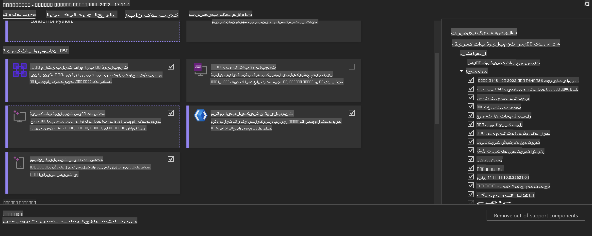
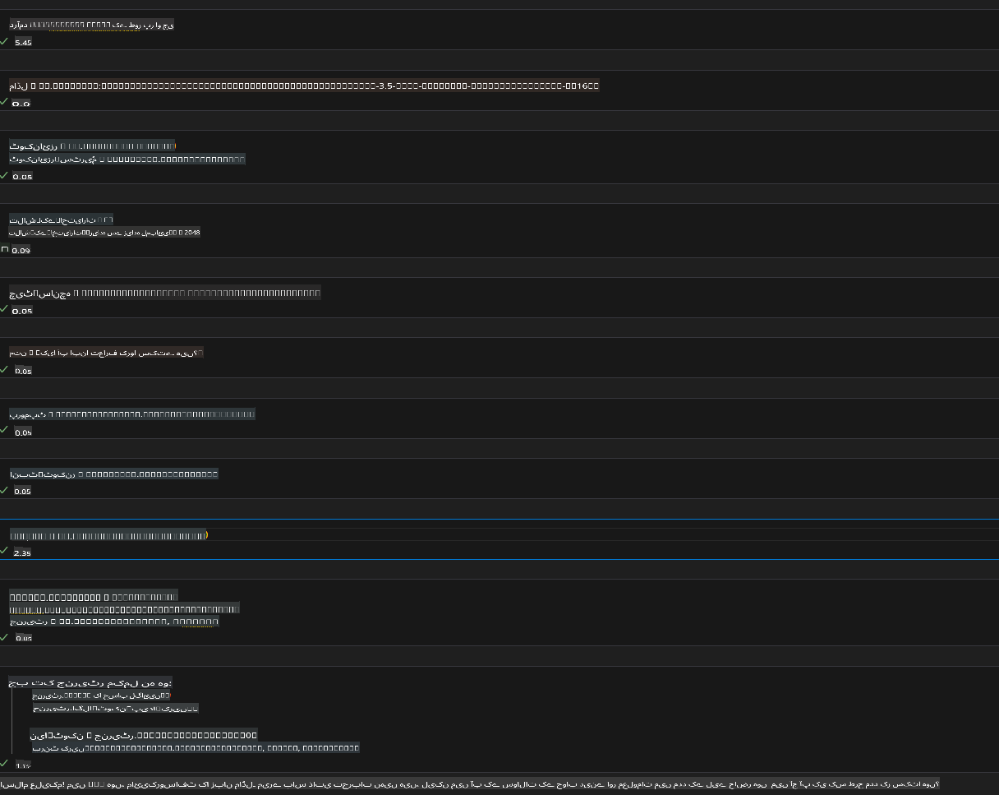
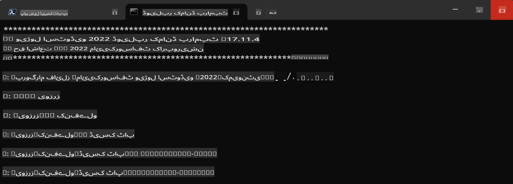

# **ونڈوز GPU کے لیے OnnxRuntime GenAI گائیڈ لائن**

یہ گائیڈ لائن ونڈوز پر GPU کے ساتھ ONNX Runtime (ORT) سیٹ اپ اور استعمال کرنے کے اقدامات فراہم کرتی ہے۔ اس کا مقصد آپ کو اپنے ماڈلز کے لیے GPU ایکسیلیریشن کا فائدہ اٹھانے میں مدد دینا ہے، تاکہ کارکردگی اور افادیت بہتر ہو۔

یہ دستاویز درج ذیل موضوعات پر رہنمائی فراہم کرتی ہے:

- ماحول کی ترتیب: CUDA، cuDNN، اور ONNX Runtime جیسی ضروری ڈیپینڈنسیز کو انسٹال کرنے کی ہدایات۔
- کنفیگریشن: ماحول اور ONNX Runtime کو مؤثر طریقے سے GPU وسائل استعمال کرنے کے لیے کیسے ترتیب دیں۔
- آپٹیمائزیشن ٹپس: بہترین کارکردگی کے لیے اپنے GPU سیٹنگز کو بہتر بنانے کے مشورے۔

### **1. Python 3.10.x /3.11.8**

   ***نوٹ*** تجویز ہے کہ [miniforge](https://github.com/conda-forge/miniforge/releases/latest/download/Miniforge3-Windows-x86_64.exe) کو اپنے Python ماحول کے طور پر استعمال کریں۔

   ```bash

   conda create -n pydev python==3.11.8

   conda activate pydev

   ```

   ***یاد دہانی*** اگر آپ نے پہلے سے کوئی Python ONNX لائبریری انسٹال کی ہوئی ہے، تو براہ کرم اسے اَن انسٹال کریں۔

### **2. ونگیٹ کے ذریعے CMake انسٹال کریں**

   ```bash

   winget install -e --id Kitware.CMake

   ```

### **3. Visual Studio 2022 انسٹال کریں - C++ کے ساتھ ڈیسک ٹاپ ڈیولپمنٹ**

   ***نوٹ*** اگر آپ کمپائل نہیں کرنا چاہتے تو یہ مرحلہ چھوڑ سکتے ہیں۔



### **4. NVIDIA ڈرائیور انسٹال کریں**

1. **NVIDIA GPU ڈرائیور** [https://www.nvidia.com/en-us/drivers/](https://www.nvidia.com/en-us/drivers/)

2. **NVIDIA CUDA 12.4** [https://developer.nvidia.com/cuda-12-4-0-download-archive](https://developer.nvidia.com/cuda-12-4-0-download-archive)

3. **NVIDIA CUDNN 9.4** [https://developer.nvidia.com/cudnn-downloads](https://developer.nvidia.com/cudnn-downloads)

***یاد دہانی*** انسٹالیشن کے دوران ڈیفالٹ سیٹنگز استعمال کریں۔

### **5. NVIDIA ماحول ترتیب دیں**

NVIDIA CUDNN 9.4 کے lib، bin، اور include کو NVIDIA CUDA 12.4 کے lib، bin، اور include میں کاپی کریں۔

- *'C:\Program Files\NVIDIA\CUDNN\v9.4\bin\12.6'* کی فائلز کو *'C:\Program Files\NVIDIA GPU Computing Toolkit\CUDA\v12.4\bin'* میں کاپی کریں۔

- *'C:\Program Files\NVIDIA\CUDNN\v9.4\include\12.6'* کی فائلز کو *'C:\Program Files\NVIDIA GPU Computing Toolkit\CUDA\v12.4\include'* میں کاپی کریں۔

- *'C:\Program Files\NVIDIA\CUDNN\v9.4\lib\12.6'* کی فائلز کو *'C:\Program Files\NVIDIA GPU Computing Toolkit\CUDA\v12.4\lib\x64'* میں کاپی کریں۔

### **6. Phi-3.5-mini-instruct-onnx ڈاؤنلوڈ کریں**

   ```bash

   winget install -e --id Git.Git

   winget install -e --id GitHub.GitLFS

   git lfs install

   git clone https://huggingface.co/microsoft/Phi-3.5-mini-instruct-onnx

   ```

### **7. InferencePhi35Instruct.ipynb چلائیں**

   [نوٹ بک](../../../../../../code/09.UpdateSamples/Aug/ortgpu-phi35-instruct.ipynb) کھولیں اور اسے چلائیں۔



### **8. ORT GenAI GPU کمپائل کریں**

   ***نوٹ*** 

   1. پہلے تمام onnx، onnxruntime، اور onnxruntime-genai کو اَن انسٹال کریں۔

   ```bash

   pip list 
   
   ```

   پھر تمام onnxruntime لائبریریوں کو اَن انسٹال کریں، مثلاً:

   ```bash

   pip uninstall onnxruntime

   pip uninstall onnxruntime-genai

   pip uninstall onnxruntume-genai-cuda
   
   ```

   2. Visual Studio ایکسٹینشن سپورٹ چیک کریں۔

   C:\Program Files\NVIDIA GPU Computing Toolkit\CUDA\v12.4\extras کو چیک کریں تاکہ یہ یقینی بنایا جا سکے کہ C:\Program Files\NVIDIA GPU Computing Toolkit\CUDA\v12.4\extras\visual_studio_integration موجود ہے۔  
   
   اگر یہ موجود نہ ہو تو دیگر Cuda ٹول کٹ ڈرائیور فولڈرز چیک کریں اور visual_studio_integration فولڈر اور اس کے مواد کو C:\Program Files\NVIDIA GPU Computing Toolkit\CUDA\v12.4\extras\visual_studio_integration میں کاپی کریں۔

   - اگر آپ کمپائل نہیں کرنا چاہتے تو یہ مرحلہ چھوڑ سکتے ہیں۔

   ```bash

   git clone https://github.com/microsoft/onnxruntime-genai

   ```

   - [https://github.com/microsoft/onnxruntime/releases/download/v1.19.2/onnxruntime-win-x64-gpu-1.19.2.zip](https://github.com/microsoft/onnxruntime/releases/download/v1.19.2/onnxruntime-win-x64-gpu-1.19.2.zip) ڈاؤنلوڈ کریں۔

   - onnxruntime-win-x64-gpu-1.19.2.zip کو ان زپ کریں، اور اسے **ort** کا نام دیں، اور ort فولڈر کو onnxruntime-genai میں کاپی کریں۔

   - ونڈوز ٹرمینل استعمال کریں، VS 2022 کے لیے ڈیولپر کمانڈ پرامپٹ پر جائیں اور onnxruntime-genai پر جائیں۔



   - اپنے Python ماحول کے ساتھ اسے کمپائل کریں۔

   ```bash

   cd onnxruntime-genai

   python build.py --use_cuda  --cuda_home "C:\Program Files\NVIDIA GPU Computing Toolkit\CUDA\v12.4" --config Release
 

   cd build/Windows/Release/Wheel

   pip install .whl

   ```

**ڈسکلیمر**:  
یہ دستاویز مشین پر مبنی AI ترجمہ سروسز کا استعمال کرتے ہوئے ترجمہ کی گئی ہے۔ ہم درستگی کے لیے بھرپور کوشش کرتے ہیں، لیکن براہ کرم آگاہ رہیں کہ خودکار ترجمے میں غلطیاں یا عدم درستگی ہو سکتی ہے۔ اصل دستاویز کو اس کی مقامی زبان میں مستند ذریعہ سمجھا جانا چاہیے۔ اہم معلومات کے لیے، پیشہ ور انسانی ترجمہ کی سفارش کی جاتی ہے۔ اس ترجمے کے استعمال سے پیدا ہونے والی کسی بھی غلط فہمی یا غلط تشریح کے لیے ہم ذمہ دار نہیں ہیں۔