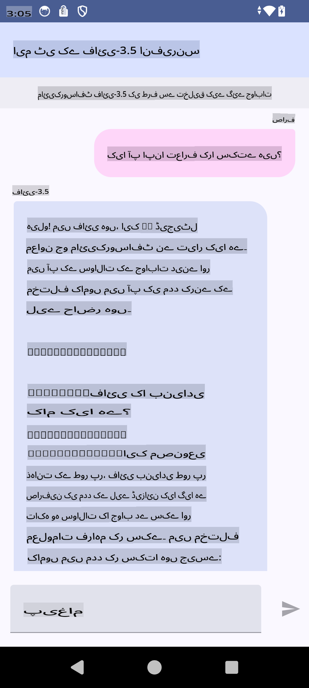

# **مائیکروسافٹ Phi-3.5 tflite استعمال کرتے ہوئے اینڈرائیڈ ایپ بنانا**

یہ ایک اینڈرائیڈ نمونہ ہے جو مائیکروسافٹ Phi-3.5 tflite ماڈلز استعمال کرتا ہے۔

## **📚 علم**

اینڈرائیڈ LLM Inference API آپ کو اینڈرائیڈ ایپلیکیشنز کے لیے بڑے زبان ماڈلز (LLMs) کو مکمل طور پر ڈیوائس پر چلانے دیتا ہے، جنہیں آپ مختلف کاموں کے لیے استعمال کر سکتے ہیں، جیسے کہ متن تخلیق کرنا، قدرتی زبان میں معلومات حاصل کرنا، اور دستاویزات کا خلاصہ بنانا۔ یہ ٹاسک کئی ٹیکسٹ ٹو ٹیکسٹ بڑے زبان ماڈلز کے لیے بلٹ ان سپورٹ فراہم کرتا ہے، تاکہ آپ اپنی اینڈرائیڈ ایپس میں جدید ترین آن ڈیوائس جنریٹو AI ماڈلز لاگو کر سکیں۔

گوگل AI ایج ٹارچ ایک پائتھون لائبریری ہے جو PyTorch ماڈلز کو .tflite فارمیٹ میں تبدیل کرنے کی سہولت دیتی ہے، جسے پھر TensorFlow Lite اور MediaPipe کے ساتھ چلایا جا سکتا ہے۔ یہ اینڈرائیڈ، iOS اور IoT کے لیے ایپلیکیشنز کو قابل بناتا ہے جو ماڈلز کو مکمل طور پر ڈیوائس پر چلا سکتے ہیں۔ AI ایج ٹارچ وسیع CPU کوریج فراہم کرتا ہے، جس میں ابتدائی GPU اور NPU سپورٹ شامل ہے۔ AI ایج ٹارچ PyTorch کے ساتھ قریبی انضمام کے لیے کام کرتا ہے، torch.export() پر مبنی ہے، اور Core ATen آپریٹرز کی اچھی کوریج فراہم کرتا ہے۔

## **🪬 رہنمائی**

### **🔥 مائیکروسافٹ Phi-3.5 کو tflite سپورٹ میں تبدیل کریں**

0. یہ نمونہ اینڈرائیڈ 14+ کے لیے ہے۔

1. Python 3.10.12 انسٹال کریں۔

***تجویز:*** conda کا استعمال کرتے ہوئے اپنا Python ماحول انسٹال کریں۔

2. Ubuntu 20.04 / 22.04 (براہ کرم [google ai-edge-torch](https://github.com/google-ai-edge/ai-edge-torch) پر توجہ دیں)

***تجویز:*** Azure Linux VM یا کسی تیسرے فریق کے کلاؤڈ VM کا استعمال کرتے ہوئے اپنا ماحول بنائیں۔

3. اپنے لینکس bash پر جائیں اور Python لائبریری انسٹال کریں۔

```bash

git clone https://github.com/google-ai-edge/ai-edge-torch.git

cd ai-edge-torch

pip install -r requirements.txt -U 

pip install tensorflow-cpu -U

pip install -e .

```

4. Hugging face سے Microsoft-3.5-Instruct ڈاؤن لوڈ کریں۔

```bash

git lfs install

git clone  https://huggingface.co/microsoft/Phi-3.5-mini-instruct

```

5. مائیکروسافٹ Phi-3.5 کو tflite میں تبدیل کریں۔

```bash

python ai-edge-torch/ai_edge_torch/generative/examples/phi/convert_phi3_to_tflite.py --checkpoint_path  Your Microsoft Phi-3.5-mini-instruct path --tflite_path Your Microsoft Phi-3.5-mini-instruct tflite path  --prefill_seq_len 1024 --kv_cache_max_len 1280 --quantize True

```

### **🔥 مائیکروسافٹ Phi-3.5 کو اینڈرائیڈ Mediapipe بنڈل میں تبدیل کریں**

براہ کرم پہلے mediapipe انسٹال کریں۔

```bash

pip install mediapipe

```

یہ کوڈ [آپ کے نوٹ بک](../../../../../../code/09.UpdateSamples/Aug/Android/convert/convert_phi.ipynb) میں چلائیں۔

```python

import mediapipe as mp
from mediapipe.tasks.python.genai import bundler

config = bundler.BundleConfig(
    tflite_model='Your Phi-3.5 tflite model path',
    tokenizer_model='Your Phi-3.5 tokenizer model path',
    start_token='start_token',
    stop_tokens=[STOP_TOKENS],
    output_filename='Your Phi-3.5 task model path',
    enable_bytes_to_unicode_mapping=True or Flase,
)
bundler.create_bundle(config)

```

### **🔥 ماڈل کو اپنے اینڈرائیڈ ڈیوائس کے راستے میں adb push ٹاسک کے ذریعے منتقل کریں**

```bash

adb shell rm -r /data/local/tmp/llm/ # Remove any previously loaded models

adb shell mkdir -p /data/local/tmp/llm/

adb push 'Your Phi-3.5 task model path' /data/local/tmp/llm/phi3.task

```

### **🔥 اپنا اینڈرائیڈ کوڈ چلائیں**



**ڈسکلیمر**:  
یہ دستاویز مشین پر مبنی AI ترجمہ خدمات کا استعمال کرتے ہوئے ترجمہ کی گئی ہے۔ ہم درستگی کے لیے پوری کوشش کرتے ہیں، لیکن براہ کرم آگاہ رہیں کہ خودکار ترجمے میں غلطیاں یا غیر درستیاں ہو سکتی ہیں۔ اصل دستاویز کو اس کی اصل زبان میں مستند ذریعہ سمجھا جانا چاہیے۔ اہم معلومات کے لیے، پیشہ ور انسانی ترجمے کی سفارش کی جاتی ہے۔ ہم اس ترجمے کے استعمال سے پیدا ہونے والی کسی بھی غلط فہمی یا غلط تشریح کے ذمہ دار نہیں ہیں۔