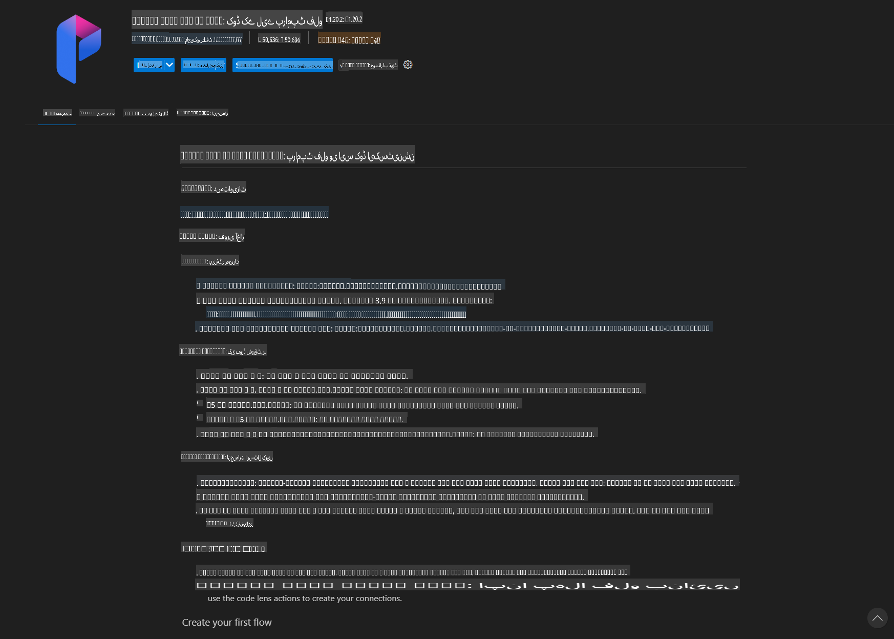
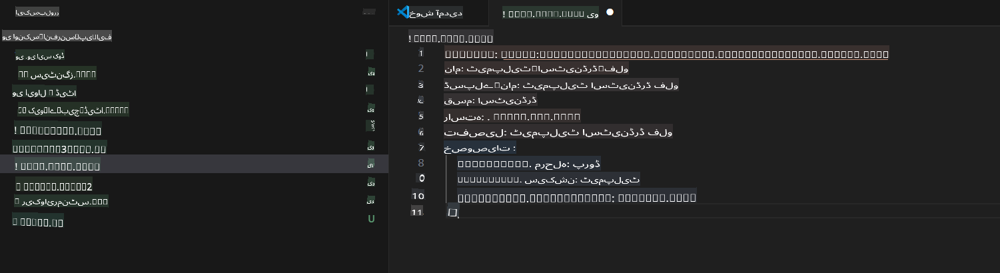
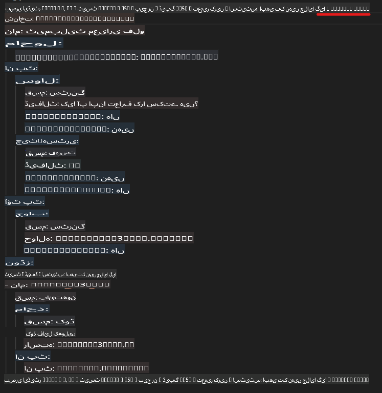
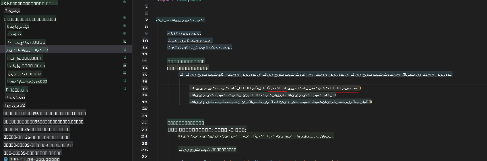
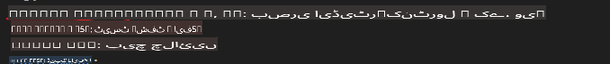
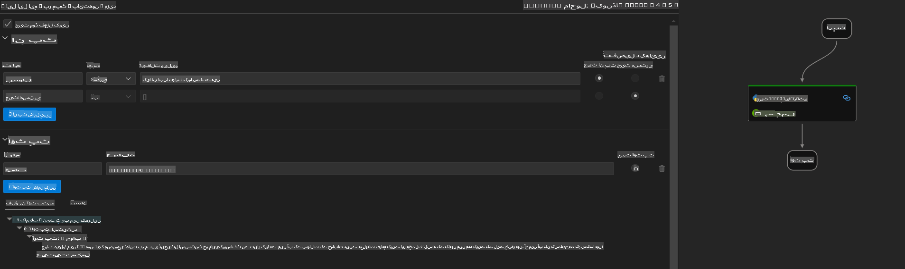
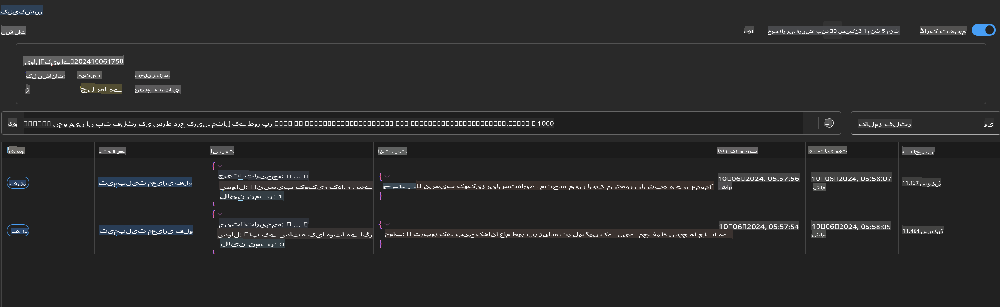

# ونڈوز جی پی یو کا استعمال کرتے ہوئے Phi-3.5-Instruct ONNX کے ساتھ پرامپٹ فلو حل بنانا

یہ دستاویز ایک مثال ہے کہ کیسے پرامپٹ فلو کو ONNX (اوپن نیورل نیٹ ورک ایکسچینج) کے ساتھ استعمال کیا جا سکتا ہے تاکہ Phi-3 ماڈلز پر مبنی AI ایپلیکیشنز تیار کی جا سکیں۔

پرامپٹ فلو ایک ترقیاتی ٹولز کا مجموعہ ہے جو LLM (بڑے زبان ماڈلز) پر مبنی AI ایپلیکیشنز کے ترقیاتی سائیکل کو بہتر اور آسان بناتا ہے، جس میں آئیڈیاز کی تشکیل، پروٹوٹائپنگ، ٹیسٹنگ اور ایویلیوایشن شامل ہیں۔

پرامپٹ فلو کو ONNX کے ساتھ جوڑ کر، ڈیولپرز درج ذیل فوائد حاصل کر سکتے ہیں:

- **ماڈل کی کارکردگی بہتر بنائیں:** ONNX کا استعمال کرتے ہوئے ماڈلز کی مؤثر انفیرینس اور ڈیپلائمنٹ کو یقینی بنائیں۔
- **ترقی کو آسان بنائیں:** ورک فلو کو منظم کرنے اور بار بار کیے جانے والے کاموں کو خودکار کرنے کے لیے پرامپٹ فلو کا استعمال کریں۔
- **تعاون کو فروغ دیں:** ٹیم کے ارکان کے درمیان بہتر تعاون کو ممکن بنائیں، ایک یکساں ترقیاتی ماحول فراہم کر کے۔

**پرامپٹ فلو** ایک ترقیاتی ٹولز کا مجموعہ ہے جو LLM پر مبنی AI ایپلیکیشنز کے مکمل ترقیاتی سائیکل کو آسان بناتا ہے، جس میں آئیڈیاز کی تشکیل، پروٹوٹائپنگ، ٹیسٹنگ، ایویلیوایشن، پروڈکشن ڈیپلائمنٹ اور مانیٹرنگ شامل ہیں۔ یہ پرامپٹ انجینئرنگ کو نہایت آسان بناتا ہے اور آپ کو پروڈکشن معیار کی LLM ایپلیکیشنز بنانے کی سہولت دیتا ہے۔

پرامپٹ فلو OpenAI، Azure OpenAI سروس، اور حسب ضرورت ماڈلز (جیسے Huggingface، مقامی LLM/SLM) سے جڑ سکتا ہے۔ ہم Phi-3.5 کے کوانٹائزڈ ONNX ماڈل کو مقامی ایپلیکیشنز پر ڈیپلائے کرنا چاہتے ہیں۔ پرامپٹ فلو ہمیں اپنے کاروباری منصوبے بہتر طور پر بنانے اور Phi-3.5 پر مبنی مقامی حل مکمل کرنے میں مدد دے سکتا ہے۔ اس مثال میں، ہم ونڈوز جی پی یو پر مبنی ONNX رن ٹائم GenAI لائبریری کے ساتھ پرامپٹ فلو حل مکمل کریں گے۔

## **انسٹالیشن**

### **ونڈوز جی پی یو کے لیے ONNX رن ٹائم GenAI**

ونڈوز جی پی یو کے لیے ONNX رن ٹائم GenAI سیٹ کرنے کے لیے یہ گائیڈ لائن پڑھیں [یہاں کلک کریں](./ORTWindowGPUGuideline.md)

### **وی ایس کوڈ میں پرامپٹ فلو سیٹ اپ کریں**

1. پرامپٹ فلو وی ایس کوڈ ایکسٹینشن انسٹال کریں



2. پرامپٹ فلو وی ایس کوڈ ایکسٹینشن انسٹال کرنے کے بعد، ایکسٹینشن پر کلک کریں، اور **Installation dependencies** منتخب کریں۔ اس گائیڈ لائن کو فالو کرتے ہوئے اپنی انوائرمنٹ میں پرامپٹ فلو SDK انسٹال کریں۔


3. [نمونہ کوڈ](../../../../../../code/09.UpdateSamples/Aug/pf/onnx_inference_pf) ڈاؤن لوڈ کریں اور وی ایس کوڈ میں اس نمونے کو کھولیں۔



4. **flow.dag.yaml** فائل کھولیں اور اپنی Python انوائرمنٹ منتخب کریں۔



   **chat_phi3_ort.py** فائل کھولیں اور اپنے Phi-3.5-instruct ONNX ماڈل کی لوکیشن تبدیل کریں۔



5. پرامپٹ فلو کو ٹیسٹ کرنے کے لیے چلائیں۔

**flow.dag.yaml** کھولیں اور ویزول ایڈیٹر پر کلک کریں۔



کلک کرنے کے بعد، اسے چلائیں اور ٹیسٹ کریں۔



1. مزید نتائج چیک کرنے کے لیے ٹرمینل میں بیچ چلائیں۔

```bash

pf run create --file batch_run.yaml --stream --name 'Your eval qa name'    

```

آپ اپنے ڈیفالٹ براؤزر میں نتائج دیکھ سکتے ہیں۔



**اعلانِ لاتعلقی**:  
یہ دستاویز مشین پر مبنی AI ترجمہ خدمات کا استعمال کرتے ہوئے ترجمہ کی گئی ہے۔ ہم درستگی کے لیے کوشش کرتے ہیں، لیکن براہ کرم آگاہ رہیں کہ خودکار ترجمے میں غلطیاں یا غیر درستیاں ہو سکتی ہیں۔ اصل دستاویز کو اس کی اصل زبان میں مستند ذریعہ سمجھا جانا چاہیے۔ اہم معلومات کے لیے، پیشہ ور انسانی ترجمے کی سفارش کی جاتی ہے۔ ہم اس ترجمے کے استعمال سے پیدا ہونے والی کسی بھی غلط فہمی یا غلط تشریح کے ذمہ دار نہیں ہیں۔