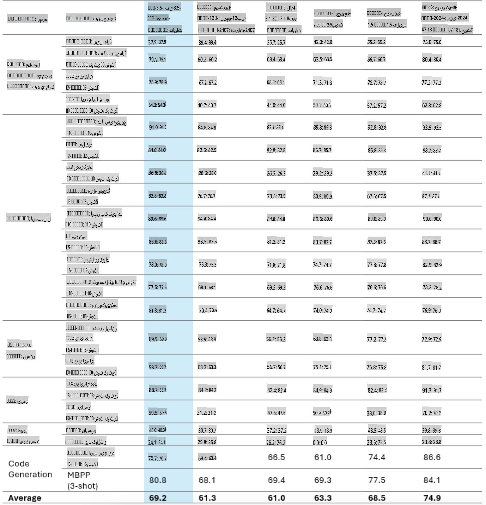
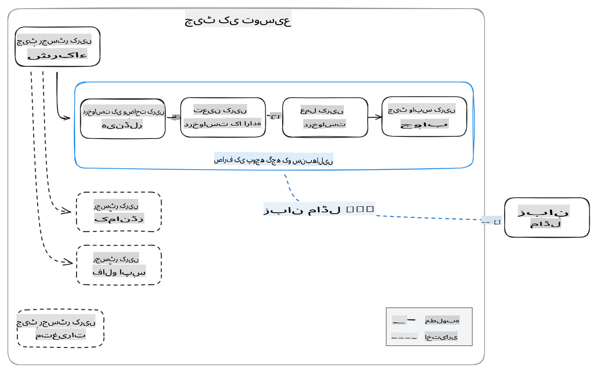
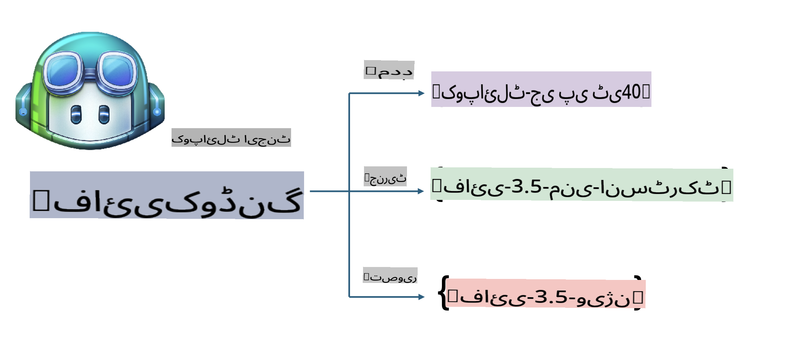
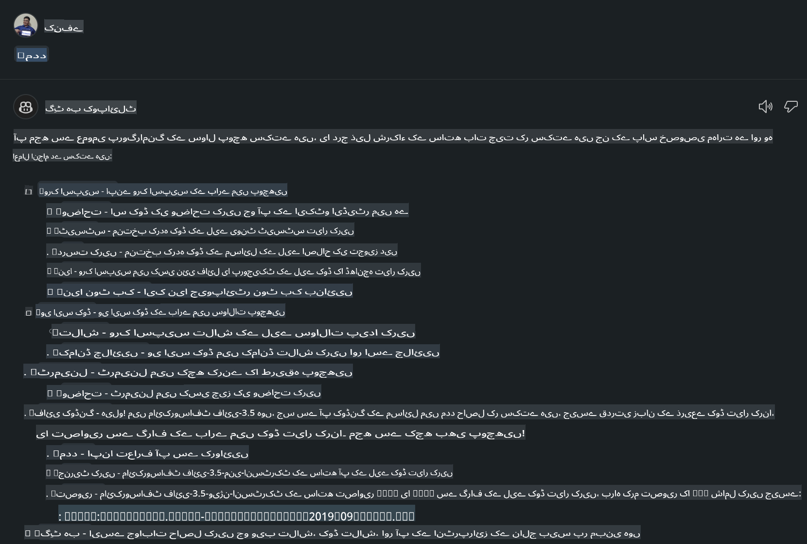
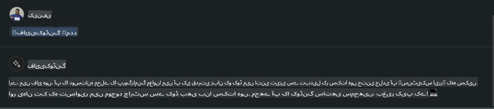
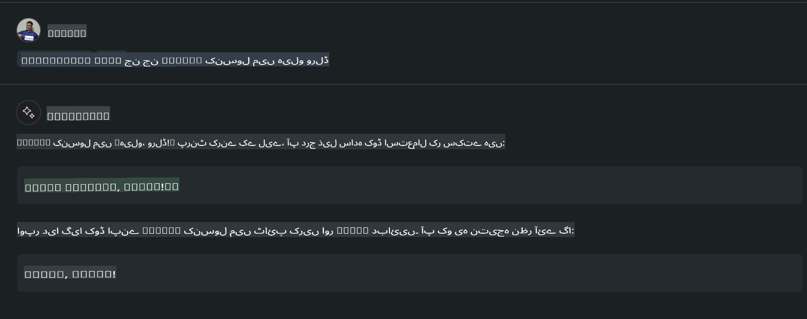
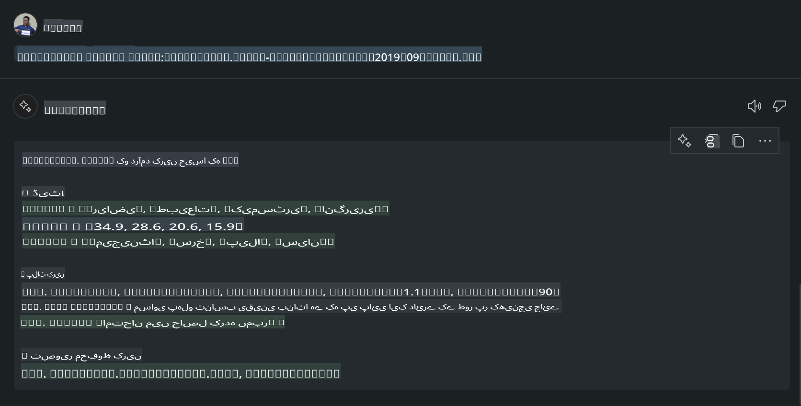

# **اپنا Visual Studio Code Chat Copilot Agent GitHub Models کے Phi-3.5 کے ساتھ بنائیں**

کیا آپ Visual Studio Code Copilot استعمال کر رہے ہیں؟ خاص طور پر چیٹ میں، آپ مختلف ایجنٹس کا استعمال کرکے Visual Studio Code میں پروجیکٹس بنانے، لکھنے اور برقرار رکھنے کی صلاحیت کو بہتر بنا سکتے ہیں۔ Visual Studio Code ایک API فراہم کرتا ہے جو کمپنیوں اور افراد کو ان کے کاروبار کی بنیاد پر مختلف ایجنٹس بنانے کی اجازت دیتا ہے تاکہ مختلف مخصوص شعبوں میں اپنی صلاحیتوں کو بڑھا سکیں۔ اس مضمون میں، ہم GitHub Models کے **Phi-3.5-mini-instruct (128k)** اور **Phi-3.5-vision-instruct (128k)** پر توجہ مرکوز کریں گے تاکہ اپنا Visual Studio Code Agent بنایا جا سکے۔

## **GitHub Models کے Phi-3.5 کے بارے میں**

ہم جانتے ہیں کہ Phi-3/3.5-mini-instruct فیملی میں کوڈ کو سمجھنے اور بنانے کی زبردست صلاحیت موجود ہے اور یہ Gemma-2-9b اور Mistral-Nemo-12B-instruct-2407 پر برتری رکھتا ہے۔



تازہ ترین GitHub Models پہلے ہی Phi-3.5-mini-instruct (128k) اور Phi-3.5-vision-instruct (128k) ماڈلز تک رسائی فراہم کرتے ہیں۔ ڈویلپرز ان تک OpenAI SDK، Azure AI Inference SDK، اور REST API کے ذریعے رسائی حاصل کر سکتے ہیں۔


***نوٹ:*** یہاں Azure AI Inference SDK استعمال کرنے کی سفارش کی جاتی ہے، کیونکہ یہ پروڈکشن ماحول میں Azure Model Catalog کے ساتھ بہتر سوئچنگ فراہم کر سکتا ہے۔

ذیل میں **Phi-3.5-mini-instruct (128k)** اور **Phi-3.5-vision-instruct (128k)** کے کوڈ جنریشن منظرنامے کے نتائج ہیں، جو GitHub Models کے ساتھ مربوط ہیں، اور آئندہ مثالوں کے لیے بھی تیار ہیں۔

**ڈیمو: GitHub Models Phi-3.5-mini-instruct (128k) کے ذریعے پرامپٹ سے کوڈ جنریٹ کریں** ([یہ لنک کلک کریں](../../../../../../code/09.UpdateSamples/Aug/ghmodel_phi35_instruct_demo.ipynb))

**ڈیمو: GitHub Models Phi-3.5-vision-instruct (128k) کے ذریعے امیج سے کوڈ جنریٹ کریں** ([یہ لنک کلک کریں](../../../../../../code/09.UpdateSamples/Aug/ghmodel_phi35_vision_demo.ipynb))


## **GitHub Copilot Chat Agent کے بارے میں**

GitHub Copilot Chat Agent مختلف پروجیکٹ کے منظرناموں میں کوڈ کی بنیاد پر مختلف کام انجام دے سکتا ہے۔ اس سسٹم میں چار ایجنٹس ہیں: workspace، github، terminal، vscode۔


ایجنٹ کے نام کے ساتھ '@' شامل کرکے آپ متعلقہ کام جلدی مکمل کر سکتے ہیں۔ کاروباری اداروں کے لیے، اگر آپ اپنی کاروباری ضروریات جیسے کہ requirements، coding، test specifications، اور release کو شامل کریں، تو آپ GitHub Copilot کی بنیاد پر مزید طاقتور پرائیویٹ فنکشنز حاصل کر سکتے ہیں۔

Visual Studio Code Chat Agent نے اب اپنی API کو باضابطہ طور پر جاری کر دیا ہے، جو کاروباری اداروں یا ڈویلپرز کو مختلف سافٹ ویئر بزنس ایکوسسٹم کی بنیاد پر ایجنٹس بنانے کی اجازت دیتا ہے۔ Visual Studio Code Extension Development کے طریقے پر مبنی، آپ آسانی سے Visual Studio Code Chat Agent API کے انٹرفیس تک رسائی حاصل کر سکتے ہیں۔ ہم اس عمل کی بنیاد پر ترقی کر سکتے ہیں۔



ترقیاتی منظرنامہ تھرڈ پارٹی ماڈل APIs (جیسے کہ GitHub Models، Azure Model Catalog، اور اوپن سورس ماڈلز پر مبنی سیلف بلٹ سروسز) تک رسائی کی حمایت کر سکتا ہے اور GitHub Copilot کے فراہم کردہ gpt-35-turbo، gpt-4، اور gpt-4o ماڈلز کو بھی استعمال کر سکتا ہے۔

## **Phi-3.5 پر مبنی ایک ایجنٹ @phicoding شامل کریں**

ہم Phi-3.5 کی پروگرامنگ صلاحیتوں کو ضم کرنے کی کوشش کرتے ہیں تاکہ کوڈ لکھنے، امیج سے کوڈ جنریٹ کرنے اور دیگر کام مکمل کیے جا سکیں۔ Phi-3.5 کے گرد بنایا گیا ایک ایجنٹ مکمل کریں - @PHI، ذیل میں کچھ فنکشنز ہیں:

1. **@phicoding /help** کمانڈ کے ذریعے GitHub Copilot کے فراہم کردہ GPT-4o کی بنیاد پر ایک تعارف جنریٹ کریں۔

2. **@phicoding /gen** کمانڈ کے ذریعے **Phi-3.5-mini-instruct (128k)** کی بنیاد پر مختلف پروگرامنگ زبانوں کے لیے کوڈ جنریٹ کریں۔

3. **@phicoding /image** کمانڈ کے ذریعے **Phi-3.5-vision-instruct (128k)** کی بنیاد پر کوڈ جنریٹ کریں اور امیج مکمل کریں۔



## **متعلقہ مراحل**

1. npm کا استعمال کرتے ہوئے Visual Studio Code Extension development سپورٹ انسٹال کریں۔

```bash

npm install --global yo generator-code 

```
2. Visual Studio Code Extension پلگ ان بنائیں (Typescript development mode کا استعمال کرتے ہوئے، نام phiext رکھیں)۔

```bash

yo code 

```

3. بنائے گئے پروجیکٹ کو کھولیں اور package.json کو تبدیل کریں۔ یہاں متعلقہ ہدایات اور کنفیگریشنز ہیں، نیز GitHub Models کی کنفیگریشن۔ نوٹ کریں کہ آپ کو یہاں اپنا GitHub Models ٹوکن شامل کرنا ہوگا۔

```json

{
  "name": "phiext",
  "displayName": "phiext",
  "description": "",
  "version": "0.0.1",
  "engines": {
    "vscode": "^1.93.0"
  },
  "categories": [
    "AI",
    "Chat"
  ],
  "activationEvents": [],
  "enabledApiProposals": [
      "chatVariableResolver"
  ],
  "main": "./dist/extension.js",
  "contributes": {
    "chatParticipants": [
        {
            "id": "chat.phicoding",
            "name": "phicoding",
            "description": "Hey! I am Microsoft Phi-3.5, She can help me with coding problems, such as generation code with your natural language, or even generation code about chart from images. Just ask me anything!",
            "isSticky": true,
            "commands": [
                {
                    "name": "help",
                    "description": "Introduce myself to you"
                },
                {
                    "name": "gen",
                    "description": "Generate code for you with Microsoft Phi-3.5-mini-instruct"
                },
                {
                    "name": "image",
                    "description": "Generate code for chart from image(png or jpg) with Microsoft Phi-3.5-vision-instruct, please add image url like this : https://ajaytech.co/wp-content/uploads/2019/09/index.png"
                }
            ]
        }
    ],
    "commands": [
        {
            "command": "phicoding.namesInEditor",
            "title": "Use Microsoft Phi 3.5 in Editor"
        }
    ],
    "configuration": {
      "type": "object",
      "title": "githubmodels",
      "properties": {
        "githubmodels.endpoint": {
          "type": "string",
          "default": "https://models.inference.ai.azure.com",
          "description": "Your GitHub Models Endpoint",
          "order": 0
        },
        "githubmodels.api_key": {
          "type": "string",
          "default": "Your GitHub Models Token",
          "description": "Your GitHub Models Token",
          "order": 1
        },
        "githubmodels.phi35instruct": {
          "type": "string",
          "default": "Phi-3.5-mini-instruct",
          "description": "Your Phi-35-Instruct Model",
          "order": 2
        },
        "githubmodels.phi35vision": {
          "type": "string",
          "default": "Phi-3.5-vision-instruct",
          "description": "Your Phi-35-Vision Model",
          "order": 3
        }
      }
    }
  },
  "scripts": {
    "vscode:prepublish": "npm run package",
    "compile": "webpack",
    "watch": "webpack --watch",
    "package": "webpack --mode production --devtool hidden-source-map",
    "compile-tests": "tsc -p . --outDir out",
    "watch-tests": "tsc -p . -w --outDir out",
    "pretest": "npm run compile-tests && npm run compile && npm run lint",
    "lint": "eslint src",
    "test": "vscode-test"
  },
  "devDependencies": {
    "@types/vscode": "^1.93.0",
    "@types/mocha": "^10.0.7",
    "@types/node": "20.x",
    "@typescript-eslint/eslint-plugin": "^8.3.0",
    "@typescript-eslint/parser": "^8.3.0",
    "eslint": "^9.9.1",
    "typescript": "^5.5.4",
    "ts-loader": "^9.5.1",
    "webpack": "^5.94.0",
    "webpack-cli": "^5.1.4",
    "@vscode/test-cli": "^0.0.10",
    "@vscode/test-electron": "^2.4.1"
  },
  "dependencies": {
    "@types/node-fetch": "^2.6.11",
    "node-fetch": "^3.3.2",
    "@azure-rest/ai-inference": "latest",
    "@azure/core-auth": "latest",
    "@azure/core-sse": "latest"
  }
}


```

4. src/extension.ts میں ترمیم کریں۔

```typescript

// The module 'vscode' contains the VS Code extensibility API
// Import the module and reference it with the alias vscode in your code below
import * as vscode from 'vscode';
import ModelClient from "@azure-rest/ai-inference";
import { AzureKeyCredential } from "@azure/core-auth";


interface IPhiChatResult extends vscode.ChatResult {
    metadata: {
        command: string;
    };
}


const MODEL_SELECTOR: vscode.LanguageModelChatSelector = { vendor: 'copilot', family: 'gpt-4o' };

function isValidImageUrl(url: string): boolean {
    const regex = /^(https?:\/\/.*\.(?:png|jpg))$/i;
    return regex.test(url);
}
  

// This method is called when your extension is activated
// Your extension is activated the very first time the command is executed
export function activate(context: vscode.ExtensionContext) {

    const codinghandler: vscode.ChatRequestHandler = async (request: vscode.ChatRequest, context: vscode.ChatContext, stream: vscode.ChatResponseStream, token: vscode.CancellationToken): Promise<IPhiChatResult> => {


        const config : any = vscode.workspace.getConfiguration('githubmodels');
        const endPoint: string = config.get('endpoint');
        const apiKey: string = config.get('api_key');
        const phi35instruct: string = config.get('phi35instruct');
        const phi35vision: string = config.get('phi35vision');
        
        if (request.command === 'help') {

            const content = "Welcome to Coding assistant with Microsoft Phi-3.5"; 
            stream.progress(content);


            try {
                const [model] = await vscode.lm.selectChatModels(MODEL_SELECTOR);
                if (model) {
                    const messages = [
                        vscode.LanguageModelChatMessage.User("Please help me express this content in a humorous way: I am a programming assistant who can help you convert natural language into code and generate code based on the charts in the images. output format like this : Hey I am Phi ......")
                    ];
                    const chatResponse = await model.sendRequest(messages, {}, token);
                    for await (const fragment of chatResponse.text) {
                        stream.markdown(fragment);
                    }
                }
            } catch(err) {
                console.log(err);
            }


            return { metadata: { command: 'help' } };

        }

        
        if (request.command === 'gen') {

            const content = "Welcome to use phi-3.5 to generate code";

            stream.progress(content);

            const client = new ModelClient(endPoint, new AzureKeyCredential(apiKey));

            const response = await client.path("/chat/completions").post({
              body: {
                messages: [
                  { role:"system", content: "You are a coding assistant.Help answer all code generation questions." },
                  { role:"user", content: request.prompt }
                ],
                model: phi35instruct,
                temperature: 0.4,
                max_tokens: 1000,
                top_p: 1.
              }
            });

            stream.markdown(response.body.choices[0].message.content);

            return { metadata: { command: 'gen' } };

        }


        
        if (request.command === 'image') {


            const content = "Welcome to use phi-3.5 to generate code from image(png or jpg),image url like this:https://ajaytech.co/wp-content/uploads/2019/09/index.png";

            stream.progress(content);

            if (!isValidImageUrl(request.prompt)) {
                stream.markdown('Please provide a valid image URL');
                return { metadata: { command: 'image' } };
            }
            else
            {

                const client = new ModelClient(endPoint, new AzureKeyCredential(apiKey));
    
                const response = await client.path("/chat/completions").post({
                    body: {
                      messages: [
                        { role: "system", content: "You are a helpful assistant that describes images in details." },
                        { role: "user", content: [
                            { type: "text", text: "Please generate code according to the chart in the picture according to the following requirements\n1. Keep all information in the chart, including data and text\n2. Do not generate additional information that is not included in the chart\n3. Please extract data from the picture, do not generate it from csv\n4. Please save the regenerated chart as a chart and save it to ./output/demo.png"},
                            { type: "image_url", image_url: {url: request.prompt}
                            }
                          ]
                        }
                      ],
                      model: phi35vision,
                      temperature: 0.4,
                      max_tokens: 2048,
                      top_p: 1.
                    }
                  });
    
                
                stream.markdown(response.body.choices[0].message.content);
    
                return { metadata: { command: 'image' } };
            }


        }


        return { metadata: { command: '' } };
    };


    const phi_ext = vscode.chat.createChatParticipant("chat.phicoding", codinghandler);

    phi_ext.iconPath = new vscode.ThemeIcon('sparkle');


    phi_ext.followupProvider = {
        provideFollowups(result: IPhiChatResult, context: vscode.ChatContext, token: vscode.CancellationToken) {
            return [{
                prompt: 'Let us coding with Phi-3.5 😋😋😋😋',
                label: vscode.l10n.t('Enjoy coding with Phi-3.5'),
                command: 'help'
            } satisfies vscode.ChatFollowup];
        }
    };

    context.subscriptions.push(phi_ext);
}

// This method is called when your extension is deactivated
export function deactivate() {}


```

6. رن کریں۔

***/help***



***@phicoding /help***



***@phicoding /gen***



***@phicoding /image***



آپ سیمپل کوڈ ڈاؤنلوڈ کر سکتے ہیں: [کلک کریں](../../../../../../code/09.UpdateSamples/Aug/vscode)

## **وسائل**

1. GitHub Models کے لیے سائن اپ کریں [https://gh.io/models](https://gh.io/models)

2. Visual Studio Code Extension Development سیکھیں [https://code.visualstudio.com/api/get-started/your-first-extension](https://code.visualstudio.com/api/get-started/your-first-extension)

3. Visual Studio Code Copilot Chat API کے بارے میں جانیں [https://code.visualstudio.com/api/extension-guides/chat](https://code.visualstudio.com/api/extension-guides/chat)

**ڈس کلیمر**:  
یہ دستاویز مشین پر مبنی اے آئی ترجمہ خدمات کا استعمال کرتے ہوئے ترجمہ کی گئی ہے۔ اگرچہ ہم درستگی کی کوشش کرتے ہیں، براہ کرم آگاہ رہیں کہ خودکار ترجمے میں غلطیاں یا خامیاں ہوسکتی ہیں۔ اصل دستاویز کو اس کی اصل زبان میں مستند ماخذ سمجھا جانا چاہیے۔ اہم معلومات کے لیے، پیشہ ور انسانی ترجمے کی سفارش کی جاتی ہے۔ ہم اس ترجمے کے استعمال سے پیدا ہونے والی کسی بھی غلط فہمی یا غلط تشریح کے ذمہ دار نہیں ہیں۔