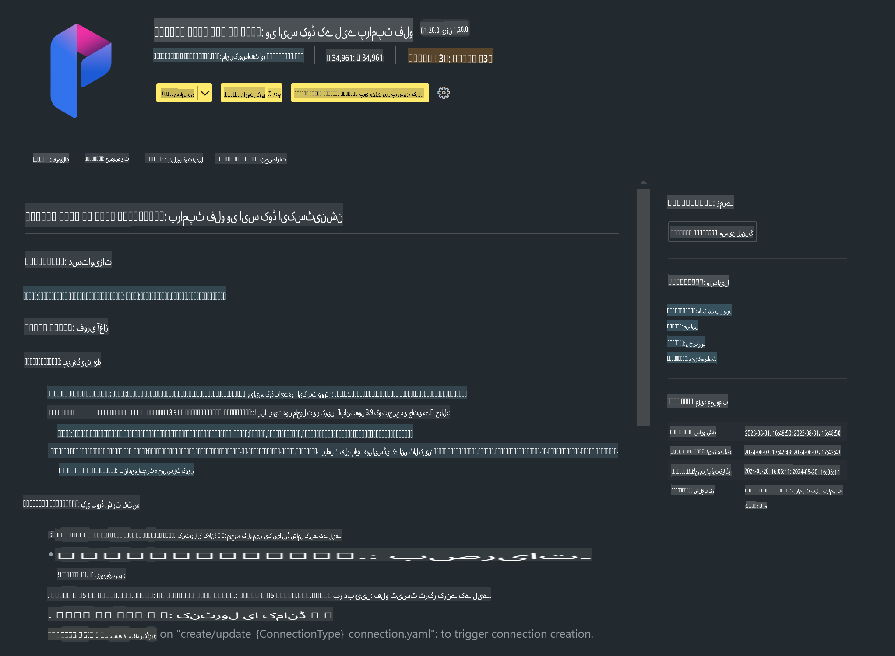

# **لیب 0 - انسٹالیشن**

جب ہم لیب میں داخل ہوں، تو ہمیں متعلقہ ماحول کو ترتیب دینا ہوگا:

### **1. Python 3.11+**

Python کے ماحول کو ترتیب دینے کے لیے miniforge استعمال کرنے کی سفارش کی جاتی ہے۔

miniforge کو ترتیب دینے کے لیے، براہ کرم یہاں دیکھیں: [https://github.com/conda-forge/miniforge](https://github.com/conda-forge/miniforge)

miniforge ترتیب دینے کے بعد، Power Shell میں درج ذیل کمانڈ چلائیں:

```bash

conda create -n pyenv python==3.11.8 -y

conda activate pyenv

```

### **2. Prompt flow SDK انسٹال کریں**

لیب 1 میں، ہم Prompt flow استعمال کریں گے، اس لیے آپ کو Prompt flow SDK ترتیب دینا ہوگا۔

```bash

pip install promptflow --upgrade

```

آپ اس کمانڈ کے ذریعے Prompt flow SDK چیک کر سکتے ہیں:

```bash

pf --version

```

### **3. Visual Studio Code Prompt flow ایکسٹینشن انسٹال کریں**



### **4. Apple's MLX فریم ورک**

MLX ایک ایری فریم ورک ہے جو ایپل سلیکان پر مشین لرننگ ریسرچ کے لیے بنایا گیا ہے، اور یہ ایپل کی مشین لرننگ ریسرچ ٹیم کی جانب سے پیش کیا گیا ہے۔ آپ **Apple MLX فریم ورک** کا استعمال کرتے ہوئے Apple Silicon پر LLM / SLM کو تیز کر سکتے ہیں۔ مزید جاننے کے لیے، آپ یہ پڑھ سکتے ہیں: [https://github.com/microsoft/PhiCookBook/blob/main/md/01.Introduction/03/MLX_Inference.md](https://github.com/microsoft/PhiCookBook/blob/main/md/01.Introduction/03/MLX_Inference.md)

bash میں MLX فریم ورک لائبریری انسٹال کریں:

```bash

pip install mlx-lm

```

### **5. دیگر Python لائبریری**

requirements.txt بنائیں اور اس مواد کو شامل کریں:

```txt

notebook
numpy 
scipy 
scikit-learn 
matplotlib 
pandas 
pillow 
graphviz

```

### **6. NVM انسٹال کریں**

Powershell میں nvm انسٹال کریں:

```bash

brew install nvm

```

Node.js 18.20 انسٹال کریں:

```bash

nvm install 18.20.0

nvm use 18.20.0

```

### **7. Visual Studio Code ڈیولپمنٹ سپورٹ انسٹال کریں**

```bash

npm install --global yo generator-code

```

مبارک ہو! آپ نے کامیابی سے SDK ترتیب دے لیا ہے۔ اب عملی اقدامات کی طرف بڑھیں۔

**ڈسکلیمر**:  
یہ دستاویز مشین پر مبنی اے آئی ترجمہ خدمات کا استعمال کرتے ہوئے ترجمہ کی گئی ہے۔ ہم درستگی کے لیے بھرپور کوشش کرتے ہیں، لیکن براہ کرم آگاہ رہیں کہ خودکار ترجمے میں غلطیاں یا خامیاں ہو سکتی ہیں۔ اصل دستاویز کو اس کی مقامی زبان میں مستند ذریعہ سمجھا جانا چاہیے۔ اہم معلومات کے لیے، پیشہ ور انسانی ترجمہ تجویز کیا جاتا ہے۔ ہم اس ترجمے کے استعمال سے پیدا ہونے والی کسی بھی غلط فہمی یا غلط تشریح کے ذمہ دار نہیں ہیں۔