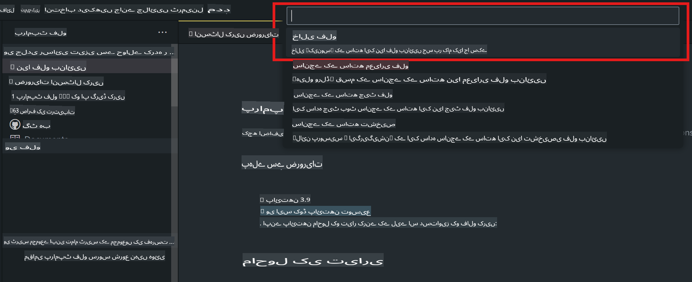
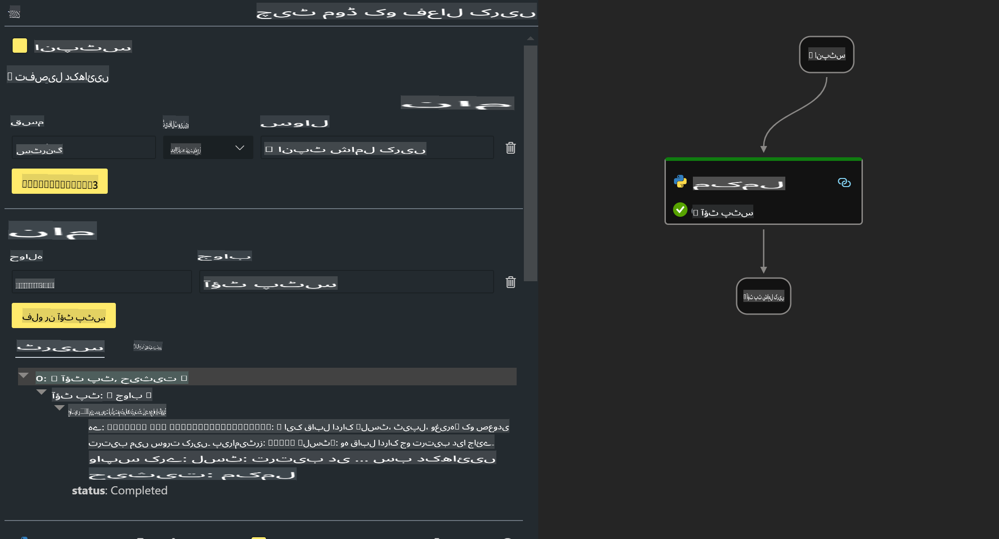
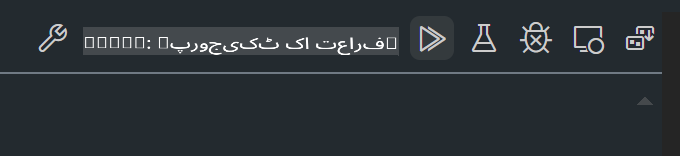

# **لیب 2 - AIPC میں Phi-3-mini کے ساتھ پرامپٹ فلو چلائیں**

## **پرامپٹ فلو کیا ہے؟**

پرامپٹ فلو ایک ایسا ترقیاتی ٹول سیٹ ہے جو LLM پر مبنی AI ایپلیکیشنز کی مکمل ڈویلپمنٹ سائیکل کو آسان اور مؤثر بناتا ہے، جس میں آئیڈیاز کی تخلیق، پروٹو ٹائپنگ، ٹیسٹنگ، ایویلیوایشن، پروڈکشن ڈیپلائمنٹ، اور مانیٹرنگ شامل ہیں۔ یہ پرامپٹ انجینئرنگ کو بہت آسان بناتا ہے اور آپ کو پروڈکشن کوالٹی کے ساتھ LLM ایپس بنانے کی سہولت دیتا ہے۔

پرامپٹ فلو کے ذریعے آپ یہ کر سکتے ہیں:

- ایسے فلو بنائیں جو LLMs، پرامپٹس، پائتھون کوڈ اور دیگر ٹولز کو ایک ایگزیکیوبل ورک فلو میں جوڑ سکیں۔

- اپنے فلو کو آسانی سے ڈیبگ اور بہتر کریں، خاص طور پر LLMs کے ساتھ انٹریکشن کو۔

- اپنے فلو کی ایویلیوایشن کریں، بڑے ڈیٹا سیٹس کے ساتھ کوالٹی اور پرفارمنس میٹرکس کا حساب لگائیں۔

- ٹیسٹنگ اور ایویلیوایشن کو اپنے CI/CD سسٹم میں ضم کریں تاکہ فلو کی کوالٹی یقینی بنائی جا سکے۔

- اپنے فلو کو اپنی منتخب کردہ سروسنگ پلیٹ فارم پر ڈیپلائے کریں یا آسانی سے اپنی ایپ کے کوڈ بیس میں شامل کریں۔

- (اختیاری لیکن بہت مفید) Azure AI میں پرامپٹ فلو کے کلاؤڈ ورژن کے ذریعے اپنی ٹیم کے ساتھ تعاون کریں۔


## **ایپل سلیکون پر جنریشن کوڈ فلو بنانا**

***نوٹ***: اگر آپ نے ماحول کی انسٹالیشن مکمل نہیں کی ہے تو براہ کرم [لیب 0 - انسٹالیشنز](./01.Installations.md) ملاحظہ کریں۔

1. Visual Studio Code میں پرامپٹ فلو ایکسٹینشن کھولیں اور ایک خالی فلو پروجیکٹ بنائیں۔



2. ان پٹ اور آؤٹ پٹ پیرامیٹرز شامل کریں اور پائتھون کوڈ کو ایک نئے فلو کے طور پر شامل کریں۔



آپ اس اسٹرکچر (flow.dag.yaml) کا حوالہ لے سکتے ہیں تاکہ اپنا فلو تعمیر کریں۔

```yaml

inputs:
  prompt:
    type: string
    default: Write python code for Fibonacci serie. Please use markdown as output
outputs:
  result:
    type: string
    reference: ${gen_code_by_phi3.output}
nodes:
- name: gen_code_by_phi3
  type: python
  source:
    type: code
    path: gen_code_by_phi3.py
  inputs:
    prompt: ${inputs.prompt}


```

3. phi-3-mini کو کوانٹفائی کریں۔

ہم امید کرتے ہیں کہ SLM کو مقامی ڈیوائسز پر بہتر چلایا جا سکے۔ عام طور پر، ہم ماڈل کو کوانٹفائی کرتے ہیں (INT4, FP16, FP32)۔

```bash

python -m mlx_lm.convert --hf-path microsoft/Phi-3-mini-4k-instruct

```

**نوٹ:** ڈیفالٹ فولڈر mlx_model ہے۔

4. ***Chat_With_Phi3.py*** میں کوڈ شامل کریں۔

```python


from promptflow import tool

from mlx_lm import load, generate


# The inputs section will change based on the arguments of the tool function, after you save the code
# Adding type to arguments and return value will help the system show the types properly
# Please update the function name/signature per need
@tool
def my_python_tool(prompt: str) -> str:

    model_id = './mlx_model_phi3_mini'

    model, tokenizer = load(model_id)

    # <|user|>\nWrite python code for Fibonacci serie. Please use markdown as output<|end|>\n<|assistant|>

    response = generate(model, tokenizer, prompt="<|user|>\n" + prompt  + "<|end|>\n<|assistant|>", max_tokens=2048, verbose=True)

    return response


```

4. آپ ڈیبگ یا رن سے فلو ٹیسٹ کر سکتے ہیں تاکہ یہ چیک کریں کہ جنریشن کوڈ درست ہے یا نہیں۔



5. ٹرمینل میں ڈیویلپمنٹ API کے طور پر فلو چلائیں۔

```

pf flow serve --source ./ --port 8080 --host localhost   

```

آپ اسے Postman / Thunder Client میں ٹیسٹ کر سکتے ہیں۔


### **نوٹ**

1. پہلی بار چلانے میں زیادہ وقت لگتا ہے۔ Hugging face CLI سے phi-3 ماڈل ڈاؤن لوڈ کرنے کی سفارش کی جاتی ہے۔

2. Intel NPU کی محدود کمپیوٹنگ پاور کو مدنظر رکھتے ہوئے، Phi-3-mini-4k-instruct استعمال کرنے کی سفارش کی جاتی ہے۔

3. ہم INT4 کنورژن کو کوانٹفائی کرنے کے لیے Intel NPU Acceleration کا استعمال کرتے ہیں، لیکن اگر آپ دوبارہ سروس چلائیں تو کیش اور nc_workshop فولڈرز کو حذف کرنا ضروری ہے۔


## **وسائل**

1. پرامپٹ فلو سیکھیں [https://microsoft.github.io/promptflow/](https://microsoft.github.io/promptflow/)

2. Intel NPU Acceleration سیکھیں [https://github.com/intel/intel-npu-acceleration-library](https://github.com/intel/intel-npu-acceleration-library)

3. سیمپل کوڈ ڈاؤن لوڈ کریں [مقامی NPU ایجنٹ سیمپل کوڈ](../../../../../../../../../code/07.Lab/01/AIPC/local-npu-agent)

**ڈسکلیمر**:  
یہ دستاویز مشین پر مبنی AI ترجمہ سروسز کا استعمال کرتے ہوئے ترجمہ کی گئی ہے۔ اگرچہ ہم درستگی کے لیے کوشش کرتے ہیں، لیکن براہ کرم آگاہ رہیں کہ خودکار ترجمے میں غلطیاں یا غیر درستیاں ہو سکتی ہیں۔ اصل دستاویز کو اس کی مقامی زبان میں مستند ماخذ سمجھا جانا چاہیے۔ اہم معلومات کے لیے، پیشہ ور انسانی ترجمہ کی سفارش کی جاتی ہے۔ ہم اس ترجمے کے استعمال سے پیدا ہونے والی کسی بھی غلط فہمی یا غلط تشریح کے ذمہ دار نہیں ہیں۔