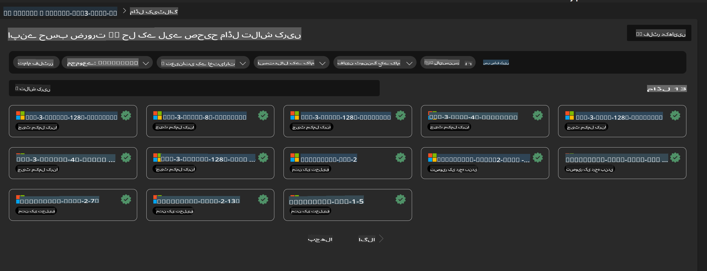
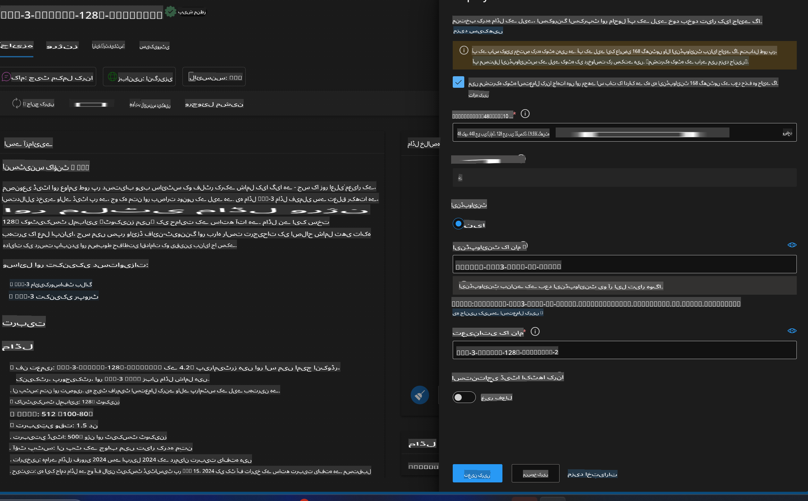
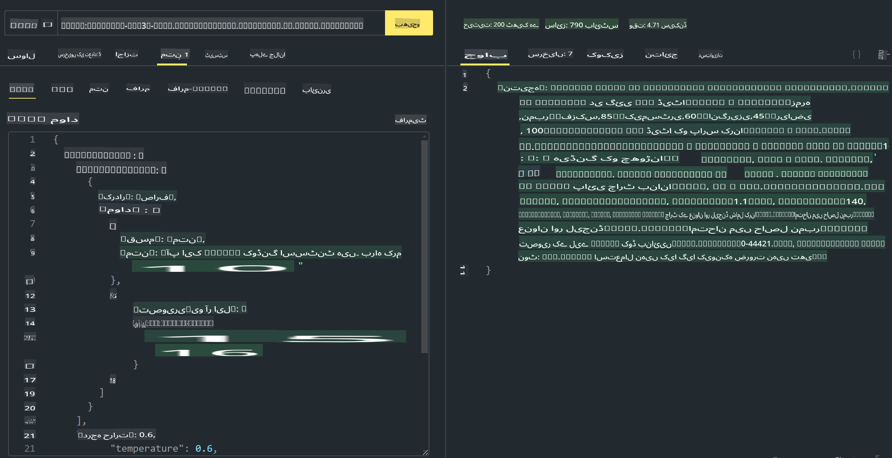

# **لیب 3 - Azure Machine Learning Service پر Phi-3-Vision کو ڈپلائے کریں**

ہم NPU کا استعمال کرتے ہوئے مقامی کوڈ کی پروڈکشن ڈپلائمنٹ مکمل کرتے ہیں، اور پھر ہم Phi-3-Vision کی صلاحیت کو متعارف کرانے کے قابل بننا چاہتے ہیں تاکہ تصویروں سے کوڈ جنریٹ کیا جا سکے۔

اس تعارف میں، ہم Azure Machine Learning Service میں جلدی سے ایک Model As Service Phi-3 Vision سروس بنا سکتے ہیں۔

***نوٹ***: Phi-3 Vision کو مواد تیزی سے پیدا کرنے کے لیے کمپیوٹنگ پاور کی ضرورت ہوتی ہے۔ ہمیں یہ حاصل کرنے میں مدد کے لیے کلاؤڈ کمپیوٹنگ پاور کی ضرورت ہے۔  

### **1. Azure Machine Learning Service بنائیں**

ہمیں Azure پورٹل میں ایک Azure Machine Learning Service بنانی ہوگی۔ اگر آپ جاننا چاہتے ہیں کہ یہ کیسے کریں، تو براہ کرم اس لنک پر جائیں: [https://learn.microsoft.com/azure/machine-learning/quickstart-create-resources?view=azureml-api-2](https://learn.microsoft.com/azure/machine-learning/quickstart-create-resources?view=azureml-api-2)

### **2. Azure Machine Learning Service میں Phi-3 Vision کا انتخاب کریں**



### **3. Azure میں Phi-3-Vision کو ڈپلائے کریں**



### **4. Postman میں Endpoint کو ٹیسٹ کریں**



***نوٹ***

1. منتقل کیے جانے والے پیرامیٹرز میں Authorization، azureml-model-deployment، اور Content-Type شامل ہونا ضروری ہے۔ آپ کو ڈپلائمنٹ کی معلومات چیک کرکے یہ حاصل کرنا ہوگا۔

2. پیرامیٹرز منتقل کرنے کے لیے، Phi-3-Vision کو ایک تصویر کا لنک بھیجنا ہوگا۔ براہ کرم پیرامیٹرز منتقل کرنے کے لیے GPT-4-Vision کے طریقے کا حوالہ دیں، جیسے کہ

```json

{
  "input_data":{
    "input_string":[
      {
        "role":"user",
        "content":[ 
          {
            "type": "text",
            "text": "You are a Python coding assistant.Please create Python code for image "
          },
          {
              "type": "image_url",
              "image_url": {
                "url": "https://ajaytech.co/wp-content/uploads/2019/09/index.png"
              }
          }
        ]
      }
    ],
    "parameters":{
          "temperature": 0.6,
          "top_p": 0.9,
          "do_sample": false,
          "max_new_tokens": 2048
    }
  }
}

```

3. Post طریقہ استعمال کرتے ہوئے **/score** کو کال کریں۔

**مبارک ہو**! آپ نے تیز رفتار PHI-3-VISION ڈپلائمنٹ مکمل کر لیا ہے اور یہ آزمایا ہے کہ تصویروں کو استعمال کرکے کوڈ کیسے بنایا جا سکتا ہے۔ اگلے مرحلے میں، ہم NPUs اور کلاؤڈز کو ملا کر ایپلیکیشنز بنا سکتے ہیں۔

**اعلانِ لاتعلقی**:  
یہ دستاویز مشین پر مبنی AI ترجمہ خدمات کا استعمال کرتے ہوئے ترجمہ کی گئی ہے۔ ہم درستگی کے لیے بھرپور کوشش کرتے ہیں، لیکن براہ کرم آگاہ رہیں کہ خودکار ترجمے میں غلطیاں یا خامیاں ہوسکتی ہیں۔ اصل دستاویز کو اس کی مقامی زبان میں مستند ذریعہ سمجھا جانا چاہیے۔ اہم معلومات کے لیے، پیشہ ور انسانی ترجمے کی سفارش کی جاتی ہے۔ ہم اس ترجمے کے استعمال سے پیدا ہونے والی کسی بھی غلط فہمی یا غلط تشریح کے ذمہ دار نہیں ہیں۔