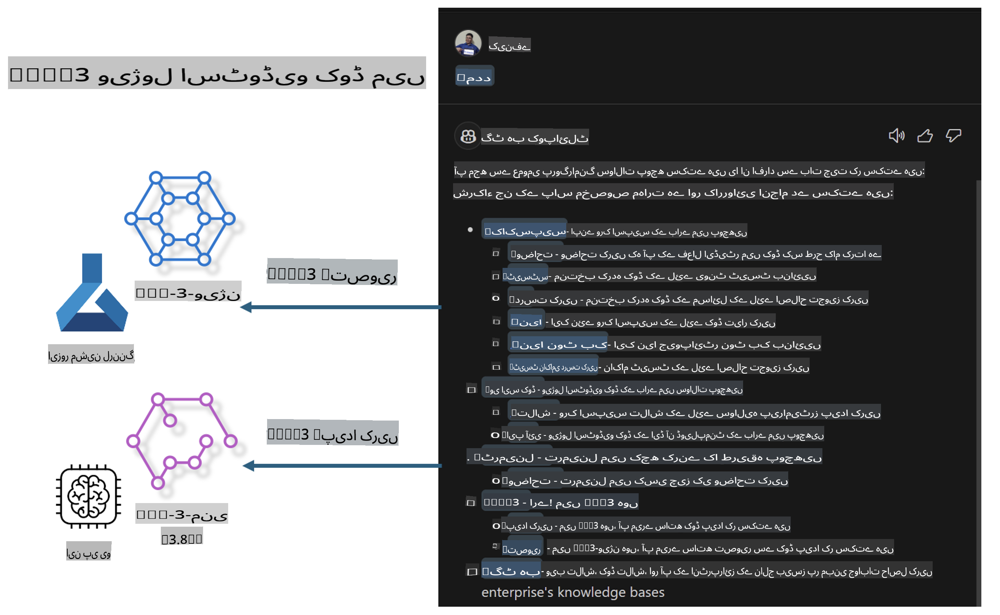

# **اپنا Visual Studio Code GitHub Copilot Chat Microsoft Phi-3 فیملی کے ساتھ بنائیں**

کیا آپ نے GitHub Copilot Chat میں ورک اسپیس ایجنٹ استعمال کیا ہے؟ کیا آپ اپنی ٹیم کے لیے اپنا کوڈ ایجنٹ بنانا چاہتے ہیں؟ یہ ہینڈز آن لیب اوپن سورس ماڈل کو استعمال کرکے ایک انٹرپرائز لیول کوڈ بزنس ایجنٹ بنانے کی امید رکھتا ہے۔

## **بنیاد**

### **Microsoft Phi-3 کیوں منتخب کریں**

Phi-3 ایک فیملی سیریز ہے، جس میں phi-3-mini، phi-3-small، اور phi-3-medium شامل ہیں، جو مختلف ٹریننگ پیرامیٹرز پر مبنی ہیں، جیسے کہ ٹیکسٹ جنریشن، ڈائیلاگ کمپلیشن، اور کوڈ جنریشن۔ اس کے علاوہ، phi-3-vision بھی موجود ہے جو Vision پر مبنی ہے۔ یہ انٹرپرائزز یا مختلف ٹیموں کے لیے آف لائن جنریٹیو AI سلوشنز بنانے کے لیے موزوں ہے۔

اس لنک کو پڑھنے کی تجویز دی جاتی ہے: [https://github.com/microsoft/PhiCookBook/blob/main/md/01.Introduction/01/01.PhiFamily.md](https://github.com/microsoft/PhiCookBook/blob/main/md/01.Introduction/01/01.PhiFamily.md)

### **Microsoft GitHub Copilot Chat**

GitHub Copilot Chat ایکسٹینشن آپ کو ایک چیٹ انٹرفیس فراہم کرتا ہے، جو آپ کو GitHub Copilot کے ساتھ بات چیت کرنے اور کوڈنگ سے متعلق سوالات کے جوابات براہ راست VS Code میں حاصل کرنے دیتا ہے، بغیر دستاویزات میں جانے یا آن لائن فورمز تلاش کرنے کی ضرورت۔

Copilot Chat کوڈ کی وضاحت کے لیے سنٹیکس ہائی لائٹنگ، انڈینٹیشن، اور دیگر فارمیٹنگ فیچرز استعمال کر سکتا ہے۔ صارف کے سوال کی نوعیت کے مطابق، نتیجہ میں ایسے لنکس ہو سکتے ہیں جو Copilot نے جواب تیار کرنے کے لیے استعمال کیے، جیسے کہ سورس کوڈ فائلز یا دستاویزات، یا VS Code کی فنکشنلٹی تک رسائی کے لیے بٹن۔

- Copilot Chat آپ کے ڈویلپر فلو میں ضم ہو کر آپ کو جہاں ضرورت ہو وہاں مدد فراہم کرتا ہے:

- ایڈیٹر یا ٹرمینل سے براہ راست ایک ان لائن چیٹ گفتگو شروع کریں تاکہ کوڈنگ کے دوران مدد مل سکے

- چیٹ ویو کا استعمال کریں تاکہ ایک AI اسسٹنٹ ہر وقت آپ کے ساتھ رہے

- کوئیک چیٹ لانچ کریں تاکہ کوئی جلدی سوال پوچھ کر اپنے کام میں واپس جا سکیں

آپ GitHub Copilot Chat کو مختلف مواقع پر استعمال کر سکتے ہیں، جیسے:

- کسی مسئلے کو حل کرنے کے بہترین طریقے پر کوڈنگ سوالات کے جوابات دینا

- کسی اور کے کوڈ کی وضاحت کرنا اور بہتری کی تجاویز دینا

- کوڈ کی خرابیوں کو ٹھیک کرنے کی تجاویز دینا

- یونٹ ٹیسٹ کیسز تیار کرنا

- کوڈ کی دستاویزات تیار کرنا

اس لنک کو پڑھنے کی تجویز دی جاتی ہے: [https://code.visualstudio.com/docs/copilot/copilot-chat](https://code.visualstudio.com/docs/copilot/copilot-chat?WT.mc_id=aiml-137032-kinfeylo)

### **Microsoft GitHub Copilot Chat @workspace**

Copilot Chat میں **@workspace** کا حوالہ دے کر آپ اپنے پورے کوڈ بیس کے بارے میں سوالات پوچھ سکتے ہیں۔ سوال کی بنیاد پر، Copilot ذہانت سے متعلقہ فائلز اور سمبلز تلاش کرتا ہے، جنہیں وہ اپنے جواب میں لنکس اور کوڈ مثالوں کے طور پر شامل کرتا ہے۔

آپ کے سوال کا جواب دینے کے لیے، **@workspace** انہی ذرائع کو تلاش کرتا ہے جنہیں ایک ڈویلپر VS Code میں کوڈ بیس نیویگیٹ کرتے وقت استعمال کرے گا:

- ورک اسپیس میں موجود تمام فائلز، سوائے ان فائلز کے جنہیں .gitignore فائل نے نظر انداز کیا ہو

- ڈائریکٹری اسٹرکچر، جس میں نیسٹڈ فولڈرز اور فائل کے نام شامل ہوں

- GitHub کا کوڈ سرچ انڈیکس، اگر ورک اسپیس ایک GitHub ریپوزٹری ہو اور کوڈ سرچ کے ذریعے انڈیکسڈ ہو

- ورک اسپیس میں موجود سمبلز اور ڈیفینیشنز

- موجودہ منتخب کردہ ٹیکسٹ یا فعال ایڈیٹر میں نظر آنے والا ٹیکسٹ

نوٹ: اگر آپ نے کسی نظر انداز شدہ فائل کو کھولا ہو یا اس میں سے ٹیکسٹ منتخب کیا ہو تو .gitignore کو نظر انداز کر دیا جاتا ہے۔

اس لنک کو پڑھنے کی تجویز دی جاتی ہے: [https://code.visualstudio.com/docs/copilot/copilot-chat](https://code.visualstudio.com/docs/copilot/workspace-context?WT.mc_id=aiml-137032-kinfeylo)

## **اس لیب کے بارے میں مزید جانیں**

GitHub Copilot نے انٹرپرائزز کی پروگرامنگ کی کارکردگی کو بہت بہتر بنایا ہے، اور ہر انٹرپرائز اپنی ضروریات کے مطابق GitHub Copilot کے متعلقہ فیچرز کو کسٹمائز کرنا چاہتا ہے۔ بہت سے انٹرپرائزز نے اپنے بزنس سیناریوز اور اوپن سورس ماڈلز کی بنیاد پر GitHub Copilot جیسے ایکسٹینشنز کو کسٹمائز کیا ہے۔ انٹرپرائزز کے لیے، کسٹمائزڈ ایکسٹینشنز کو کنٹرول کرنا آسان ہوتا ہے، لیکن یہ صارف کے تجربے پر بھی اثر ڈال سکتا ہے۔ آخر کار، GitHub Copilot عام سیناریوز اور پروفیشنلزم کو ہینڈل کرنے میں زیادہ طاقتور ہے۔ اگر تجربہ مستقل رکھا جا سکے، تو انٹرپرائز کے اپنے ایکسٹینشن کو کسٹمائز کرنا بہتر ہوگا۔ GitHub Copilot Chat انٹرپرائزز کو چیٹ کے تجربے میں توسیع کے لیے متعلقہ APIs فراہم کرتا ہے۔ مستقل تجربہ برقرار رکھنا اور کسٹمائزڈ فیچرز رکھنا ایک بہتر صارف کا تجربہ ہے۔

یہ لیب بنیادی طور پر Phi-3 ماڈل کو مقامی NPU اور Azure ہائبرڈ کے ساتھ ملا کر GitHub Copilot Chat میں ایک کسٹم ایجنٹ ***@PHI3*** بنانے کے لیے استعمال کرتی ہے، جو انٹرپرائز ڈویلپرز کو کوڈ جنریشن ***(@PHI3 /gen)*** اور تصاویر کی بنیاد پر کوڈ تیار کرنے ***(@PHI3 /img)*** میں مدد فراہم کرے۔

### ***نوٹ:*** 

یہ لیب فی الحال Intel CPU اور Apple Silicon کے AIPC میں نافذ کی گئی ہے۔ ہم Qualcomm ورژن کے NPU کو اپ ڈیٹ کرتے رہیں گے۔

## **لیب**

| نام | تفصیل | AIPC | Apple |
| ------------ | ----------- | -------- |-------- |
| Lab0 - انسٹالیشنز(✅) | متعلقہ ماحول اور انسٹالیشن ٹولز کو ترتیب دیں اور انسٹال کریں | [Go](./HOL/AIPC/01.Installations.md) |[Go](./HOL/Apple/01.Installations.md) |
| Lab1 - Phi-3-mini کے ساتھ پرامپٹ فلو چلائیں (✅) | AIPC / Apple Silicon کے ساتھ ملا کر، مقامی NPU کا استعمال کرتے ہوئے Phi-3-mini کے ذریعے کوڈ جنریشن بنائیں | [Go](./HOL/AIPC/02.PromptflowWithNPU.md) |  [Go](./HOL/Apple/02.PromptflowWithMLX.md) |
| Lab2 - Azure Machine Learning Service پر Phi-3-vision کو تعینات کریں (✅) | Azure Machine Learning Service کے ماڈل کیٹلاگ - Phi-3-vision امیج کو تعینات کرکے کوڈ تیار کریں | [Go](./HOL/AIPC/03.DeployPhi3VisionOnAzure.md) |[Go](./HOL/Apple/03.DeployPhi3VisionOnAzure.md) |
| Lab3 - GitHub Copilot Chat میں @phi-3 ایجنٹ بنائیں (✅) | GitHub Copilot Chat میں ایک کسٹم Phi-3 ایجنٹ بنائیں تاکہ کوڈ جنریشن، گراف جنریشن کوڈ، RAG، وغیرہ مکمل کیے جا سکیں | [Go](./HOL/AIPC/04.CreatePhi3AgentInVSCode.md) | [Go](./HOL/Apple/04.CreatePhi3AgentInVSCode.md) |
| نمونہ کوڈ (✅) | نمونہ کوڈ ڈاؤن لوڈ کریں | [Go](../../../../../../../code/07.Lab/01/AIPC) | [Go](../../../../../../../code/07.Lab/01/Apple) |

## **وسائل**

1. Phi-3 Cookbook [https://github.com/microsoft/Phi-3CookBook](https://github.com/microsoft/Phi-3CookBook)

2. GitHub Copilot کے بارے میں مزید سیکھیں [https://learn.microsoft.com/training/paths/copilot/](https://learn.microsoft.com/training/paths/copilot/?WT.mc_id=aiml-137032-kinfeylo)

3. GitHub Copilot Chat کے بارے میں مزید سیکھیں [https://learn.microsoft.com/training/paths/accelerate-app-development-using-github-copilot/](https://learn.microsoft.com/training/paths/accelerate-app-development-using-github-copilot/?WT.mc_id=aiml-137032-kinfeylo)

4. GitHub Copilot Chat API کے بارے میں مزید سیکھیں [https://code.visualstudio.com/api/extension-guides/chat](https://code.visualstudio.com/api/extension-guides/chat?WT.mc_id=aiml-137032-kinfeylo)

5. Azure AI Foundry کے بارے میں مزید سیکھیں [https://learn.microsoft.com/training/paths/create-custom-copilots-ai-studio/](https://learn.microsoft.com/training/paths/create-custom-copilots-ai-studio/?WT.mc_id=aiml-137032-kinfeylo)

6. Azure AI Foundry کے ماڈل کیٹلاگ کے بارے میں مزید سیکھیں [https://learn.microsoft.com/azure/ai-studio/how-to/model-catalog-overview](https://learn.microsoft.com/azure/ai-studio/how-to/model-catalog-overview)

**ڈس کلیمر**:  
یہ دستاویز مشین پر مبنی AI ترجمہ خدمات کا استعمال کرتے ہوئے ترجمہ کی گئی ہے۔ اگرچہ ہم درستگی کے لیے کوشش کرتے ہیں، براہ کرم آگاہ رہیں کہ خودکار ترجمے میں غلطیاں یا خامیاں ہو سکتی ہیں۔ اصل دستاویز، جو اس کی مقامی زبان میں ہے، کو مستند ذریعہ سمجھا جانا چاہیے۔ اہم معلومات کے لیے، پیشہ ور انسانی ترجمہ تجویز کیا جاتا ہے۔ ہم اس ترجمے کے استعمال سے پیدا ہونے والی کسی بھی غلط فہمی یا غلط تشریح کے ذمہ دار نہیں ہیں۔