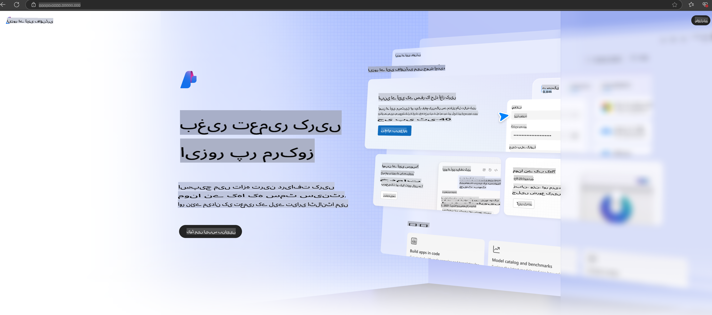

# **Azure AI Foundry میں Phi-3 کا استعمال**

جنریٹیو AI کی ترقی کے ساتھ، ہمارا مقصد ایک متحد پلیٹ فارم کا استعمال کرنا ہے تاکہ مختلف LLM اور SLM، انٹرپرائز ڈیٹا انٹیگریشن، فائن ٹیوننگ/RAG آپریشنز، اور LLM اور SLM کے انضمام کے بعد مختلف انٹرپرائز کاروباروں کی تشخیص کو منظم کیا جا سکے، تاکہ جنریٹیو AI کو سمارٹ ایپلیکیشنز میں بہتر طریقے سے نافذ کیا جا سکے۔ [Azure AI Foundry](https://ai.azure.com) ایک انٹرپرائز لیول جنریٹیو AI ایپلیکیشن پلیٹ فارم ہے۔

Azure AI Foundry کے ذریعے، آپ بڑے لینگویج ماڈل (LLM) کے جوابات کا جائزہ لے سکتے ہیں اور بہتر کارکردگی کے لیے پرامپٹ فلو کے ساتھ پرامپٹ ایپلیکیشن کے اجزاء کو ترتیب دے سکتے ہیں۔ یہ پلیٹ فارم پروف آف کانسیپٹ کو مکمل پیداوار میں تبدیل کرنے کے عمل کو آسانی سے بڑھانے میں مدد دیتا ہے۔ مسلسل مانیٹرنگ اور بہتری طویل مدتی کامیابی کو یقینی بناتی ہے۔

ہم Azure AI Foundry پر سادہ اقدامات کے ذریعے Phi-3 ماڈل کو جلدی سے تعینات کر سکتے ہیں، اور پھر Azure AI Foundry کا استعمال کرتے ہوئے Phi-3 سے متعلقہ Playground/Chat، Fine-tuning، تشخیص اور دیگر متعلقہ کام مکمل کر سکتے ہیں۔

## **1. تیاری**

اگر آپ کے سسٹم پر پہلے سے [Azure Developer CLI](https://learn.microsoft.com/azure/developer/azure-developer-cli/overview?WT.mc_id=aiml-138114-kinfeylo) انسٹال ہے، تو اس ٹیمپلیٹ کا استعمال اتنا آسان ہے کہ اسے ایک نئے ڈائریکٹری میں درج ذیل کمانڈ چلا کر استعمال کیا جا سکتا ہے۔

## دستی تخلیق

Microsoft Azure AI Foundry پروجیکٹ اور حب تخلیق کرنا آپ کے AI کام کو منظم کرنے کا ایک بہترین طریقہ ہے۔ شروع کرنے کے لیے یہاں ایک مرحلہ وار گائیڈ دی گئی ہے:

### Azure AI Foundry میں پروجیکٹ بنانا

1. **Azure AI Foundry پر جائیں**: Azure AI Foundry پورٹل میں سائن ان کریں۔
2. **پروجیکٹ بنائیں**:
   - اگر آپ کسی پروجیکٹ میں ہیں، تو صفحے کے اوپر بائیں جانب "Azure AI Foundry" کو منتخب کریں تاکہ ہوم پیج پر جائیں۔
   - "+ Create project" کو منتخب کریں۔
   - پروجیکٹ کے لیے ایک نام درج کریں۔
   - اگر آپ کے پاس ایک حب ہے، تو وہ ڈیفالٹ کے طور پر منتخب ہوگا۔ اگر آپ کے پاس ایک سے زیادہ حب تک رسائی ہے، تو آپ ڈراپ ڈاؤن سے ایک مختلف حب منتخب کر سکتے ہیں۔ اگر آپ ایک نیا حب بنانا چاہتے ہیں، تو "Create new hub" کو منتخب کریں اور ایک نام فراہم کریں۔
   - "Create" کو منتخب کریں۔

### Azure AI Foundry میں حب بنانا

1. **Azure AI Foundry پر جائیں**: اپنے Azure اکاؤنٹ کے ساتھ سائن ان کریں۔
2. **حب بنائیں**:
   - بائیں مینو سے مینجمنٹ سینٹر کو منتخب کریں۔
   - "All resources" کو منتخب کریں، پھر "+ New project" کے ساتھ نیچے والے تیر کو منتخب کریں اور "+ New hub" پر کلک کریں۔
   - "Create a new hub" ڈائیلاگ میں، اپنے حب کا نام (مثلاً، contoso-hub) درج کریں اور دیگر فیلڈز کو حسب ضرورت تبدیل کریں۔
   - "Next" کو منتخب کریں، معلومات کا جائزہ لیں، اور پھر "Create" کو منتخب کریں۔

مزید تفصیلی ہدایات کے لیے، آپ سرکاری [Microsoft documentation](https://learn.microsoft.com/azure/ai-studio/how-to/create-projects) کا حوالہ دے سکتے ہیں۔

کامیاب تخلیق کے بعد، آپ اپنے بنائے گئے اسٹوڈیو تک [ai.azure.com](https://ai.azure.com/) کے ذریعے رسائی حاصل کر سکتے ہیں۔

ایک AI Foundry پر کئی پروجیکٹس ہو سکتے ہیں۔ AI Foundry میں ایک پروجیکٹ بنائیں تاکہ تیاری مکمل ہو سکے۔

Azure AI Foundry [QuickStarts](https://learn.microsoft.com/azure/ai-studio/quickstarts/get-started-code) کا استعمال کریں۔

## **2. Azure AI Foundry میں Phi ماڈل تعینات کریں**

پروجیکٹ کے Explore آپشن پر کلک کریں تاکہ ماڈل کیٹلاگ میں داخل ہوں اور Phi-3 کو منتخب کریں۔

Phi-3-mini-4k-instruct کو منتخب کریں۔

Phi-3-mini-4k-instruct ماڈل کو تعینات کرنے کے لیے 'Deploy' پر کلک کریں۔

> [!NOTE]
>
> تعیناتی کے وقت آپ کمپیوٹنگ پاور کا انتخاب کر سکتے ہیں۔

## **3. Azure AI Foundry میں Phi کے ساتھ Playground چیٹ**

تعیناتی صفحے پر جائیں، Playground کو منتخب کریں، اور Azure AI Foundry کے Phi-3 کے ساتھ چیٹ کریں۔

## **4. Azure AI Foundry سے ماڈل تعینات کرنا**

Azure Model Catalog سے ماڈل تعینات کرنے کے لیے، آپ درج ذیل مراحل پر عمل کر سکتے ہیں:

- Azure AI Foundry میں سائن ان کریں۔
- Azure AI Foundry ماڈل کیٹلاگ سے جس ماڈل کو آپ تعینات کرنا چاہتے ہیں اسے منتخب کریں۔
- ماڈل کی Details صفحے پر، Deploy کو منتخب کریں اور پھر Serverless API with Azure AI Content Safety کو منتخب کریں۔
- اس پروجیکٹ کو منتخب کریں جس میں آپ اپنے ماڈلز کو تعینات کرنا چاہتے ہیں۔ Serverless API آپشن استعمال کرنے کے لیے، آپ کے ورک اسپیس کا تعلق East US 2 یا Sweden Central ریجن سے ہونا ضروری ہے۔ آپ Deployment نام کو حسب ضرورت بنا سکتے ہیں۔
- تعیناتی وزرڈ پر، Pricing and terms کو منتخب کریں تاکہ قیمتوں اور استعمال کی شرائط کے بارے میں جان سکیں۔
- Deploy کو منتخب کریں۔ جب تک تعیناتی مکمل نہ ہو جائے اور آپ کو Deployments صفحے پر ری ڈائریکٹ نہ کر دیا جائے، انتظار کریں۔
- ماڈل کے ساتھ تعامل شروع کرنے کے لیے Open in playground کو منتخب کریں۔
- آپ Deployments صفحے پر واپس جا سکتے ہیں، تعیناتی کو منتخب کریں، اور Endpoint کا Target URL اور Secret Key نوٹ کریں، جنہیں آپ تعیناتی کو کال کرنے اور کمپلیشنز جنریٹ کرنے کے لیے استعمال کر سکتے ہیں۔
- آپ ہمیشہ Endpoint کی تفصیلات، URL، اور ایکسیس کیز Build ٹیب میں جا کر اور Components سیکشن سے Deployments کو منتخب کر کے حاصل کر سکتے ہیں۔

> [!NOTE]
> براہ کرم نوٹ کریں کہ ان مراحل کو انجام دینے کے لیے آپ کے اکاؤنٹ کے پاس Resource Group پر Azure AI Developer رول کی اجازتیں ہونی چاہئیں۔

## **5. Azure AI Foundry میں Phi API کا استعمال**

آپ Postman کے ذریعے GET کے ساتھ https://{Your project name}.region.inference.ml.azure.com/swagger.json تک رسائی حاصل کر سکتے ہیں اور Key کے ساتھ فراہم کردہ انٹرفیس کے بارے میں معلومات حاصل کر سکتے ہیں۔

آپ درخواست کے پیرامیٹرز اور جواب کے پیرامیٹرز کو بہت آسانی سے حاصل کر سکتے ہیں۔

**ڈس کلیمر**:  
یہ دستاویز مشین پر مبنی اے آئی ترجمہ خدمات کا استعمال کرتے ہوئے ترجمہ کی گئی ہے۔ اگرچہ ہم درستگی کے لیے کوشش کرتے ہیں، براہ کرم آگاہ رہیں کہ خودکار ترجمے میں غلطیاں یا خامیاں ہو سکتی ہیں۔ اصل دستاویز، جو اس کی اصل زبان میں ہے، کو مستند ذریعہ سمجھا جانا چاہیے۔ اہم معلومات کے لیے، پیشہ ور انسانی ترجمہ کی سفارش کی جاتی ہے۔ ہم اس ترجمے کے استعمال سے پیدا ہونے والی کسی بھی غلط فہمی یا غلط تشریح کے ذمہ دار نہیں ہیں۔