# Azure AI Foundry کے ساتھ Phi-3 کو بہتر بنانا

آئیے Microsoft کے Phi-3 Mini لینگویج ماڈل کو Azure AI Foundry کے ذریعے بہتر بنانے کا طریقہ دریافت کریں۔ Fine-tuning آپ کو Phi-3 Mini کو مخصوص کاموں کے لیے ڈھالنے کی اجازت دیتا ہے، جس سے یہ اور بھی طاقتور اور سیاق و سباق سے آگاہ ہو جاتا ہے۔

## اہم نکات

- **صلاحیتیں:** کون سے ماڈلز کو بہتر بنایا جا سکتا ہے؟ بیس ماڈل کو کس حد تک بہتر بنایا جا سکتا ہے؟
- **لاگت:** Fine-tuning کے لیے قیمت کا ماڈل کیا ہے؟
- **حسب ضرورت:** میں بیس ماڈل میں کتنی اور کس حد تک تبدیلی کر سکتا ہوں؟
- **آسانی:** Fine-tuning کیسے کی جاتی ہے – کیا مجھے کسٹم کوڈ لکھنے کی ضرورت ہے؟ کیا مجھے اپنا کمپیوٹ لانا ہوگا؟
- **حفاظت:** Fine-tuned ماڈلز میں حفاظتی خطرات ہو سکتے ہیں – کیا غیر ارادی نقصان سے بچانے کے لیے کوئی حفاظتی اقدامات موجود ہیں؟

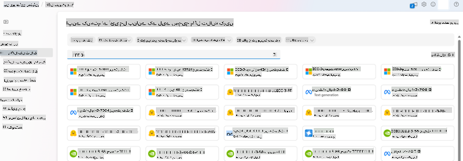

## Fine-tuning کی تیاری

### ضروریات

> [!NOTE]  
> Phi-3 فیملی ماڈلز کے لیے، pay-as-you-go ماڈل کی Fine-tuning کی سہولت صرف **East US 2** ریجنز میں بنائے گئے hubs کے ساتھ دستیاب ہے۔

- ایک Azure سبسکرپشن۔ اگر آپ کے پاس Azure سبسکرپشن نہیں ہے، تو ایک [پیدا کردہ Azure اکاؤنٹ](https://azure.microsoft.com/pricing/purchase-options/pay-as-you-go) بنائیں۔

- ایک [AI Foundry پروجیکٹ](https://ai.azure.com?WT.mc_id=aiml-138114-kinfeylo)۔
- Azure RBAC (رول بیسڈ ایکسس کنٹرول) کو Azure AI Foundry میں آپریشنز تک رسائی دینے کے لیے استعمال کیا جاتا ہے۔ اس آرٹیکل کے مراحل انجام دینے کے لیے، آپ کے یوزر اکاؤنٹ کو __Azure AI Developer رول__ کے ساتھ resource group پر تفویض ہونا چاہیے۔

### سبسکرپشن پرووائیڈر رجسٹریشن

یقینی بنائیں کہ سبسکرپشن `Microsoft.Network` resource provider کے ساتھ رجسٹرڈ ہے۔

1. [Azure پورٹل](https://portal.azure.com) میں سائن ان کریں۔
1. بائیں مینو سے **سبسکرپشنز** منتخب کریں۔
1. وہ سبسکرپشن منتخب کریں جسے آپ استعمال کرنا چاہتے ہیں۔
1. بائیں مینو سے **AI پروجیکٹ سیٹنگز** > **Resource providers** منتخب کریں۔
1. تصدیق کریں کہ **Microsoft.Network** resource providers کی فہرست میں موجود ہے۔ اگر نہیں، تو اسے شامل کریں۔

### ڈیٹا کی تیاری

اپنے ماڈل کو بہتر بنانے کے لیے ٹریننگ اور ویلیڈیشن ڈیٹا تیار کریں۔ آپ کے ٹریننگ اور ویلیڈیشن ڈیٹا سیٹس میں ان پٹ اور آؤٹ پٹ مثالیں شامل ہوں گی کہ آپ ماڈل سے کس طرح کی کارکردگی کی توقع رکھتے ہیں۔

یقینی بنائیں کہ آپ کی تمام ٹریننگ مثالیں انفرینس کے لیے متوقع فارمیٹ کی پیروی کرتی ہیں۔ ماڈلز کو مؤثر طریقے سے بہتر بنانے کے لیے، ایک متوازن اور متنوع ڈیٹا سیٹ تیار کریں۔

اس میں ڈیٹا کا توازن برقرار رکھنا، مختلف منظرنامے شامل کرنا، اور وقتاً فوقتاً ٹریننگ ڈیٹا کو حقیقی دنیا کی توقعات کے مطابق بہتر بنانا شامل ہے، جو بالآخر زیادہ درست اور متوازن ماڈل کے جوابات کی طرف لے جاتا ہے۔

مختلف ماڈلز کے لیے مختلف ٹریننگ ڈیٹا فارمیٹ کی ضرورت ہوتی ہے۔

### چیٹ کمپلیشن

آپ جو ٹریننگ اور ویلیڈیشن ڈیٹا استعمال کرتے ہیں، اسے **JSON Lines (JSONL)** دستاویز کے طور پر فارمیٹ کیا جانا چاہیے۔ `Phi-3-mini-128k-instruct` کے لیے، Fine-tuning ڈیٹا سیٹ کو چیٹ کمپلیشن API کے استعمال کردہ گفتگو کے فارمیٹ میں ہونا چاہیے۔

### مثال فائل فارمیٹ

```json
    {"messages": [{"role": "system", "content": "You are an Xbox customer support agent whose primary goal is to help users with issues they are experiencing with their Xbox devices. You are friendly and concise. You only provide factual answers to queries, and do not provide answers that are not related to Xbox."}, {"role": "user", "content": "Is Xbox better than PlayStation?"}, {"role": "assistant", "content": "I apologize, but I cannot provide personal opinions. My primary job is to assist you with any issues related to your Xbox device. Do you have any Xbox-related issues that need addressing?"}]}
    {"messages": [{"role": "system", "content": "You are an Xbox customer support agent whose primary goal is to help users with issues they are experiencing with their Xbox devices. You are friendly and concise. You only provide factual answers to queries, and do not provide answers that are not related to Xbox."}, {"role": "user", "content": "Can I play PC games on my Xbox?"}, {"role": "assistant", "content": "While Xbox consoles don't natively support PC games, they can play an array of Xbox games, many of which are also available on PC. Can I assist you with finding games compatible with your Xbox device?"}]}
    {"messages": [{"role": "system", "content": "You are an Xbox customer support agent whose primary goal is to help users with issues they are experiencing with their Xbox devices. You are friendly and concise. You only provide factual answers to queries, and do not provide answers that are not related to Xbox."}, {"role": "user", "content": "I'm having trouble connecting my Xbox to the Wi-Fi."}, {"role": "assistant", "content": "No worries, let's go through the network settings on your Xbox. Can you please tell me what happens when you try to connect it to the Wi-Fi?"}]}
```

مددگار فائل کی قسم JSON Lines ہے۔ فائلز کو ڈیفالٹ ڈیٹا اسٹور پر اپلوڈ کیا جاتا ہے اور آپ کے پروجیکٹ میں دستیاب کر دی جاتی ہیں۔

## Azure AI Foundry کے ساتھ Phi-3 کو Fine-Tune کرنا

Azure AI Foundry آپ کو بڑے لینگویج ماڈلز کو اپنے ذاتی ڈیٹا سیٹس کے مطابق ڈھالنے کی سہولت دیتا ہے، جسے Fine-tuning کہتے ہیں۔ Fine-tuning مخصوص کاموں اور ایپلیکیشنز کے لیے حسب ضرورت اور اصلاح کو قابل بناتے ہوئے اہم فوائد فراہم کرتا ہے۔ یہ کارکردگی کو بہتر بناتا ہے، لاگت کی بچت کرتا ہے، لیٹینسی کم کرتا ہے، اور مطلوبہ آؤٹ پٹ فراہم کرتا ہے۔

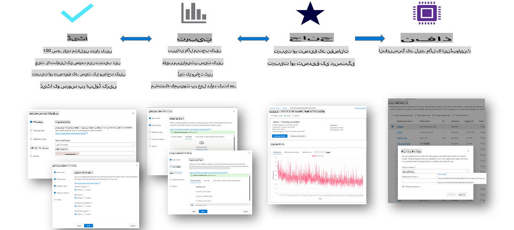

### نیا پروجیکٹ بنائیں

1. [Azure AI Foundry](https://ai.azure.com) میں سائن ان کریں۔

1. نیا پروجیکٹ بنانے کے لیے **+New project** منتخب کریں۔

    

1. درج ذیل کام انجام دیں:

    - پروجیکٹ کا **Hub نام** درج کریں۔ یہ ایک منفرد قدر ہونی چاہیے۔
    - استعمال کے لیے **Hub** منتخب کریں (ضرورت ہو تو نیا بنائیں)۔

    

1. نیا Hub بنانے کے لیے درج ذیل کام انجام دیں:

    - **Hub نام** درج کریں۔ یہ ایک منفرد قدر ہونی چاہیے۔
    - اپنی Azure **سبسکرپشن** منتخب کریں۔
    - استعمال کے لیے **Resource group** منتخب کریں (ضرورت ہو تو نیا بنائیں)۔
    - وہ **Location** منتخب کریں جسے آپ استعمال کرنا چاہتے ہیں۔
    - **Azure AI Services** سے جڑیں (ضرورت ہو تو نیا بنائیں)۔
    - **Azure AI Search** کو **Skip connecting** کریں۔

    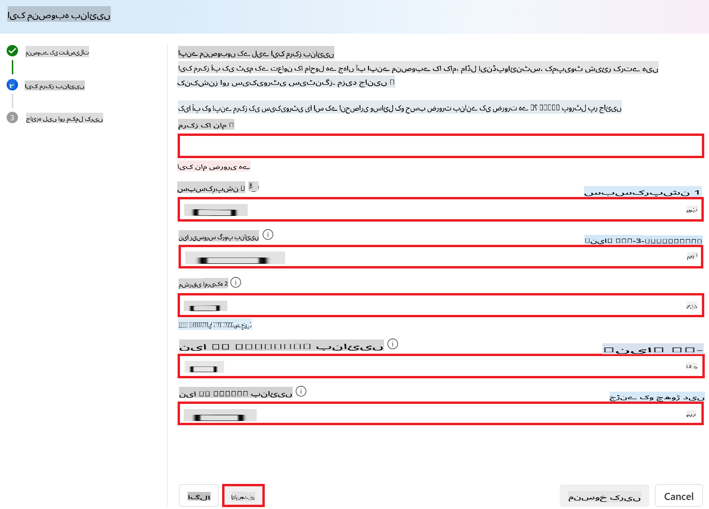

1. **Next** منتخب کریں۔
1. **Create a project** منتخب کریں۔

### ڈیٹا کی تیاری

Fine-tuning سے پہلے، اپنے کام سے متعلقہ ڈیٹا سیٹ اکٹھا کریں یا بنائیں، جیسے چیٹ انسٹرکشنز، سوال-جواب کے جوڑے، یا کوئی اور متعلقہ ٹیکسٹ ڈیٹا۔ اس ڈیٹا کو صاف اور پہلے سے پروسیس کریں، شور کو ہٹائیں، گمشدہ اقدار کو سنبھالیں، اور متن کو ٹوکنائز کریں۔

### Azure AI Foundry میں Phi-3 ماڈلز کو Fine-Tune کریں

> [!NOTE]  
> Phi-3 ماڈلز کی Fine-tuning فی الحال صرف **East US 2** میں موجود پروجیکٹس میں سپورٹ کی جاتی ہے۔

1. بائیں طرف کے ٹیب سے **Model catalog** منتخب کریں۔

1. **سرچ بار** میں *phi-3* ٹائپ کریں اور وہ phi-3 ماڈل منتخب کریں جسے آپ استعمال کرنا چاہتے ہیں۔

    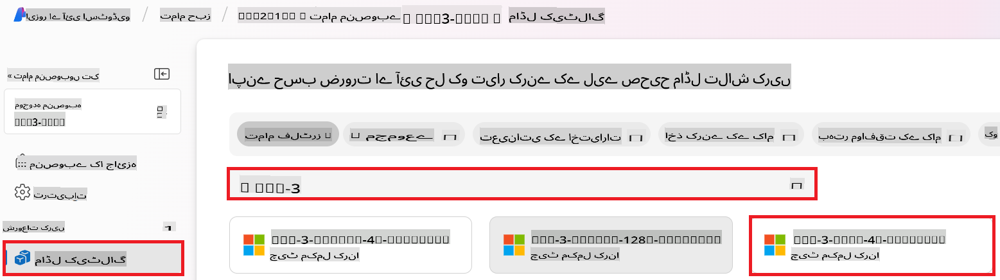

1. **Fine-tune** منتخب کریں۔

    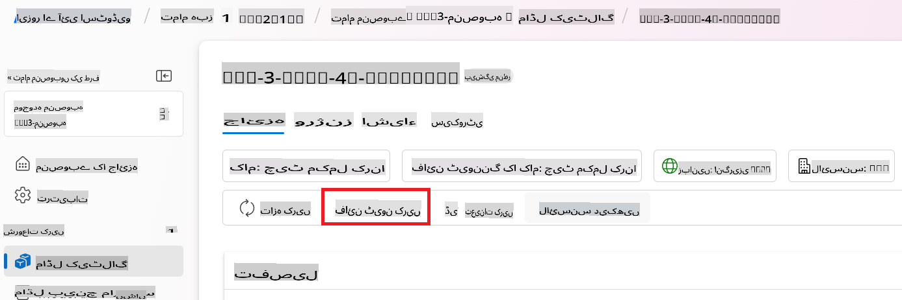

1. **Fine-tuned ماڈل کا نام** درج کریں۔

    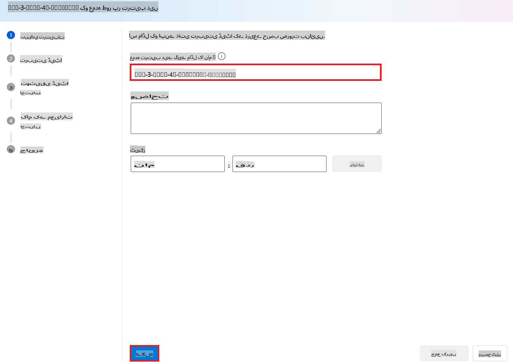

1. **Next** منتخب کریں۔

1. درج ذیل کام انجام دیں:

    - **Task type** کو **Chat completion** پر سیٹ کریں۔
    - وہ **Training data** منتخب کریں جسے آپ استعمال کرنا چاہتے ہیں۔ آپ اسے Azure AI Foundry کے ڈیٹا یا اپنی مقامی فائلوں سے اپلوڈ کر سکتے ہیں۔

    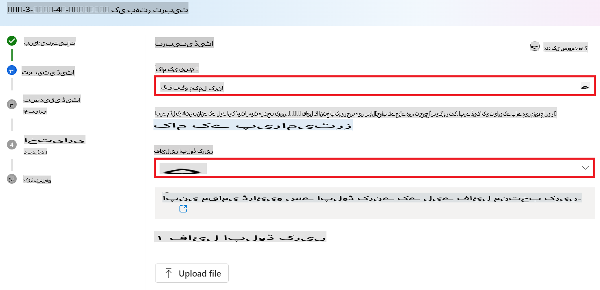

1. **Next** منتخب کریں۔

1. وہ **Validation data** اپلوڈ کریں جسے آپ استعمال کرنا چاہتے ہیں، یا **Automatic split of training data** منتخب کریں۔

    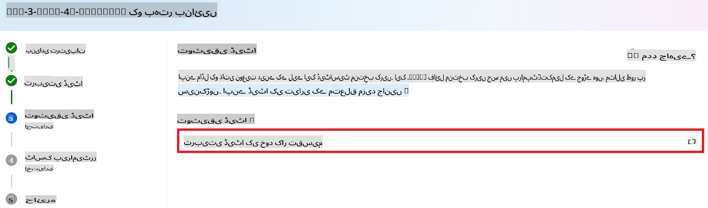

1. **Next** منتخب کریں۔

1. درج ذیل کام انجام دیں:

    - وہ **Batch size multiplier** منتخب کریں جسے آپ استعمال کرنا چاہتے ہیں۔
    - وہ **Learning rate** منتخب کریں جسے آپ استعمال کرنا چاہتے ہیں۔
    - وہ **Epochs** منتخب کریں جسے آپ استعمال کرنا چاہتے ہیں۔

    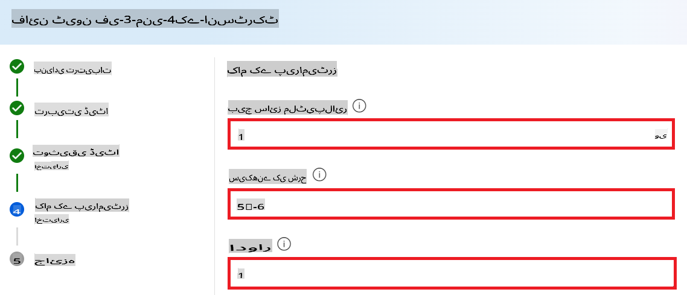

1. Fine-tuning کے عمل کو شروع کرنے کے لیے **Submit** منتخب کریں۔

    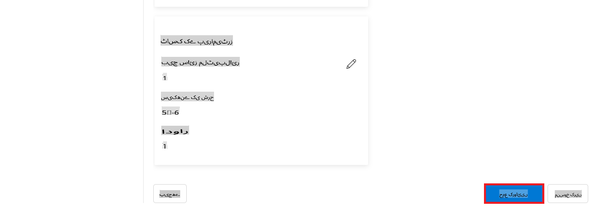

1. ایک بار جب آپ کا ماڈل Fine-tune ہو جائے، تو اس کی حیثیت **Completed** کے طور پر ظاہر ہوگی، جیسا کہ نیچے تصویر میں دکھایا گیا ہے۔ اب آپ ماڈل کو تعینات کر سکتے ہیں اور اسے اپنی ایپلیکیشن میں، پلے گراؤنڈ میں، یا پرامپٹ فلو میں استعمال کر سکتے ہیں۔ مزید معلومات کے لیے دیکھیں [Phi-3 فیملی کے چھوٹے لینگویج ماڈلز کو Azure AI Foundry کے ساتھ کیسے تعینات کریں](https://learn.microsoft.com/azure/ai-studio/how-to/deploy-models-phi-3?tabs=phi-3-5&pivots=programming-language-python)۔

    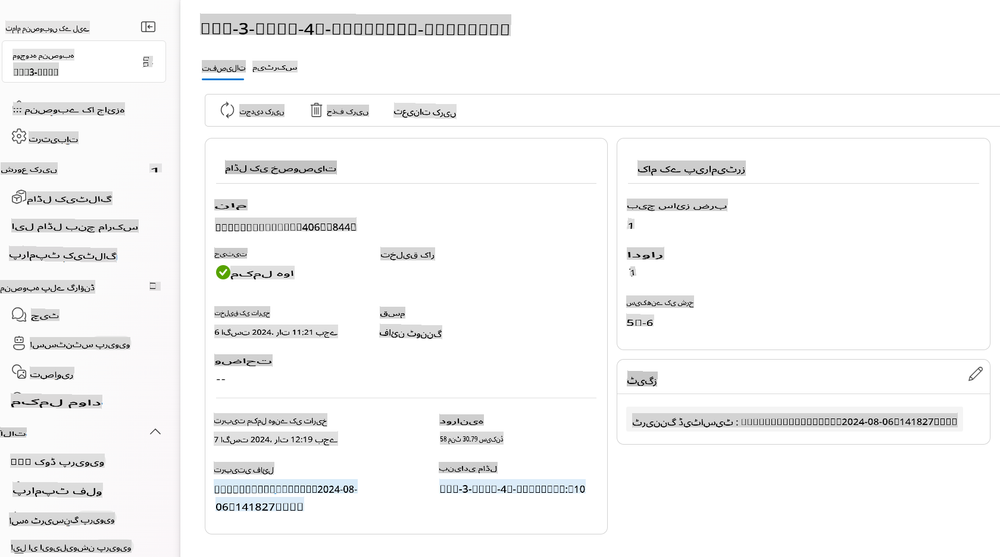

> [!NOTE]  
> Phi-3 کو Fine-tune کرنے پر مزید تفصیلی معلومات کے لیے براہ کرم ملاحظہ کریں [Azure AI Foundry میں Phi-3 ماڈلز کو Fine-tune کریں](https://learn.microsoft.com/azure/ai-studio/how-to/fine-tune-phi-3?tabs=phi-3-mini)۔

## Fine-tuned ماڈلز کی صفائی

آپ Fine-tuned ماڈل کو [Azure AI Foundry](https://ai.azure.com) میں Fine-tuning ماڈل کی فہرست سے یا ماڈل کی تفصیلات والے صفحے سے حذف کر سکتے ہیں۔ Fine-tuning صفحے سے حذف کرنے کے لیے Fine-tuned ماڈل منتخب کریں اور پھر حذف کرنے کے لیے Delete بٹن منتخب کریں۔

> [!NOTE]  
> آپ کسی کسٹم ماڈل کو حذف نہیں کر سکتے اگر اس کی کوئی موجودہ تعیناتی ہو۔ آپ کو پہلے اپنی ماڈل کی تعیناتی کو حذف کرنا ہوگا۔

## لاگت اور کوٹہ

### سروس کے طور پر Fine-tuned Phi-3 ماڈلز کے لیے لاگت اور کوٹہ کے خیالات

Phi ماڈلز سروس کے طور پر Fine-tuned کیے جاتے ہیں اور Microsoft کے ذریعے فراہم کیے جاتے ہیں، اور Azure AI Foundry کے ساتھ انضمام کے لیے دستیاب ہیں۔ آپ قیمتوں کا تعین [ماڈلز کی تعیناتی](https://learn.microsoft.com/azure/ai-studio/how-to/deploy-models-phi-3?tabs=phi-3-5&pivots=programming-language-python) یا Fine-tuning کے دوران، تعیناتی وزرڈ میں Pricing and terms ٹیب کے تحت دیکھ سکتے ہیں۔

## مواد کی فلٹرنگ

Pay-as-you-go کے طور پر سروس کے طور پر تعینات ماڈلز Azure AI Content Safety کے ذریعے محفوظ ہیں۔ جب حقیقی وقت کے endpoints پر تعینات کیا جاتا ہے، تو آپ اس صلاحیت سے باہر نکل سکتے ہیں۔ Azure AI Content Safety فعال ہونے کے ساتھ، پرامپٹ اور کمپلیشن دونوں کو درجہ بندی ماڈلز کے ایک سیٹ کے ذریعے پروسیس کیا جاتا ہے، جو نقصان دہ مواد کی پیداوار کا پتہ لگانے اور اسے روکنے کے لیے تیار ہیں۔ مواد کی فلٹرنگ کا نظام ان پٹ پرامپٹس اور آؤٹ پٹ کمپلیشنز دونوں میں ممکنہ نقصان دہ مواد کی مخصوص اقسام پر کارروائی کرتا ہے۔ مزید جانیں [Azure AI Content Safety](https://learn.microsoft.com/azure/ai-studio/concepts/content-filtering) کے بارے میں۔

**Fine-Tuning کنفیگریشن**

Hyperparameters: Hyperparameters جیسے learning rate، batch size، اور training epochs کی وضاحت کریں۔

**Loss Function**

اپنے کام کے لیے ایک مناسب loss function (جیسے cross-entropy) منتخب کریں۔

**Optimizer**

Gradient اپڈیٹس کے دوران ایک optimizer (جیسے Adam) منتخب کریں۔

**Fine-Tuning کا عمل**

- Pre-Trained ماڈل لوڈ کریں: Phi-3 Mini کا چیک پوائنٹ لوڈ کریں۔
- کسٹم لیئرز شامل کریں: ٹاسک مخصوص لیئرز شامل کریں (جیسے چیٹ انسٹرکشنز کے لیے classification head)۔

**ماڈل کو ٹرین کریں**  
اپنے تیار کردہ ڈیٹا سیٹ کا استعمال کرتے ہوئے ماڈل کو Fine-tune کریں۔ ٹریننگ کی پیش رفت کی نگرانی کریں اور ضرورت کے مطابق Hyperparameters کو ایڈجسٹ کریں۔

**تشخیص اور تصدیق**

ویلیڈیشن سیٹ: اپنے ڈیٹا کو ٹریننگ اور ویلیڈیشن سیٹس میں تقسیم کریں۔

**کارکردگی کا جائزہ لیں**

Accuracy، F1-score، یا perplexity جیسے میٹرکس کا استعمال کرتے ہوئے ماڈل کی کارکردگی کا اندازہ لگائیں۔

## Fine-Tuned ماڈل محفوظ کریں

**Checkpoint**  
Fine-tuned ماڈل کے چیک پوائنٹ کو مستقبل کے استعمال کے لیے محفوظ کریں۔

## تعیناتی

- ویب سروس کے طور پر تعینات کریں: اپنے Fine-tuned ماڈل کو Azure AI Foundry میں ایک ویب سروس کے طور پر تعینات کریں۔
- Endpoint کو ٹیسٹ کریں: تعینات کردہ endpoint کو ٹیسٹ queries بھیج کر اس کی فعالیت کی تصدیق کریں۔

## دہرائیں اور بہتر کریں

دہرائیں: اگر کارکردگی تسلی بخش نہیں ہے تو Hyperparameters کو ایڈجسٹ کرکے، مزید ڈیٹا شامل کرکے، یا اضافی epochs کے لیے Fine-tuning کرکے دہرائیں۔

## مانیٹر اور بہتر کریں

مسلسل ماڈل کے رویے کی نگرانی کریں اور ضرورت کے مطابق بہتر بنائیں۔

## حسب ضرورت اور توسیع

کسٹم کام: Phi-3 Mini کو چیٹ انسٹرکشنز سے آگے مختلف کاموں کے لیے Fine-tune کیا جا سکتا ہے۔ دوسرے استعمال کے معاملات کو دریافت کریں!  
تجربہ کریں: کارکردگی کو بڑھانے کے لیے مختلف آرکیٹیکچرز، لیئر کمبی نیشنز، اور تکنیک آزمائیں۔

> [!NOTE]  
> Fine-tuning ایک دہرانے والا عمل ہے۔ تجربہ کریں، سیکھیں، اور اپنے ماڈل کو اپنے مخصوص کام کے لیے بہترین نتائج حاصل کرنے کے لیے ڈھالیں!

**ڈسکلیمر**:  
یہ دستاویز مشین پر مبنی AI ترجمہ خدمات کا استعمال کرتے ہوئے ترجمہ کی گئی ہے۔ ہم درستگی کے لیے بھرپور کوشش کرتے ہیں، لیکن براہ کرم آگاہ رہیں کہ خودکار ترجمے میں غلطیاں یا خامیاں ہو سکتی ہیں۔ اصل دستاویز کو اس کی اصل زبان میں مستند ذریعہ سمجھا جانا چاہیے۔ اہم معلومات کے لیے، پیشہ ور انسانی ترجمہ کی سفارش کی جاتی ہے۔ ہم اس ترجمے کے استعمال سے پیدا ہونے والی کسی بھی غلط فہمی یا غلط تشریح کے ذمہ دار نہیں ہیں۔