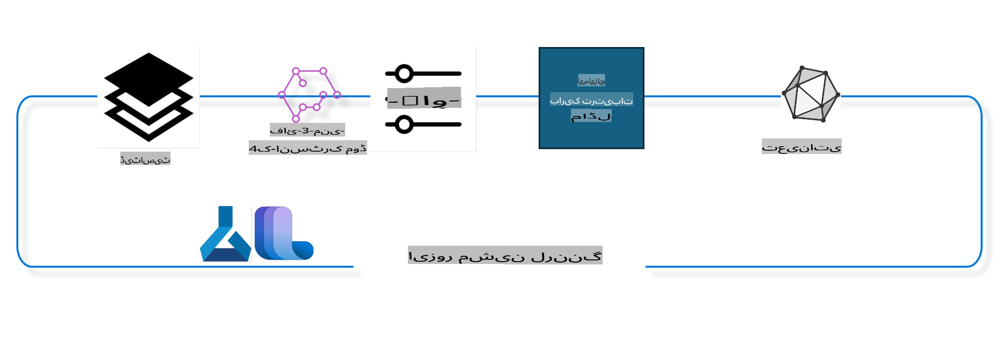

## Azure ML سسٹم رجسٹری سے چیٹ-کمپلیشن کمپوننٹس کا استعمال کرتے ہوئے ماڈل کو فائن ٹیون کرنا

اس مثال میں، ہم Phi-3-mini-4k-instruct ماڈل کو دو افراد کے درمیان گفتگو مکمل کرنے کے لیے ultrachat_200k ڈیٹا سیٹ استعمال کرکے فائن ٹیون کریں گے۔



یہ مثال آپ کو دکھائے گی کہ Azure ML SDK اور Python کا استعمال کرتے ہوئے فائن ٹیوننگ کیسے کی جاتی ہے، اور پھر فائن ٹیون کیے گئے ماڈل کو حقیقی وقت کی پیشن گوئی کے لیے آن لائن اینڈپوائنٹ پر کیسے تعینات کیا جاتا ہے۔

### تربیتی ڈیٹا

ہم ultrachat_200k ڈیٹا سیٹ استعمال کریں گے۔ یہ UltraChat ڈیٹا سیٹ کا ایک سختی سے فلٹر شدہ ورژن ہے اور اسے Zephyr-7B-β ماڈل کی تربیت کے لیے استعمال کیا گیا، جو کہ ایک جدید ترین 7b چیٹ ماڈل ہے۔

### ماڈل

ہم Phi-3-mini-4k-instruct ماڈل استعمال کریں گے تاکہ یہ دکھایا جا سکے کہ صارف چیٹ-کمپلیشن کے کام کے لیے ماڈل کو کیسے فائن ٹیون کر سکتا ہے۔ اگر آپ نے یہ نوٹ بک کسی خاص ماڈل کارڈ سے کھولی ہے، تو ماڈل کے نام کو تبدیل کرنا یاد رکھیں۔

### کام

- فائن ٹیون کے لیے ماڈل کا انتخاب کریں۔
- تربیتی ڈیٹا کا انتخاب اور جائزہ لیں۔
- فائن ٹیوننگ جاب کو ترتیب دیں۔
- فائن ٹیوننگ جاب چلائیں۔
- تربیتی اور تشخیصی میٹرکس کا جائزہ لیں۔
- فائن ٹیون کیے گئے ماڈل کو رجسٹر کریں۔
- حقیقی وقت کی پیشن گوئی کے لیے ماڈل تعینات کریں۔
- وسائل کو صاف کریں۔

## 1. ابتدائی تقاضے ترتیب دیں

- انحصارات انسٹال کریں۔
- AzureML ورک اسپیس سے جڑیں۔ مزید معلومات کے لیے SDK تصدیق قائم کریں۔ نیچے <WORKSPACE_NAME>, <RESOURCE_GROUP> اور <SUBSCRIPTION_ID> کو تبدیل کریں۔
- AzureML سسٹم رجسٹری سے جڑیں۔
- ایک اختیاری تجربہ کا نام مقرر کریں۔
- کمپیوٹ چیک کریں یا تخلیق کریں۔

> [!NOTE]
> تقاضے: ایک سنگل GPU نوڈ میں کئی GPU کارڈز ہو سکتے ہیں۔ مثلاً، Standard_NC24rs_v3 کے ایک نوڈ میں 4 NVIDIA V100 GPUs ہوتے ہیں، جبکہ Standard_NC12s_v3 میں 2 NVIDIA V100 GPUs ہوتے ہیں۔ اس معلومات کے لیے دستاویزات کا حوالہ دیں۔ نوڈ میں GPU کارڈز کی تعداد نیچے دیے گئے پیرامیٹر gpus_per_node میں مقرر کی گئی ہے۔ اس ویلیو کو صحیح طریقے سے سیٹ کرنا نوڈ کے تمام GPUs کے استعمال کو یقینی بنائے گا۔ تجویز کردہ GPU کمپیوٹ SKUs یہاں اور یہاں مل سکتے ہیں۔

### Python لائبریریاں

نیچے دیے گئے سیل کو چلا کر انحصارات انسٹال کریں۔ اگر آپ نئے ماحول میں کام کر رہے ہیں تو یہ ایک لازمی قدم ہے۔

```bash
pip install azure-ai-ml
pip install azure-identity
pip install datasets==2.9.0
pip install mlflow
pip install azureml-mlflow
```

### Azure ML کے ساتھ تعامل

1. یہ Python اسکرپٹ Azure Machine Learning (Azure ML) سروس کے ساتھ تعامل کے لیے استعمال ہوتا ہے۔ اس کا خلاصہ یہ ہے:

    - azure.ai.ml, azure.identity, اور azure.ai.ml.entities پیکجز سے ضروری ماڈیولز درآمد کرتا ہے۔ time ماڈیول بھی درآمد کرتا ہے۔
    - DefaultAzureCredential() کے ذریعے تصدیق کرنے کی کوشش کرتا ہے۔ اگر یہ ناکام ہو جائے تو InteractiveBrowserCredential() پر منتقل ہوتا ہے۔
    - from_config میتھڈ کا استعمال کرتے ہوئے MLClient انسٹینس بنانے کی کوشش کرتا ہے۔ اگر یہ ناکام ہو جائے تو subscription_id, resource_group_name, اور workspace_name فراہم کر کے دستی طور پر MLClient انسٹینس بناتا ہے۔
    - Azure ML رجسٹری کے لیے ایک اور MLClient انسٹینس بناتا ہے۔
    - experiment_name کو "chat_completion_Phi-3-mini-4k-instruct" پر سیٹ کرتا ہے۔
    - موجودہ وقت کو ایک منفرد ٹائم اسٹیمپ میں تبدیل کرتا ہے۔

    ```python
    # Import necessary modules from Azure ML and Azure Identity
    from azure.ai.ml import MLClient
    from azure.identity import (
        DefaultAzureCredential,
        InteractiveBrowserCredential,
    )
    from azure.ai.ml.entities import AmlCompute
    import time  # Import time module
    
    # Try to authenticate using DefaultAzureCredential
    try:
        credential = DefaultAzureCredential()
        credential.get_token("https://management.azure.com/.default")
    except Exception as ex:  # If DefaultAzureCredential fails, use InteractiveBrowserCredential
        credential = InteractiveBrowserCredential()
    
    # Try to create an MLClient instance using the default config file
    try:
        workspace_ml_client = MLClient.from_config(credential=credential)
    except:  # If that fails, create an MLClient instance by manually providing the details
        workspace_ml_client = MLClient(
            credential,
            subscription_id="<SUBSCRIPTION_ID>",
            resource_group_name="<RESOURCE_GROUP>",
            workspace_name="<WORKSPACE_NAME>",
        )
    
    # Create another MLClient instance for the Azure ML registry named "azureml"
    # This registry is where models, fine-tuning pipelines, and environments are stored
    registry_ml_client = MLClient(credential, registry_name="azureml")
    
    # Set the experiment name
    experiment_name = "chat_completion_Phi-3-mini-4k-instruct"
    
    # Generate a unique timestamp that can be used for names and versions that need to be unique
    timestamp = str(int(time.time()))
    ```

## 2. فاؤنڈیشن ماڈل منتخب کریں

1. Phi-3-mini-4k-instruct ایک 3.8B پیرامیٹرز، ہلکا پھلکا، جدید اوپن ماڈل ہے جو Phi-2 کے لیے استعمال کیے گئے ڈیٹا سیٹس پر بنایا گیا ہے۔ ماڈل Phi-3 ماڈل فیملی سے تعلق رکھتا ہے، اور Mini ورژن 4K اور 128K کی دو اقسام میں دستیاب ہے، جو وہ کانٹیکسٹ لمبائی ہے جسے یہ سپورٹ کر سکتا ہے۔ ہمیں ماڈل کو اپنی مخصوص ضرورت کے مطابق فائن ٹیون کرنا ہوگا۔ AzureML اسٹوڈیو کے ماڈل کیٹلاگ میں چیٹ-کمپلیشن ٹاسک کے لحاظ سے فلٹر کر کے ان ماڈلز کو براؤز کریں۔ اس مثال میں، ہم Phi-3-mini-4k-instruct ماڈل استعمال کریں گے۔

    > [!NOTE]
    > ماڈل کی id پراپرٹی۔ یہ فائن ٹیوننگ جاب میں بطور ان پٹ پاس کی جائے گی۔ یہ AzureML اسٹوڈیو ماڈل کیٹلاگ میں ماڈل کی تفصیلات والے صفحے پر Asset ID فیلڈ کے طور پر بھی دستیاب ہے۔

2. یہ Python اسکرپٹ Azure Machine Learning (Azure ML) سروس کے ساتھ تعامل کر رہا ہے۔ اس کا خلاصہ یہ ہے:

    - model_name کو "Phi-3-mini-4k-instruct" پر سیٹ کرتا ہے۔
    - registry_ml_client آبجیکٹ کے models پراپرٹی کے get میتھڈ کا استعمال کرتے ہوئے ماڈل کی تازہ ترین ورژن کو بازیافت کرتا ہے۔
    - ماڈل کے نام، ورژن، اور id کو کنسول پر پرنٹ کرتا ہے۔

    ```python
    # Set the model name
    model_name = "Phi-3-mini-4k-instruct"
    
    # Get the latest version of the model from the Azure ML registry
    foundation_model = registry_ml_client.models.get(model_name, label="latest")
    
    # Print the model name, version, and id
    # This information is useful for tracking and debugging
    print(
        "\n\nUsing model name: {0}, version: {1}, id: {2} for fine tuning".format(
            foundation_model.name, foundation_model.version, foundation_model.id
        )
    )
    ```

## 3. جاب کے لیے کمپیوٹ بنائیں

فائن ٹیون جاب صرف GPU کمپیوٹ کے ساتھ کام کرتا ہے۔ کمپیوٹ کا سائز ماڈل کے سائز پر منحصر ہوتا ہے، اور اکثر اوقات مناسب کمپیوٹ کی شناخت کرنا مشکل ہو سکتا ہے۔

> [!NOTE]
> نیچے دی گئی کمپیوٹس سب سے زیادہ بہتر ترتیب کے ساتھ کام کرتی ہیں۔ کسی بھی ترتیب میں تبدیلی Cuda Out Of Memory کی خرابی کا باعث بن سکتی ہے۔ ایسی صورت میں، کمپیوٹ کو بڑے سائز میں اپ گریڈ کرنے کی کوشش کریں۔

> [!NOTE]
> کمپیوٹ_cluster_size منتخب کرتے وقت، یقینی بنائیں کہ کمپیوٹ آپ کے ریسورس گروپ میں دستیاب ہے۔ اگر کوئی خاص کمپیوٹ دستیاب نہیں ہے تو آپ کمپیوٹ وسائل تک رسائی کی درخواست کر سکتے ہیں۔

### فائن ٹیوننگ سپورٹ کے لیے ماڈل کی جانچ

1. یہ Python اسکرپٹ Azure Machine Learning (Azure ML) ماڈل کے ساتھ تعامل کر رہا ہے۔ اس کا خلاصہ یہ ہے:

    - ast ماڈیول کو درآمد کرتا ہے۔
    - چیک کرتا ہے کہ آیا foundation_model آبجیکٹ کے ٹیگز میں finetune_compute_allow_list موجود ہے۔
    - اگر ٹیگ موجود ہو تو، اس کے ویلیو کو Python لسٹ میں تبدیل کرتا ہے اور صارف کو ہدایات دیتا ہے۔
    - اگر ٹیگ موجود نہ ہو، تو computes_allow_list کو None پر سیٹ کرتا ہے اور صارف کو اطلاع دیتا ہے۔

    ```python
    # Import the ast module, which provides functions to process trees of the Python abstract syntax grammar
    import ast
    
    # Check if the 'finetune_compute_allow_list' tag is present in the model's tags
    if "finetune_compute_allow_list" in foundation_model.tags:
        # If the tag is present, use ast.literal_eval to safely parse the tag's value (a string) into a Python list
        computes_allow_list = ast.literal_eval(
            foundation_model.tags["finetune_compute_allow_list"]
        )  # convert string to python list
        # Print a message indicating that a compute should be created from the list
        print(f"Please create a compute from the above list - {computes_allow_list}")
    else:
        # If the tag is not present, set computes_allow_list to None
        computes_allow_list = None
        # Print a message indicating that the 'finetune_compute_allow_list' tag is not part of the model's tags
        print("`finetune_compute_allow_list` is not part of model tags")
    ```

### کمپیوٹ انسٹینس کی جانچ

1. یہ Python اسکرپٹ Azure Machine Learning (Azure ML) سروس کے ساتھ تعامل کر رہا ہے اور کمپیوٹ انسٹینس پر کئی چیک انجام دے رہا ہے۔ اس کا خلاصہ یہ ہے:

    - کمپیوٹ انسٹینس کی provisioning state چیک کرتا ہے۔
    - computes_allow_list کے خلاف کمپیوٹ سائز کی تصدیق کرتا ہے۔
    - کمپیوٹ انسٹینس کے GPU کی تعداد بازیافت کرتا ہے اور اس کی تصدیق کرتا ہے۔

    ```python
    # Print the exception message
    print(e)
    # Raise a ValueError if the compute size is not available in the workspace
    raise ValueError(
        f"WARNING! Compute size {compute_cluster_size} not available in workspace"
    )
    
    # Retrieve the compute instance from the Azure ML workspace
    compute = workspace_ml_client.compute.get(compute_cluster)
    # Check if the provisioning state of the compute instance is "failed"
    if compute.provisioning_state.lower() == "failed":
        # Raise a ValueError if the provisioning state is "failed"
        raise ValueError(
            f"Provisioning failed, Compute '{compute_cluster}' is in failed state. "
            f"please try creating a different compute"
        )
    
    # Check if computes_allow_list is not None
    if computes_allow_list is not None:
        # Convert all compute sizes in computes_allow_list to lowercase
        computes_allow_list_lower_case = [x.lower() for x in computes_allow_list]
        # Check if the size of the compute instance is in computes_allow_list_lower_case
        if compute.size.lower() not in computes_allow_list_lower_case:
            # Raise a ValueError if the size of the compute instance is not in computes_allow_list_lower_case
            raise ValueError(
                f"VM size {compute.size} is not in the allow-listed computes for finetuning"
            )
    else:
        # Define a list of unsupported GPU VM sizes
        unsupported_gpu_vm_list = [
            "standard_nc6",
            "standard_nc12",
            "standard_nc24",
            "standard_nc24r",
        ]
        # Check if the size of the compute instance is in unsupported_gpu_vm_list
        if compute.size.lower() in unsupported_gpu_vm_list:
            # Raise a ValueError if the size of the compute instance is in unsupported_gpu_vm_list
            raise ValueError(
                f"VM size {compute.size} is currently not supported for finetuning"
            )
    
    # Initialize a flag to check if the number of GPUs in the compute instance has been found
    gpu_count_found = False
    # Retrieve a list of all available compute sizes in the workspace
    workspace_compute_sku_list = workspace_ml_client.compute.list_sizes()
    available_sku_sizes = []
    # Iterate over the list of available compute sizes
    for compute_sku in workspace_compute_sku_list:
        available_sku_sizes.append(compute_sku.name)
        # Check if the name of the compute size matches the size of the compute instance
        if compute_sku.name.lower() == compute.size.lower():
            # If it does, retrieve the number of GPUs for that compute size and set gpu_count_found to True
            gpus_per_node = compute_sku.gpus
            gpu_count_found = True
    # If gpu_count_found is True, print the number of GPUs in the compute instance
    if gpu_count_found:
        print(f"Number of GPU's in compute {compute.size}: {gpus_per_node}")
    else:
        # If gpu_count_found is False, raise a ValueError
        raise ValueError(
            f"Number of GPU's in compute {compute.size} not found. Available skus are: {available_sku_sizes}."
            f"This should not happen. Please check the selected compute cluster: {compute_cluster} and try again."
        )
    ```

## 4. فائن ٹیوننگ کے لیے ڈیٹا سیٹ منتخب کریں

1. ہم ultrachat_200k ڈیٹا سیٹ استعمال کرتے ہیں۔ اس ڈیٹا سیٹ میں چار تقسیمیں ہیں، جو Supervised fine-tuning (sft) کے لیے موزوں ہیں۔

    ```bash
    train_sft test_sft  train_gen  test_gen
    207865  23110  256032  28304
    ```

1. اگلے چند سیلز فائن ٹیوننگ کے لیے بنیادی ڈیٹا تیاری دکھاتے ہیں:

### کچھ ڈیٹا قطاروں کو دیکھیں

ہم چاہتے ہیں کہ یہ نمونہ تیزی سے چلے، اس لیے train_sft اور test_sft فائلز میں پہلے سے تراشے گئے قطاروں کا 5% محفوظ کریں۔ اس کا مطلب ہے کہ فائن ٹیون کیا گیا ماڈل کم درست ہوگا، اس لیے اسے حقیقی دنیا میں استعمال نہ کریں۔

> [!NOTE]
> کچھ زبان کے ماڈلز کے مختلف زبان کوڈز ہوتے ہیں، اور اس لیے ڈیٹا سیٹ میں کالم کے نام اس کی عکاسی کرنے چاہییں۔

1. یہاں ایک مثال ہے کہ ڈیٹا کیسا نظر آنا چاہیے:

    ```python
    {
        // The task or question posed to an AI assistant
        "prompt": "Create a fully-developed protagonist who is challenged to survive within a dystopian society under the rule of a tyrant. ...",
        
        // An array of objects, each representing a message in a conversation between a user and an AI assistant
        "messages":[
            {
                // The content of the user's message
                "content": "Create a fully-developed protagonist who is challenged to survive within a dystopian society under the rule of a tyrant. ...",
                // The role of the entity that sent the message
                "role": "user"
            },
            {
                // The content of the assistant's message
                "content": "Name: Ava\n\n Ava was just 16 years old when the world as she knew it came crashing down. The government had collapsed, leaving behind a chaotic and lawless society. ...",
                // The role of the entity that sent the message
                "role": "assistant"
            },
            {
                // The content of the user's message
                "content": "Wow, Ava's story is so intense and inspiring! Can you provide me with more details.  ...",
                // The role of the entity that sent the message
                "role": "user"
            }, 
            {
                // The content of the assistant's message
                "content": "Certainly! ....",
                // The role of the entity that sent the message
                "role": "assistant"
            }
        ],
        
        // A unique identifier for the prompt
        "prompt_id": "d938b65dfe31f05f80eb8572964c6673eddbd68eff3db6bd234d7f1e3b86c2af"
    }
    ```

### ڈیٹا ڈاؤن لوڈ کریں

1. یہ Python اسکرپٹ ایک ڈیٹا سیٹ کو ڈاؤن لوڈ کرنے کے لیے ایک مددگار اسکرپٹ download-dataset.py استعمال کرتا ہے۔ اس کا خلاصہ یہ ہے:

    - os ماڈیول کو درآمد کرتا ہے۔
    - os.system فنکشن کا استعمال کرتے ہوئے download-dataset.py اسکرپٹ کو شیل میں مخصوص دلائل کے ساتھ چلاتا ہے۔
    - اگر exit_status 0 نہ ہو، تو ایک Exception اٹھاتا ہے۔

    ```python
    # Import the os module, which provides a way of using operating system dependent functionality
    import os
    
    # Use the os.system function to run the download-dataset.py script in the shell with specific command-line arguments
    # The arguments specify the dataset to download (HuggingFaceH4/ultrachat_200k), the directory to download it to (ultrachat_200k_dataset), and the percentage of the dataset to split (5)
    # The os.system function returns the exit status of the command it executed; this status is stored in the exit_status variable
    exit_status = os.system(
        "python ./download-dataset.py --dataset HuggingFaceH4/ultrachat_200k --download_dir ultrachat_200k_dataset --dataset_split_pc 5"
    )
    
    # Check if exit_status is not 0
    # In Unix-like operating systems, an exit status of 0 usually indicates that a command has succeeded, while any other number indicates an error
    # If exit_status is not 0, raise an Exception with a message indicating that there was an error downloading the dataset
    if exit_status != 0:
        raise Exception("Error downloading dataset")
    ```

### ڈیٹا کو ڈیٹا فریم میں لوڈ کریں

1. یہ Python اسکرپٹ JSON Lines فائل کو pandas ڈیٹا فریم میں لوڈ کر رہا ہے اور پہلی 5 قطاریں دکھا رہا ہے۔ اس کا خلاصہ یہ ہے:

    - pandas لائبریری کو درآمد کرتا ہے۔
    - pd.read_json فنکشن کا استعمال کرتے ہوئے JSON Lines فائل کو ڈیٹا فریم میں لوڈ کرتا ہے۔
    - head میتھڈ کا استعمال کرتے ہوئے پہلی 5 قطاریں دکھاتا ہے۔

    ```python
    # Import the pandas library, which is a powerful data manipulation and analysis library
    import pandas as pd
    
    # Set the maximum column width for pandas' display options to 0
    # This means that the full text of each column will be displayed without truncation when the DataFrame is printed
    pd.set_option("display.max_colwidth", 0)
    
    # Use the pd.read_json function to load the train_sft.jsonl file from the ultrachat_200k_dataset directory into a DataFrame
    # The lines=True argument indicates that the file is in JSON Lines format, where each line is a separate JSON object
    df = pd.read_json("./ultrachat_200k_dataset/train_sft.jsonl", lines=True)
    
    # Use the head method to display the first 5 rows of the DataFrame
    # If the DataFrame has less than 5 rows, it will display all of them
    df.head()
    ```

## 5. ماڈل اور ڈیٹا کو ان پٹ کے طور پر استعمال کرتے ہوئے فائن ٹیوننگ جاب جمع کریں

چیٹ-کمپلیشن پائپ لائن کمپوننٹ کا استعمال کرتے ہوئے جاب بنائیں۔ فائن ٹیوننگ کے لیے تمام معاون پیرامیٹرز کے بارے میں مزید جانیں۔

### فائن ٹیون پیرامیٹرز کی تعریف

1. فائن ٹیون پیرامیٹرز کو دو زمروں میں تقسیم کیا جا سکتا ہے: تربیتی پیرامیٹرز، اصلاحی پیرامیٹرز۔

1. تربیتی پیرامیٹرز تربیتی پہلوؤں کی وضاحت کرتے ہیں جیسے کہ:

    - استعمال کرنے کے لیے آپٹیمائزر، شیڈیولر۔
    - فائن ٹیون کو بہتر بنانے کے لیے میٹرک۔
    - تربیتی مراحل کی تعداد، بیچ سائز وغیرہ۔

1. اصلاحی پیرامیٹرز GPU میموری کو بہتر بنانے اور کمپیوٹ وسائل کو مؤثر طریقے سے استعمال کرنے میں مدد دیتے ہیں۔

> [!NOTE]
> Supervised فائن ٹیوننگ کے نتیجے میں alignment کھونے یا catastrophic forgetting کا مسئلہ ہو سکتا ہے۔ ہم تجویز کرتے ہیں کہ اس مسئلے کی جانچ کریں اور فائن ٹیوننگ کے بعد alignment کا مرحلہ چلائیں۔

### فائن ٹیوننگ پیرامیٹرز

1. یہ Python اسکرپٹ مشین لرننگ ماڈل کو فائن ٹیون کرنے کے پیرامیٹرز سیٹ کر رہا ہے۔ اس کا خلاصہ یہ ہے:

    - تربیتی اور اصلاحی پیرامیٹرز کو ایک ڈکشنری میں یکجا کرتا ہے۔
    - foundation_model کے ماڈل-مخصوص ڈیفالٹ پیرامیٹرز کو چیک کرتا ہے اور انہیں فائن ٹیون پیرامیٹرز میں شامل کرتا ہے۔

    ```python
    # Set up default training parameters such as the number of training epochs, batch sizes for training and evaluation, learning rate, and learning rate scheduler type
    training_parameters = dict(
        num_train_epochs=3,
        per_device_train_batch_size=1,
        per_device_eval_batch_size=1,
        learning_rate=5e-6,
        lr_scheduler_type="cosine",
    )
    
    # Set up default optimization parameters such as whether to apply Layer-wise Relevance Propagation (LoRa) and DeepSpeed, and the DeepSpeed stage
    optimization_parameters = dict(
        apply_lora="true",
        apply_deepspeed="true",
        deepspeed_stage=2,
    )
    
    # Combine the training and optimization parameters into a single dictionary called finetune_parameters
    finetune_parameters = {**training_parameters, **optimization_parameters}
    
    # Check if the foundation_model has any model-specific default parameters
    # If it does, print a warning message and update the finetune_parameters dictionary with these model-specific defaults
    # The ast.literal_eval function is used to convert the model-specific defaults from a string to a Python dictionary
    if "model_specific_defaults" in foundation_model.tags:
        print("Warning! Model specific defaults exist. The defaults could be overridden.")
        finetune_parameters.update(
            ast.literal_eval(  # convert string to python dict
                foundation_model.tags["model_specific_defaults"]
            )
        )
    
    # Print the final set of fine-tuning parameters that will be used for the run
    print(
        f"The following finetune parameters are going to be set for the run: {finetune_parameters}"
    )
    ```

### تربیتی پائپ لائن

1. یہ Python اسکرپٹ تربیتی پائپ لائن کے لیے ڈسپلے نام تیار کرنے کے لیے ایک فنکشن کی وضاحت کر رہا ہے، اور پھر اس فنکشن کو کال کر کے ڈسپلے نام تیار کرتا ہے۔ اس کا خلاصہ یہ ہے:

    - ڈسپلے نام میں مختلف تربیتی پیرامیٹرز شامل کیے جاتے ہیں۔
    - فنکشن کو کال کر کے ڈسپلے نام پرنٹ کیا جاتا ہے۔

    ```python
    # Define a function to generate a display name for the training pipeline
    def get_pipeline_display_name():
        # Calculate the total batch size by multiplying the per-device batch size, the number of gradient accumulation steps, the number of GPUs per node, and the number of nodes used for fine-tuning
        batch_size = (
            int(finetune_parameters.get("per_device_train_batch_size", 1))
            * int(finetune_parameters.get("gradient_accumulation_steps", 1))
            * int(gpus_per_node)
            * int(finetune_parameters.get("num_nodes_finetune", 1))
        )
        # Retrieve the learning rate scheduler type
        scheduler = finetune_parameters.get("lr_scheduler_type", "linear")
        # Retrieve whether DeepSpeed is applied
        deepspeed = finetune_parameters.get("apply_deepspeed", "false")
        # Retrieve the DeepSpeed stage
        ds_stage = finetune_parameters.get("deepspeed_stage", "2")
        # If DeepSpeed is applied, include "ds" followed by the DeepSpeed stage in the display name; if not, include "nods"
        if deepspeed == "true":
            ds_string = f"ds{ds_stage}"
        else:
            ds_string = "nods"
        # Retrieve whether Layer-wise Relevance Propagation (LoRa) is applied
        lora = finetune_parameters.get("apply_lora", "false")
        # If LoRa is applied, include "lora" in the display name; if not, include "nolora"
        if lora == "true":
            lora_string = "lora"
        else:
            lora_string = "nolora"
        # Retrieve the limit on the number of model checkpoints to keep
        save_limit = finetune_parameters.get("save_total_limit", -1)
        # Retrieve the maximum sequence length
        seq_len = finetune_parameters.get("max_seq_length", -1)
        # Construct the display name by concatenating all these parameters, separated by hyphens
        return (
            model_name
            + "-"
            + "ultrachat"
            + "-"
            + f"bs{batch_size}"
            + "-"
            + f"{scheduler}"
            + "-"
            + ds_string
            + "-"
            + lora_string
            + f"-save_limit{save_limit}"
            + f"-seqlen{seq_len}"
        )
    
    # Call the function to generate the display name
    pipeline_display_name = get_pipeline_display_name()
    # Print the display name
    print(f"Display name used for the run: {pipeline_display_name}")
    ```
### تربیتی پائپ لائن کا تعارف  
یہ اسکرپٹ مختلف پیرامیٹرز کی بنیاد پر ایک تربیتی پائپ لائن کو ترتیب دے رہا ہے اور پھر اس کا ڈسپلے نام پرنٹ کر رہا ہے۔  
```python
    # Define a function to generate a display name for the training pipeline
    def get_pipeline_display_name():
        # Calculate the total batch size by multiplying the per-device batch size, the number of gradient accumulation steps, the number of GPUs per node, and the number of nodes used for fine-tuning
        batch_size = (
            int(finetune_parameters.get("per_device_train_batch_size", 1))
            * int(finetune_parameters.get("gradient_accumulation_steps", 1))
            * int(gpus_per_node)
            * int(finetune_parameters.get("num_nodes_finetune", 1))
        )
        # Retrieve the learning rate scheduler type
        scheduler = finetune_parameters.get("lr_scheduler_type", "linear")
        # Retrieve whether DeepSpeed is applied
        deepspeed = finetune_parameters.get("apply_deepspeed", "false")
        # Retrieve the DeepSpeed stage
        ds_stage = finetune_parameters.get("deepspeed_stage", "2")
        # If DeepSpeed is applied, include "ds" followed by the DeepSpeed stage in the display name; if not, include "nods"
        if deepspeed == "true":
            ds_string = f"ds{ds_stage}"
        else:
            ds_string = "nods"
        # Retrieve whether Layer-wise Relevance Propagation (LoRa) is applied
        lora = finetune_parameters.get("apply_lora", "false")
        # If LoRa is applied, include "lora" in the display name; if not, include "nolora"
        if lora == "true":
            lora_string = "lora"
        else:
            lora_string = "nolora"
        # Retrieve the limit on the number of model checkpoints to keep
        save_limit = finetune_parameters.get("save_total_limit", -1)
        # Retrieve the maximum sequence length
        seq_len = finetune_parameters.get("max_seq_length", -1)
        # Construct the display name by concatenating all these parameters, separated by hyphens
        return (
            model_name
            + "-"
            + "ultrachat"
            + "-"
            + f"bs{batch_size}"
            + "-"
            + f"{scheduler}"
            + "-"
            + ds_string
            + "-"
            + lora_string
            + f"-save_limit{save_limit}"
            + f"-seqlen{seq_len}"
        )
    
    # Call the function to generate the display name
    pipeline_display_name = get_pipeline_display_name()
    # Print the display name
    print(f"Display name used for the run: {pipeline_display_name}")
    ```  

### پائپ لائن کی ترتیب  
یہ Python اسکرپٹ Azure Machine Learning SDK کا استعمال کرتے ہوئے مشین لرننگ پائپ لائن کو ترتیب دے رہا ہے۔  
یہاں اسکرپٹ کے کام کی تفصیل دی گئی ہے:  
1. Azure AI ML SDK سے ضروری ماڈیولز کو درآمد کرتا ہے۔  
2. رجسٹری سے "chat_completion_pipeline" نامی پائپ لائن کمپوننٹ کو حاصل کرتا ہے۔  
3. `@pipeline` decorator and the function `create_pipeline`. The name of the pipeline is set to `pipeline_display_name`.

1. Inside the `create_pipeline` function, it initializes the fetched pipeline component with various parameters, including the model path, compute clusters for different stages, dataset splits for training and testing, the number of GPUs to use for fine-tuning, and other fine-tuning parameters.

1. It maps the output of the fine-tuning job to the output of the pipeline job. This is done so that the fine-tuned model can be easily registered, which is required to deploy the model to an online or batch endpoint.

1. It creates an instance of the pipeline by calling the `create_pipeline` function.

1. It sets the `force_rerun` setting of the pipeline to `True`, meaning that cached results from previous jobs will not be used.

1. It sets the `continue_on_step_failure` setting of the pipeline to `False` کا استعمال کرتے ہوئے ایک پائپ لائن جاب کو ڈیفائن کرتا ہے، جس کا مطلب ہے کہ اگر کوئی مرحلہ ناکام ہو جائے تو پائپ لائن رک جائے گی۔  
4. خلاصے میں، یہ اسکرپٹ ایک چیٹ کمپلیشن ٹاسک کے لیے Azure Machine Learning SDK کا استعمال کرتے ہوئے ایک مشین لرننگ پائپ لائن کو ترتیب دے رہا ہے۔  
```python
    # Import necessary modules from the Azure AI ML SDK
    from azure.ai.ml.dsl import pipeline
    from azure.ai.ml import Input
    
    # Fetch the pipeline component named "chat_completion_pipeline" from the registry
    pipeline_component_func = registry_ml_client.components.get(
        name="chat_completion_pipeline", label="latest"
    )
    
    # Define the pipeline job using the @pipeline decorator and the function create_pipeline
    # The name of the pipeline is set to pipeline_display_name
    @pipeline(name=pipeline_display_name)
    def create_pipeline():
        # Initialize the fetched pipeline component with various parameters
        # These include the model path, compute clusters for different stages, dataset splits for training and testing, the number of GPUs to use for fine-tuning, and other fine-tuning parameters
        chat_completion_pipeline = pipeline_component_func(
            mlflow_model_path=foundation_model.id,
            compute_model_import=compute_cluster,
            compute_preprocess=compute_cluster,
            compute_finetune=compute_cluster,
            compute_model_evaluation=compute_cluster,
            # Map the dataset splits to parameters
            train_file_path=Input(
                type="uri_file", path="./ultrachat_200k_dataset/train_sft.jsonl"
            ),
            test_file_path=Input(
                type="uri_file", path="./ultrachat_200k_dataset/test_sft.jsonl"
            ),
            # Training settings
            number_of_gpu_to_use_finetuning=gpus_per_node,  # Set to the number of GPUs available in the compute
            **finetune_parameters
        )
        return {
            # Map the output of the fine tuning job to the output of pipeline job
            # This is done so that we can easily register the fine tuned model
            # Registering the model is required to deploy the model to an online or batch endpoint
            "trained_model": chat_completion_pipeline.outputs.mlflow_model_folder
        }
    
    # Create an instance of the pipeline by calling the create_pipeline function
    pipeline_object = create_pipeline()
    
    # Don't use cached results from previous jobs
    pipeline_object.settings.force_rerun = True
    
    # Set continue on step failure to False
    # This means that the pipeline will stop if any step fails
    pipeline_object.settings.continue_on_step_failure = False
    ```  

### جاب جمع کروانا  
1. یہ Python اسکرپٹ Azure Machine Learning ورک اسپیس میں ایک مشین لرننگ پائپ لائن جاب کو جمع کروا رہا ہے اور پھر جاب کے مکمل ہونے کا انتظار کر رہا ہے۔  
یہاں اسکرپٹ کے کام کی تفصیل دی گئی ہے:  
- `workspace_ml_client` کے `jobs` آبجیکٹ کے `create_or_update` میتھڈ کو کال کر کے پائپ لائن جاب جمع کرواتا ہے۔ چلنے والی پائپ لائن کو `pipeline_object` سے متعین کیا جاتا ہے، اور جاب جس تجربے کے تحت چلایا جاتا ہے اسے `experiment_name` سے متعین کیا جاتا ہے۔  
- پھر `workspace_ml_client` کے `jobs` آبجیکٹ کے `stream` میتھڈ کو کال کر کے جاب کے مکمل ہونے کا انتظار کرتا ہے۔ انتظار کرنے والے جاب کو `pipeline_job` آبجیکٹ کے `name` ایٹریبیوٹ سے متعین کیا جاتا ہے۔  
- خلاصے میں، یہ اسکرپٹ Azure Machine Learning ورک اسپیس میں ایک مشین لرننگ پائپ لائن جاب کو جمع کروا رہا ہے اور پھر جاب کے مکمل ہونے کا انتظار کر رہا ہے۔  
```python
    # Submit the pipeline job to the Azure Machine Learning workspace
    # The pipeline to be run is specified by pipeline_object
    # The experiment under which the job is run is specified by experiment_name
    pipeline_job = workspace_ml_client.jobs.create_or_update(
        pipeline_object, experiment_name=experiment_name
    )
    
    # Wait for the pipeline job to complete
    # The job to wait for is specified by the name attribute of the pipeline_job object
    workspace_ml_client.jobs.stream(pipeline_job.name)
    ```  

## 6. فائن ٹیون ماڈل کو ورک اسپیس میں رجسٹر کریں  
ہم فائن ٹیوننگ جاب کے آؤٹ پٹ سے ماڈل کو رجسٹر کریں گے۔ اس سے فائن ٹیون ماڈل اور فائن ٹیوننگ جاب کے درمیان نسبتی رشتہ ٹریک ہوگا۔ مزید یہ کہ فائن ٹیوننگ جاب بنیاد ماڈل، ڈیٹا اور تربیتی کوڈ کے ساتھ نسبتی رشتہ ٹریک کرے گا۔  

### ML ماڈل کو رجسٹر کرنا  
1. یہ Python اسکرپٹ Azure Machine Learning پائپ لائن میں تربیت یافتہ مشین لرننگ ماڈل کو رجسٹر کر رہا ہے۔  
یہاں اسکرپٹ کے کام کی تفصیل دی گئی ہے:  
- Azure AI ML SDK سے ضروری ماڈیولز کو درآمد کرتا ہے۔  
- `workspace_ml_client` کے `jobs` آبجیکٹ کے `get` میتھڈ کو کال کر کے یہ چیک کرتا ہے کہ آیا `trained_model` آؤٹ پٹ پائپ لائن جاب سے دستیاب ہے یا نہیں اور اس کے `outputs` ایٹریبیوٹ تک رسائی حاصل کرتا ہے۔  
- تربیت یافتہ ماڈل کا راستہ کنسٹرکٹ کرتا ہے، جس میں پائپ لائن جاب کا نام اور آؤٹ پٹ کا نام ("trained_model") شامل ہوتا ہے۔  
- فائن ٹیون ماڈل کے لیے ایک نام ڈیفائن کرتا ہے، جو اصل ماڈل کے نام کے ساتھ "-ultrachat-200k" شامل کر کے بنایا جاتا ہے اور کسی بھی سلیش کو ہائفن سے بدل دیتا ہے۔  
- ماڈل کو رجسٹر کرنے کے لیے ایک `Model` آبجیکٹ تیار کرتا ہے، جس میں مختلف پیرامیٹرز شامل ہوتے ہیں، جیسے ماڈل کا راستہ، ماڈل کی قسم (MLflow ماڈل)، ماڈل کا نام اور ورژن، اور ماڈل کی تفصیل۔  
- `workspace_ml_client` کے `models` آبجیکٹ کے `create_or_update` میتھڈ کو کال کر کے ماڈل کو رجسٹر کرتا ہے۔  
- رجسٹر شدہ ماڈل کو پرنٹ کرتا ہے۔  
- خلاصے میں، یہ اسکرپٹ Azure Machine Learning پائپ لائن میں تربیت یافتہ مشین لرننگ ماڈل کو رجسٹر کر رہا ہے۔  
```python
    # Import necessary modules from the Azure AI ML SDK
    from azure.ai.ml.entities import Model
    from azure.ai.ml.constants import AssetTypes
    
    # Check if the `trained_model` output is available from the pipeline job
    print("pipeline job outputs: ", workspace_ml_client.jobs.get(pipeline_job.name).outputs)
    
    # Construct a path to the trained model by formatting a string with the name of the pipeline job and the name of the output ("trained_model")
    model_path_from_job = "azureml://jobs/{0}/outputs/{1}".format(
        pipeline_job.name, "trained_model"
    )
    
    # Define a name for the fine-tuned model by appending "-ultrachat-200k" to the original model name and replacing any slashes with hyphens
    finetuned_model_name = model_name + "-ultrachat-200k"
    finetuned_model_name = finetuned_model_name.replace("/", "-")
    
    print("path to register model: ", model_path_from_job)
    
    # Prepare to register the model by creating a Model object with various parameters
    # These include the path to the model, the type of the model (MLflow model), the name and version of the model, and a description of the model
    prepare_to_register_model = Model(
        path=model_path_from_job,
        type=AssetTypes.MLFLOW_MODEL,
        name=finetuned_model_name,
        version=timestamp,  # Use timestamp as version to avoid version conflict
        description=model_name + " fine tuned model for ultrachat 200k chat-completion",
    )
    
    print("prepare to register model: \n", prepare_to_register_model)
    
    # Register the model by calling the create_or_update method of the models object in the workspace_ml_client with the Model object as the argument
    registered_model = workspace_ml_client.models.create_or_update(
        prepare_to_register_model
    )
    
    # Print the registered model
    print("registered model: \n", registered_model)
    ```  

## 7. فائن ٹیون ماڈل کو آن لائن اینڈ پوائنٹ پر ڈپلائے کریں  
آن لائن اینڈ پوائنٹس ایک پائیدار REST API فراہم کرتے ہیں جسے ان ایپلیکیشنز کے ساتھ انٹیگریٹ کیا جا سکتا ہے جو ماڈل کا استعمال کرنا چاہتی ہیں۔  

### اینڈ پوائنٹ کا انتظام  
1. یہ Python اسکرپٹ Azure Machine Learning میں ایک رجسٹرڈ ماڈل کے لیے ایک مینیجڈ آن لائن اینڈ پوائنٹ بنا رہا ہے۔  
یہاں اسکرپٹ کے کام کی تفصیل دی گئی ہے:  
- Azure AI ML SDK سے ضروری ماڈیولز کو درآمد کرتا ہے۔  
- آن لائن اینڈ پوائنٹ کے لیے ایک منفرد نام ڈیفائن کرتا ہے، جو "ultrachat-completion-" کے ساتھ ایک ٹائم اسٹیمپ شامل کر کے بنایا جاتا ہے۔  
- آن لائن اینڈ پوائنٹ بنانے کی تیاری کرتا ہے، جس میں ایک `ManagedOnlineEndpoint` آبجیکٹ تخلیق کرتا ہے جس میں مختلف پیرامیٹرز شامل ہوتے ہیں، جیسے اینڈ پوائنٹ کا نام، اس کی تفصیل، اور تصدیق کا موڈ ("key")۔  
- `workspace_ml_client` کے `begin_create_or_update` میتھڈ کو کال کر کے آن لائن اینڈ پوائنٹ کو تخلیق کرتا ہے اور پھر `wait` میتھڈ کو کال کر کے تخلیق کے عمل کے مکمل ہونے کا انتظار کرتا ہے۔  
- خلاصے میں، یہ اسکرپٹ Azure Machine Learning میں ایک رجسٹرڈ ماڈل کے لیے ایک مینیجڈ آن لائن اینڈ پوائنٹ بنا رہا ہے۔  
```python
    # Import necessary modules from the Azure AI ML SDK
    from azure.ai.ml.entities import (
        ManagedOnlineEndpoint,
        ManagedOnlineDeployment,
        ProbeSettings,
        OnlineRequestSettings,
    )
    
    # Define a unique name for the online endpoint by appending a timestamp to the string "ultrachat-completion-"
    online_endpoint_name = "ultrachat-completion-" + timestamp
    
    # Prepare to create the online endpoint by creating a ManagedOnlineEndpoint object with various parameters
    # These include the name of the endpoint, a description of the endpoint, and the authentication mode ("key")
    endpoint = ManagedOnlineEndpoint(
        name=online_endpoint_name,
        description="Online endpoint for "
        + registered_model.name
        + ", fine tuned model for ultrachat-200k-chat-completion",
        auth_mode="key",
    )
    
    # Create the online endpoint by calling the begin_create_or_update method of the workspace_ml_client with the ManagedOnlineEndpoint object as the argument
    # Then wait for the creation operation to complete by calling the wait method
    workspace_ml_client.begin_create_or_update(endpoint).wait()
    ```  

> [!NOTE]  
> آپ یہاں ڈپلائمنٹ کے لیے سپورٹڈ SKU کی فہرست دیکھ سکتے ہیں - [Managed online endpoints SKU list](https://learn.microsoft.com/azure/machine-learning/reference-managed-online-endpoints-vm-sku-list)  

### مشین لرننگ ماڈل کو ڈپلائے کرنا  
1. یہ Python اسکرپٹ Azure Machine Learning میں ایک رجسٹرڈ مشین لرننگ ماڈل کو مینیجڈ آن لائن اینڈ پوائنٹ پر ڈپلائے کر رہا ہے۔  
یہاں اسکرپٹ کے کام کی تفصیل دی گئی ہے:  
- `ast` ماڈیول کو درآمد کرتا ہے، جو Python کے ایبسٹریکٹ سنتیکس گرامر کے ٹری کو پراسیس کرنے کے لیے فنکشنز فراہم کرتا ہے۔  
- ڈپلائمنٹ کے لیے انسٹینس ٹائپ "Standard_NC6s_v3" سیٹ کرتا ہے۔  
- چیک کرتا ہے کہ آیا بنیاد ماڈل میں `inference_compute_allow_list` ٹیگ موجود ہے۔ اگر موجود ہو، تو ٹیگ ویلیو کو ایک اسٹرنگ سے Python لسٹ میں کنورٹ کرتا ہے اور اسے `inference_computes_allow_list` میں محفوظ کرتا ہے۔ اگر موجود نہ ہو، تو اسے `None` پر سیٹ کرتا ہے۔  
- چیک کرتا ہے کہ آیا مخصوص انسٹینس ٹائپ اجازت شدہ لسٹ میں موجود ہے۔ اگر نہیں، تو ایک پیغام پرنٹ کرتا ہے کہ صارف اجازت شدہ لسٹ سے انسٹینس ٹائپ منتخب کرے۔  
- ڈپلائمنٹ بنانے کی تیاری کرتا ہے، جس میں ایک `ManagedOnlineDeployment` آبجیکٹ تخلیق کرتا ہے جس میں مختلف پیرامیٹرز شامل ہوتے ہیں، جیسے ڈپلائمنٹ کا نام، اینڈ پوائنٹ کا نام، ماڈل کا ID، انسٹینس ٹائپ اور کاؤنٹ، لائیونیس پروب سیٹنگز، اور ریکویسٹ سیٹنگز۔  
- `workspace_ml_client` کے `begin_create_or_update` میتھڈ کو کال کر کے ڈپلائمنٹ کو تخلیق کرتا ہے اور پھر `wait` میتھڈ کو کال کر کے تخلیق کے عمل کے مکمل ہونے کا انتظار کرتا ہے۔  
- اینڈ پوائنٹ کے ٹریفک کو 100% "demo" ڈپلائمنٹ کی طرف ڈائریکٹ کرتا ہے۔  
- `workspace_ml_client` کے `begin_create_or_update` میتھڈ کو کال کر کے اینڈ پوائنٹ کو اپ ڈیٹ کرتا ہے اور پھر `result` میتھڈ کو کال کر کے اپ ڈیٹ کے عمل کے مکمل ہونے کا انتظار کرتا ہے۔  
- خلاصے میں، یہ اسکرپٹ Azure Machine Learning میں ایک رجسٹرڈ مشین لرننگ ماڈل کو مینیجڈ آن لائن اینڈ پوائنٹ پر ڈپلائے کر رہا ہے۔  
```python
    # Import the ast module, which provides functions to process trees of the Python abstract syntax grammar
    import ast
    
    # Set the instance type for the deployment
    instance_type = "Standard_NC6s_v3"
    
    # Check if the `inference_compute_allow_list` tag is present in the foundation model
    if "inference_compute_allow_list" in foundation_model.tags:
        # If it is, convert the tag value from a string to a Python list and assign it to `inference_computes_allow_list`
        inference_computes_allow_list = ast.literal_eval(
            foundation_model.tags["inference_compute_allow_list"]
        )
        print(f"Please create a compute from the above list - {computes_allow_list}")
    else:
        # If it's not, set `inference_computes_allow_list` to `None`
        inference_computes_allow_list = None
        print("`inference_compute_allow_list` is not part of model tags")
    
    # Check if the specified instance type is in the allow list
    if (
        inference_computes_allow_list is not None
        and instance_type not in inference_computes_allow_list
    ):
        print(
            f"`instance_type` is not in the allow listed compute. Please select a value from {inference_computes_allow_list}"
        )
    
    # Prepare to create the deployment by creating a `ManagedOnlineDeployment` object with various parameters
    demo_deployment = ManagedOnlineDeployment(
        name="demo",
        endpoint_name=online_endpoint_name,
        model=registered_model.id,
        instance_type=instance_type,
        instance_count=1,
        liveness_probe=ProbeSettings(initial_delay=600),
        request_settings=OnlineRequestSettings(request_timeout_ms=90000),
    )
    
    # Create the deployment by calling the `begin_create_or_update` method of the `workspace_ml_client` with the `ManagedOnlineDeployment` object as the argument
    # Then wait for the creation operation to complete by calling the `wait` method
    workspace_ml_client.online_deployments.begin_create_or_update(demo_deployment).wait()
    
    # Set the traffic of the endpoint to direct 100% of the traffic to the "demo" deployment
    endpoint.traffic = {"demo": 100}
    
    # Update the endpoint by calling the `begin_create_or_update` method of the `workspace_ml_client` with the `endpoint` object as the argument
    # Then wait for the update operation to complete by calling the `result` method
    workspace_ml_client.begin_create_or_update(endpoint).result()
    ```  

## 8. اینڈ پوائنٹ کو نمونہ ڈیٹا کے ساتھ ٹیسٹ کریں  
ہم ٹیسٹ ڈیٹاسیٹ سے کچھ نمونہ ڈیٹا حاصل کریں گے اور پیشن گوئی کے لیے آن لائن اینڈ پوائنٹ کو جمع کروائیں گے۔ ہم اس کے بعد اسکور کیے گئے لیبلز کو اصل لیبلز کے ساتھ دکھائیں گے۔  

### نتائج پڑھنا  
1. یہ Python اسکرپٹ ایک JSON Lines فائل کو pandas DataFrame میں پڑھ رہا ہے، ایک رینڈم سیمپل لے رہا ہے، اور انڈیکس کو ری سیٹ کر رہا ہے۔  
یہاں اسکرپٹ کے کام کی تفصیل دی گئی ہے:  
- `./ultrachat_200k_dataset/test_gen.jsonl` فائل کو pandas DataFrame میں پڑھتا ہے۔ `read_json` فنکشن `lines=True` دلیل کے ساتھ استعمال کیا جاتا ہے کیونکہ فائل JSON Lines فارمیٹ میں ہے، جہاں ہر لائن ایک علیحدہ JSON آبجیکٹ ہوتی ہے۔  
- DataFrame سے 1 رینڈم قطار کا نمونہ لیتا ہے۔ `sample` فنکشن `n=1` دلیل کے ساتھ استعمال کیا جاتا ہے تاکہ منتخب کی جانے والی رینڈم قطاروں کی تعداد متعین کی جا سکے۔  
- DataFrame کے انڈیکس کو ری سیٹ کرتا ہے۔ `reset_index` فنکشن `drop=True` دلیل کے ساتھ استعمال کیا جاتا ہے تاکہ اصل انڈیکس کو ہٹا دیا جائے اور اسے ڈیفالٹ انٹیجر ویلیوز کے ایک نئے انڈیکس سے بدل دیا جائے۔  
- DataFrame کی پہلی 2 قطاروں کو `head` فنکشن کے ساتھ دکھاتا ہے، جس میں دلیل 2 دی گئی ہے۔ تاہم، چونکہ سیمپلنگ کے بعد DataFrame میں صرف ایک قطار موجود ہے، یہ صرف وہی قطار دکھائے گا۔  
- خلاصے میں، یہ اسکرپٹ ایک JSON Lines فائل کو pandas DataFrame میں پڑھ رہا ہے، 1 قطار کا رینڈم نمونہ لے رہا ہے، انڈیکس کو ری سیٹ کر رہا ہے، اور پہلی قطار کو دکھا رہا ہے۔  
```python
    # Import pandas library
    import pandas as pd
    
    # Read the JSON Lines file './ultrachat_200k_dataset/test_gen.jsonl' into a pandas DataFrame
    # The 'lines=True' argument indicates that the file is in JSON Lines format, where each line is a separate JSON object
    test_df = pd.read_json("./ultrachat_200k_dataset/test_gen.jsonl", lines=True)
    
    # Take a random sample of 1 row from the DataFrame
    # The 'n=1' argument specifies the number of random rows to select
    test_df = test_df.sample(n=1)
    
    # Reset the index of the DataFrame
    # The 'drop=True' argument indicates that the original index should be dropped and replaced with a new index of default integer values
    # The 'inplace=True' argument indicates that the DataFrame should be modified in place (without creating a new object)
    test_df.reset_index(drop=True, inplace=True)
    
    # Display the first 2 rows of the DataFrame
    # However, since the DataFrame only contains one row after the sampling, this will only display that one row
    test_df.head(2)
    ```  

### JSON آبجیکٹ بنانا  
1. یہ Python اسکرپٹ مخصوص پیرامیٹرز کے ساتھ ایک JSON آبجیکٹ بنا رہا ہے اور اسے فائل میں محفوظ کر رہا ہے۔  
یہاں اسکرپٹ کے کام کی تفصیل دی گئی ہے:  
- `json` ماڈیول کو درآمد کرتا ہے، جو JSON ڈیٹا کے ساتھ کام کرنے کے لیے فنکشنز فراہم کرتا ہے۔  
- `parameters` نامی ایک ڈکشنری بناتا ہے، جس میں مشین لرننگ ماڈل کے لیے پیرامیٹرز کی نمائندگی کرنے والی کیز اور ویلیوز شامل ہوتی ہیں۔ کیز "temperature"، "top_p"، "do_sample"، اور "max_new_tokens" ہیں، اور ان کے متعلقہ ویلیوز 0.6، 0.9، True، اور 200 ہیں۔  
- ایک اور ڈکشنری `test_json` بناتا ہے، جس میں دو کیز شامل ہوتی ہیں: "input_data" اور "params"۔  
```python
    # Import the json module, which provides functions to work with JSON data
    import json
    
    # Create a dictionary `parameters` with keys and values that represent parameters for a machine learning model
    # The keys are "temperature", "top_p", "do_sample", and "max_new_tokens", and their corresponding values are 0.6, 0.9, True, and 200 respectively
    parameters = {
        "temperature": 0.6,
        "top_p": 0.9,
        "do_sample": True,
        "max_new_tokens": 200,
    }
    
    # Create another dictionary `test_json` with two keys: "input_data" and "params"
    # The value of "input_data" is another dictionary with keys "input_string" and "parameters"
    # The value of "input_string" is a list containing the first message from the `test_df` DataFrame
    # The value of "parameters" is the `parameters` dictionary created earlier
    # The value of "params" is an empty dictionary
    test_json = {
        "input_data": {
            "input_string": [test_df["messages"][0]],
            "parameters": parameters,
        },
        "params": {},
    }
    
    # Open a file named `sample_score.json` in the `./ultrachat_200k_dataset` directory in write mode
    with open("./ultrachat_200k_dataset/sample_score.json", "w") as f:
        # Write the `test_json` dictionary to the file in JSON format using the `json.dump` function
        json.dump(test_json, f)
    ```  

### اینڈ پوائنٹ کو کال کرنا  
1. یہ Python اسکرپٹ Azure Machine Learning میں ایک آن لائن اینڈ پوائنٹ کو کال کر کے ایک JSON فائل کو اسکور کر رہا ہے۔  
یہاں اسکرپٹ کے کام کی تفصیل دی گئی ہے:  
- `workspace_ml_client` آبجیکٹ کے `online_endpoints` پراپرٹی کے `invoke` میتھڈ کو کال کرتا ہے۔ یہ میتھڈ ایک آن لائن اینڈ پوائنٹ کو درخواست بھیجنے اور جواب حاصل کرنے کے لیے استعمال ہوتا ہے۔  
- اینڈ پوائنٹ اور ڈپلائمنٹ کے نام کو `endpoint_name` اور `deployment_name` دلائل کے ساتھ متعین کرتا ہے۔  
- اسکور کیے جانے والی JSON فائل کے راستے کو `request_file` دلیل کے ساتھ متعین کرتا ہے۔  
- اینڈ پوائنٹ سے حاصل کردہ جواب کو `response` ویریبل میں محفوظ کرتا ہے۔  
- خام جواب کو پرنٹ کرتا ہے۔  
- خلاصے میں، یہ اسکرپٹ Azure Machine Learning میں ایک آن لائن اینڈ پوائنٹ کو کال کر کے ایک JSON فائل کو اسکور کر رہا ہے اور جواب کو پرنٹ کر رہا ہے۔  
```python
    # Invoke the online endpoint in Azure Machine Learning to score the `sample_score.json` file
    # The `invoke` method of the `online_endpoints` property of the `workspace_ml_client` object is used to send a request to an online endpoint and get a response
    # The `endpoint_name` argument specifies the name of the endpoint, which is stored in the `online_endpoint_name` variable
    # The `deployment_name` argument specifies the name of the deployment, which is "demo"
    # The `request_file` argument specifies the path to the JSON file to be scored, which is `./ultrachat_200k_dataset/sample_score.json`
    response = workspace_ml_client.online_endpoints.invoke(
        endpoint_name=online_endpoint_name,
        deployment_name="demo",
        request_file="./ultrachat_200k_dataset/sample_score.json",
    )
    
    # Print the raw response from the endpoint
    print("raw response: \n", response, "\n")
    ```  

## 9. آن لائن اینڈ پوائنٹ کو حذف کریں  
1. آن لائن اینڈ پوائنٹ کو حذف کرنا نہ بھولیں، ورنہ اینڈ پوائنٹ کے ذریعے استعمال ہونے والے کمپیوٹ کے لیے بلنگ جاری رہے گی۔  
یہ Python کوڈ کی ایک لائن Azure Machine Learning میں ایک آن لائن اینڈ پوائنٹ کو حذف کر رہی ہے۔  
یہاں کوڈ کی تفصیل دی گئی ہے:  
- `workspace_ml_client` آبجیکٹ کے `online_endpoints` پراپرٹی کے `begin_delete` میتھڈ کو کال کرتا ہے۔ یہ میتھڈ آن لائن اینڈ پوائنٹ کو حذف کرنے کے عمل کو شروع کرنے کے لیے استعمال ہوتا ہے۔  
- حذف کیے جانے والے اینڈ پوائنٹ کے نام کو `name` دلیل کے ساتھ متعین کرتا ہے۔  
- حذف کرنے کے عمل کے مکمل ہونے کا انتظار کرنے کے لیے `wait` میتھڈ کو کال کرتا ہے۔  
- خلاصے میں، یہ کوڈ کی ایک لائن Azure Machine Learning میں ایک آن لائن اینڈ پوائنٹ کو حذف کرنے کے عمل کو شروع کر رہی ہے اور عمل کے مکمل ہونے کا انتظار کر رہی ہے۔  
```python
    # Delete the online endpoint in Azure Machine Learning
    # The `begin_delete` method of the `online_endpoints` property of the `workspace_ml_client` object is used to start the deletion of an online endpoint
    # The `name` argument specifies the name of the endpoint to be deleted, which is stored in the `online_endpoint_name` variable
    # The `wait` method is called to wait for the deletion operation to complete. This is a blocking operation, meaning that it will prevent the script from continuing until the deletion is finished
    workspace_ml_client.online_endpoints.begin_delete(name=online_endpoint_name).wait()
    ```  

**اعلانِ لاتعلقی**:  
یہ دستاویز مشین پر مبنی اے آئی ترجمہ خدمات کا استعمال کرتے ہوئے ترجمہ کی گئی ہے۔ ہم درستگی کے لیے بھرپور کوشش کرتے ہیں، لیکن براہ کرم آگاہ رہیں کہ خودکار ترجمے میں غلطیاں یا خامیاں ہو سکتی ہیں۔ اصل دستاویز کو اس کی مقامی زبان میں مستند ماخذ سمجھا جانا چاہیے۔ اہم معلومات کے لیے، پیشہ ور انسانی ترجمہ کی سفارش کی جاتی ہے۔ اس ترجمے کے استعمال سے پیدا ہونے والی کسی بھی غلط فہمی یا غلط تشریح کے لیے ہم ذمہ دار نہیں ہیں۔