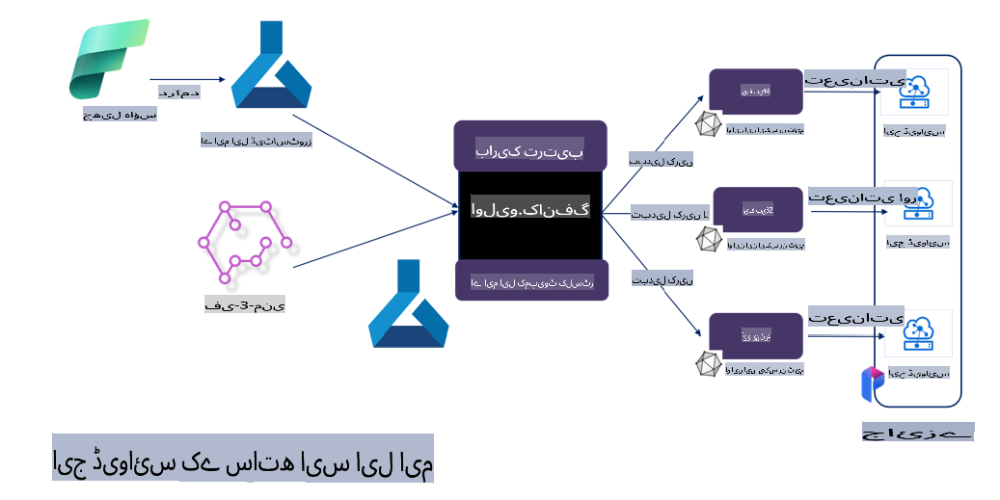

# **مائیکروسافٹ اولیو کے ساتھ Phi-3 کی فائن ٹوننگ**

[Olive](https://github.com/microsoft/OLive?WT.mc_id=aiml-138114-kinfeylo) ایک آسان اور ہارڈویئر سے آگاہ ماڈل آپٹیمائزیشن کا ٹول ہے جو ماڈل کمپریشن، آپٹیمائزیشن، اور کمپائلیشن کے شعبے میں صنعت کی جدید ترین تکنیکوں کو یکجا کرتا ہے۔

یہ مشین لرننگ ماڈلز کو بہتر بنانے کے عمل کو آسان بناتا ہے تاکہ وہ مخصوص ہارڈویئر آرکیٹیکچر کا مؤثر استعمال کر سکیں۔

چاہے آپ کلاؤڈ بیسڈ ایپلیکیشنز پر کام کر رہے ہوں یا ایج ڈیوائسز پر، اولیو آپ کو ماڈلز کو آسانی اور مؤثر طریقے سے آپٹیمائز کرنے کے قابل بناتا ہے۔

## اہم خصوصیات:
- اولیو مطلوبہ ہارڈویئر کے لیے آپٹیمائزیشن تکنیکوں کو یکجا اور خودکار کرتا ہے۔
- ہر منظرنامے کے لیے کوئی ایک تکنیک موزوں نہیں ہوتی، اس لیے اولیو ماہرین کو اپنی اختراعات شامل کرنے کی اجازت دیتا ہے۔

## انجینئرنگ کی محنت کو کم کریں:
- ڈویلپرز کو اکثر ماڈلز کی تیاری اور ان کی آپٹیمائزیشن کے لیے مختلف ہارڈویئر وینڈرز کے مخصوص ٹول چینز سیکھنے اور استعمال کرنے کی ضرورت ہوتی ہے۔
- اولیو اس عمل کو آسان بناتا ہے اور مطلوبہ ہارڈویئر کے لیے آپٹیمائزیشن تکنیکوں کو خودکار کر دیتا ہے۔

## ای2ای آپٹیمائزیشن کا تیار حل:

اولیو مختلف تکنیکوں کو ترتیب دے کر اور ٹوننگ کے ذریعے ایک متحدہ حل پیش کرتا ہے۔
یہ ماڈلز کو آپٹیمائز کرتے وقت درستگی اور تاخیر جیسے عوامل کو مدنظر رکھتا ہے۔

## مائیکروسافٹ اولیو کے ذریعے فائن ٹوننگ

مائیکروسافٹ اولیو ایک آسان اوپن سورس ماڈل آپٹیمائزیشن ٹول ہے جو تخلیقی مصنوعی ذہانت کے میدان میں فائن ٹوننگ اور ریفرنس دونوں کے لیے استعمال کیا جا سکتا ہے۔ اس کے لیے صرف سادہ کنفیگریشن کی ضرورت ہوتی ہے، جس میں اوپن سورس چھوٹے لینگویج ماڈلز اور متعلقہ رن ٹائم ماحولیات (AzureML / لوکل GPU، CPU، DirectML) کے ساتھ استعمال شامل ہے۔ آپ ماڈل کو خودکار آپٹیمائزیشن کے ذریعے فائن ٹون یا ریفرنس کر سکتے ہیں اور بہترین ماڈل تلاش کر سکتے ہیں تاکہ کلاؤڈ یا ایج ڈیوائسز پر ڈیپلائی کیا جا سکے۔ یہ کاروباری اداروں کو اپنے انڈسٹری ورٹیکل ماڈلز کلاؤڈ یا آن پرائمس پر بنانے کی اجازت دیتا ہے۔


## مائیکروسافٹ اولیو کے ساتھ Phi-3 کی فائن ٹوننگ



## Phi-3 اولیو سیمپل کوڈ اور مثال
اس مثال میں آپ اولیو کا استعمال کریں گے:

- LoRA اڈاپٹر کو فائن ٹون کر کے جملوں کو Sad، Joy، Fear، Surprise میں تقسیم کرنے کے لیے۔
- اڈاپٹر ویٹس کو بیس ماڈل میں ضم کرنے کے لیے۔
- ماڈل کو int4 میں آپٹیمائز اور کوانٹائز کرنے کے لیے۔

[سیمپل کوڈ](../../code/03.Finetuning/olive-ort-example/README.md)

### مائیکروسافٹ اولیو کی سیٹ اپ

مائیکروسافٹ اولیو کی انسٹالیشن بہت آسان ہے، اور یہ CPU، GPU، DirectML، اور Azure ML کے لیے بھی انسٹال کی جا سکتی ہے۔

```bash
pip install olive-ai
```

اگر آپ ایک ONNX ماڈل کو CPU پر چلانا چاہتے ہیں، تو آپ یہ استعمال کر سکتے ہیں:

```bash
pip install olive-ai[cpu]
```

اگر آپ ایک ONNX ماڈل کو GPU پر چلانا چاہتے ہیں، تو آپ یہ استعمال کر سکتے ہیں:

```python
pip install olive-ai[gpu]
```

اگر آپ Azure ML استعمال کرنا چاہتے ہیں، تو یہ استعمال کریں:

```python
pip install git+https://github.com/microsoft/Olive#egg=olive-ai[azureml]
```

**نوٹ**
OS کی ضرورت: Ubuntu 20.04 / 22.04 

### **مائیکروسافٹ اولیو کا Config.json**

انسٹالیشن کے بعد، آپ Config فائل کے ذریعے مختلف ماڈل سے متعلق سیٹنگز کو کنفیگر کر سکتے ہیں، جن میں ڈیٹا، کمپیوٹنگ، ٹریننگ، ڈیپلائمنٹ، اور ماڈل جنریشن شامل ہیں۔

**1. ڈیٹا**

مائیکروسافٹ اولیو پر، لوکل ڈیٹا اور کلاؤڈ ڈیٹا پر ٹریننگ کی جا سکتی ہے اور اسے سیٹنگز میں کنفیگر کیا جا سکتا ہے۔

*لوکل ڈیٹا سیٹنگز*

آپ آسانی سے ڈیٹا سیٹ کو سیٹ اپ کر سکتے ہیں جسے فائن ٹوننگ کے لیے ٹریننگ کی ضرورت ہو، عام طور پر json فارمیٹ میں، اور اسے ڈیٹا ٹیمپلیٹ کے ساتھ ہم آہنگ کر سکتے ہیں۔ یہ ماڈل کی ضروریات کے مطابق ایڈجسٹ کیا جاتا ہے (مثال کے طور پر، مائیکروسافٹ Phi-3-mini کے مطلوبہ فارمیٹ کے مطابق ہم آہنگ کریں۔ اگر آپ کے پاس دیگر ماڈلز ہیں، تو براہ کرم دیگر ماڈلز کے مطلوبہ فارمیٹس کے مطابق پروسیسنگ کریں۔)

```json

    "data_configs": [
        {
            "name": "dataset_default_train",
            "type": "HuggingfaceContainer",
            "load_dataset_config": {
                "params": {
                    "data_name": "json", 
                    "data_files":"dataset/dataset-classification.json",
                    "split": "train"
                }
            },
            "pre_process_data_config": {
                "params": {
                    "dataset_type": "corpus",
                    "text_cols": [
                            "phrase",
                            "tone"
                    ],
                    "text_template": "### Text: {phrase}\n### The tone is:\n{tone}",
                    "corpus_strategy": "join",
                    "source_max_len": 2048,
                    "pad_to_max_len": false,
                    "use_attention_mask": false
                }
            }
        }
    ],
```

**کلاؤڈ ڈیٹا سورس سیٹنگز**

Azure AI Studio/Azure Machine Learning Service کے ڈیٹا اسٹور کو کلاؤڈ میں موجود ڈیٹا سے لنک کر کے، آپ Microsoft Fabric اور Azure Data کے ذریعے مختلف ڈیٹا سورسز کو Azure AI Studio/Azure Machine Learning Service میں متعارف کروا سکتے ہیں تاکہ ڈیٹا کو فائن ٹوننگ کے لیے سپورٹ فراہم کی جا سکے۔

```json

    "data_configs": [
        {
            "name": "dataset_default_train",
            "type": "HuggingfaceContainer",
            "load_dataset_config": {
                "params": {
                    "data_name": "json", 
                    "data_files": {
                        "type": "azureml_datastore",
                        "config": {
                            "azureml_client": {
                                "subscription_id": "Your Azure Subscrition ID",
                                "resource_group": "Your Azure Resource Group",
                                "workspace_name": "Your Azure ML Workspaces name"
                            },
                            "datastore_name": "workspaceblobstore",
                            "relative_path": "Your train_data.json Azure ML Location"
                        }
                    },
                    "split": "train"
                }
            },
            "pre_process_data_config": {
                "params": {
                    "dataset_type": "corpus",
                    "text_cols": [
                            "Question",
                            "Best Answer"
                    ],
                    "text_template": "<|user|>\n{Question}<|end|>\n<|assistant|>\n{Best Answer}\n<|end|>",
                    "corpus_strategy": "join",
                    "source_max_len": 2048,
                    "pad_to_max_len": false,
                    "use_attention_mask": false
                }
            }
        }
    ],
    
```

**2. کمپیوٹنگ کنفیگریشن**

اگر آپ کو لوکل پر ضرورت ہو، تو آپ براہ راست لوکل ڈیٹا وسائل استعمال کر سکتے ہیں۔ اگر آپ کو Azure AI Studio / Azure Machine Learning Service کے وسائل استعمال کرنے ہوں، تو آپ کو متعلقہ Azure پیرامیٹرز، کمپیوٹنگ پاور کا نام وغیرہ کنفیگر کرنا ہوگا۔

```json

    "systems": {
        "aml": {
            "type": "AzureML",
            "config": {
                "accelerators": ["gpu"],
                "hf_token": true,
                "aml_compute": "Your Azure AI Studio / Azure Machine Learning Service Compute Name",
                "aml_docker_config": {
                    "base_image": "Your Azure AI Studio / Azure Machine Learning Service docker",
                    "conda_file_path": "conda.yaml"
                }
            }
        },
        "azure_arc": {
            "type": "AzureML",
            "config": {
                "accelerators": ["gpu"],
                "aml_compute": "Your Azure AI Studio / Azure Machine Learning Service Compute Name",
                "aml_docker_config": {
                    "base_image": "Your Azure AI Studio / Azure Machine Learning Service docker",
                    "conda_file_path": "conda.yaml"
                }
            }
        }
    },
```

***نوٹ***

چونکہ یہ Azure AI Studio/Azure Machine Learning Service پر کنٹینر کے ذریعے چلایا جاتا ہے، اس لیے مطلوبہ ماحول کو کنفیگر کرنے کی ضرورت ہے۔ یہ conda.yaml ماحول میں کنفیگر کیا جاتا ہے۔

```yaml

name: project_environment
channels:
  - defaults
dependencies:
  - python=3.8.13
  - pip=22.3.1
  - pip:
      - einops
      - accelerate
      - azure-keyvault-secrets
      - azure-identity
      - bitsandbytes
      - datasets
      - huggingface_hub
      - peft
      - scipy
      - sentencepiece
      - torch>=2.2.0
      - transformers
      - git+https://github.com/microsoft/Olive@jiapli/mlflow_loading_fix#egg=olive-ai[gpu]
      - --extra-index-url https://aiinfra.pkgs.visualstudio.com/PublicPackages/_packaging/ORT-Nightly/pypi/simple/ 
      - ort-nightly-gpu==1.18.0.dev20240307004
      - --extra-index-url https://aiinfra.pkgs.visualstudio.com/PublicPackages/_packaging/onnxruntime-genai/pypi/simple/
      - onnxruntime-genai-cuda

    

```

**3. اپنا SLM منتخب کریں**

آپ ماڈل کو براہ راست Hugging Face سے استعمال کر سکتے ہیں، یا آپ Azure AI Studio / Azure Machine Learning کے ماڈل کیٹلاگ کے ساتھ اسے براہ راست ملا سکتے ہیں تاکہ استعمال کے لیے ماڈل منتخب کریں۔ نیچے دیے گئے کوڈ کی مثال میں ہم مائیکروسافٹ Phi-3-mini کو بطور مثال استعمال کریں گے۔

اگر آپ کے پاس ماڈل لوکل پر موجود ہے، تو آپ یہ طریقہ استعمال کر سکتے ہیں:

```json

    "input_model":{
        "type": "PyTorchModel",
        "config": {
            "hf_config": {
                "model_name": "model-cache/microsoft/phi-3-mini",
                "task": "text-generation",
                "model_loading_args": {
                    "trust_remote_code": true
                }
            }
        }
    },
```

اگر آپ Azure AI Studio / Azure Machine Learning Service سے ماڈل استعمال کرنا چاہتے ہیں، تو آپ یہ طریقہ استعمال کر سکتے ہیں:

```json

    "input_model":{
        "type": "PyTorchModel",
        "config": {
            "model_path": {
                "type": "azureml_registry_model",
                "config": {
                    "name": "microsoft/Phi-3-mini-4k-instruct",
                    "registry_name": "azureml-msr",
                    "version": "11"
                }
            },
             "model_file_format": "PyTorch.MLflow",
             "hf_config": {
                "model_name": "microsoft/Phi-3-mini-4k-instruct",
                "task": "text-generation",
                "from_pretrained_args": {
                    "trust_remote_code": true
                }
            }
        }
    },
```

**نوٹ:**
ہمیں Azure AI Studio / Azure Machine Learning Service کے ساتھ انضمام کی ضرورت ہے، اس لیے ماڈل سیٹ اپ کرتے وقت، براہ کرم ورژن نمبر اور متعلقہ ناموں کا حوالہ دیں۔

Azure پر موجود تمام ماڈلز کو PyTorch.MLflow پر سیٹ کرنے کی ضرورت ہے۔

آپ کو Hugging Face اکاؤنٹ کی ضرورت ہوگی اور اسے Azure AI Studio / Azure Machine Learning کے Key value سے منسلک کرنا ہوگا۔

**4. الگورتھم**

مائیکروسافٹ اولیو نے Lora اور QLora فائن ٹوننگ الگورتھمز کو بہت عمدہ طریقے سے انکیپسولیٹ کیا ہے۔ آپ کو صرف متعلقہ پیرامیٹرز کنفیگر کرنے کی ضرورت ہے۔ یہاں میں QLora کی مثال لیتا ہوں:

```json
        "lora": {
            "type": "LoRA",
            "config": {
                "target_modules": [
                    "o_proj",
                    "qkv_proj"
                ],
                "double_quant": true,
                "lora_r": 64,
                "lora_alpha": 64,
                "lora_dropout": 0.1,
                "train_data_config": "dataset_default_train",
                "eval_dataset_size": 0.3,
                "training_args": {
                    "seed": 0,
                    "data_seed": 42,
                    "per_device_train_batch_size": 1,
                    "per_device_eval_batch_size": 1,
                    "gradient_accumulation_steps": 4,
                    "gradient_checkpointing": false,
                    "learning_rate": 0.0001,
                    "num_train_epochs": 3,
                    "max_steps": 10,
                    "logging_steps": 10,
                    "evaluation_strategy": "steps",
                    "eval_steps": 187,
                    "group_by_length": true,
                    "adam_beta2": 0.999,
                    "max_grad_norm": 0.3
                }
            }
        },
```

اگر آپ کو کوانٹائزیشن کنورژن کی ضرورت ہو، تو مائیکروسافٹ اولیو کا مین برانچ پہلے ہی onnxruntime-genai طریقہ کار کو سپورٹ کرتا ہے۔ آپ اپنی ضروریات کے مطابق اسے سیٹ کر سکتے ہیں:

1. اڈاپٹر ویٹس کو بیس ماڈل میں ضم کریں۔
2. ماڈل کو مطلوبہ پریسیژن کے ساتھ onnx ماڈل میں تبدیل کریں ModelBuilder کے ذریعے۔

مثال کے طور پر، quantized INT4 میں تبدیل کریں:

```json

        "merge_adapter_weights": {
            "type": "MergeAdapterWeights"
        },
        "builder": {
            "type": "ModelBuilder",
            "config": {
                "precision": "int4"
            }
        }
```

**نوٹ** 
- اگر آپ QLoRA استعمال کرتے ہیں، تو ONNXRuntime-genai کے ذریعے کوانٹائزیشن کنورژن فی الحال سپورٹ نہیں کیا جاتا۔

- یہ واضح کیا جانا چاہیے کہ آپ اپنی ضروریات کے مطابق اوپر دیے گئے مراحل کو سیٹ کر سکتے ہیں۔ ان تمام مراحل کو مکمل طور پر کنفیگر کرنے کی ضرورت نہیں ہے۔ اپنی ضروریات کے مطابق، آپ الگورتھم کے مراحل کو براہ راست استعمال کر سکتے ہیں بغیر فائن ٹوننگ کے۔ آخر میں آپ کو متعلقہ انجنز کو کنفیگر کرنے کی ضرورت ہوگی۔

```json

    "engine": {
        "log_severity_level": 0,
        "host": "aml",
        "target": "aml",
        "search_strategy": false,
        "execution_providers": ["CUDAExecutionProvider"],
        "cache_dir": "../model-cache/models/phi3-finetuned/cache",
        "output_dir" : "../model-cache/models/phi3-finetuned"
    }
```

**5. فائن ٹوننگ مکمل ہو گئی**

کمانڈ لائن پر، olive-config.json کی ڈائریکٹری میں یہ کمانڈ چلائیں:

```bash
olive run --config olive-config.json  
```

**ڈس کلیمر**:  
یہ دستاویز مشین پر مبنی AI ترجمہ سروسز کا استعمال کرتے ہوئے ترجمہ کی گئی ہے۔ اگرچہ ہم درستگی کے لیے کوشش کرتے ہیں، براہ کرم آگاہ رہیں کہ خودکار ترجمے میں غلطیاں یا خامیاں ہوسکتی ہیں۔ اصل دستاویز کو اس کی مقامی زبان میں مستند ذریعہ سمجھا جانا چاہیے۔ اہم معلومات کے لیے، پیشہ ورانہ انسانی ترجمے کی سفارش کی جاتی ہے۔ ہم اس ترجمے کے استعمال سے پیدا ہونے والی کسی بھی غلط فہمی یا غلط تشریح کے ذمہ دار نہیں ہیں۔