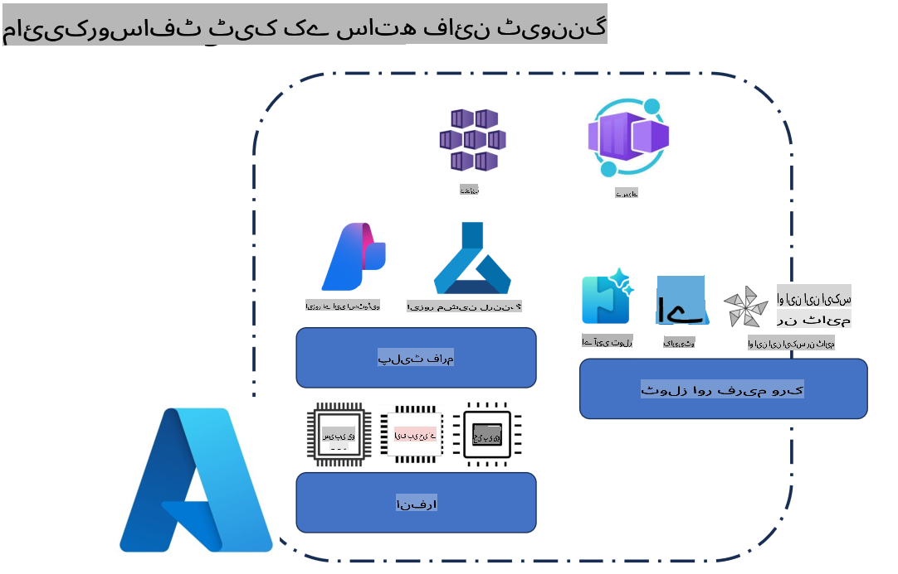
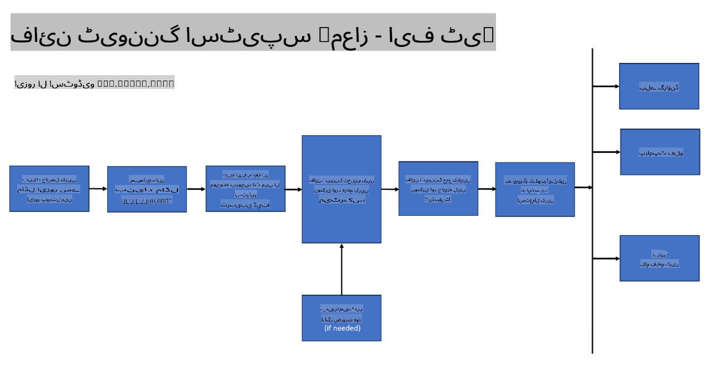
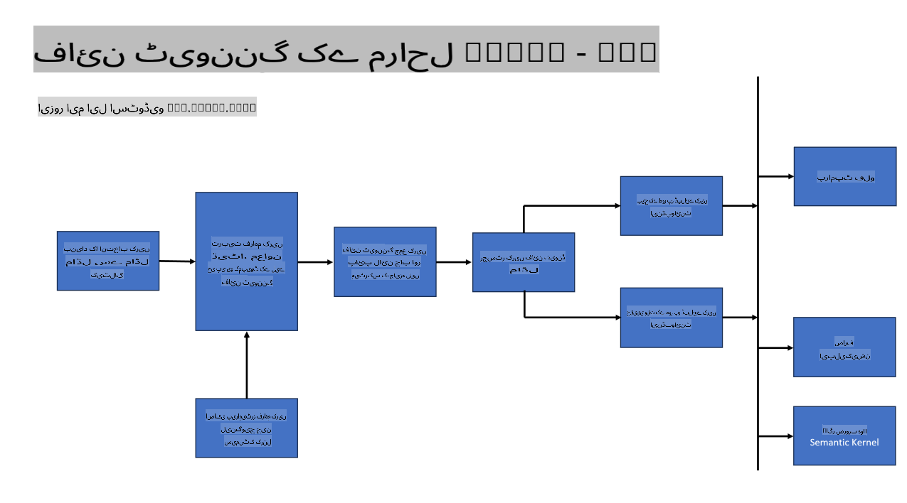
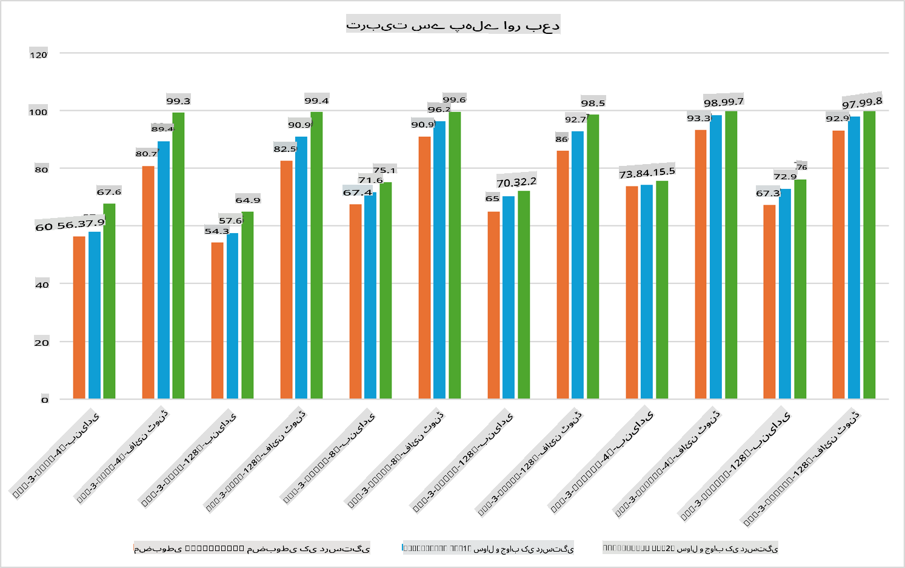

## فائن ٹیوننگ کے منظرنامے

**پلیٹ فارم** اس میں مختلف ٹیکنالوجیز شامل ہیں جیسے Azure AI Foundry, Azure Machine Learning, AI Tools, Kaito, اور ONNX Runtime۔

**انفراسٹرکچر** اس میں CPU اور FPGA شامل ہیں، جو فائن ٹیوننگ کے عمل کے لیے ضروری ہیں۔ آئیے میں آپ کو ان ٹیکنالوجیز کے آئیکنز دکھاتا ہوں۔

**ٹولز اور فریم ورک** اس میں ONNX Runtime شامل ہے۔ آئیے میں آپ کو ان ٹیکنالوجیز کے آئیکنز دکھاتا ہوں۔
[Insert icons for ONNX Runtime and ONNX Runtime]

Microsoft ٹیکنالوجیز کے ساتھ فائن ٹیوننگ کا عمل مختلف اجزاء اور ٹولز پر مشتمل ہوتا ہے۔ ان ٹیکنالوجیز کو سمجھ کر اور استعمال کرکے، ہم اپنی ایپلیکیشنز کو مؤثر طریقے سے فائن ٹیون کرسکتے ہیں اور بہتر حل تخلیق کرسکتے ہیں۔

## ماڈل بطور سروس

ہوسٹڈ فائن ٹیوننگ کے ذریعے ماڈل کو فائن ٹیون کریں، بغیر کمپیوٹ کی تخلیق اور انتظام کی ضرورت کے۔

سرور لیس فائن ٹیوننگ Phi-3-mini اور Phi-3-medium ماڈلز کے لیے دستیاب ہے، جو ڈیولپرز کو کلاؤڈ اور ایج منظرناموں کے لیے ماڈلز کو تیزی اور آسانی سے حسب ضرورت بنانے کے قابل بناتی ہے، بغیر کمپیوٹ کے انتظام کی ضرورت کے۔ ہم نے یہ بھی اعلان کیا ہے کہ Phi-3-small اب ہمارے Models-as-a-Service آفرنگ کے ذریعے دستیاب ہے، تاکہ ڈیولپرز بنیادی انفراسٹرکچر کو سنبھالے بغیر AI ڈیولپمنٹ شروع کرسکیں۔

## ماڈل بطور پلیٹ فارم

صارفین اپنے کمپیوٹ کا انتظام کرتے ہیں تاکہ اپنے ماڈلز کو فائن ٹیون کرسکیں۔

[Fine Tuning Sample](https://github.com/Azure/azureml-examples/blob/main/sdk/python/foundation-models/system/finetune/chat-completion/chat-completion.ipynb)

## فائن ٹیوننگ کے منظرنامے

| | | | | | | |
|-|-|-|-|-|-|-|
|منظرنامہ|LoRA|QLoRA|PEFT|DeepSpeed|ZeRO|DORA|
|پری ٹرینڈ LLMs کو مخصوص کاموں یا ڈومینز کے مطابق ڈھالنا|ہاں|ہاں|ہاں|ہاں|ہاں|ہاں|
|NLP کے کاموں کے لیے فائن ٹیوننگ جیسے ٹیکسٹ کلاسیفیکیشن، نامزد ادارہ کی شناخت، اور مشین ترجمہ|ہاں|ہاں|ہاں|ہاں|ہاں|ہاں|
|QA کے کاموں کے لیے فائن ٹیوننگ|ہاں|ہاں|ہاں|ہاں|ہاں|ہاں|
|چَیٹ بوٹس میں انسانی جیسے جوابات پیدا کرنے کے لیے فائن ٹیوننگ|ہاں|ہاں|ہاں|ہاں|ہاں|ہاں|
|موسیقی، آرٹ، یا دیگر تخلیقی شکلوں کی تخلیق کے لیے فائن ٹیوننگ|ہاں|ہاں|ہاں|ہاں|ہاں|ہاں|
|کمپیوٹیشنل اور مالیاتی اخراجات کو کم کرنا|ہاں|ہاں|نہیں|ہاں|ہاں|نہیں|
|میموری کے استعمال کو کم کرنا|نہیں|ہاں|نہیں|ہاں|ہاں|ہاں|
|مؤثر فائن ٹیوننگ کے لیے کم پیرامیٹرز کا استعمال|نہیں|ہاں|ہاں|نہیں|نہیں|ہاں|
|ڈیٹا پیراللزم کی میموری مؤثر شکل جو دستیاب تمام GPU ڈیوائسز کی مجموعی GPU میموری تک رسائی فراہم کرتی ہے|نہیں|نہیں|نہیں|ہاں|ہاں|ہاں|

## فائن ٹیوننگ کی کارکردگی کی مثالیں

**ڈسکلیمر**:  
یہ دستاویز مشین پر مبنی AI ترجمہ خدمات کا استعمال کرتے ہوئے ترجمہ کی گئی ہے۔ اگرچہ ہم درستگی کی کوشش کرتے ہیں، براہ کرم آگاہ رہیں کہ خودکار ترجمے میں غلطیاں یا عدم درستگی ہو سکتی ہیں۔ اصل دستاویز کو اس کی اصل زبان میں مستند ذریعہ سمجھا جانا چاہیے۔ اہم معلومات کے لیے، پیشہ ور انسانی ترجمہ کی سفارش کی جاتی ہے۔ ہم اس ترجمے کے استعمال سے پیدا ہونے والی کسی بھی غلط فہمی یا غلط تشریح کے ذمہ دار نہیں ہیں۔