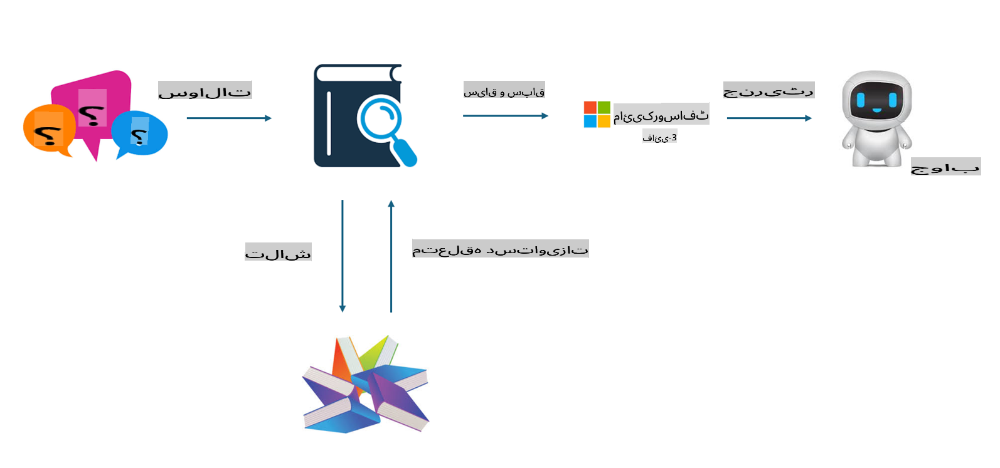

## فائن ٹیوننگ بمقابلہ RAG

## ریٹریول آگمینٹڈ جنریشن

RAG ڈیٹا ریٹریول + ٹیکسٹ جنریشن ہے۔ انٹرپرائز کے منظم اور غیر منظم ڈیٹا کو ویکٹر ڈیٹا بیس میں محفوظ کیا جاتا ہے۔ جب متعلقہ مواد کی تلاش کی جاتی ہے، تو متعلقہ خلاصہ اور مواد ڈھونڈ کر ایک کانٹیکسٹ تشکیل دیا جاتا ہے، اور LLM/SLM کی ٹیکسٹ کمپلیشن کی قابلیت کو ملا کر مواد تیار کیا جاتا ہے۔

## RAG کا عمل

## فائن ٹیوننگ
فائن ٹیوننگ کسی مخصوص ماڈل کی بہتری پر مبنی ہے۔ اس میں ماڈل الگورتھم سے شروعات کی ضرورت نہیں ہوتی، لیکن ڈیٹا کو مسلسل جمع کرنا ضروری ہوتا ہے۔ اگر آپ کو انڈسٹری ایپلیکیشنز میں زیادہ درست اصطلاحات اور زبان کے اظہار کی ضرورت ہو، تو فائن ٹیوننگ بہتر انتخاب ہوگا۔ لیکن اگر آپ کا ڈیٹا بار بار تبدیل ہوتا ہے، تو فائن ٹیوننگ پیچیدہ ہو سکتی ہے۔

## انتخاب کیسے کریں
اگر ہمارے جواب کے لیے بیرونی ڈیٹا کا تعارف ضروری ہو، تو RAG بہترین انتخاب ہے۔

اگر آپ کو مستحکم اور درست انڈسٹری نالج آؤٹ پٹ کی ضرورت ہو، تو فائن ٹیوننگ ایک اچھا انتخاب ہوگا۔ RAG متعلقہ مواد کھینچنے کو ترجیح دیتا ہے، لیکن ہمیشہ مخصوص باریکیوں کو نہیں پکڑ پاتا۔

فائن ٹیوننگ کے لیے ایک اعلی معیار کا ڈیٹا سیٹ درکار ہوتا ہے، اور اگر یہ صرف ایک چھوٹے دائرے کا ڈیٹا ہو، تو زیادہ فرق نہیں پڑے گا۔ RAG زیادہ لچکدار ہے۔

فائن ٹیوننگ ایک بلیک باکس ہے، ایک میٹافزکس، اور اس کے اندرونی میکانزم کو سمجھنا مشکل ہے۔ لیکن RAG ڈیٹا کے ماخذ کو تلاش کرنا آسان بنا سکتا ہے، جس سے ہیلوسینیشنز یا مواد کی غلطیوں کو مؤثر طریقے سے ایڈجسٹ کرنے اور بہتر شفافیت فراہم کرنے میں مدد ملتی ہے۔

**ڈس کلیمر**:  
یہ دستاویز مشین پر مبنی AI ترجمہ خدمات کا استعمال کرتے ہوئے ترجمہ کی گئی ہے۔ اگرچہ ہم درستگی کے لیے کوشش کرتے ہیں، براہ کرم آگاہ رہیں کہ خودکار ترجمے میں غلطیاں یا خامیاں ہو سکتی ہیں۔ اصل دستاویز اپنی اصل زبان میں مستند ذریعہ سمجھی جانی چاہیے۔ اہم معلومات کے لیے، پیشہ ور انسانی ترجمہ کی سفارش کی جاتی ہے۔ ہم اس ترجمے کے استعمال سے پیدا ہونے والی کسی بھی غلط فہمی یا غلط تشریح کے ذمہ دار نہیں ہیں۔