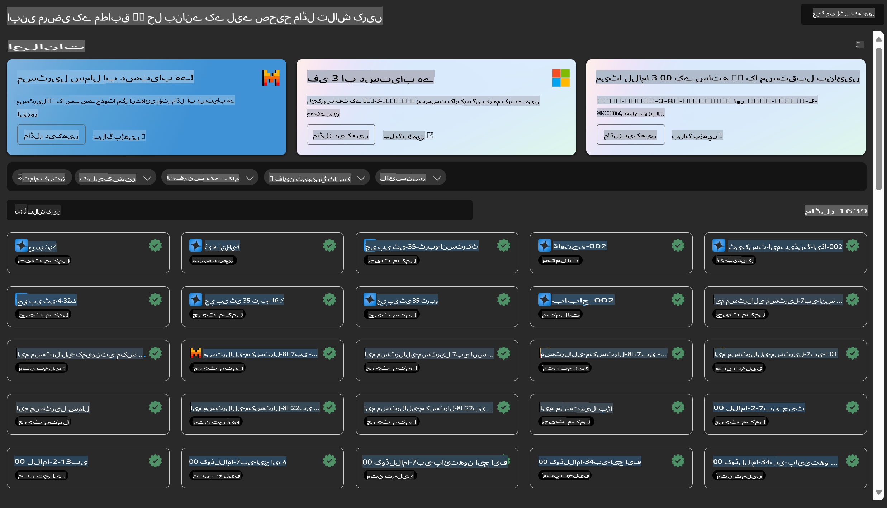

# **Azure Machine Learning سروس کا تعارف**

[Azure Machine Learning](https://ml.azure.com?WT.mc_id=aiml-138114-kinfeylo) ایک کلاؤڈ سروس ہے جو مشین لرننگ (ML) پروجیکٹ کے لائف سائیکل کو تیز کرنے اور منظم کرنے کے لیے استعمال ہوتی ہے۔

ایم ایل پروفیشنلز، ڈیٹا سائنسدان، اور انجینئر اسے اپنی روزمرہ کی ورک فلو میں استعمال کر سکتے ہیں تاکہ:

- ماڈلز کو ٹرین اور ڈپلائے کیا جا سکے۔
- مشین لرننگ آپریشنز (MLOps) کو منظم کیا جا سکے۔
- آپ Azure Machine Learning میں ماڈل بنا سکتے ہیں یا کسی اوپن سورس پلیٹ فارم جیسے PyTorch، TensorFlow، یا scikit-learn سے تیار کردہ ماڈل استعمال کر سکتے ہیں۔
- MLOps کے ٹولز آپ کو ماڈلز کی مانیٹرنگ، دوبارہ تربیت، اور دوبارہ ڈپلائمنٹ میں مدد دیتے ہیں۔

## Azure Machine Learning کس کے لیے ہے؟

**ڈیٹا سائنسدان اور ایم ایل انجینئرز**

یہ اپنے روزمرہ کے کام کو تیز اور خودکار کرنے کے لیے ٹولز استعمال کر سکتے ہیں۔
Azure ML فیئرنس، وضاحت، ٹریکنگ، اور آڈیٹیبلٹی جیسی خصوصیات فراہم کرتا ہے۔

**ایپلیکیشن ڈیولپرز**

یہ ماڈلز کو ایپلیکیشنز یا سروسز میں آسانی سے انٹیگریٹ کر سکتے ہیں۔

**پلیٹ فارم ڈیولپرز**

یہ مضبوط ٹولز تک رسائی حاصل کر سکتے ہیں جو Azure Resource Manager APIs پر مبنی ہیں۔
یہ ٹولز جدید ایم ایل ٹولنگ کی تعمیر کی اجازت دیتے ہیں۔

**انٹرپرائزز**

Microsoft Azure کلاؤڈ میں کام کرتے ہوئے، انٹرپرائزز کو مانوس سیکیورٹی اور رول بیسڈ ایکسیس کنٹرول سے فائدہ ہوتا ہے۔
پروجیکٹس سیٹ اپ کریں تاکہ محفوظ ڈیٹا اور مخصوص آپریشنز تک رسائی کو کنٹرول کیا جا سکے۔

## ٹیم کے ہر فرد کے لیے پروڈکٹیوٹی

ایم ایل پروجیکٹس اکثر ایک متنوع مہارتوں والی ٹیم کی ضرورت ہوتی ہے تاکہ انہیں بنایا اور برقرار رکھا جا سکے۔

Azure ML ایسے ٹولز فراہم کرتا ہے جو آپ کو اجازت دیتے ہیں:
- اپنی ٹیم کے ساتھ شیئرڈ نوٹ بکس، کمپیوٹ ریسورسز، سرور لیس کمپیوٹ، ڈیٹا، اور ماحولیات کے ذریعے تعاون کریں۔
- ماڈلز کو فیئرنس، وضاحت، ٹریکنگ، اور آڈیٹیبلٹی کے ساتھ تیار کریں تاکہ لائن ایج اور آڈٹ کی تعمیل کے تقاضے پورے ہوں۔
- ایم ایل ماڈلز کو تیزی سے اور آسانی سے بڑے پیمانے پر ڈپلائے کریں، اور MLOps کے ساتھ ان کا مؤثر طریقے سے انتظام اور حکمرانی کریں۔
- بلٹ ان گورننس، سیکیورٹی، اور تعمیل کے ساتھ مشین لرننگ ورک لوڈز کو کہیں بھی چلائیں۔

## کراس کمپٹیبل پلیٹ فارم ٹولز

ایم ایل ٹیم میں کوئی بھی اپنے پسندیدہ ٹولز استعمال کر سکتا ہے تاکہ کام مکمل کیا جا سکے۔
چاہے آپ ریپڈ ایکسپیریمنٹس کر رہے ہوں، ہائپر پیرامیٹر ٹیوننگ، پائپ لائنز بنا رہے ہوں، یا انفرنسز کو منیج کر رہے ہوں، آپ مانوس انٹرفیسز استعمال کر سکتے ہیں، جیسے:
- Azure Machine Learning Studio
- Python SDK (v2)
- Azure CLI (v2)
- Azure Resource Manager REST APIs

جب آپ ماڈلز کو بہتر بنا رہے ہوں اور ڈیولپمنٹ سائیکل کے دوران تعاون کر رہے ہوں، آپ Azure Machine Learning اسٹوڈیو UI کے اندر اثاثے، وسائل، اور میٹرکس شیئر اور تلاش کر سکتے ہیں۔

## **Azure ML میں LLM/SLM**

Azure ML نے LLM/SLM سے متعلق بہت سی خصوصیات شامل کی ہیں، جو LLMOps اور SLMOps کو ملا کر ایک انٹرپرائز وسیع جنریٹو مصنوعی ذہانت ٹیکنالوجی پلیٹ فارم تشکیل دیتا ہے۔

### **ماڈل کیٹلاگ**

انٹرپرائز صارفین مختلف کاروباری منظرناموں کے مطابق مختلف ماڈلز کو ماڈل کیٹلاگ کے ذریعے ڈپلائے کر سکتے ہیں، اور ماڈل ایز اے سروس کے طور پر خدمات فراہم کر سکتے ہیں تاکہ انٹرپرائز ڈیولپرز یا صارفین انہیں استعمال کر سکیں۔

Azure Machine Learning اسٹوڈیو میں ماڈل کیٹلاگ وہ مرکز ہے جہاں آپ مختلف ماڈلز کو دریافت اور استعمال کر سکتے ہیں تاکہ جنریٹو AI ایپلیکیشنز بنا سکیں۔ ماڈل کیٹلاگ میں مختلف ماڈل پرووائیڈرز جیسے Azure OpenAI سروس، Mistral، Meta، Cohere، Nvidia، Hugging Face، اور Microsoft کے تربیت یافتہ ماڈلز شامل ہیں۔ Microsoft کے علاوہ دیگر پرووائیڈرز کے ماڈلز کو Microsoft پروڈکٹ ٹرمز میں نان-مائیکروسافٹ پروڈکٹس کے طور پر بیان کیا گیا ہے، اور وہ ماڈل کے ساتھ فراہم کردہ شرائط کے تابع ہیں۔

### **جاب پائپ لائن**

مشین لرننگ پائپ لائن کا بنیادی کام ایک مکمل مشین لرننگ ٹاسک کو ایک ملٹی اسٹیپ ورک فلو میں تقسیم کرنا ہے۔ ہر اسٹیپ ایک قابل انتظام جزو ہوتا ہے جسے الگ سے ڈیولپ، آپٹمائز، کنفیگر، اور خودکار کیا جا سکتا ہے۔ اسٹیپس کو واضح انٹرفیسز کے ذریعے جوڑا جاتا ہے۔ Azure Machine Learning پائپ لائن سروس پائپ لائن اسٹیپس کے درمیان تمام انحصار کو خودکار طور پر آرکیسٹریٹ کرتی ہے۔

SLM / LLM کو فائن ٹیون کرتے وقت، ہم اپنے ڈیٹا، تربیت، اور جنریشن کے عمل کو پائپ لائن کے ذریعے منظم کر سکتے ہیں۔

### **پرامپٹ فلو**

Azure Machine Learning پرامپٹ فلو کے فوائد:
Azure Machine Learning پرامپٹ فلو کئی فوائد فراہم کرتا ہے جو صارفین کو آئیڈیاز سے تجربات اور بالآخر پروڈکشن کے لیے تیار LLM پر مبنی ایپلیکیشنز تک منتقلی میں مدد دیتے ہیں:

**پرامپٹ انجینئرنگ کی چستی**

- انٹرایکٹو آتھرنگ تجربہ: Azure Machine Learning پرامپٹ فلو فلو کے ڈھانچے کی بصری نمائندگی فراہم کرتا ہے، جو صارفین کو اپنے پروجیکٹس کو آسانی سے سمجھنے اور نیویگیٹ کرنے کی اجازت دیتا ہے۔ یہ فلو ڈیولپمنٹ اور ڈیبگنگ کے لیے ایک نوٹ بک جیسا کوڈنگ تجربہ بھی پیش کرتا ہے۔
- پرامپٹ ٹیوننگ کے لیے مختلف ورژن: صارفین متعدد پرامپٹ ورژن بنا اور موازنہ کر سکتے ہیں، جو ایک تکراری بہتری کے عمل کو آسان بناتا ہے۔
- تشخیص: بلٹ ان تشخیصی فلو صارفین کو اپنے پرامپٹس اور فلو کی کوالٹی اور مؤثریت کا اندازہ لگانے کی اجازت دیتے ہیں۔
- جامع وسائل: Azure Machine Learning پرامپٹ فلو میں بلٹ ان ٹولز، سیمپلز، اور ٹیمپلیٹس کی ایک لائبریری شامل ہے جو ترقی کے لیے ایک نقطہ آغاز فراہم کرتی ہے، تخلیقی صلاحیتوں کو متاثر کرتی ہے اور عمل کو تیز کرتی ہے۔

**LLM پر مبنی ایپلیکیشنز کے لیے انٹرپرائز ریڈینس**

- تعاون: Azure Machine Learning پرامپٹ فلو ٹیم کے تعاون کو سپورٹ کرتا ہے، جس سے متعدد صارفین پرامپٹ انجینئرنگ پروجیکٹس پر مل کر کام کر سکتے ہیں، علم شیئر کر سکتے ہیں، اور ورژن کنٹرول کو برقرار رکھ سکتے ہیں۔
- آل-ان-ون پلیٹ فارم: Azure Machine Learning پرامپٹ فلو پورے پرامپٹ انجینئرنگ عمل کو ہموار کرتا ہے، ترقی اور تشخیص سے لے کر ڈپلائمنٹ اور مانیٹرنگ تک۔ صارفین اپنے فلو کو Azure Machine Learning اینڈپوائنٹس کے طور پر آسانی سے ڈپلائے اور ان کی کارکردگی کو ریئل ٹائم میں مانیٹر کر سکتے ہیں، جو بہترین آپریشن اور مسلسل بہتری کو یقینی بناتے ہیں۔
- Azure Machine Learning انٹرپرائز ریڈینس سلوشنز: پرامپٹ فلو Azure Machine Learning کے مضبوط انٹرپرائز ریڈینس سلوشنز سے فائدہ اٹھاتا ہے، جو فلو کی ترقی، تجربات، اور ڈپلائمنٹ کے لیے ایک محفوظ، قابل توسیع، اور قابل اعتماد بنیاد فراہم کرتا ہے۔

Azure Machine Learning پرامپٹ فلو کے ساتھ، صارفین اپنی پرامپٹ انجینئرنگ کی چستی کو آزاد کر سکتے ہیں، مؤثر طریقے سے تعاون کر سکتے ہیں، اور کامیاب LLM پر مبنی ایپلیکیشنز کی ترقی اور ڈپلائمنٹ کے لیے انٹرپرائز گریڈ سلوشنز کا فائدہ اٹھا سکتے ہیں۔

Azure ML کے کمپیوٹنگ پاور، ڈیٹا، اور مختلف اجزاء کو یکجا کرتے ہوئے، انٹرپرائز ڈیولپرز آسانی سے اپنی مصنوعی ذہانت کی ایپلیکیشنز بنا سکتے ہیں۔

**ڈس کلیمر**:  
یہ دستاویز مشین پر مبنی اے آئی ترجمہ سروسز کا استعمال کرتے ہوئے ترجمہ کی گئی ہے۔ ہم درستگی کے لیے پوری کوشش کرتے ہیں، لیکن براہ کرم نوٹ کریں کہ خودکار ترجمے میں غلطیاں یا خامیاں ہو سکتی ہیں۔ اصل دستاویز، جو اس کی مقامی زبان میں ہے، کو مستند ذریعہ سمجھا جانا چاہیے۔ اہم معلومات کے لیے، پیشہ ور انسانی ترجمہ کی سفارش کی جاتی ہے۔ ہم اس ترجمے کے استعمال سے پیدا ہونے والی کسی بھی غلط فہمی یا غلط تشریح کے ذمہ دار نہیں ہیں۔