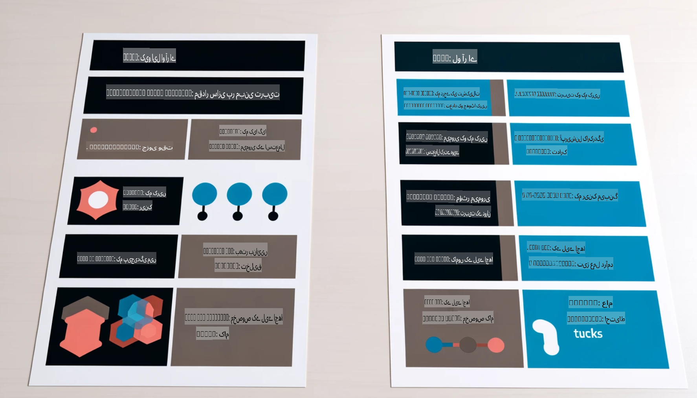

# **فائی-3 کو ایک انڈسٹری ماہر بنائیں**

فائی-3 ماڈل کو کسی انڈسٹری میں شامل کرنے کے لیے، آپ کو فائی-3 ماڈل میں انڈسٹری کے کاروباری ڈیٹا کو شامل کرنا ہوگا۔ ہمارے پاس دو مختلف اختیارات ہیں: پہلا RAG (ریٹریول اگمینٹڈ جنریشن) اور دوسرا فائن ٹیوننگ۔

## **RAG بمقابلہ فائن ٹیوننگ**

### **ریٹریول اگمینٹڈ جنریشن**

RAG ڈیٹا کی تلاش اور ٹیکسٹ جنریشن کا امتزاج ہے۔ انٹرپرائز کے منظم اور غیر منظم ڈیٹا کو ویکٹر ڈیٹا بیس میں محفوظ کیا جاتا ہے۔ جب متعلقہ مواد کی تلاش کی جاتی ہے، تو متعلقہ خلاصہ اور مواد کو تلاش کر کے ایک کانٹیکسٹ بنایا جاتا ہے، اور LLM/SLM کی ٹیکسٹ کمپلیشن صلاحیت کو مواد تیار کرنے کے لیے استعمال کیا جاتا ہے۔

### **فائن ٹیوننگ**

فائن ٹیوننگ کسی ماڈل کو مزید بہتر بنانے پر مبنی ہے۔ اس میں ماڈل الگورتھم سے شروع کرنے کی ضرورت نہیں ہوتی، لیکن ڈیٹا کو مسلسل جمع کرنا ضروری ہوتا ہے۔ اگر آپ انڈسٹری ایپلیکیشنز میں زیادہ دقیق اصطلاحات اور زبان کے اظہار کی ضرورت ہو، تو فائن ٹیوننگ ایک بہتر انتخاب ہوگا۔ لیکن اگر آپ کا ڈیٹا بار بار تبدیل ہوتا ہے، تو فائن ٹیوننگ پیچیدہ ہو سکتی ہے۔

### **کیسے انتخاب کریں**

1. اگر ہمارے جواب کے لیے بیرونی ڈیٹا شامل کرنے کی ضرورت ہو، تو RAG بہترین انتخاب ہے۔

2. اگر آپ کو مستحکم اور درست انڈسٹری نالج فراہم کرنا ہو، تو فائن ٹیوننگ ایک اچھا انتخاب ہوگا۔ RAG متعلقہ مواد لانے کو ترجیح دیتا ہے لیکن ہمیشہ خصوصی باریکیوں کو نہیں سمجھ سکتا۔

3. فائن ٹیوننگ کے لیے ایک اعلی معیار کا ڈیٹا سیٹ درکار ہوتا ہے، اور اگر یہ صرف ایک چھوٹے ڈیٹا کا دائرہ ہو، تو یہ زیادہ فرق نہیں ڈالے گا۔ RAG زیادہ لچکدار ہے۔

4. فائن ٹیوننگ ایک "بلیک باکس" ہے، ایک قسم کی پیچیدگی، اور اس کے اندرونی میکانزم کو سمجھنا مشکل ہوتا ہے۔ لیکن RAG ڈیٹا کے ماخذ کو آسانی سے تلاش کرنے کی صلاحیت فراہم کرتا ہے، جس سے غلط فہمیوں یا مواد کی غلطیوں کو مؤثر طریقے سے ایڈجسٹ کیا جا سکتا ہے اور زیادہ شفافیت فراہم کی جا سکتی ہے۔

### **اسٹینریوز**

1. مخصوص پیشہ ورانہ الفاظ اور اظہار کی ضرورت والے عمودی انڈسٹریز کے لیے، ***فائن ٹیوننگ*** بہترین انتخاب ہوگا۔

2. سوال و جواب کے نظام میں، جہاں مختلف نالج پوائنٹس کو یکجا کرنا شامل ہو، ***RAG*** بہترین انتخاب ہوگا۔

3. خودکار کاروباری فلو کے امتزاج کے لیے، ***RAG + فائن ٹیوننگ*** بہترین انتخاب ہوگا۔

## **RAG کا استعمال کیسے کریں**

ویکٹر ڈیٹا بیس ایک ایسا ڈیٹا مجموعہ ہے جو ریاضیاتی شکل میں محفوظ ہوتا ہے۔ ویکٹر ڈیٹا بیس مشین لرننگ ماڈلز کے لیے پچھلے ان پٹس کو یاد رکھنا آسان بناتا ہے، جس سے مشین لرننگ کو تلاش، سفارشات، اور ٹیکسٹ جنریشن جیسے استعمالات کی حمایت کے لیے استعمال کیا جا سکتا ہے۔ ڈیٹا کو مماثلت کے میٹرکس کی بنیاد پر شناخت کیا جا سکتا ہے، نہ کہ صرف عین مماثلت کے ذریعے، جس سے کمپیوٹر ماڈلز ڈیٹا کے کانٹیکسٹ کو بہتر طور پر سمجھ سکتے ہیں۔

ویکٹر ڈیٹا بیس RAG کو حقیقت میں بدلنے کی کلید ہے۔ ہم ڈیٹا کو ویکٹر اسٹوریج میں تبدیل کر سکتے ہیں ویکٹر ماڈلز جیسے کہ text-embedding-3، jina-ai-embedding، وغیرہ کے ذریعے۔

RAG ایپلیکیشن بنانے کے بارے میں مزید جانیں [https://github.com/microsoft/Phi-3CookBook](https://github.com/microsoft/Phi-3CookBook?WT.mc_id=aiml-138114-kinfeylo) 

## **فائن ٹیوننگ کا استعمال کیسے کریں**

فائن ٹیوننگ میں عام طور پر استعمال ہونے والے الگورتھم Lora اور QLora ہیں۔ کیسے انتخاب کریں؟
- [اس نمونہ نوٹ بک کے ذریعے مزید جانیں](../../../../code/04.Finetuning/Phi_3_Inference_Finetuning.ipynb)
- [Python فائن ٹیوننگ کا نمونہ اسکرپٹ](../../../../code/04.Finetuning/FineTrainingScript.py)

### **Lora اور QLora**

LoRA (لو رینک ایڈاپٹیشن) اور QLoRA (کوانٹائزڈ لو رینک ایڈاپٹیشن) دونوں تکنیکیں ہیں جو بڑے لینگویج ماڈلز (LLMs) کو Parameter Efficient Fine Tuning (PEFT) کے ذریعے فائن ٹیون کرنے کے لیے استعمال ہوتی ہیں۔ PEFT تکنیکیں روایتی طریقوں کے مقابلے میں ماڈلز کو زیادہ مؤثر طریقے سے تربیت دینے کے لیے بنائی گئی ہیں۔

LoRA ایک خودمختار فائن ٹیوننگ تکنیک ہے جو وزن کی اپڈیٹ میٹرکس پر کم رینک اپروکسی میشن لگا کر میموری کے استعمال کو کم کرتی ہے۔ یہ تیز تربیتی اوقات فراہم کرتی ہے اور روایتی فائن ٹیوننگ طریقوں کے قریب کارکردگی کو برقرار رکھتی ہے۔

QLoRA LoRA کا ایک توسیعی ورژن ہے جو میموری کے استعمال کو مزید کم کرنے کے لیے کوانٹائزیشن تکنیکوں کو شامل کرتا ہے۔ QLoRA پری ٹرینڈ LLM کے وزن کے پیرامیٹرز کو 4-بٹ کی درستگی میں کوانٹائز کرتا ہے، جو LoRA سے زیادہ میموری مؤثر ہے۔ تاہم، QLoRA کی تربیت LoRA کی تربیت سے تقریباً 30% سست ہے کیونکہ اس میں اضافی کوانٹائزیشن اور ڈی کوانٹائزیشن کے مراحل شامل ہوتے ہیں۔

QLoRA کوانٹائزیشن کے دوران پیدا ہونے والی غلطیوں کو درست کرنے کے لیے LoRA کو ایک معاون کے طور پر استعمال کرتا ہے۔ QLoRA بڑے ماڈلز کو، جن کے اربوں پیرامیٹرز ہوتے ہیں، نسبتاً چھوٹے اور آسانی سے دستیاب GPUs پر فائن ٹیون کرنے کے قابل بناتا ہے۔ مثال کے طور پر، QLoRA ایک 70B پیرامیٹر ماڈل کو فائن ٹیون کر سکتا ہے جس کے لیے 36 GPUs کی ضرورت ہوتی ہے، صرف 2 پر۔

**اعلانِ لاتعلقی**:  
یہ دستاویز مشین پر مبنی AI ترجمہ خدمات کا استعمال کرتے ہوئے ترجمہ کی گئی ہے۔ اگرچہ ہم درستگی کے لیے کوشش کرتے ہیں، براہ کرم یہ بات ذہن میں رکھیں کہ خودکار ترجمے میں غلطیاں یا خامیاں ہو سکتی ہیں۔ اصل دستاویز کو اس کی مقامی زبان میں مستند ذریعہ سمجھا جانا چاہیے۔ اہم معلومات کے لیے، پیشہ ور انسانی ترجمہ کی سفارش کی جاتی ہے۔ ہم اس ترجمے کے استعمال سے پیدا ہونے والی کسی بھی غلط فہمی یا غلط تشریح کے ذمہ دار نہیں ہیں۔