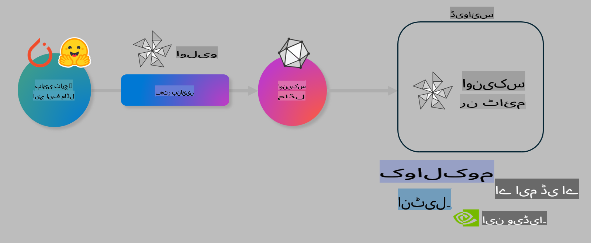

# لیب: AI ماڈلز کو ڈیوائس پر انفیرینس کے لیے بہتر بنائیں

## تعارف 

> [!IMPORTANT]
> اس لیب کے لیے **Nvidia A10 یا A100 GPU** اور متعلقہ ڈرائیورز اور CUDA ٹول کٹ (ورژن 12+) کی تنصیب ضروری ہے۔

> [!NOTE]
> یہ ایک **35 منٹ** کا لیب ہے جو آپ کو OLIVE کا استعمال کرتے ہوئے ماڈلز کو ڈیوائس پر انفیرینس کے لیے بہتر بنانے کے بنیادی تصورات کا عملی تعارف فراہم کرے گا۔

## سیکھنے کے مقاصد

اس لیب کے اختتام تک، آپ OLIVE کو استعمال کرتے ہوئے یہ کر سکیں گے:

- AWQ کوانٹائزیشن طریقہ استعمال کرکے AI ماڈل کو کوانٹائز کریں۔
- کسی خاص کام کے لیے AI ماڈل کو فائن ٹیون کریں۔
- ONNX Runtime پر مؤثر ڈیوائس انفیرینس کے لیے LoRA ایڈاپٹرز (فائن ٹیونڈ ماڈل) تیار کریں۔

### اولیو کیا ہے؟

اولیو (*O*NNX *live*) ایک ماڈل آپٹیمائزیشن ٹول کٹ ہے جس کے ساتھ CLI آتا ہے جو آپ کو ONNX runtime +++https://onnxruntime.ai+++ کے لیے ماڈلز تیار کرنے میں مدد دیتا ہے۔



اولیو میں عام طور پر ان پٹ PyTorch یا Hugging Face ماڈل ہوتا ہے اور آؤٹ پٹ ایک بہتر ONNX ماڈل ہوتا ہے جو ڈیوائس (ڈپلائمنٹ ٹارگٹ) پر ONNX runtime کے ساتھ چلایا جاتا ہے۔ اولیو ماڈل کو ہارڈویئر وینڈر جیسے Qualcomm، AMD، Nvidia یا Intel کے فراہم کردہ AI ایکسیلیریٹر (NPU, GPU, CPU) کے لیے بہتر بناتا ہے۔

اولیو ایک *ورک فلو* انجام دیتا ہے، جو ماڈل آپٹیمائزیشن ٹاسکس کی ترتیب وار فہرست پر مشتمل ہوتا ہے، جنہیں *پاسز* کہا جاتا ہے۔ مثال کے طور پر: ماڈل کمپریشن، گراف کیپچر، کوانٹائزیشن، گراف آپٹیمائزیشن۔ ہر پاس کے لیے ایک سیٹ پیرامیٹرز ہوتے ہیں جو بہترین میٹرکس، جیسے ایکیوریسی اور لیٹنسی، حاصل کرنے کے لیے ٹیون کیے جا سکتے ہیں۔ اولیو ایک سرچ اسٹریٹجی استعمال کرتا ہے جو ایک سرچ الگورتھم کے ذریعے ہر پاس یا پاسز کے سیٹ کو خودکار طور پر ٹیون کرتا ہے۔

#### اولیو کے فوائد

- گراف آپٹیمائزیشن، کمپریشن اور کوانٹائزیشن کے مختلف تکنیکوں کے ساتھ آزمائش و خطا کے عمل سے بچتے ہوئے وقت اور پریشانی کم کریں۔ اپنی کوالٹی اور پرفارمنس کی شرائط بیان کریں اور اولیو کو خودکار طور پر بہترین ماڈل تلاش کرنے دیں۔
- **40+ بلٹ ان ماڈل آپٹیمائزیشن کمپوننٹس** جو کوانٹائزیشن، کمپریشن، گراف آپٹیمائزیشن اور فائن ٹیوننگ میں جدید تکنیکوں کا احاطہ کرتے ہیں۔
- عام ماڈل آپٹیمائزیشن ٹاسکس کے لیے **آسان CLI**۔ مثال کے طور پر، olive quantize, olive auto-opt, olive finetune۔
- ماڈل پیکیجنگ اور ڈپلائمنٹ بلٹ ان۔
- **ملٹی LoRA سروسنگ** کے لیے ماڈلز تیار کرنے کی سپورٹ۔
- ماڈل آپٹیمائزیشن اور ڈپلائمنٹ ٹاسکس کو آرکیسٹریٹ کرنے کے لیے YAML/JSON کا استعمال کرتے ہوئے ورک فلو تعمیر کریں۔
- **Hugging Face** اور **Azure AI** انضمام۔
- **کیشنگ** میکانزم بلٹ ان تاکہ **اخراجات بچائے جا سکیں**۔

## لیب ہدایات
> [!NOTE]
> براہ کرم یقینی بنائیں کہ آپ نے Azure AI Hub اور پروجیکٹ کو پروویژن کیا ہے اور اپنا A100 کمپیوٹ لیب 1 کے مطابق سیٹ اپ کیا ہے۔

### مرحلہ 0: Azure AI Compute سے کنیکٹ کریں

آپ **VS Code** میں ریموٹ فیچر کا استعمال کرتے ہوئے Azure AI compute سے کنیکٹ کریں گے۔

1. اپنی **VS Code** ڈیسک ٹاپ ایپلیکیشن کھولیں:
1. **Shift+Ctrl+P** دبا کر **کمانڈ پلیٹ** کھولیں۔
1. کمانڈ پلیٹ میں **AzureML - remote: Connect to compute instance in New Window** تلاش کریں۔
1. کمپیوٹ سے کنیکٹ کرنے کے لیے آن اسکرین ہدایات پر عمل کریں۔ اس میں آپ کے Azure سبسکرپشن، ریسورس گروپ، پروجیکٹ اور کمپیوٹ کا نام منتخب کرنا شامل ہوگا جو آپ نے لیب 1 میں سیٹ اپ کیا تھا۔
1. ایک بار جب آپ Azure ML Compute نوڈ سے کنیکٹ ہو جائیں، یہ **Visual Code کے نیچے بائیں طرف** میں دکھایا جائے گا `><Azure ML: Compute Name`

### مرحلہ 1: اس ریپو کو کلون کریں

VS Code میں، **Ctrl+J** کے ذریعے ایک نیا ٹرمینل کھولیں اور اس ریپو کو کلون کریں:

ٹرمینل میں آپ کو یہ پرامپٹ نظر آئے گا

```
azureuser@computername:~/cloudfiles/code$ 
```
ریپو کلون کریں 

```bash
cd ~/localfiles
git clone https://github.com/microsoft/phi-3cookbook.git
```

### مرحلہ 2: فولڈر VS Code میں کھولیں

VS Code کو متعلقہ فولڈر میں کھولنے کے لیے ٹرمینل میں درج ذیل کمانڈ چلائیں، جو ایک نئی ونڈو کھولے گا:

```bash
code phi-3cookbook/code/04.Finetuning/Olive-lab
```

متبادل کے طور پر، آپ **File** > **Open Folder** کو منتخب کر کے فولڈر کھول سکتے ہیں۔

### مرحلہ 3: ڈپینڈنسیز

VS Code میں Azure AI Compute Instance پر ایک ٹرمینل ونڈو کھولیں (ٹپ: **Ctrl+J**) اور درج ذیل کمانڈز چلائیں تاکہ ڈپینڈنسیز انسٹال ہوں:

```bash
conda create -n olive-ai python=3.11 -y
conda activate olive-ai
pip install -r requirements.txt
az extension remove -n azure-cli-ml
az extension add -n ml
```

> [!NOTE]
> تمام ڈپینڈنسیز انسٹال ہونے میں تقریباً ~5 منٹ لگتے ہیں۔

اس لیب میں آپ ماڈلز کو Azure AI Model catalog میں ڈاؤنلوڈ اور اپلوڈ کریں گے۔ ماڈل کیٹلاگ تک رسائی کے لیے، آپ کو Azure میں لاگ ان کرنے کی ضرورت ہوگی:

```bash
az login
```

> [!NOTE]
> لاگ ان کے وقت آپ سے اپنی سبسکرپشن منتخب کرنے کو کہا جائے گا۔ یقینی بنائیں کہ آپ وہ سبسکرپشن سیٹ کریں جو اس لیب کے لیے فراہم کی گئی ہے۔

### مرحلہ 4: اولیو کمانڈز چلائیں 

VS Code میں Azure AI Compute Instance پر ایک ٹرمینل ونڈو کھولیں (ٹپ: **Ctrl+J**) اور یقینی بنائیں کہ `olive-ai` کونڈا ماحول فعال ہے:

```bash
conda activate olive-ai
```

اب درج ذیل اولیو کمانڈز کمانڈ لائن میں چلائیں۔

1. **ڈیٹا کا معائنہ کریں:** اس مثال میں، آپ Phi-3.5-Mini ماڈل کو فائن ٹیون کریں گے تاکہ یہ سفر سے متعلق سوالات کے جوابات دینے میں مہارت حاصل کرے۔ نیچے دیے گئے کوڈ میں ڈیٹاسیٹ کے پہلے چند ریکارڈز دکھائے جاتے ہیں، جو JSON لائنز فارمیٹ میں ہیں:
   
    ```bash
    head data/data_sample_travel.jsonl
    ```
1. **ماڈل کوانٹائز کریں:** ماڈل کو ٹرین کرنے سے پہلے آپ درج ذیل کمانڈ کے ساتھ کوانٹائز کریں گے جو Active Aware Quantization (AWQ) +++https://arxiv.org/abs/2306.00978+++ نامی تکنیک استعمال کرتا ہے۔ AWQ ماڈل کے ویٹس کو انفیرینس کے دوران پیدا ہونے والی ایکٹیویشنز کو مدنظر رکھ کر کوانٹائز کرتا ہے۔ اس کا مطلب یہ ہے کہ کوانٹائزیشن کا عمل ایکٹیویشنز میں اصل ڈیٹا ڈسٹریبیوشن کو مدنظر رکھتا ہے، جس سے ماڈل کی ایکیوریسی کو بہتر طریقے سے محفوظ رکھا جاتا ہے۔

    ```bash
    olive quantize \
       --model_name_or_path microsoft/Phi-3.5-mini-instruct \
       --trust_remote_code \
       --algorithm awq \
       --output_path models/phi/awq \
       --log_level 1
    ```
    
    AWQ کوانٹائزیشن مکمل ہونے میں **~8 منٹ** لگتے ہیں، جو ماڈل کا سائز **~7.5GB سے ~2.5GB** تک کم کر دے گا۔
   
   اس لیب میں، ہم آپ کو دکھا رہے ہیں کہ Hugging Face سے ماڈلز کو کیسے ان پٹ کریں (مثال کے طور پر: `microsoft/Phi-3.5-mini-instruct`). However, Olive also allows you to input models from the Azure AI catalog by updating the `model_name_or_path` argument to an Azure AI asset ID (for example:  `azureml://registries/azureml/models/Phi-3.5-mini-instruct/versions/4`). 

1. **Train the model:** Next, the `olive finetune` کمانڈ کوانٹائزڈ ماڈل کو فائن ٹیون کرتا ہے۔ کوانٹائزیشن کے بعد فائن ٹیوننگ کے بجائے پہلے ماڈل کوانٹائز کرنا بہتر ایکیوریسی فراہم کرتا ہے کیونکہ فائن ٹیوننگ کا عمل کوانٹائزیشن سے ہونے والے نقصان کو کسی حد تک بحال کرتا ہے۔

    ```bash
    olive finetune \
        --method lora \
        --model_name_or_path models/phi/awq \
        --data_files "data/data_sample_travel.jsonl" \
        --data_name "json" \
        --text_template "<|user|>\n{prompt}<|end|>\n<|assistant|>\n{response}<|end|>" \
        --max_steps 100 \
        --output_path ./models/phi/ft \
        --log_level 1
    ```
    
    فائن ٹیوننگ مکمل ہونے میں **~6 منٹ** لگتے ہیں (100 مراحل کے ساتھ)۔

1. **آپٹیمائز کریں:** ماڈل کو ٹرین کرنے کے بعد، آپ اب ماڈل کو اولیو کے `auto-opt` command, which will capture the ONNX graph and automatically perform a number of optimizations to improve the model performance for CPU by compressing the model and doing fusions. It should be noted, that you can also optimize for other devices such as NPU or GPU by just updating the `--device` and `--provider` آرگومنٹس کے ساتھ آپٹیمائز کریں گے - لیکن اس لیب کے مقاصد کے لیے ہم CPU استعمال کریں گے۔

    ```bash
    olive auto-opt \
       --model_name_or_path models/phi/ft/model \
       --adapter_path models/phi/ft/adapter \
       --device cpu \
       --provider CPUExecutionProvider \
       --use_ort_genai \
       --output_path models/phi/onnx-ao \
       --log_level 1
    ```
    
    آپٹیمائزیشن مکمل ہونے میں **~5 منٹ** لگتے ہیں۔

### مرحلہ 5: ماڈل انفیرینس کا فوری ٹیسٹ

ماڈل کی انفیرینس کو ٹیسٹ کرنے کے لیے، اپنے فولڈر میں ایک Python فائل بنائیں جس کا نام **app.py** ہو اور درج ذیل کوڈ کاپی کریں:

```python
import onnxruntime_genai as og
import numpy as np

print("loading model and adapters...", end="", flush=True)
model = og.Model("models/phi/onnx-ao/model")
adapters = og.Adapters(model)
adapters.load("models/phi/onnx-ao/model/adapter_weights.onnx_adapter", "travel")
print("DONE!")

tokenizer = og.Tokenizer(model)
tokenizer_stream = tokenizer.create_stream()

params = og.GeneratorParams(model)
params.set_search_options(max_length=100, past_present_share_buffer=False)
user_input = "what is the best thing to see in chicago"
params.input_ids = tokenizer.encode(f"<|user|>\n{user_input}<|end|>\n<|assistant|>\n")

generator = og.Generator(model, params)

generator.set_active_adapter(adapters, "travel")

print(f"{user_input}")

while not generator.is_done():
    generator.compute_logits()
    generator.generate_next_token()

    new_token = generator.get_next_tokens()[0]
    print(tokenizer_stream.decode(new_token), end='', flush=True)

print("\n")
```

کوڈ کو چلانے کے لیے یہ کمانڈ استعمال کریں:

```bash
python app.py
```

### مرحلہ 6: ماڈل کو Azure AI پر اپلوڈ کریں

ماڈل کو Azure AI ماڈل ریپوزٹری پر اپلوڈ کرنے سے ماڈل آپ کی ڈویلپمنٹ ٹیم کے دیگر ممبرز کے ساتھ شیئر کیا جا سکتا ہے اور ماڈل کا ورژن کنٹرول بھی ہینڈل ہوتا ہے۔ ماڈل اپلوڈ کرنے کے لیے درج ذیل کمانڈ چلائیں:

> [!NOTE]
> `{}` placeholders with the name of your resource group and Azure AI Project Name. 

To find your resource group `"resourceGroup"اور Azure AI پروجیکٹ کا نام اپ ڈیٹ کریں، درج ذیل کمانڈ چلائیں 

```
az ml workspace show
```

یا +++ai.azure.com+++ پر جا کر **management center** **project** **overview** منتخب کریں۔

`{}` پلیس ہولڈرز کو اپنے ریسورس گروپ اور Azure AI پروجیکٹ کے نام سے اپ ڈیٹ کریں۔

```bash
az ml model create \
    --name ft-for-travel \
    --version 1 \
    --path ./models/phi/onnx-ao \
    --resource-group {RESOURCE_GROUP_NAME} \
    --workspace-name {PROJECT_NAME}
```
پھر آپ اپنا اپلوڈ شدہ ماڈل دیکھ سکتے ہیں اور اسے https://ml.azure.com/model/list پر ڈپلائے کر سکتے ہیں۔

**ڈسکلیمر**:  
یہ دستاویز مشین پر مبنی اے آئی ترجمہ خدمات کا استعمال کرتے ہوئے ترجمہ کی گئی ہے۔ اگرچہ ہم درستگی کے لیے پوری کوشش کرتے ہیں، براہ کرم آگاہ رہیں کہ خودکار ترجمے میں غلطیاں یا غیر درستیاں ہو سکتی ہیں۔ اصل دستاویز، جو اس کی اصل زبان میں ہے، مستند ذریعہ سمجھا جانا چاہیے۔ اہم معلومات کے لیے، پیشہ ور انسانی ترجمے کی سفارش کی جاتی ہے۔ اس ترجمے کے استعمال سے پیدا ہونے والی کسی بھی غلط فہمی یا غلط تشریح کے لیے ہم ذمہ دار نہیں ہیں۔