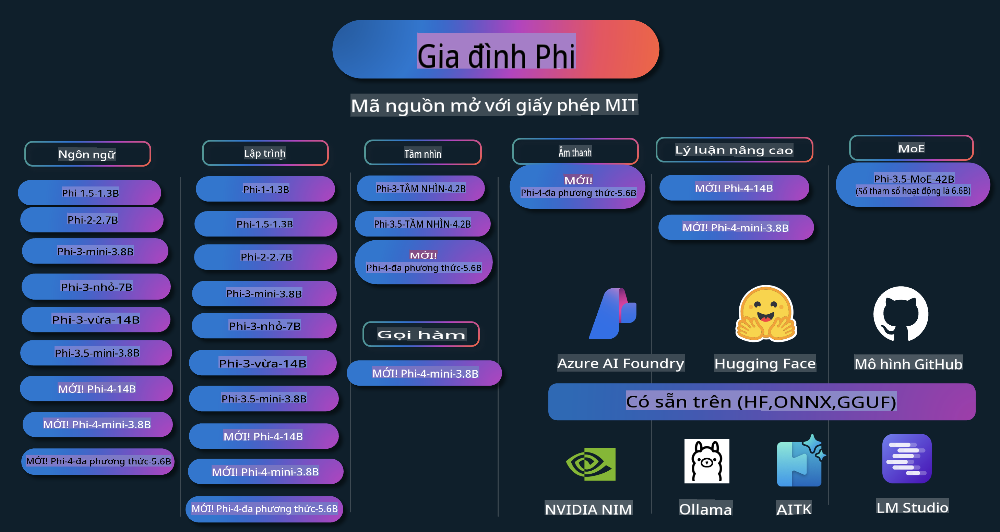

# Sách Hướng Dẫn Phi: Ví Dụ Thực Tế với Các Mô Hình Phi của Microsoft

  

  
  
  

  
  

Phi là một loạt các mô hình AI mã nguồn mở được phát triển bởi Microsoft.

Hiện tại, Phi là mô hình ngôn ngữ nhỏ (SLM) mạnh mẽ và tiết kiệm chi phí nhất, đạt kết quả rất tốt trong nhiều ngôn ngữ, lý luận, tạo văn bản/chat, mã hóa, hình ảnh, âm thanh và các kịch bản khác.

Bạn có thể triển khai Phi trên đám mây hoặc các thiết bị biên, và dễ dàng xây dựng các ứng dụng AI tạo sinh với sức mạnh tính toán hạn chế.

Hãy làm theo các bước sau để bắt đầu sử dụng các tài nguyên này:  
1. **Fork kho lưu trữ**: Nhấn vào   
2. **Clone kho lưu trữ**: `git clone https://github.com/microsoft/PhiCookBook.git`  
3. [**Tham gia cộng đồng Microsoft AI Discord và gặp gỡ các chuyên gia cũng như nhà phát triển khác**](https://discord.com/invite/ByRwuEEgH4?WT.mc_id=aiml-137032-kinfeylo)

## Mục Lục

- Giới thiệu
  - [Chào mừng đến với Gia Đình Phi](./md/01.Introduction/01/01.PhiFamily.md)
  - [Cài đặt môi trường của bạn](./md/01.Introduction/01/01.EnvironmentSetup.md)
  - [Hiểu các công nghệ chính](./md/01.Introduction/01/01.Understandingtech.md)
  - [An toàn AI cho các mô hình Phi](./md/01.Introduction/01/01.AISafety.md)
  - [Hỗ trợ phần cứng cho Phi](./md/01.Introduction/01/01.Hardwaresupport.md)
  - [Mô hình Phi & Khả năng sử dụng trên các nền tảng](./md/01.Introduction/01/01.Edgeandcloud.md)
  - [Sử dụng Guidance-ai và Phi](./md/01.Introduction/01/01.Guidance.md)
  - [Các mô hình trên GitHub Marketplace](https://github.com/marketplace/models)
  - [Danh mục Mô hình Azure AI](https://ai.azure.com)

- Suy luận Phi trong các môi trường khác nhau
    - [Hugging face](./md/01.Introduction/02/01.HF.md)
    - [Các mô hình GitHub](./md/01.Introduction/02/02.GitHubModel.md)
    - [Danh mục Mô hình Azure AI Foundry](./md/01.Introduction/02/03.AzureAIFoundry.md)
    - [Ollama](./md/01.Introduction/02/04.Ollama.md)
    - [AI Toolkit VSCode (AITK)](./md/01.Introduction/02/05.AITK.md)
    - [NVIDIA NIM](./md/01.Introduction/02/06.NVIDIA.md)

- Suy luận Gia Đình Phi
    - [Suy luận Phi trên iOS](./md/01.Introduction/03/iOS_Inference.md)
    - [Suy luận Phi trên Android](./md/01.Introduction/03/Android_Inference.md)
- [Inference Phi trên Jetson](./md/01.Introduction/03/Jetson_Inference.md)
    - [Inference Phi trên AI PC](./md/01.Introduction/03/AIPC_Inference.md)
    - [Inference Phi với Apple MLX Framework](./md/01.Introduction/03/MLX_Inference.md)
    - [Inference Phi trên máy chủ cục bộ](./md/01.Introduction/03/Local_Server_Inference.md)
    - [Inference Phi trên máy chủ từ xa sử dụng AI Toolkit](./md/01.Introduction/03/Remote_Interence.md)
    - [Inference Phi với Rust](./md/01.Introduction/03/Rust_Inference.md)
    - [Inference Phi--Vision trên cục bộ](./md/01.Introduction/03/Vision_Inference.md)
    - [Inference Phi với Kaito AKS, Azure Containers (hỗ trợ chính thức)](./md/01.Introduction/03/Kaito_Inference.md)
- [Định lượng Phi Family](./md/01.Introduction/04/QuantifyingPhi.md)
    - [Định lượng Phi-3.5 / 4 bằng llama.cpp](./md/01.Introduction/04/UsingLlamacppQuantifyingPhi.md)
    - [Định lượng Phi-3.5 / 4 bằng Generative AI extensions cho onnxruntime](./md/01.Introduction/04/UsingORTGenAIQuantifyingPhi.md)
    - [Định lượng Phi-3.5 / 4 bằng Intel OpenVINO](./md/01.Introduction/04/UsingIntelOpenVINOQuantifyingPhi.md)
    - [Định lượng Phi-3.5 / 4 bằng Apple MLX Framework](./md/01.Introduction/04/UsingAppleMLXQuantifyingPhi.md)

- Đánh giá Phi
    - [AI Trách nhiệm](./md/01.Introduction/05/ResponsibleAI.md)
    - [Azure AI Foundry để đánh giá](./md/01.Introduction/05/AIFoundry.md)
    - [Sử dụng Promptflow để đánh giá](./md/01.Introduction/05/Promptflow.md)
 
- RAG với Azure AI Search
    - [Cách sử dụng Phi-4-mini và Phi-4-multimodal (RAG) với Azure AI Search](https://github.com/microsoft/PhiCookBook/blob/main/code/06.E2E/E2E_Phi-4-RAG-Azure-AI-Search.ipynb)

- Các mẫu phát triển ứng dụng Phi
  - Ứng dụng văn bản & trò chuyện
    - Các mẫu Phi-4 🆕
      - [📓] [Trò chuyện với mô hình Phi-4-mini ONNX](./md/02.Application/01.TextAndChat/Phi4/ChatWithPhi4ONNX/README.md)
      - [Trò chuyện với mô hình Phi-4 ONNX cục bộ bằng .NET](../../md/04.HOL/dotnet/src/LabsPhi4-Chat-01OnnxRuntime)
      - [Ứng dụng console .NET trò chuyện với Phi-4 ONNX sử dụng Semantic Kernel](../../md/04.HOL/dotnet/src/LabsPhi4-Chat-02SK)
    - Các mẫu Phi-3 / 3.5
      - [Chatbot cục bộ trong trình duyệt sử dụng Phi-3, ONNX Runtime Web và WebGPU](https://github.com/microsoft/onnxruntime-inference-examples/tree/main/js/chat)
      - [OpenVino Chat](./md/02.Application/01.TextAndChat/Phi3/E2E_OpenVino_Chat.md)
      - [Mô hình đa năng - Tương tác giữa Phi-3-mini và OpenAI Whisper](./md/02.Application/01.TextAndChat/Phi3/E2E_Phi-3-mini_with_whisper.md)
      - [MLFlow - Xây dựng wrapper và sử dụng Phi-3 với MLFlow](./md//02.Application/01.TextAndChat/Phi3/E2E_Phi-3-MLflow.md)
      - [Tối ưu hóa mô hình - Cách tối ưu hóa mô hình Phi-3-mini cho ONNX Runtime Web với Olive](https://github.com/microsoft/Olive/tree/main/examples/phi3)
      - [Ứng dụng WinUI3 với Phi-3 mini-4k-instruct-onnx](https://github.com/microsoft/Phi3-Chat-WinUI3-Sample/)
      - [Ứng dụng ghi chú AI đa mô hình mẫu trên WinUI3](https://github.com/microsoft/ai-powered-notes-winui3-sample)
      - [Tinh chỉnh và tích hợp mô hình Phi-3 tùy chỉnh với Prompt flow](./md/02.Application/01.TextAndChat/Phi3/E2E_Phi-3-FineTuning_PromptFlow_Integration.md)
      - [Tinh chỉnh và tích hợp mô hình Phi-3 tùy chỉnh với Prompt flow trong Azure AI Foundry](./md/02.Application/01.TextAndChat/Phi3/E2E_Phi-3-FineTuning_PromptFlow_Integration_AIFoundry.md)
      - [Đánh giá mô hình Phi-3 / Phi-3.5 đã tinh chỉnh trong Azure AI Foundry tập trung vào các nguyên tắc AI Trách nhiệm của Microsoft](./md/02.Application/01.TextAndChat/Phi3/E2E_Phi-3-Evaluation_AIFoundry.md)
- [📓] [Mẫu dự đoán ngôn ngữ Phi-3.5-mini-instruct (Trung/Anh)](../../md/02.Application/01.TextAndChat/Phi3/phi3-instruct-demo.ipynb)
      - [Phi-3.5-Instruct WebGPU RAG Chatbot](./md/02.Application/01.TextAndChat/Phi3/WebGPUWithPhi35Readme.md)
      - [Sử dụng GPU Windows để tạo giải pháp Prompt flow với Phi-3.5-Instruct ONNX](./md/02.Application/01.TextAndChat/Phi3/UsingPromptFlowWithONNX.md)
      - [Sử dụng Microsoft Phi-3.5 tflite để tạo ứng dụng Android](./md/02.Application/01.TextAndChat/Phi3/UsingPhi35TFLiteCreateAndroidApp.md)
      - [Ví dụ Hỏi & Đáp .NET sử dụng mô hình ONNX Phi-3 cục bộ với Microsoft.ML.OnnxRuntime](../../md/04.HOL/dotnet/src/LabsPhi301)
      - [Ứng dụng chat console .NET với Semantic Kernel và Phi-3](../../md/04.HOL/dotnet/src/LabsPhi302)

  - Mẫu mã SDK Azure AI Inference
    - Mẫu Phi-4 🆕
      - [📓] [Tạo mã dự án bằng Phi-4-multimodal](./md/02.Application/02.Code/Phi4/GenProjectCode/README.md)
    - Mẫu Phi-3 / 3.5
      - [Tự tạo Visual Studio Code GitHub Copilot Chat với Microsoft Phi-3 Family](./md/02.Application/02.Code/Phi3/VSCodeExt/README.md)
      - [Tạo Visual Studio Code Chat Copilot Agent của riêng bạn với Phi-3.5 bằng GitHub Models](/md/02.Application/02.Code/Phi3/CreateVSCodeChatAgentWithGitHubModels.md)

  - Mẫu suy luận nâng cao
    - Mẫu Phi-4 🆕
      - [📓] [Mẫu Suy luận Phi-4-mini](./md/02.Application/03.AdvancedReasoning/Phi4/AdvancedResoningPhi4mini/README.md)
  
  - Demo
      - [Demo Phi-4-mini được lưu trữ trên Hugging Face Spaces](https://huggingface.co/spaces/microsoft/phi-4-mini?WT.mc_id=aiml-137032-kinfeylo)
      - [Demo Phi-4-multimodal được lưu trữ trên Hugging Face Spaces](https://huggingface.co/spaces/microsoft/phi-4-multimodal?WT.mc_id=aiml-137032-kinfeylo)
  - Mẫu Vision
    - Mẫu Phi-4 🆕
      - [📓] [Sử dụng Phi-4-multimodal để đọc hình ảnh và tạo mã](./md/02.Application/04.Vision/Phi4/CreateFrontend/README.md) 
    - Mẫu Phi-3 / 3.5
      -  [📓][Phi-3-vision-Image text to text](../../md/02.Application/04.Vision/Phi3/E2E_Phi-3-vision-image-text-to-text-online-endpoint.ipynb)
      - [Phi-3-vision-ONNX](https://onnxruntime.ai/docs/genai/tutorials/phi3-v.html)
      - [📓][Phi-3-vision CLIP Embedding](../../md/02.Application/04.Vision/Phi3/E2E_Phi-3-vision-image-text-to-text-online-endpoint.ipynb)
      - [DEMO: Phi-3 Tái chế](https://github.com/jennifermarsman/PhiRecycling/)
      - [Phi-3-vision - Trợ lý ngôn ngữ trực quan - với Phi3-Vision và OpenVINO](https://docs.openvino.ai/nightly/notebooks/phi-3-vision-with-output.html)
      - [Phi-3 Vision Nvidia NIM](./md/02.Application/04.Vision/Phi3/E2E_Nvidia_NIM_Vision.md)
      - [Phi-3 Vision OpenVino](./md/02.Application/04.Vision/Phi3/E2E_OpenVino_Phi3Vision.md)
      - [📓][Mẫu đa khung hình hoặc đa hình ảnh Phi-3.5 Vision](../../md/02.Application/04.Vision/Phi3/phi3-vision-demo.ipynb)
      - [Phi-3 Vision Mô hình ONNX cục bộ sử dụng Microsoft.ML.OnnxRuntime .NET](../../md/04.HOL/dotnet/src/LabsPhi303)
      - [Menu dựa trên Mô hình ONNX cục bộ Phi-3 Vision sử dụng Microsoft.ML.OnnxRuntime .NET](../../md/04.HOL/dotnet/src/LabsPhi304)

  - Mẫu âm thanh
    - Mẫu Phi-4 🆕
      - [📓] [Trích xuất bản chép âm thanh bằng Phi-4-multimodal](./md/02.Application/05.Audio/Phi4/Transciption/README.md)
      - [📓] [Mẫu âm thanh Phi-4-multimodal](../../md/02.Application/05.Audio/Phi4/Siri/demo.ipynb)
      - [📓] [Mẫu dịch giọng nói Phi-4-multimodal](../../md/02.Application/05.Audio/Phi4/Translate/demo.ipynb)
      - [Ứng dụng console .NET sử dụng Phi-4-multimodal để phân tích tệp âm thanh và tạo bản chép](../../md/04.HOL/dotnet/src/LabsPhi4-MultiModal-02Audio)

  - Mẫu MOE
    - Mẫu Phi-3 / 3.5
      - [📓] [Mẫu mạng xã hội Mô hình MoE Phi-3.5](../../md/02.Application/06.MoE/Phi3/phi3_moe_demo.ipynb)
      - [📓] [Xây dựng Pipeline RAG (Retrieval-Augmented Generation) với NVIDIA NIM Phi-3 MOE, Azure AI Search và LlamaIndex](../../md/02.Application/06.MoE/Phi3/azure-ai-search-nvidia-rag.ipynb)
  - Mẫu gọi hàm
    - Mẫu Phi-4 🆕
      -  [📓] [Sử dụng Function Calling Với Phi-4-mini](./md/02.Application/07.FunctionCalling/Phi4/FunctionCallingBasic/README.md)
  - Mẫu trộn đa phương thức
    - Mẫu Phi-4 🆕
-  [📓] [Sử dụng Phi-4-multimodal như một nhà báo công nghệ](../../md/02.Application/08.Multimodel/Phi4/TechJournalist/phi_4_mm_audio_text_publish_news.ipynb)  
      - [Ứng dụng .NET console sử dụng Phi-4-multimodal để phân tích hình ảnh](../../md/04.HOL/dotnet/src/LabsPhi4-MultiModal-01Images)

- Tinh chỉnh các mẫu Phi  
  - [Các kịch bản tinh chỉnh](./md/03.FineTuning/FineTuning_Scenarios.md)  
  - [So sánh giữa Tinh chỉnh và RAG](./md/03.FineTuning/FineTuning_vs_RAG.md)  
  - [Tinh chỉnh để Phi-3 trở thành chuyên gia trong ngành](./md/03.FineTuning/LetPhi3gotoIndustriy.md)  
  - [Tinh chỉnh Phi-3 với AI Toolkit trong VS Code](./md/03.FineTuning/Finetuning_VSCodeaitoolkit.md)  
  - [Tinh chỉnh Phi-3 với Azure Machine Learning Service](./md/03.FineTuning/Introduce_AzureML.md)  
  - [Tinh chỉnh Phi-3 với Lora](./md/03.FineTuning/FineTuning_Lora.md)  
  - [Tinh chỉnh Phi-3 với QLora](./md/03.FineTuning/FineTuning_Qlora.md)  
  - [Tinh chỉnh Phi-3 với Azure AI Foundry](./md/03.FineTuning/FineTuning_AIFoundry.md)  
  - [Tinh chỉnh Phi-3 với Azure ML CLI/SDK](./md/03.FineTuning/FineTuning_MLSDK.md)  
  - [Tinh chỉnh với Microsoft Olive](./md/03.FineTuning/FineTuning_MicrosoftOlive.md)  
  - [Thực hành tinh chỉnh với Microsoft Olive](./md/03.FineTuning/olive-lab/readme.md)  
  - [Tinh chỉnh Phi-3-vision với Weights and Bias](./md/03.FineTuning/FineTuning_Phi-3-visionWandB.md)  
  - [Tinh chỉnh Phi-3 với Apple MLX Framework](./md/03.FineTuning/FineTuning_MLX.md)  
  - [Tinh chỉnh Phi-3-vision (hỗ trợ chính thức)](./md/03.FineTuning/FineTuning_Vision.md)  
  - [Tinh chỉnh Phi-3 với Kaito AKS, Azure Containers (hỗ trợ chính thức)](./md/03.FineTuning/FineTuning_Kaito.md)  
  - [Tinh chỉnh Phi-3 và 3.5 Vision](https://github.com/2U1/Phi3-Vision-Finetune)  

- Thực hành  
  - [Khám phá các mô hình tiên tiến: LLMs, SLMs, phát triển cục bộ và hơn thế nữa](https://github.com/microsoft/aitour-exploring-cutting-edge-models)  
  - [Mở khóa tiềm năng NLP: Tinh chỉnh với Microsoft Olive](https://github.com/azure/Ignite_FineTuning_workshop)  

- Các bài nghiên cứu và ấn phẩm học thuật  
  - [Textbooks Are All You Need II: báo cáo kỹ thuật phi-1.5](https://arxiv.org/abs/2309.05463)  
  - [Báo cáo kỹ thuật Phi-3: Một mô hình ngôn ngữ mạnh mẽ chạy cục bộ trên điện thoại của bạn](https://arxiv.org/abs/2404.14219)  
  - [Báo cáo kỹ thuật Phi-4](https://arxiv.org/abs/2412.08905)  
  - [Tối ưu hóa các mô hình ngôn ngữ nhỏ cho việc gọi hàm trong xe](https://arxiv.org/abs/2501.02342)  
  - [(WhyPHI) Tinh chỉnh PHI-3 cho trả lời câu hỏi trắc nghiệm: Phương pháp, kết quả và thách thức](https://arxiv.org/abs/2501.01588)  

## Sử dụng các mô hình Phi  

### Phi trên Azure AI Foundry  

Bạn có thể tìm hiểu cách sử dụng Microsoft Phi và xây dựng các giải pháp E2E trên các thiết bị phần cứng khác nhau của mình. Để trải nghiệm Phi, hãy bắt đầu bằng cách thử nghiệm các mô hình và tùy chỉnh Phi theo các kịch bản của bạn bằng [Azure AI Foundry Azure AI Model Catalog](https://aka.ms/phi3-azure-ai). Bạn có thể tìm hiểu thêm tại phần Bắt đầu với [Azure AI Foundry](/md/02.QuickStart/AzureAIFoundry_QuickStart.md).  

**Playground**  
Mỗi mô hình đều có một playground riêng để thử nghiệm: [Azure AI Playground](https://aka.ms/try-phi3).  

### Phi trên GitHub Models  

Bạn có thể tìm hiểu cách sử dụng Microsoft Phi và xây dựng các giải pháp E2E trên các thiết bị phần cứng khác nhau của mình. Để trải nghiệm Phi, hãy bắt đầu bằng cách thử nghiệm mô hình và tùy chỉnh Phi theo các kịch bản của bạn bằng [GitHub Model Catalog](https://github.com/marketplace/models?WT.mc_id=aiml-137032-kinfeylo). Bạn có thể tìm hiểu thêm tại phần Bắt đầu với [GitHub Model Catalog](/md/02.QuickStart/GitHubModel_QuickStart.md).  

**Playground**  
Mỗi mô hình đều có một [playground để kiểm tra mô hình](/md/02.QuickStart/GitHubModel_QuickStart.md).

### Phi trên Hugging Face

Bạn cũng có thể tìm thấy mô hình này trên [Hugging Face](https://huggingface.co/microsoft)

**Playground**  
 [Hugging Chat playground](https://huggingface.co/chat/models/microsoft/Phi-3-mini-4k-instruct)

## AI có trách nhiệm

Microsoft cam kết hỗ trợ khách hàng sử dụng các sản phẩm AI của chúng tôi một cách có trách nhiệm, chia sẻ những bài học kinh nghiệm và xây dựng mối quan hệ đối tác dựa trên sự tin tưởng thông qua các công cụ như Ghi chú Minh bạch và Đánh giá Tác động. Nhiều tài nguyên này có thể được tìm thấy tại [https://aka.ms/RAI](https://aka.ms/RAI).  
Cách tiếp cận của Microsoft đối với AI có trách nhiệm được dựa trên các nguyên tắc AI của chúng tôi, bao gồm công bằng, đáng tin cậy và an toàn, quyền riêng tư và bảo mật, tính bao trùm, minh bạch, và trách nhiệm.

Các mô hình ngôn ngữ tự nhiên, hình ảnh và giọng nói quy mô lớn - như những mô hình được sử dụng trong ví dụ này - có thể hành xử theo cách không công bằng, không đáng tin cậy, hoặc gây xúc phạm, dẫn đến những tác hại. Vui lòng tham khảo [Ghi chú minh bạch của dịch vụ Azure OpenAI](https://learn.microsoft.com/legal/cognitive-services/openai/transparency-note?tabs=text) để hiểu rõ về các rủi ro và hạn chế.

Cách tiếp cận được khuyến nghị để giảm thiểu những rủi ro này là tích hợp một hệ thống an toàn trong kiến trúc của bạn, có khả năng phát hiện và ngăn chặn hành vi gây hại. [Azure AI Content Safety](https://learn.microsoft.com/azure/ai-services/content-safety/overview) cung cấp một lớp bảo vệ độc lập, có khả năng phát hiện nội dung gây hại do người dùng hoặc AI tạo ra trong các ứng dụng và dịch vụ. Azure AI Content Safety bao gồm các API văn bản và hình ảnh cho phép bạn phát hiện tài liệu có tính chất gây hại. Trong Azure AI Foundry, dịch vụ Content Safety cho phép bạn xem, khám phá và thử nghiệm mã mẫu để phát hiện nội dung gây hại trên các loại dữ liệu khác nhau. [Tài liệu hướng dẫn nhanh](https://learn.microsoft.com/azure/ai-services/content-safety/quickstart-text?tabs=visual-studio%2Clinux&pivots=programming-language-rest) sau đây sẽ hướng dẫn bạn cách gửi yêu cầu đến dịch vụ này.

Một khía cạnh khác cần cân nhắc là hiệu suất tổng thể của ứng dụng. Với các ứng dụng đa mô hình và đa phương thức, hiệu suất được hiểu là hệ thống hoạt động như bạn và người dùng mong đợi, bao gồm việc không tạo ra các đầu ra có hại. Điều quan trọng là đánh giá hiệu suất của ứng dụng tổng thể bằng cách sử dụng [các bộ đánh giá Hiệu suất và Chất lượng cũng như Rủi ro và An toàn](https://learn.microsoft.com/azure/ai-studio/concepts/evaluation-metrics-built-in). Bạn cũng có thể tạo và đánh giá với [các bộ đánh giá tùy chỉnh](https://learn.microsoft.com/azure/ai-studio/how-to/develop/evaluate-sdk#custom-evaluators).

Bạn có thể đánh giá ứng dụng AI của mình trong môi trường phát triển bằng cách sử dụng [Azure AI Evaluation SDK](https://microsoft.github.io/promptflow/index.html). Với tập dữ liệu kiểm tra hoặc mục tiêu, các đầu ra từ ứng dụng AI tạo sinh của bạn sẽ được đo lường định lượng bằng các bộ đánh giá tích hợp hoặc tùy chỉnh theo lựa chọn của bạn. Để bắt đầu với Azure AI Evaluation SDK để đánh giá hệ thống của bạn, bạn có thể tham khảo [hướng dẫn nhanh](https://learn.microsoft.com/azure/ai-studio/how-to/develop/flow-evaluate-sdk). Sau khi thực hiện một lần chạy đánh giá, bạn có thể [hình dung kết quả trong Azure AI Foundry](https://learn.microsoft.com/azure/ai-studio/how-to/evaluate-flow-results).

## Thương hiệu

Dự án này có thể chứa các thương hiệu hoặc logo cho các dự án, sản phẩm, hoặc dịch vụ. Việc sử dụng hợp pháp các thương hiệu hoặc logo của Microsoft phải tuân thủ và phù hợp với [Hướng dẫn về Thương hiệu & Nhãn hiệu của Microsoft](https://www.microsoft.com/legal/intellectualproperty/trademarks/usage/general).  
Việc sử dụng thương hiệu hoặc logo của Microsoft trong các phiên bản đã chỉnh sửa của dự án này không được gây nhầm lẫn hoặc ngụ ý rằng Microsoft tài trợ cho dự án. Bất kỳ việc sử dụng thương hiệu hoặc logo của bên thứ ba nào đều phải tuân theo chính sách của bên thứ ba đó.

**Tuyên bố miễn trừ trách nhiệm**:  
Tài liệu này đã được dịch bằng các dịch vụ dịch thuật AI tự động. Mặc dù chúng tôi cố gắng đảm bảo độ chính xác, xin lưu ý rằng các bản dịch tự động có thể chứa lỗi hoặc không chính xác. Tài liệu gốc bằng ngôn ngữ ban đầu nên được coi là nguồn thông tin chính thức. Đối với các thông tin quan trọng, chúng tôi khuyến nghị sử dụng dịch thuật chuyên nghiệp từ con người. Chúng tôi không chịu trách nhiệm cho bất kỳ sự hiểu lầm hoặc diễn giải sai nào phát sinh từ việc sử dụng bản dịch này.