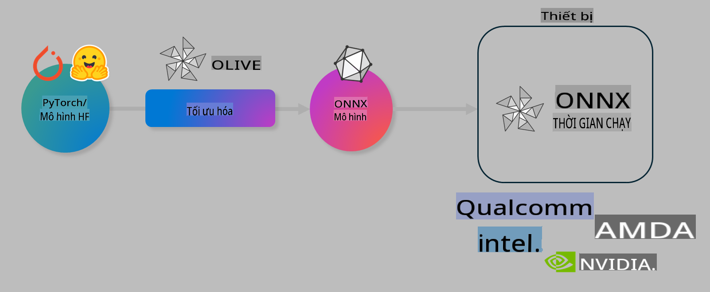

# Lab. Tối ưu hóa mô hình AI cho suy luận trên thiết bị

## Giới thiệu

> [!IMPORTANT]
> Phòng thí nghiệm này yêu cầu một **GPU Nvidia A10 hoặc A100** cùng với các driver và bộ công cụ CUDA (phiên bản 12+).

> [!NOTE]
> Đây là một phòng thí nghiệm kéo dài **35 phút** giúp bạn thực hành các khái niệm cốt lõi về tối ưu hóa mô hình cho suy luận trên thiết bị bằng cách sử dụng OLIVE.

## Mục tiêu học tập

Sau khi hoàn thành phòng thí nghiệm này, bạn sẽ có thể sử dụng OLIVE để:

- Lượng tử hóa một mô hình AI bằng phương pháp lượng tử hóa AWQ.
- Tinh chỉnh một mô hình AI cho một nhiệm vụ cụ thể.
- Tạo các bộ điều hợp LoRA (mô hình tinh chỉnh) để suy luận hiệu quả trên thiết bị với ONNX Runtime.

### Olive là gì

Olive (*O*NNX *live*) là một bộ công cụ tối ưu hóa mô hình kèm theo CLI, cho phép bạn triển khai các mô hình cho ONNX runtime +++https://onnxruntime.ai+++ với chất lượng và hiệu suất cao.



Đầu vào của Olive thường là một mô hình PyTorch hoặc Hugging Face, và đầu ra là một mô hình ONNX đã được tối ưu hóa để thực thi trên thiết bị (mục tiêu triển khai) chạy ONNX runtime. Olive sẽ tối ưu hóa mô hình cho bộ tăng tốc AI (NPU, GPU, CPU) của thiết bị được cung cấp bởi các nhà cung cấp phần cứng như Qualcomm, AMD, Nvidia hoặc Intel.

Olive thực hiện một *workflow*, là một chuỗi sắp xếp các tác vụ tối ưu hóa mô hình riêng lẻ được gọi là *passes* - các ví dụ về passes bao gồm: nén mô hình, ghi lại đồ thị, lượng tử hóa, tối ưu hóa đồ thị. Mỗi pass có một tập hợp các tham số có thể được điều chỉnh để đạt được các chỉ số tốt nhất, ví dụ như độ chính xác và độ trễ, được đánh giá bởi bộ đánh giá tương ứng. Olive sử dụng một chiến lược tìm kiếm với thuật toán tìm kiếm để tự động điều chỉnh từng pass một hoặc một nhóm các passes cùng lúc.

#### Lợi ích của Olive

- **Giảm bớt sự phức tạp và thời gian** thử nghiệm thủ công với các kỹ thuật tối ưu hóa đồ thị, nén và lượng tử hóa khác nhau. Xác định các ràng buộc về chất lượng và hiệu suất của bạn, và để Olive tự động tìm ra mô hình tốt nhất cho bạn.
- **Hơn 40 thành phần tối ưu hóa mô hình tích hợp sẵn** với các kỹ thuật tiên tiến trong lượng tử hóa, nén, tối ưu hóa đồ thị và tinh chỉnh.
- **CLI dễ sử dụng** cho các tác vụ tối ưu hóa mô hình phổ biến. Ví dụ: olive quantize, olive auto-opt, olive finetune.
- Tích hợp sẵn gói mô hình và triển khai.
- Hỗ trợ tạo mô hình cho **Multi LoRA serving**.
- Xây dựng workflows bằng YAML/JSON để điều phối các tác vụ tối ưu hóa và triển khai mô hình.
- Tích hợp **Hugging Face** và **Azure AI**.
- Cơ chế **caching** tích hợp để **tiết kiệm chi phí**.

## Hướng dẫn phòng thí nghiệm

> [!NOTE]
> Hãy đảm bảo bạn đã thiết lập Azure AI Hub và Dự án của mình, cũng như cấu hình A100 compute theo Phòng thí nghiệm 1.

### Bước 0: Kết nối với Azure AI Compute

Bạn sẽ kết nối với Azure AI compute bằng tính năng remote trong **VS Code.**

1. Mở ứng dụng **VS Code** trên máy tính của bạn:
1. Mở **command palette** bằng cách nhấn **Shift+Ctrl+P**.
1. Trong command palette, tìm kiếm **AzureML - remote: Connect to compute instance in New Window**.
1. Làm theo hướng dẫn trên màn hình để kết nối với Compute. Điều này bao gồm việc chọn Azure Subscription, Resource Group, Project và Compute name mà bạn đã thiết lập trong Phòng thí nghiệm 1.
1. Khi đã kết nối với Azure ML Compute node, trạng thái kết nối sẽ hiển thị ở **góc dưới bên trái của Visual Code** `><Azure ML: Compute Name`.

### Bước 1: Clone repo này

Trong VS Code, bạn có thể mở một terminal mới bằng **Ctrl+J** và clone repo này:

Trong terminal, bạn sẽ thấy prompt:

```
azureuser@computername:~/cloudfiles/code$ 
```
Clone giải pháp:

```bash
cd ~/localfiles
git clone https://github.com/microsoft/phi-3cookbook.git
```

### Bước 2: Mở thư mục trong VS Code

Để mở VS Code trong thư mục liên quan, hãy thực hiện lệnh sau trong terminal, lệnh này sẽ mở một cửa sổ mới:

```bash
code phi-3cookbook/code/04.Finetuning/Olive-lab
```

Ngoài ra, bạn có thể mở thư mục bằng cách chọn **File** > **Open Folder**.

### Bước 3: Cài đặt các phụ thuộc

Mở cửa sổ terminal trong VS Code trên Azure AI Compute Instance của bạn (mẹo: **Ctrl+J**) và thực hiện các lệnh sau để cài đặt các phụ thuộc:

```bash
conda create -n olive-ai python=3.11 -y
conda activate olive-ai
pip install -r requirements.txt
az extension remove -n azure-cli-ml
az extension add -n ml
```

> [!NOTE]
> Việc cài đặt tất cả các phụ thuộc sẽ mất khoảng ~5 phút.

Trong phòng thí nghiệm này, bạn sẽ tải xuống và tải lên các mô hình vào Azure AI Model catalog. Để có thể truy cập catalog, bạn cần đăng nhập vào Azure bằng:

```bash
az login
```

> [!NOTE]
> Khi đăng nhập, bạn sẽ được yêu cầu chọn subscription. Hãy đảm bảo chọn subscription được cung cấp cho phòng thí nghiệm này.

### Bước 4: Thực thi các lệnh Olive

Mở cửa sổ terminal trong VS Code trên Azure AI Compute Instance của bạn (mẹo: **Ctrl+J**) và đảm bảo môi trường `olive-ai` conda đã được kích hoạt:

```bash
conda activate olive-ai
```

Tiếp theo, thực thi các lệnh Olive sau trong dòng lệnh.

1. **Kiểm tra dữ liệu:** Trong ví dụ này, bạn sẽ tinh chỉnh mô hình Phi-3.5-Mini để nó chuyên trả lời các câu hỏi liên quan đến du lịch. Mã bên dưới hiển thị một vài bản ghi đầu tiên của tập dữ liệu, được định dạng dưới dạng JSON lines:

    ```bash
    head data/data_sample_travel.jsonl
    ```
1. **Lượng tử hóa mô hình:** Trước khi huấn luyện mô hình, bạn cần lượng tử hóa bằng lệnh sau, sử dụng một kỹ thuật gọi là Active Aware Quantization (AWQ) +++https://arxiv.org/abs/2306.00978+++. AWQ lượng tử hóa trọng số của mô hình bằng cách xem xét các kích hoạt được tạo ra trong quá trình suy luận. Điều này có nghĩa là quá trình lượng tử hóa sẽ xem xét phân phối dữ liệu thực tế trong các kích hoạt, giúp bảo toàn độ chính xác của mô hình tốt hơn so với các phương pháp lượng tử hóa trọng số truyền thống.

    ```bash
    olive quantize \
       --model_name_or_path microsoft/Phi-3.5-mini-instruct \
       --trust_remote_code \
       --algorithm awq \
       --output_path models/phi/awq \
       --log_level 1
    ```
    
    Quá trình lượng tử hóa AWQ mất khoảng **~8 phút** và sẽ **giảm kích thước mô hình từ ~7.5GB xuống ~2.5GB**.
   
   Trong phòng thí nghiệm này, chúng tôi sẽ chỉ cho bạn cách nhập mô hình từ Hugging Face (ví dụ: `microsoft/Phi-3.5-mini-instruct`). However, Olive also allows you to input models from the Azure AI catalog by updating the `model_name_or_path` argument to an Azure AI asset ID (for example:  `azureml://registries/azureml/models/Phi-3.5-mini-instruct/versions/4`). 

1. **Train the model:** Next, the `olive finetune` lệnh này sẽ tinh chỉnh mô hình đã lượng tử hóa. Lượng tử hóa mô hình *trước khi* tinh chỉnh thay vì sau đó sẽ mang lại độ chính xác tốt hơn vì quá trình tinh chỉnh sẽ khôi phục một số mất mát từ lượng tử hóa.

    ```bash
    olive finetune \
        --method lora \
        --model_name_or_path models/phi/awq \
        --data_files "data/data_sample_travel.jsonl" \
        --data_name "json" \
        --text_template "<|user|>\n{prompt}<|end|>\n<|assistant|>\n{response}<|end|>" \
        --max_steps 100 \
        --output_path ./models/phi/ft \
        --log_level 1
    ```
    
    Quá trình tinh chỉnh (với 100 bước) mất khoảng **~6 phút**.

1. **Tối ưu hóa:** Với mô hình đã được huấn luyện, bây giờ bạn sẽ tối ưu hóa mô hình bằng lệnh `auto-opt` command, which will capture the ONNX graph and automatically perform a number of optimizations to improve the model performance for CPU by compressing the model and doing fusions. It should be noted, that you can also optimize for other devices such as NPU or GPU by just updating the `--device` and `--provider` của Olive - nhưng trong phòng thí nghiệm này, chúng tôi sẽ sử dụng CPU.

    ```bash
    olive auto-opt \
       --model_name_or_path models/phi/ft/model \
       --adapter_path models/phi/ft/adapter \
       --device cpu \
       --provider CPUExecutionProvider \
       --use_ort_genai \
       --output_path models/phi/onnx-ao \
       --log_level 1
    ```
    
    Quá trình tối ưu hóa mất khoảng **~5 phút**.

### Bước 5: Kiểm tra nhanh suy luận mô hình

Để kiểm tra suy luận mô hình, hãy tạo một file Python trong thư mục của bạn có tên **app.py** và sao chép-dán đoạn mã sau:

```python
import onnxruntime_genai as og
import numpy as np

print("loading model and adapters...", end="", flush=True)
model = og.Model("models/phi/onnx-ao/model")
adapters = og.Adapters(model)
adapters.load("models/phi/onnx-ao/model/adapter_weights.onnx_adapter", "travel")
print("DONE!")

tokenizer = og.Tokenizer(model)
tokenizer_stream = tokenizer.create_stream()

params = og.GeneratorParams(model)
params.set_search_options(max_length=100, past_present_share_buffer=False)
user_input = "what is the best thing to see in chicago"
params.input_ids = tokenizer.encode(f"<|user|>\n{user_input}<|end|>\n<|assistant|>\n")

generator = og.Generator(model, params)

generator.set_active_adapter(adapters, "travel")

print(f"{user_input}")

while not generator.is_done():
    generator.compute_logits()
    generator.generate_next_token()

    new_token = generator.get_next_tokens()[0]
    print(tokenizer_stream.decode(new_token), end='', flush=True)

print("\n")
```

Thực thi mã bằng lệnh:

```bash
python app.py
```

### Bước 6: Tải lên mô hình vào Azure AI

Tải lên mô hình vào kho lưu trữ mô hình Azure AI giúp chia sẻ mô hình với các thành viên khác trong nhóm phát triển của bạn và quản lý phiên bản của mô hình. Để tải lên mô hình, chạy lệnh sau:

> [!NOTE]
> Cập nhật `{}` placeholders with the name of your resource group and Azure AI Project Name. 

To find your resource group `"resourceGroup"và tên Dự án Azure AI, chạy lệnh sau:

```
az ml workspace show
```

Hoặc truy cập +++ai.azure.com+++ và chọn **management center** **project** **overview**.

Cập nhật các `{}` với tên resource group và tên Dự án Azure AI của bạn.

```bash
az ml model create \
    --name ft-for-travel \
    --version 1 \
    --path ./models/phi/onnx-ao \
    --resource-group {RESOURCE_GROUP_NAME} \
    --workspace-name {PROJECT_NAME}
```
Bạn sau đó có thể xem mô hình đã tải lên và triển khai mô hình của mình tại https://ml.azure.com/model/list.

**Tuyên bố miễn trừ trách nhiệm**:  
Tài liệu này đã được dịch bằng các dịch vụ dịch thuật AI tự động. Mặc dù chúng tôi cố gắng đảm bảo độ chính xác, xin lưu ý rằng các bản dịch tự động có thể chứa lỗi hoặc sai sót. Tài liệu gốc bằng ngôn ngữ ban đầu nên được coi là nguồn thông tin chính thức. Đối với thông tin quan trọng, nên sử dụng dịch thuật chuyên nghiệp bởi con người. Chúng tôi không chịu trách nhiệm cho bất kỳ sự hiểu lầm hoặc diễn giải sai nào phát sinh từ việc sử dụng bản dịch này.