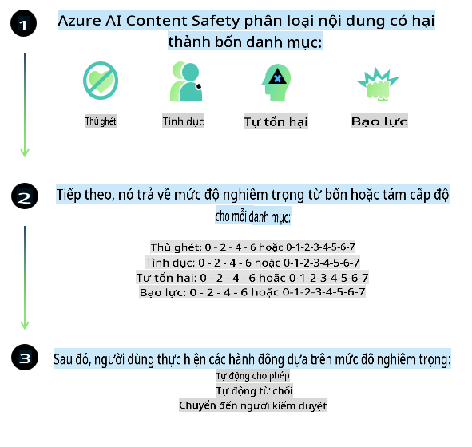
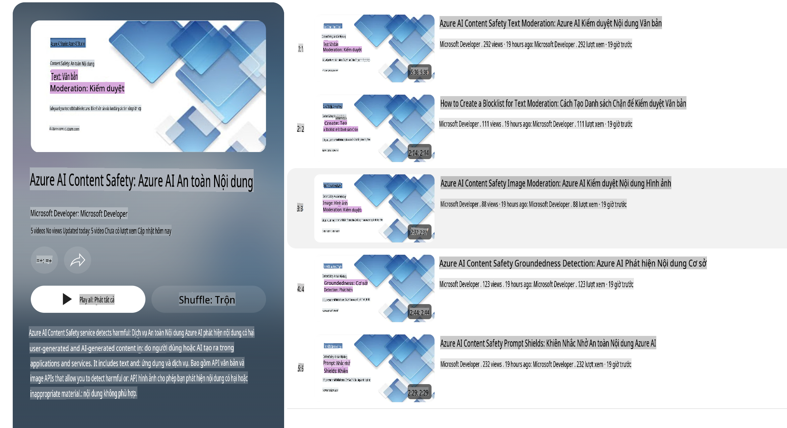

# An toàn AI cho các mô hình Phi

Dòng mô hình Phi được phát triển theo [Tiêu chuẩn AI Có Trách Nhiệm của Microsoft](https://query.prod.cms.rt.microsoft.com/cms/api/am/binary/RE5cmFl), một bộ yêu cầu áp dụng toàn công ty dựa trên sáu nguyên tắc sau: trách nhiệm giải trình, minh bạch, công bằng, độ tin cậy và an toàn, quyền riêng tư và bảo mật, và tính bao trùm, tạo thành [Nguyên tắc AI Có Trách Nhiệm của Microsoft](https://www.microsoft.com/ai/responsible-ai).  

Giống như các mô hình Phi trước đó, một phương pháp đánh giá an toàn đa chiều và đào tạo hậu an toàn đã được áp dụng, với các biện pháp bổ sung để tính đến khả năng đa ngôn ngữ của phiên bản này. Phương pháp của chúng tôi về đào tạo và đánh giá an toàn, bao gồm thử nghiệm trên nhiều ngôn ngữ và danh mục rủi ro, được nêu trong [Bài báo Hậu An Toàn Phi](https://arxiv.org/abs/2407.13833). Mặc dù các mô hình Phi được hưởng lợi từ phương pháp này, các nhà phát triển nên áp dụng các thực hành tốt nhất về AI có trách nhiệm, bao gồm lập bản đồ, đo lường và giảm thiểu rủi ro liên quan đến trường hợp sử dụng cụ thể cũng như bối cảnh văn hóa và ngôn ngữ.

## Thực hành tốt nhất

Giống như các mô hình khác, dòng mô hình Phi có thể hoạt động theo những cách không công bằng, không đáng tin cậy hoặc gây khó chịu.

Một số hành vi hạn chế của SLM và LLM mà bạn cần lưu ý bao gồm:

- **Chất lượng dịch vụ:** Các mô hình Phi chủ yếu được đào tạo trên văn bản tiếng Anh. Các ngôn ngữ khác ngoài tiếng Anh sẽ có hiệu suất kém hơn. Các biến thể tiếng Anh ít được đại diện trong dữ liệu đào tạo có thể có hiệu suất kém hơn so với tiếng Anh Mỹ tiêu chuẩn.
- **Đại diện gây hại & Duy trì định kiến:** Các mô hình này có thể đại diện quá mức hoặc thiếu đại diện cho các nhóm người, xóa bỏ sự hiện diện của một số nhóm, hoặc củng cố các định kiến tiêu cực hoặc hạ thấp. Dù đã qua đào tạo hậu an toàn, các hạn chế này vẫn có thể tồn tại do mức độ đại diện khác nhau của các nhóm hoặc do sự phổ biến của các ví dụ về định kiến tiêu cực trong dữ liệu đào tạo, phản ánh các khuôn mẫu thực tế và thiên kiến xã hội.
- **Nội dung không phù hợp hoặc xúc phạm:** Các mô hình này có thể tạo ra các loại nội dung không phù hợp hoặc xúc phạm khác, khiến chúng không phù hợp để triển khai trong các ngữ cảnh nhạy cảm mà không có các biện pháp giảm thiểu bổ sung phù hợp với trường hợp sử dụng cụ thể.  
  **Độ tin cậy thông tin:** Các mô hình ngôn ngữ có thể tạo ra nội dung vô nghĩa hoặc bịa đặt nội dung nghe có vẻ hợp lý nhưng không chính xác hoặc đã lỗi thời.
- **Phạm vi hạn chế cho mã lập trình:** Phần lớn dữ liệu đào tạo của Phi-3 dựa trên Python và sử dụng các gói phổ biến như "typing, math, random, collections, datetime, itertools". Nếu mô hình tạo ra các script Python sử dụng các gói khác hoặc script bằng các ngôn ngữ khác, chúng tôi khuyến nghị mạnh mẽ rằng người dùng nên kiểm tra thủ công tất cả các API được sử dụng.

Các nhà phát triển nên áp dụng các thực hành tốt nhất về AI có trách nhiệm và chịu trách nhiệm đảm bảo rằng trường hợp sử dụng cụ thể tuân thủ các luật và quy định liên quan (ví dụ: quyền riêng tư, thương mại, v.v.).

## Cân nhắc về AI Có Trách Nhiệm

Giống như các mô hình ngôn ngữ khác, dòng mô hình Phi có thể hoạt động theo những cách không công bằng, không đáng tin cậy hoặc gây khó chịu. Một số hành vi hạn chế cần lưu ý bao gồm:

**Chất lượng dịch vụ:** Các mô hình Phi chủ yếu được đào tạo trên văn bản tiếng Anh. Các ngôn ngữ khác ngoài tiếng Anh sẽ có hiệu suất kém hơn. Các biến thể tiếng Anh ít được đại diện trong dữ liệu đào tạo có thể có hiệu suất kém hơn so với tiếng Anh Mỹ tiêu chuẩn.

**Đại diện gây hại & Duy trì định kiến:** Các mô hình này có thể đại diện quá mức hoặc thiếu đại diện cho các nhóm người, xóa bỏ sự hiện diện của một số nhóm, hoặc củng cố các định kiến tiêu cực hoặc hạ thấp. Dù đã qua đào tạo hậu an toàn, các hạn chế này vẫn có thể tồn tại do mức độ đại diện khác nhau của các nhóm hoặc do sự phổ biến của các ví dụ về định kiến tiêu cực trong dữ liệu đào tạo, phản ánh các khuôn mẫu thực tế và thiên kiến xã hội.

**Nội dung không phù hợp hoặc xúc phạm:** Các mô hình này có thể tạo ra các loại nội dung không phù hợp hoặc xúc phạm khác, khiến chúng không phù hợp để triển khai trong các ngữ cảnh nhạy cảm mà không có các biện pháp giảm thiểu bổ sung phù hợp với trường hợp sử dụng cụ thể.  
  **Độ tin cậy thông tin:** Các mô hình ngôn ngữ có thể tạo ra nội dung vô nghĩa hoặc bịa đặt nội dung nghe có vẻ hợp lý nhưng không chính xác hoặc đã lỗi thời.

**Phạm vi hạn chế cho mã lập trình:** Phần lớn dữ liệu đào tạo của Phi-3 dựa trên Python và sử dụng các gói phổ biến như "typing, math, random, collections, datetime, itertools". Nếu mô hình tạo ra các script Python sử dụng các gói khác hoặc script bằng các ngôn ngữ khác, chúng tôi khuyến nghị mạnh mẽ rằng người dùng nên kiểm tra thủ công tất cả các API được sử dụng.

Các nhà phát triển nên áp dụng các thực hành tốt nhất về AI có trách nhiệm và chịu trách nhiệm đảm bảo rằng trường hợp sử dụng cụ thể tuân thủ các luật và quy định liên quan (ví dụ: quyền riêng tư, thương mại, v.v.). Các lĩnh vực quan trọng cần xem xét bao gồm:

**Phân bổ:** Các mô hình có thể không phù hợp với các kịch bản có thể ảnh hưởng lớn đến tình trạng pháp lý hoặc phân bổ tài nguyên hay cơ hội sống (ví dụ: nhà ở, việc làm, tín dụng, v.v.) mà không có các đánh giá bổ sung và kỹ thuật giảm thiểu thiên kiến.

**Kịch bản rủi ro cao:** Các nhà phát triển nên đánh giá sự phù hợp của việc sử dụng mô hình trong các kịch bản rủi ro cao, nơi mà các đầu ra không công bằng, không đáng tin cậy hoặc gây khó chịu có thể cực kỳ tốn kém hoặc gây hại. Điều này bao gồm việc cung cấp lời khuyên trong các lĩnh vực nhạy cảm hoặc chuyên môn, nơi mà độ chính xác và độ tin cậy là rất quan trọng (ví dụ: tư vấn pháp lý hoặc y tế). Các biện pháp bảo vệ bổ sung nên được triển khai ở cấp độ ứng dụng tùy theo ngữ cảnh triển khai.

**Thông tin sai lệch:** Các mô hình có thể tạo ra thông tin không chính xác. Các nhà phát triển nên tuân thủ các thực hành tốt nhất về minh bạch và thông báo cho người dùng cuối rằng họ đang tương tác với một hệ thống AI. Ở cấp độ ứng dụng, các nhà phát triển có thể xây dựng các cơ chế phản hồi và đường dẫn để gắn kết các phản hồi với thông tin cụ thể, phù hợp với trường hợp sử dụng, một kỹ thuật được gọi là Retrieval Augmented Generation (RAG).

**Tạo nội dung có hại:** Các nhà phát triển nên đánh giá các đầu ra theo ngữ cảnh và sử dụng các bộ phân loại an toàn có sẵn hoặc các giải pháp tùy chỉnh phù hợp với trường hợp sử dụng của họ.

**Lạm dụng:** Các hình thức lạm dụng khác như gian lận, thư rác hoặc tạo phần mềm độc hại có thể xảy ra, và các nhà phát triển cần đảm bảo rằng ứng dụng của họ không vi phạm các luật và quy định hiện hành.

### Tinh chỉnh và An toàn Nội dung AI

Sau khi tinh chỉnh một mô hình, chúng tôi khuyến nghị mạnh mẽ việc sử dụng các biện pháp của [Azure AI Content Safety](https://learn.microsoft.com/azure/ai-services/content-safety/overview) để giám sát nội dung do mô hình tạo ra, nhận diện và chặn các rủi ro, mối đe dọa, và vấn đề chất lượng tiềm tàng.

[Azure AI Content Safety](https://learn.microsoft.com/azure/ai-services/content-safety/overview) hỗ trợ cả nội dung văn bản và hình ảnh. Nó có thể được triển khai trên đám mây, container không kết nối, và các thiết bị nhúng/biên.

## Tổng quan về Azure AI Content Safety

Azure AI Content Safety không phải là một giải pháp "một kích cỡ phù hợp cho tất cả"; nó có thể được tùy chỉnh để phù hợp với các chính sách cụ thể của doanh nghiệp. Ngoài ra, các mô hình đa ngôn ngữ của nó cho phép hiểu được nhiều ngôn ngữ cùng lúc.

- **Azure AI Content Safety**  
- **Microsoft Developer**  
- **5 videos**

Dịch vụ Azure AI Content Safety phát hiện nội dung do người dùng và AI tạo ra có thể gây hại trong các ứng dụng và dịch vụ. Nó bao gồm các API văn bản và hình ảnh cho phép bạn phát hiện nội dung gây hại hoặc không phù hợp.

[AI Content Safety Playlist](https://www.youtube.com/playlist?list=PLlrxD0HtieHjaQ9bJjyp1T7FeCbmVcPkQ)

**Tuyên bố miễn trừ trách nhiệm**:  
Tài liệu này đã được dịch bằng các dịch vụ dịch thuật AI tự động. Mặc dù chúng tôi cố gắng đảm bảo độ chính xác, xin lưu ý rằng các bản dịch tự động có thể chứa lỗi hoặc không chính xác. Tài liệu gốc bằng ngôn ngữ bản địa nên được coi là nguồn thông tin chính thức. Đối với các thông tin quan trọng, chúng tôi khuyến nghị sử dụng dịch vụ dịch thuật chuyên nghiệp của con người. Chúng tôi không chịu trách nhiệm về bất kỳ sự hiểu nhầm hoặc diễn giải sai nào phát sinh từ việc sử dụng bản dịch này.