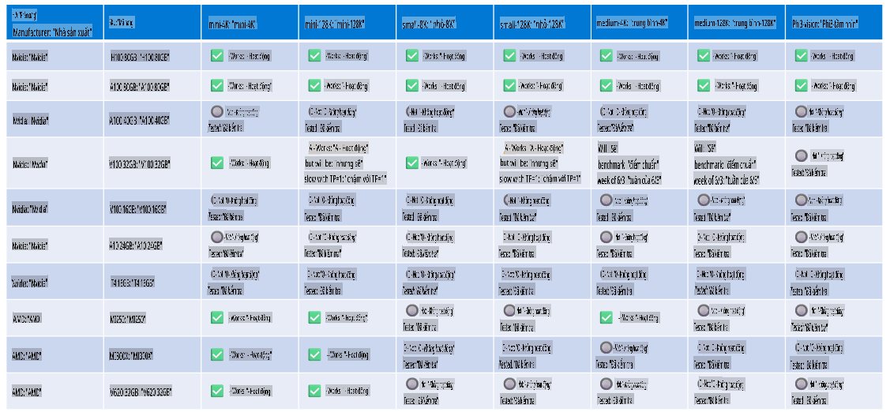

# Hỗ Trợ Phần Cứng Phi

Microsoft Phi đã được tối ưu hóa cho ONNX Runtime và hỗ trợ Windows DirectML. Nó hoạt động tốt trên nhiều loại phần cứng khác nhau, bao gồm GPU, CPU, và thậm chí cả thiết bị di động.

## Phần Cứng Thiết Bị
Cụ thể, các phần cứng được hỗ trợ bao gồm:

- GPU SKU: RTX 4090 (DirectML)
- GPU SKU: 1 A100 80GB (CUDA)
- CPU SKU: Standard F64s v2 (64 vCPUs, 128 GiB bộ nhớ)

## SKU Di Động

- Android - Samsung Galaxy S21
- Apple iPhone 14 hoặc cao hơn với Bộ xử lý A16/A17

## Thông Số Kỹ Thuật Phần Cứng Phi

- Cấu hình tối thiểu yêu cầu.
- Windows: GPU hỗ trợ DirectX 12 và tối thiểu 4GB RAM tổng hợp

CUDA: NVIDIA GPU với Compute Capability >= 7.02



## Chạy onnxruntime trên nhiều GPU

Hiện tại, các mô hình Phi ONNX có sẵn chỉ hỗ trợ 1 GPU. Có thể hỗ trợ đa GPU cho mô hình Phi, nhưng ORT với 2 GPU không đảm bảo sẽ mang lại thông lượng cao hơn so với việc chạy 2 phiên bản ORT. Vui lòng xem [ONNX Runtime](https://onnxruntime.ai/) để biết các cập nhật mới nhất.

Tại [Build 2024 nhóm GenAI ONNX](https://youtu.be/WLW4SE8M9i8?si=EtG04UwDvcjunyfC) đã công bố rằng họ đã kích hoạt chế độ đa phiên bản thay vì đa GPU cho các mô hình Phi.

Hiện tại, điều này cho phép bạn chạy một phiên bản onnxruntime hoặc onnxruntime-genai với biến môi trường CUDA_VISIBLE_DEVICES như sau.

```Python
CUDA_VISIBLE_DEVICES=0 python infer.py
CUDA_VISIBLE_DEVICES=1 python infer.py
```

Hãy khám phá thêm về Phi tại [Azure AI Foundry](https://ai.azure.com)

**Tuyên bố miễn trừ trách nhiệm**:  
Tài liệu này đã được dịch bằng các dịch vụ dịch thuật AI tự động. Mặc dù chúng tôi cố gắng đảm bảo độ chính xác, xin lưu ý rằng các bản dịch tự động có thể chứa lỗi hoặc sai sót. Tài liệu gốc bằng ngôn ngữ bản địa nên được coi là nguồn thông tin chính xác nhất. Đối với thông tin quan trọng, nên sử dụng dịch vụ dịch thuật chuyên nghiệp của con người. Chúng tôi không chịu trách nhiệm về bất kỳ sự hiểu lầm hoặc diễn giải sai nào phát sinh từ việc sử dụng bản dịch này.