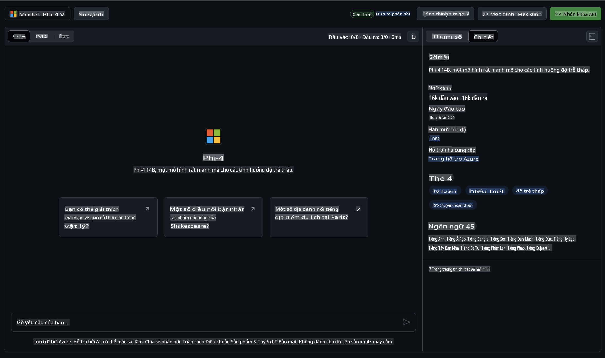

## Gia đình Phi trong GitHub Models

Chào mừng bạn đến với [GitHub Models](https://github.com/marketplace/models)! Mọi thứ đã sẵn sàng để bạn khám phá các mô hình AI được lưu trữ trên Azure AI.


Để biết thêm thông tin về các mô hình có sẵn trên GitHub Models, hãy xem [GitHub Model Marketplace](https://github.com/marketplace/models).

## Các mô hình có sẵn

Mỗi mô hình đều có playground riêng và mã mẫu 



### Gia đình Phi trong GitHub Model Catalog

- [Phi-4](https://github.com/marketplace/models/azureml/Phi-4)

- [Phi-3.5-MoE instruct (128k)](https://github.com/marketplace/models/azureml/Phi-3-5-MoE-instruct)

- [Phi-3.5-vision instruct (128k)](https://github.com/marketplace/models/azureml/Phi-3-5-vision-instruct)

- [Phi-3.5-mini instruct (128k)](https://github.com/marketplace/models/azureml/Phi-3-5-mini-instruct)

- [Phi-3-Medium-128k-Instruct](https://github.com/marketplace/models/azureml/Phi-3-medium-128k-instruct)

- [Phi-3-medium-4k-instruct](https://github.com/marketplace/models/azureml/Phi-3-medium-4k-instruct)

- [Phi-3-mini-128k-instruct](https://github.com/marketplace/models/azureml/Phi-3-mini-128k-instruct)

- [Phi-3-mini-4k-instruct](https://github.com/marketplace/models/azureml/Phi-3-mini-4k-instruct)

- [Phi-3-small-128k-instruct](https://github.com/marketplace/models/azureml/Phi-3-small-128k-instruct)

- [Phi-3-small-8k-instruct](https://github.com/marketplace/models/azureml/Phi-3-small-8k-instruct)

## Bắt đầu

Có một số ví dụ cơ bản sẵn sàng để bạn chạy. Bạn có thể tìm chúng trong thư mục mẫu. Nếu bạn muốn sử dụng ngay ngôn ngữ yêu thích của mình, các ví dụ có sẵn trong các ngôn ngữ sau:

- Python
- JavaScript
- C#
- Java
- cURL

Ngoài ra còn có một môi trường Codespaces chuyên dụng để chạy các mẫu và mô hình.


## Mã mẫu

Dưới đây là các đoạn mã mẫu cho một số trường hợp sử dụng. Để biết thêm thông tin về Azure AI Inference SDK, hãy xem tài liệu đầy đủ và các mẫu.

## Cài đặt

1. Tạo mã thông báo truy cập cá nhân  
Bạn không cần cấp bất kỳ quyền nào cho mã thông báo. Lưu ý rằng mã thông báo sẽ được gửi đến một dịch vụ của Microsoft.

Để sử dụng các đoạn mã dưới đây, hãy tạo một biến môi trường để đặt mã thông báo của bạn làm khóa cho mã khách hàng.

Nếu bạn sử dụng bash:  
```
export GITHUB_TOKEN="<your-github-token-goes-here>"
```  
Nếu bạn dùng powershell:  

```
$Env:GITHUB_TOKEN="<your-github-token-goes-here>"
```  

Nếu bạn dùng Windows command prompt:  

```
set GITHUB_TOKEN=<your-github-token-goes-here>
```  

## Ví dụ Python

### Cài đặt các phụ thuộc  
Cài đặt Azure AI Inference SDK bằng pip (Yêu cầu: Python >=3.8):  

```
pip install azure-ai-inference
```  

### Chạy một ví dụ cơ bản  

Ví dụ này minh họa một cuộc gọi cơ bản đến API hoàn thành hội thoại. Nó sử dụng điểm cuối suy luận mô hình AI GitHub và mã thông báo GitHub của bạn. Cuộc gọi này là đồng bộ.

```python
import os
from azure.ai.inference import ChatCompletionsClient
from azure.ai.inference.models import SystemMessage, UserMessage
from azure.core.credentials import AzureKeyCredential

endpoint = "https://models.inference.ai.azure.com"
model_name = "Phi-4"
token = os.environ["GITHUB_TOKEN"]

client = ChatCompletionsClient(
    endpoint=endpoint,
    credential=AzureKeyCredential(token),
)

response = client.complete(
    messages=[
        UserMessage(content="I have $20,000 in my savings account, where I receive a 4% profit per year and payments twice a year. Can you please tell me how long it will take for me to become a millionaire? Also, can you please explain the math step by step as if you were explaining it to an uneducated person?"),
    ],
    temperature=0.4,
    top_p=1.0,
    max_tokens=2048,
    model=model_name
)

print(response.choices[0].message.content)
```  

### Chạy một cuộc hội thoại nhiều lượt  

Ví dụ này minh họa một cuộc hội thoại nhiều lượt với API hoàn thành hội thoại. Khi sử dụng mô hình cho một ứng dụng chat, bạn cần quản lý lịch sử của cuộc hội thoại và gửi các tin nhắn mới nhất đến mô hình.

```
import os
from azure.ai.inference import ChatCompletionsClient
from azure.ai.inference.models import AssistantMessage, SystemMessage, UserMessage
from azure.core.credentials import AzureKeyCredential

token = os.environ["GITHUB_TOKEN"]
endpoint = "https://models.inference.ai.azure.com"
# Replace Model_Name
model_name = "Phi-4"

client = ChatCompletionsClient(
    endpoint=endpoint,
    credential=AzureKeyCredential(token),
)

messages = [
    SystemMessage(content="You are a helpful assistant."),
    UserMessage(content="What is the capital of France?"),
    AssistantMessage(content="The capital of France is Paris."),
    UserMessage(content="What about Spain?"),
]

response = client.complete(messages=messages, model=model_name)

print(response.choices[0].message.content)
```  

### Truyền tải đầu ra  

Để có trải nghiệm người dùng tốt hơn, bạn nên truyền tải phản hồi của mô hình để token đầu tiên xuất hiện sớm và tránh phải chờ đợi phản hồi dài.

```
import os
from azure.ai.inference import ChatCompletionsClient
from azure.ai.inference.models import SystemMessage, UserMessage
from azure.core.credentials import AzureKeyCredential

token = os.environ["GITHUB_TOKEN"]
endpoint = "https://models.inference.ai.azure.com"
# Replace Model_Name
model_name = "Phi-4"

client = ChatCompletionsClient(
    endpoint=endpoint,
    credential=AzureKeyCredential(token),
)

response = client.complete(
    stream=True,
    messages=[
        SystemMessage(content="You are a helpful assistant."),
        UserMessage(content="Give me 5 good reasons why I should exercise every day."),
    ],
    model=model_name,
)

for update in response:
    if update.choices:
        print(update.choices[0].delta.content or "", end="")

client.close()
```  

## Sử dụng MIỄN PHÍ và giới hạn tốc độ cho GitHub Models


[Giới hạn tốc độ cho playground và sử dụng API miễn phí](https://docs.github.com/en/github-models/prototyping-with-ai-models#rate-limits) nhằm giúp bạn thử nghiệm với các mô hình và tạo nguyên mẫu cho ứng dụng AI của bạn. Để sử dụng vượt quá các giới hạn đó và đưa ứng dụng của bạn lên quy mô lớn, bạn cần cung cấp tài nguyên từ tài khoản Azure và xác thực từ đó thay vì sử dụng mã thông báo truy cập cá nhân GitHub của bạn. Bạn không cần thay đổi bất cứ điều gì khác trong mã của mình. Sử dụng liên kết này để tìm hiểu cách vượt qua giới hạn tầng miễn phí trong Azure AI.

### Thông báo

Hãy nhớ rằng khi tương tác với một mô hình, bạn đang thử nghiệm với AI, vì vậy có thể xảy ra sai sót về nội dung.

Tính năng này chịu nhiều giới hạn khác nhau (bao gồm số yêu cầu mỗi phút, số yêu cầu mỗi ngày, số token mỗi yêu cầu và số yêu cầu đồng thời) và không được thiết kế cho các trường hợp sử dụng trong sản xuất.

GitHub Models sử dụng Azure AI Content Safety. Các bộ lọc này không thể tắt trong trải nghiệm GitHub Models. Nếu bạn quyết định sử dụng mô hình qua một dịch vụ trả phí, vui lòng cấu hình bộ lọc nội dung để đáp ứng yêu cầu của bạn.

Dịch vụ này tuân theo Điều khoản Phát hành Trước của GitHub.  

**Tuyên bố từ chối trách nhiệm**:  
Tài liệu này đã được dịch bằng các dịch vụ dịch thuật AI tự động. Mặc dù chúng tôi cố gắng đảm bảo độ chính xác, xin lưu ý rằng các bản dịch tự động có thể chứa lỗi hoặc không chính xác. Tài liệu gốc bằng ngôn ngữ ban đầu nên được coi là nguồn thông tin chính thức. Đối với các thông tin quan trọng, nên sử dụng dịch thuật chuyên nghiệp từ con người. Chúng tôi không chịu trách nhiệm cho bất kỳ sự hiểu lầm hoặc diễn giải sai nào phát sinh từ việc sử dụng bản dịch này.