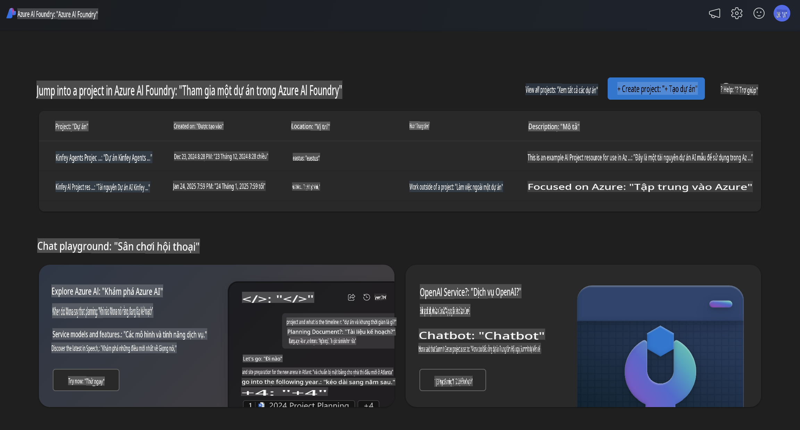
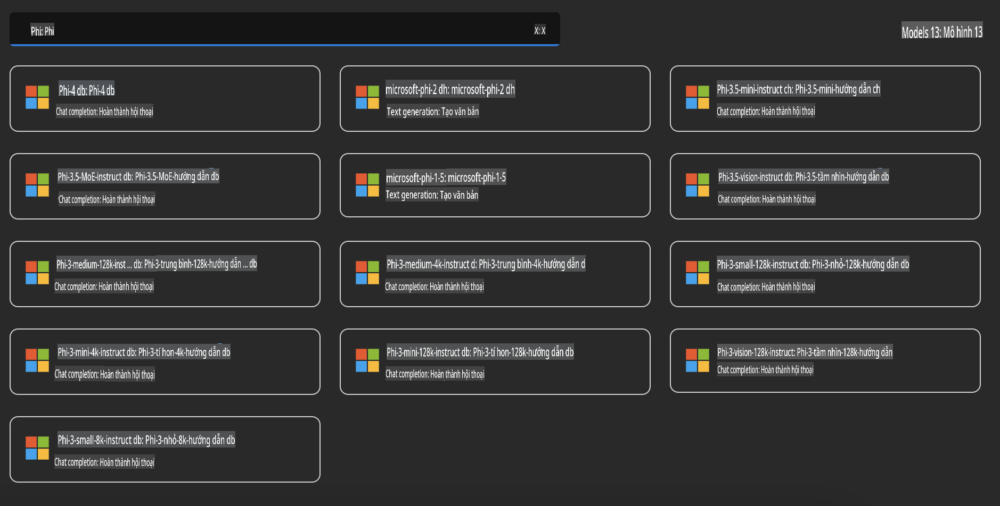
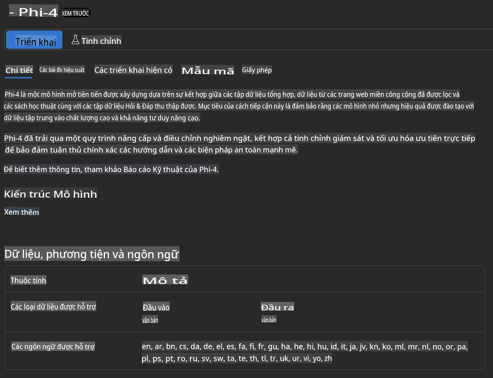
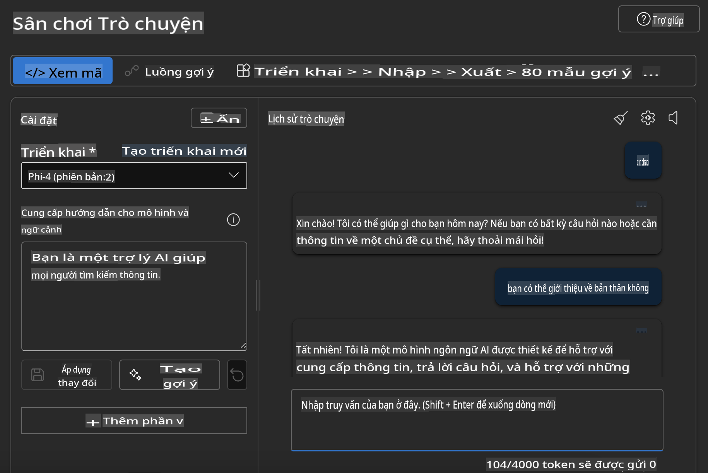

## Gia đình Phi trong Azure AI Foundry

[Azure AI Foundry](https://ai.azure.com) là một nền tảng đáng tin cậy giúp các nhà phát triển thúc đẩy đổi mới và định hình tương lai với AI một cách an toàn, bảo mật và có trách nhiệm.

[Azure AI Foundry](https://ai.azure.com) được thiết kế để các nhà phát triển có thể:

- Xây dựng các ứng dụng AI tạo sinh trên một nền tảng đạt chuẩn doanh nghiệp.
- Khám phá, xây dựng, kiểm thử và triển khai bằng các công cụ AI tiên tiến và mô hình ML, dựa trên các nguyên tắc AI có trách nhiệm.
- Hợp tác với nhóm trong toàn bộ vòng đời phát triển ứng dụng.

Với Azure AI Foundry, bạn có thể khám phá nhiều mô hình, dịch vụ và khả năng khác nhau, và bắt đầu xây dựng các ứng dụng AI phù hợp nhất với mục tiêu của bạn. Nền tảng Azure AI Foundry hỗ trợ khả năng mở rộng để chuyển đổi từ các nguyên mẫu thử nghiệm thành các ứng dụng sản xuất hoàn chỉnh một cách dễ dàng. Việc giám sát và tinh chỉnh liên tục đảm bảo thành công lâu dài.



Ngoài việc sử dụng Azure AOAI Service trong Azure AI Foundry, bạn cũng có thể sử dụng các mô hình của bên thứ ba trong Azure AI Foundry Model Catalog. Đây là một lựa chọn tốt nếu bạn muốn sử dụng Azure AI Foundry làm nền tảng giải pháp AI của mình.

Chúng ta có thể nhanh chóng triển khai các mô hình thuộc Gia đình Phi thông qua Model Catalog trong Azure AI Foundry.



### **Triển khai Phi-4 trong Azure AI Foundry**



### **Kiểm thử Phi-4 trong Azure AI Foundry Playground**



### **Chạy mã Python để gọi Azure AI Foundry Phi-4**

```python

import os  
import base64
from openai import AzureOpenAI  
from azure.identity import DefaultAzureCredential, get_bearer_token_provider  
        
endpoint = os.getenv("ENDPOINT_URL", "Your Azure AOAI Service Endpoint")  
deployment = os.getenv("DEPLOYMENT_NAME", "Phi-4")  
      
token_provider = get_bearer_token_provider(  
    DefaultAzureCredential(),  
    "https://cognitiveservices.azure.com/.default"  
)  
  
client = AzureOpenAI(  
    azure_endpoint=endpoint,  
    azure_ad_token_provider=token_provider,  
    api_version="2024-05-01-preview",  
)  
  

chat_prompt = [
    {
        "role": "system",
        "content": "You are an AI assistant that helps people find information."
    },
    {
        "role": "user",
        "content": "can you introduce yourself"
    }
] 
    
# Include speech result if speech is enabled  
messages = chat_prompt 

completion = client.chat.completions.create(  
    model=deployment,  
    messages=messages,
    max_tokens=800,  
    temperature=0.7,  
    top_p=0.95,  
    frequency_penalty=0,  
    presence_penalty=0,
    stop=None,  
    stream=False  
)  
  
print(completion.to_json())  

```

**Tuyên bố miễn trừ trách nhiệm**:  
Tài liệu này đã được dịch bằng các dịch vụ dịch thuật AI tự động. Mặc dù chúng tôi cố gắng đảm bảo độ chính xác, xin lưu ý rằng các bản dịch tự động có thể chứa lỗi hoặc không chính xác. Tài liệu gốc bằng ngôn ngữ ban đầu nên được coi là nguồn thông tin chính thức. Đối với các thông tin quan trọng, chúng tôi khuyến nghị sử dụng dịch vụ dịch thuật chuyên nghiệp từ con người. Chúng tôi không chịu trách nhiệm về bất kỳ sự hiểu lầm hoặc diễn giải sai nào phát sinh từ việc sử dụng bản dịch này.