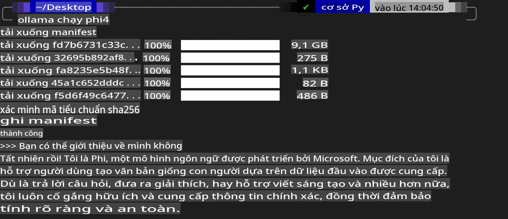
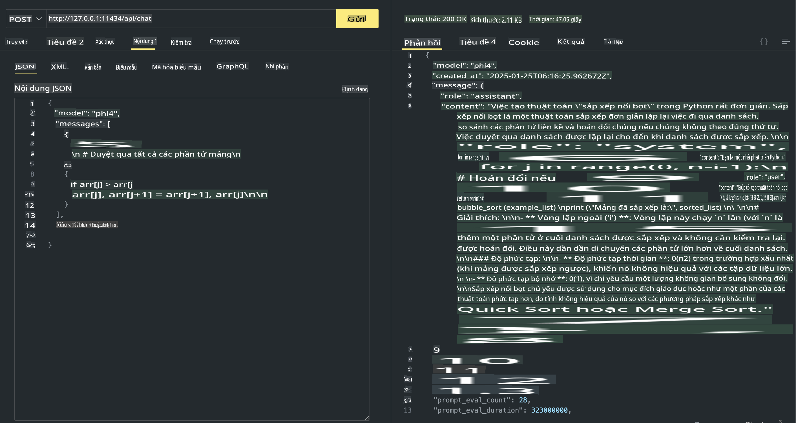

## Gia đình Phi trong Ollama

[Ollama](https://ollama.com) cho phép nhiều người triển khai trực tiếp các mô hình nguồn mở LLM hoặc SLM thông qua các script đơn giản, và cũng có thể xây dựng API để hỗ trợ các ứng dụng Copilot cục bộ.

## **1. Cài đặt**

Ollama hỗ trợ chạy trên Windows, macOS và Linux. Bạn có thể cài đặt Ollama qua liên kết này ([https://ollama.com/download](https://ollama.com/download)). Sau khi cài đặt thành công, bạn có thể sử dụng script Ollama để gọi Phi-3 trực tiếp từ cửa sổ terminal. Bạn có thể xem tất cả [thư viện có sẵn trên Ollama](https://ollama.com/library). Nếu bạn mở repository này trong Codespace, Ollama sẽ được cài đặt sẵn.

```bash

ollama run phi4

```

> [!NOTE]
> Mô hình sẽ được tải xuống lần đầu tiên khi bạn chạy. Tất nhiên, bạn cũng có thể chỉ định trực tiếp mô hình Phi-4 đã tải xuống. Chúng ta sẽ lấy WSL làm ví dụ để chạy lệnh. Sau khi mô hình được tải xuống thành công, bạn có thể tương tác trực tiếp trên terminal.



## **2. Gọi API phi-4 từ Ollama**

Nếu bạn muốn gọi API Phi-4 được tạo bởi Ollama, bạn có thể sử dụng lệnh này trong terminal để khởi động server Ollama.

```bash

ollama serve

```

> [!NOTE]
> Nếu đang chạy trên macOS hoặc Linux, hãy lưu ý rằng bạn có thể gặp lỗi sau **"Error: listen tcp 127.0.0.1:11434: bind: address already in use"**. Bạn có thể gặp lỗi này khi chạy lệnh. Bạn có thể bỏ qua lỗi đó, vì nó thường chỉ ra rằng server đã được khởi động, hoặc bạn có thể dừng và khởi động lại Ollama:

**macOS**

```bash

brew services restart ollama

```

**Linux**

```bash

sudo systemctl stop ollama

```

Ollama hỗ trợ hai API: generate và chat. Bạn có thể gọi API mô hình do Ollama cung cấp tùy theo nhu cầu của mình, bằng cách gửi yêu cầu đến dịch vụ cục bộ chạy trên cổng 11434.

**Chat**

```bash

curl http://127.0.0.1:11434/api/chat -d '{
  "model": "phi3",
  "messages": [
    {
      "role": "system",
      "content": "Your are a python developer."
    },
    {
      "role": "user",
      "content": "Help me generate a bubble algorithm"
    }
  ],
  "stream": false
  
}'

This is the result in Postman



## Additional Resources

Check the list of available models in Ollama in [their library](https://ollama.com/library).

Pull your model from the Ollama server using this command

```bash
ollama pull phi4
```

Run the model using this command

```bash
ollama run phi4
```

***Note:*** Visit this link [https://github.com/ollama/ollama/blob/main/docs/api.md](https://github.com/ollama/ollama/blob/main/docs/api.md) to learn more

## Calling Ollama from Python

You can use `requests` or `urllib3` to make requests to the local server endpoints used above. However, a popular way to use Ollama in Python is via the [openai](https://pypi.org/project/openai/) SDK, since Ollama provides OpenAI-compatible server endpoints as well.

Here is an example for phi3-mini:

```python
import openai

client = openai.OpenAI(
    base_url="http://localhost:11434/v1",
    api_key="nokeyneeded",
)

response = client.chat.completions.create(
    model="phi4",
    temperature=0.7,
    n=1,
    messages=[
        {"role": "system", "content": "Bạn là một trợ lý hữu ích."},
        {"role": "user", "content": "Hãy viết một bài haiku về một chú mèo đói"},
    ],
)

print("Phản hồi:")
print(response.choices[0].message.content)
```

## Calling Ollama from JavaScript 

```javascript
// Ví dụ tóm tắt một file với Phi-4
script({
    model: "ollama:phi4",
    title: "Tóm tắt với Phi-4",
    system: ["system"],
})

// Ví dụ tóm tắt
const file = def("FILE", env.files)
$`Tóm tắt ${file} trong một đoạn văn.`
```

## Calling Ollama from C#

Create a new C# Console application and add the following NuGet package:

```bash
dotnet add package Microsoft.SemanticKernel --version 1.34.0
```

Then replace this code in the `Program.cs` file

```csharp
using Microsoft.SemanticKernel;
using Microsoft.SemanticKernel.ChatCompletion;

// thêm dịch vụ hoàn thành chat sử dụng endpoint server ollama cục bộ
#pragma warning disable SKEXP0001, SKEXP0003, SKEXP0010, SKEXP0011, SKEXP0050, SKEXP0052
builder.AddOpenAIChatCompletion(
    modelId: "phi4",
    endpoint: new Uri("http://localhost:11434/"),
    apiKey: "non required");

// gọi một prompt đơn giản tới dịch vụ chat
string prompt = "Hãy viết một câu chuyện cười về mèo con";
var response = await kernel.InvokePromptAsync(prompt);
Console.WriteLine(response.GetValue<string>());
```

Run the app with the command:

```bash
dotnet run
```

**Tuyên bố từ chối trách nhiệm**:  
Tài liệu này đã được dịch bằng các dịch vụ dịch thuật AI tự động. Mặc dù chúng tôi cố gắng đảm bảo độ chính xác, xin lưu ý rằng các bản dịch tự động có thể chứa lỗi hoặc không chính xác. Tài liệu gốc bằng ngôn ngữ ban đầu nên được coi là nguồn thông tin chính thức. Đối với các thông tin quan trọng, nên sử dụng dịch vụ dịch thuật chuyên nghiệp từ con người. Chúng tôi không chịu trách nhiệm về bất kỳ sự hiểu lầm hoặc diễn giải sai nào phát sinh từ việc sử dụng bản dịch này.