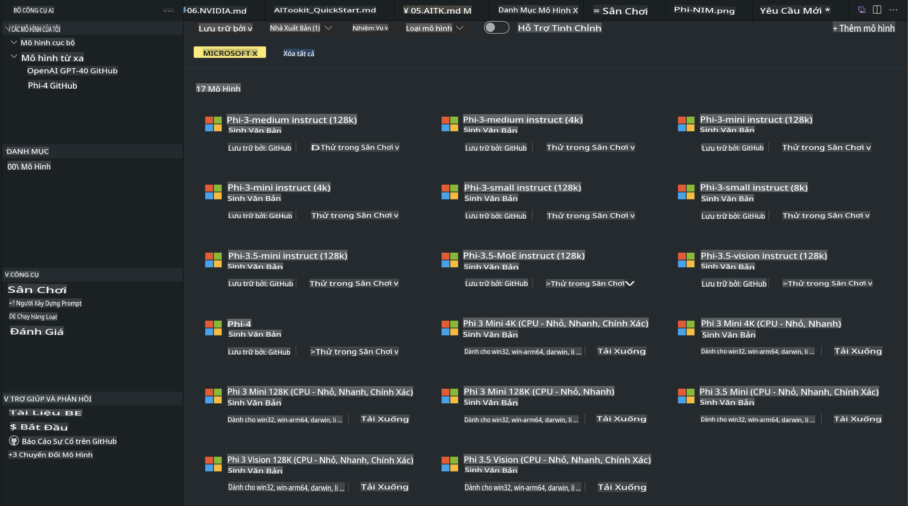
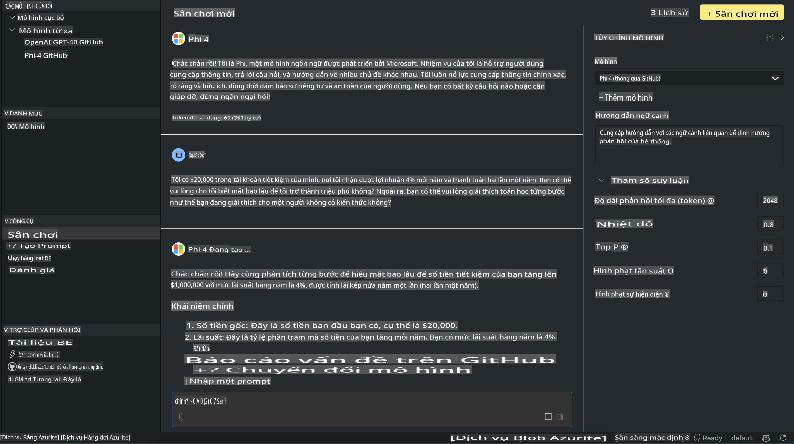

# Gia đình Phi trong AITK

[AI Toolkit for VS Code](https://marketplace.visualstudio.com/items?itemName=ms-windows-ai-studio.windows-ai-studio) đơn giản hóa việc phát triển ứng dụng AI tạo sinh bằng cách tích hợp các công cụ phát triển AI tiên tiến và các mô hình từ Azure AI Foundry Catalog cũng như các thư viện khác như Hugging Face. Bạn có thể duyệt thư viện mô hình AI được hỗ trợ bởi GitHub Models và Azure AI Foundry Model Catalogs, tải chúng xuống máy cục bộ hoặc từ xa, tinh chỉnh, kiểm tra và sử dụng chúng trong ứng dụng của bạn.

Phiên bản xem trước của AI Toolkit sẽ chạy cục bộ. Việc suy luận cục bộ hoặc tinh chỉnh sẽ phụ thuộc vào mô hình bạn chọn, và có thể bạn sẽ cần GPU như NVIDIA CUDA GPU. Bạn cũng có thể chạy trực tiếp các mô hình từ GitHub Models bằng AITK.

## Bắt đầu

[Tìm hiểu cách cài đặt Windows Subsystem for Linux](https://learn.microsoft.com/windows/wsl/install?WT.mc_id=aiml-137032-kinfeylo)

và [thay đổi bản phân phối mặc định](https://learn.microsoft.com/windows/wsl/install#change-the-default-linux-distribution-installed).

[Kho GitHub của AI Toolkit](https://github.com/microsoft/vscode-ai-toolkit/)

- Windows, Linux, macOS
  
- Để tinh chỉnh trên cả Windows và Linux, bạn sẽ cần GPU Nvidia. Ngoài ra, **Windows** yêu cầu Windows Subsystem for Linux với bản phân phối Ubuntu 18.4 hoặc cao hơn. [Tìm hiểu cách cài đặt Windows Subsystem for Linux](https://learn.microsoft.com/windows/wsl/install) và [thay đổi bản phân phối mặc định](https://learn.microsoft.com/windows/wsl/install#change-the-default-linux-distribution-installed).

### Cài đặt AI Toolkit

AI Toolkit được cung cấp dưới dạng [Visual Studio Code Extension](https://code.visualstudio.com/docs/setup/additional-components#_vs-code-extensions), vì vậy bạn cần cài đặt [VS Code](https://code.visualstudio.com/docs/setup/windows?WT.mc_id=aiml-137032-kinfeylo) trước, và tải xuống AI Toolkit từ [VS Marketplace](https://marketplace.visualstudio.com/items?itemName=ms-windows-ai-studio.windows-ai-studio).
[AI Toolkit có sẵn trên Visual Studio Marketplace](https://marketplace.visualstudio.com/items?itemName=ms-windows-ai-studio.windows-ai-studio) và có thể được cài đặt như bất kỳ tiện ích mở rộng VS Code nào khác.

Nếu bạn chưa quen với việc cài đặt tiện ích mở rộng VS Code, hãy làm theo các bước sau:

### Đăng nhập

1. Trong thanh hoạt động của VS Code, chọn **Extensions**
1. Trong thanh tìm kiếm tiện ích mở rộng, nhập "AI Toolkit"
1. Chọn "AI Toolkit for Visual Studio Code"
1. Chọn **Install**

Bây giờ, bạn đã sẵn sàng để sử dụng tiện ích mở rộng!

Bạn sẽ được nhắc đăng nhập vào GitHub, vì vậy vui lòng nhấp vào "Allow" để tiếp tục. Bạn sẽ được chuyển hướng đến trang đăng nhập GitHub.

Hãy đăng nhập và làm theo các bước hướng dẫn. Sau khi hoàn tất thành công, bạn sẽ được chuyển hướng trở lại VS Code.

Sau khi tiện ích mở rộng đã được cài đặt, bạn sẽ thấy biểu tượng AI Toolkit xuất hiện trong thanh hoạt động của bạn.

Hãy khám phá các hành động có sẵn!

### Các hành động có sẵn

Thanh bên chính của AI Toolkit được tổ chức thành  

- **Models**
- **Resources**
- **Playground**  
- **Fine-tuning**
- **Evaluation**

Các mục này có sẵn trong phần Resources. Để bắt đầu, chọn **Model Catalog**.

### Tải xuống một mô hình từ thư viện

Khi khởi chạy AI Toolkit từ thanh bên của VS Code, bạn có thể chọn từ các tùy chọn sau:



- Tìm một mô hình được hỗ trợ từ **Model Catalog** và tải xuống cục bộ
- Kiểm tra suy luận mô hình trong **Model Playground**
- Tinh chỉnh mô hình cục bộ hoặc từ xa trong **Model Fine-tuning**
- Triển khai các mô hình đã tinh chỉnh lên đám mây thông qua bảng lệnh của AI Toolkit
- Đánh giá các mô hình

> [!NOTE]
>
> **GPU Vs CPU**
>
> Bạn sẽ nhận thấy rằng các thẻ mô hình hiển thị kích thước mô hình, nền tảng và loại tăng tốc (CPU, GPU). Để có hiệu suất tối ưu trên **các thiết bị Windows có ít nhất một GPU**, hãy chọn các phiên bản mô hình chỉ nhắm mục tiêu Windows.
>
> Điều này đảm bảo bạn có một mô hình được tối ưu hóa cho bộ tăng tốc DirectML.
>
> Các tên mô hình có định dạng:
>
> - `{model_name}-{accelerator}-{quantization}-{format}`.
>
> Để kiểm tra xem bạn có GPU trên thiết bị Windows của mình không, mở **Task Manager** và sau đó chọn tab **Performance**. Nếu bạn có GPU, chúng sẽ được liệt kê với các tên như "GPU 0" hoặc "GPU 1".

### Chạy mô hình trong playground

Sau khi tất cả các tham số đã được đặt, nhấp vào **Generate Project**.

Khi mô hình của bạn đã được tải xuống, chọn **Load in Playground** trên thẻ mô hình trong thư viện:

- Bắt đầu tải xuống mô hình
- Cài đặt tất cả các điều kiện tiên quyết và phụ thuộc
- Tạo workspace trong VS Code



### Sử dụng REST API trong ứng dụng của bạn 

AI Toolkit đi kèm với một máy chủ web REST API cục bộ **trên cổng 5272** sử dụng định dạng [OpenAI chat completions](https://platform.openai.com/docs/api-reference/chat/create). 

Điều này cho phép bạn kiểm tra ứng dụng của mình cục bộ mà không cần dựa vào dịch vụ mô hình AI trên đám mây. Ví dụ, tệp JSON sau đây hiển thị cách cấu hình nội dung của yêu cầu:

```json
{
    "model": "Phi-4",
    "messages": [
        {
            "role": "user",
            "content": "what is the golden ratio?"
        }
    ],
    "temperature": 0.7,
    "top_p": 1,
    "top_k": 10,
    "max_tokens": 100,
    "stream": true
}
```

Bạn có thể kiểm tra REST API bằng (ví dụ) [Postman](https://www.postman.com/) hoặc tiện ích CURL (Client URL):

```bash
curl -vX POST http://127.0.0.1:5272/v1/chat/completions -H 'Content-Type: application/json' -d @body.json
```

### Sử dụng thư viện khách hàng OpenAI cho Python

```python
from openai import OpenAI

client = OpenAI(
    base_url="http://127.0.0.1:5272/v1/", 
    api_key="x" # required for the API but not used
)

chat_completion = client.chat.completions.create(
    messages=[
        {
            "role": "user",
            "content": "what is the golden ratio?",
        }
    ],
    model="Phi-4",
)

print(chat_completion.choices[0].message.content)
```

### Sử dụng thư viện khách hàng Azure OpenAI cho .NET

Thêm [Azure OpenAI client library for .NET](https://www.nuget.org/packages/Azure.AI.OpenAI/) vào dự án của bạn bằng NuGet:

```bash
dotnet add {project_name} package Azure.AI.OpenAI --version 1.0.0-beta.17
```

Thêm một tệp C# có tên **OverridePolicy.cs** vào dự án của bạn và dán đoạn mã sau:

```csharp
// OverridePolicy.cs
using Azure.Core.Pipeline;
using Azure.Core;

internal partial class OverrideRequestUriPolicy(Uri overrideUri)
    : HttpPipelineSynchronousPolicy
{
    private readonly Uri _overrideUri = overrideUri;

    public override void OnSendingRequest(HttpMessage message)
    {
        message.Request.Uri.Reset(_overrideUri);
    }
}
```

Tiếp theo, dán đoạn mã sau vào tệp **Program.cs** của bạn:

```csharp
// Program.cs
using Azure.AI.OpenAI;

Uri localhostUri = new("http://localhost:5272/v1/chat/completions");

OpenAIClientOptions clientOptions = new();
clientOptions.AddPolicy(
    new OverrideRequestUriPolicy(localhostUri),
    Azure.Core.HttpPipelinePosition.BeforeTransport);
OpenAIClient client = new(openAIApiKey: "unused", clientOptions);

ChatCompletionsOptions options = new()
{
    DeploymentName = "Phi-4",
    Messages =
    {
        new ChatRequestSystemMessage("You are a helpful assistant. Be brief and succinct."),
        new ChatRequestUserMessage("What is the golden ratio?"),
    }
};

StreamingResponse<StreamingChatCompletionsUpdate> streamingChatResponse
    = await client.GetChatCompletionsStreamingAsync(options);

await foreach (StreamingChatCompletionsUpdate chatChunk in streamingChatResponse)
{
    Console.Write(chatChunk.ContentUpdate);
}
```

## Tinh chỉnh với AI Toolkit

- Bắt đầu với khám phá mô hình và playground.
- Tinh chỉnh mô hình và suy luận bằng tài nguyên máy cục bộ.
- Tinh chỉnh từ xa và suy luận bằng tài nguyên Azure.

[Tinh chỉnh với AI Toolkit](../../03.FineTuning/Finetuning_VSCodeaitoolkit.md)

## Tài nguyên Q&A của AI Toolkit

Vui lòng tham khảo [trang Q&A của chúng tôi](https://github.com/microsoft/vscode-ai-toolkit/blob/main/archive/QA.md) để biết các vấn đề phổ biến và cách giải quyết.

**Tuyên bố miễn trừ trách nhiệm**:  
Tài liệu này đã được dịch bằng các dịch vụ dịch thuật AI dựa trên máy móc. Mặc dù chúng tôi cố gắng đảm bảo độ chính xác, xin lưu ý rằng các bản dịch tự động có thể chứa lỗi hoặc không chính xác. Tài liệu gốc bằng ngôn ngữ ban đầu nên được coi là nguồn thông tin chính thức. Đối với các thông tin quan trọng, khuyến nghị sử dụng dịch thuật chuyên nghiệp từ con người. Chúng tôi không chịu trách nhiệm về bất kỳ sự hiểu nhầm hoặc diễn giải sai nào phát sinh từ việc sử dụng bản dịch này.