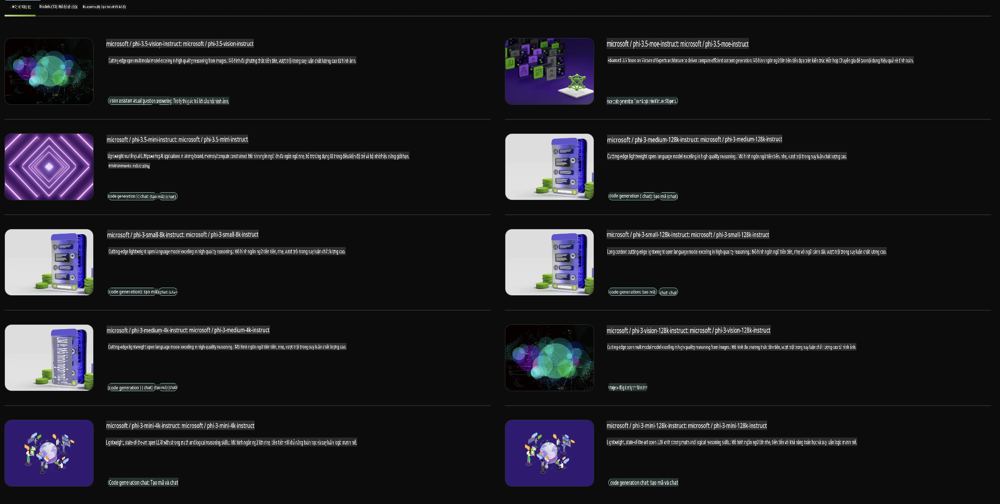

## Dòng họ Phi trong NVIDIA NIM

NVIDIA NIM là một tập hợp các dịch vụ vi mô dễ sử dụng, được thiết kế để tăng tốc triển khai các mô hình AI tạo sinh trên đám mây, trung tâm dữ liệu và máy trạm. NIM được phân loại theo dòng họ mô hình và từng mô hình cụ thể. Ví dụ, NVIDIA NIM dành cho các mô hình ngôn ngữ lớn (LLMs) mang sức mạnh của các LLM hiện đại nhất đến với các ứng dụng doanh nghiệp, cung cấp khả năng xử lý và hiểu ngôn ngữ tự nhiên vượt trội.

NIM giúp các nhóm IT và DevOps dễ dàng tự lưu trữ các mô hình ngôn ngữ lớn (LLMs) trong môi trường do họ quản lý, đồng thời vẫn cung cấp cho các nhà phát triển các API tiêu chuẩn ngành, cho phép họ xây dựng các trợ lý AI, chatbot và copilots mạnh mẽ có thể cách mạng hóa doanh nghiệp của họ. Tận dụng khả năng tăng tốc GPU tiên tiến và triển khai quy mô lớn của NVIDIA, NIM mang lại con đường nhanh nhất đến suy luận với hiệu suất không gì sánh bằng.

Bạn có thể sử dụng NVIDIA NIM để suy luận các mô hình thuộc dòng họ Phi.



### **Ví dụ - Phi-3-Vision trong NVIDIA NIM**

Hãy tưởng tượng bạn có một hình ảnh (`demo.png`) và bạn muốn tạo mã Python để xử lý hình ảnh này và lưu một phiên bản mới của nó (`phi-3-vision.jpg`).

Đoạn mã trên tự động hóa quy trình này bằng cách:

1. Thiết lập môi trường và các cấu hình cần thiết.
2. Tạo một prompt hướng dẫn mô hình tạo ra mã Python yêu cầu.
3. Gửi prompt đến mô hình và thu thập mã được tạo ra.
4. Trích xuất và chạy mã được tạo.
5. Hiển thị hình ảnh gốc và hình ảnh đã xử lý.

Cách tiếp cận này tận dụng sức mạnh của AI để tự động hóa các tác vụ xử lý hình ảnh, giúp bạn đạt được mục tiêu dễ dàng và nhanh chóng hơn.

[Giải pháp mã mẫu](../../../../../code/06.E2E/E2E_Nvidia_NIM_Phi3_Vision.ipynb)

Hãy cùng phân tích từng bước của toàn bộ đoạn mã:

1. **Cài đặt gói cần thiết**:
    ```python
    !pip install langchain_nvidia_ai_endpoints -U
    ```
    Lệnh này cài đặt gói `langchain_nvidia_ai_endpoints`, đảm bảo rằng đây là phiên bản mới nhất.

2. **Nhập các module cần thiết**:
    ```python
    from langchain_nvidia_ai_endpoints import ChatNVIDIA
    import getpass
    import os
    import base64
    ```
    Các lệnh nhập này đưa vào các module cần thiết để tương tác với các endpoint AI của NVIDIA, xử lý mật khẩu an toàn, tương tác với hệ điều hành và mã hóa/giải mã dữ liệu ở định dạng base64.

3. **Thiết lập API Key**:
    ```python
    if not os.getenv("NVIDIA_API_KEY"):
        os.environ["NVIDIA_API_KEY"] = getpass.getpass("Enter your NVIDIA API key: ")
    ```
    Đoạn mã này kiểm tra xem biến môi trường `NVIDIA_API_KEY` đã được thiết lập hay chưa. Nếu chưa, nó sẽ yêu cầu người dùng nhập API key một cách an toàn.

4. **Xác định mô hình và đường dẫn hình ảnh**:
    ```python
    model = 'microsoft/phi-3-vision-128k-instruct'
    chat = ChatNVIDIA(model=model)
    img_path = './imgs/demo.png'
    ```
    Đoạn mã này xác định mô hình sẽ được sử dụng, tạo một instance của `ChatNVIDIA` với mô hình được chỉ định, và định nghĩa đường dẫn đến tệp hình ảnh.

5. **Tạo prompt văn bản**:
    ```python
    text = "Please create Python code for image, and use plt to save the new picture under imgs/ and name it phi-3-vision.jpg."
    ```
    Đoạn mã này định nghĩa một prompt văn bản hướng dẫn mô hình tạo mã Python để xử lý hình ảnh.

6. **Mã hóa hình ảnh ở định dạng Base64**:
    ```python
    with open(img_path, "rb") as f:
        image_b64 = base64.b64encode(f.read()).decode()
    image = f''
    ```
    Đoạn mã này đọc tệp hình ảnh, mã hóa nó ở định dạng base64, và tạo một thẻ hình ảnh HTML với dữ liệu đã mã hóa.

7. **Kết hợp văn bản và hình ảnh vào prompt**:
    ```python
    prompt = f"{text} {image}"
    ```
    Đoạn mã này kết hợp prompt văn bản và thẻ hình ảnh HTML thành một chuỗi duy nhất.

8. **Tạo mã bằng ChatNVIDIA**:
    ```python
    code = ""
    for chunk in chat.stream(prompt):
        print(chunk.content, end="")
        code += chunk.content
    ```
    Đoạn mã này gửi prompt đến `ChatNVIDIA` model and collects the generated code in chunks, printing and appending each chunk to the `code` string.

9. **Trích xuất mã Python từ nội dung được tạo**:
    ```python
    begin = code.index('```python') + 9
    code = code[begin:]
    end = code.index('```')
    code = code[:end]
    ```
    Đoạn mã này trích xuất mã Python thực tế từ nội dung được tạo bằng cách loại bỏ định dạng markdown.

10. **Chạy mã được tạo**:
    ```python
    import subprocess
    result = subprocess.run(["python", "-c", code], capture_output=True)
    ```
    Đoạn mã này chạy mã Python đã trích xuất dưới dạng một subprocess và thu thập đầu ra của nó.

11. **Hiển thị hình ảnh**:
    ```python
    from IPython.display import Image, display
    display(Image(filename='./imgs/phi-3-vision.jpg'))
    display(Image(filename='./imgs/demo.png'))
    ```
    Các dòng này hiển thị hình ảnh bằng cách sử dụng module `IPython.display`.

**Tuyên bố miễn trừ trách nhiệm**:  
Tài liệu này đã được dịch bằng các dịch vụ dịch thuật AI tự động. Mặc dù chúng tôi cố gắng đảm bảo độ chính xác, xin lưu ý rằng các bản dịch tự động có thể chứa lỗi hoặc không chính xác. Tài liệu gốc bằng ngôn ngữ bản địa nên được coi là nguồn thông tin chính thức. Đối với các thông tin quan trọng, khuyến nghị sử dụng dịch vụ dịch thuật chuyên nghiệp bởi con người. Chúng tôi không chịu trách nhiệm về bất kỳ sự hiểu lầm hoặc diễn giải sai nào phát sinh từ việc sử dụng bản dịch này.