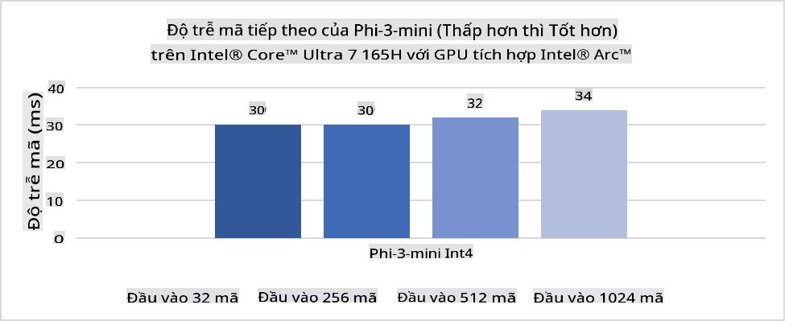
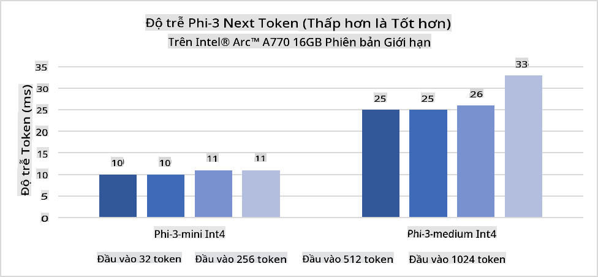
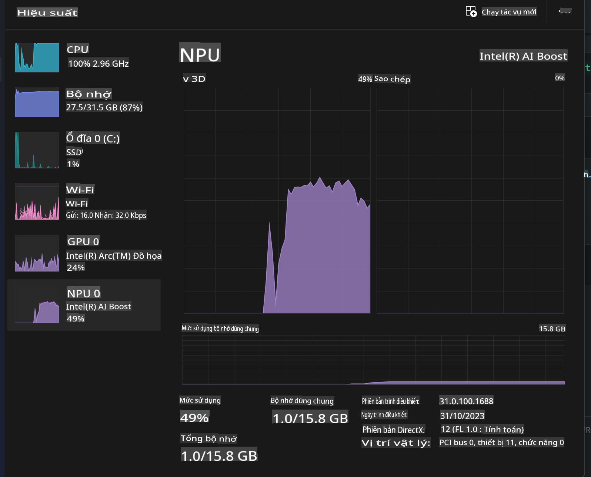
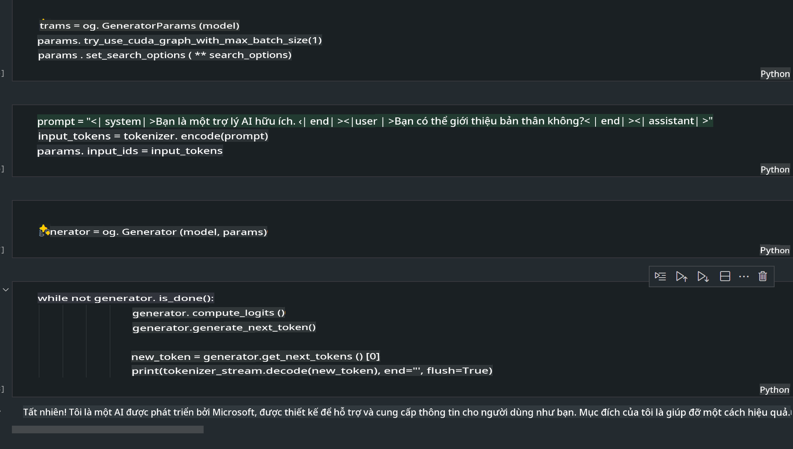
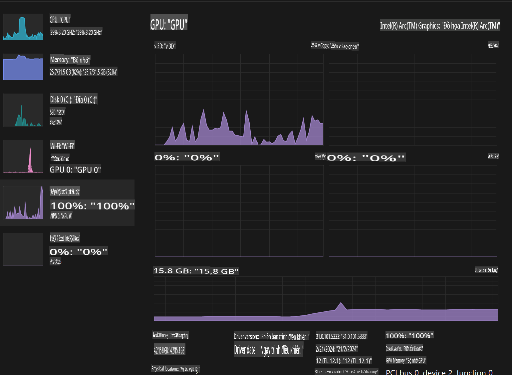

# **Triển khai Phi-3 trên AI PC**

Với sự phát triển của AI sinh tạo và sự cải thiện trong khả năng phần cứng của các thiết bị biên, ngày càng có nhiều mô hình AI sinh tạo có thể được tích hợp vào các thiết bị cá nhân (BYOD) của người dùng. AI PC là một trong những mô hình đó. Bắt đầu từ năm 2024, Intel, AMD và Qualcomm đã hợp tác với các nhà sản xuất PC để giới thiệu AI PC, hỗ trợ triển khai các mô hình AI sinh tạo cục bộ thông qua các cải tiến phần cứng. Trong bài viết này, chúng ta sẽ tập trung vào AI PC của Intel và khám phá cách triển khai Phi-3 trên AI PC của Intel.

### NPU là gì?

NPU (Neural Processing Unit) là một bộ xử lý chuyên dụng hoặc một đơn vị xử lý trên SoC lớn hơn, được thiết kế đặc biệt để tăng tốc các tác vụ AI và hoạt động của mạng nơ-ron. Khác với CPU và GPU đa năng, NPU được tối ưu hóa cho tính toán song song dựa trên dữ liệu, giúp xử lý hiệu quả khối lượng dữ liệu đa phương tiện khổng lồ như video, hình ảnh và xử lý dữ liệu cho mạng nơ-ron. Chúng đặc biệt phù hợp với các tác vụ liên quan đến AI, như nhận diện giọng nói, làm mờ nền trong cuộc gọi video, và chỉnh sửa ảnh hoặc video như phát hiện đối tượng.

## NPU so với GPU

Mặc dù nhiều khối lượng công việc AI và học máy được xử lý trên GPU, nhưng có một sự khác biệt quan trọng giữa GPU và NPU.  
GPU nổi tiếng với khả năng tính toán song song, nhưng không phải GPU nào cũng hiệu quả trong các tác vụ ngoài xử lý đồ họa. Trong khi đó, NPU được thiết kế chuyên dụng cho các tính toán phức tạp liên quan đến hoạt động của mạng nơ-ron, làm cho chúng cực kỳ hiệu quả trong các tác vụ AI.

Tóm lại, NPU là những "thiên tài toán học" giúp tăng tốc các tính toán AI, đóng vai trò quan trọng trong kỷ nguyên AI PC đang nổi lên!

***Ví dụ này dựa trên bộ xử lý Intel Core Ultra mới nhất của Intel***

## **1. Sử dụng NPU để chạy mô hình Phi-3**

Thiết bị Intel® NPU là bộ tăng tốc suy luận AI được tích hợp với CPU Intel, bắt đầu từ thế hệ CPU Intel® Core™ Ultra (trước đây gọi là Meteor Lake). Nó cho phép thực thi các tác vụ mạng nơ-ron nhân tạo một cách tiết kiệm năng lượng.





**Thư viện tăng tốc Intel NPU**

Thư viện tăng tốc Intel NPU [https://github.com/intel/intel-npu-acceleration-library](https://github.com/intel/intel-npu-acceleration-library) là một thư viện Python được thiết kế để tăng hiệu quả cho ứng dụng của bạn bằng cách tận dụng sức mạnh của Intel Neural Processing Unit (NPU) để thực hiện các tính toán tốc độ cao trên phần cứng tương thích.

Ví dụ về Phi-3-mini trên AI PC sử dụng bộ xử lý Intel® Core™ Ultra.


Cài đặt thư viện Python bằng pip

```bash

   pip install intel-npu-acceleration-library

```

***Lưu ý*** Dự án vẫn đang trong giai đoạn phát triển, nhưng mô hình tham chiếu đã rất đầy đủ.

### **Chạy Phi-3 với thư viện tăng tốc Intel NPU**

Khi sử dụng tăng tốc Intel NPU, thư viện này không ảnh hưởng đến quá trình mã hóa truyền thống. Bạn chỉ cần sử dụng thư viện này để lượng tử hóa mô hình Phi-3 gốc, ví dụ như FP16, INT8, INT4, v.v.

```python
from transformers import AutoTokenizer, pipeline,TextStreamer
from intel_npu_acceleration_library import NPUModelForCausalLM, int4
from intel_npu_acceleration_library.compiler import CompilerConfig
import warnings

model_id = "microsoft/Phi-3-mini-4k-instruct"

compiler_conf = CompilerConfig(dtype=int4)
model = NPUModelForCausalLM.from_pretrained(
    model_id, use_cache=True, config=compiler_conf, attn_implementation="sdpa"
).eval()

tokenizer = AutoTokenizer.from_pretrained(model_id)

text_streamer = TextStreamer(tokenizer, skip_prompt=True)
```

Sau khi lượng tử hóa thành công, tiếp tục thực thi để gọi NPU chạy mô hình Phi-3.

```python
generation_args = {
   "max_new_tokens": 1024,
   "return_full_text": False,
   "temperature": 0.3,
   "do_sample": False,
   "streamer": text_streamer,
}

pipe = pipeline(
   "text-generation",
   model=model,
   tokenizer=tokenizer,
)

query = "<|system|>You are a helpful AI assistant.<|end|><|user|>Can you introduce yourself?<|end|><|assistant|>"

with warnings.catch_warnings():
    warnings.simplefilter("ignore")
    pipe(query, **generation_args)
```

Khi thực thi mã, chúng ta có thể xem trạng thái hoạt động của NPU thông qua Task Manager.



***Ví dụ mẫu***: [AIPC_NPU_DEMO.ipynb](../../../../../code/03.Inference/AIPC/AIPC_NPU_DEMO.ipynb)

## **2. Sử dụng DirectML + ONNX Runtime để chạy mô hình Phi-3**

### **DirectML là gì**

[DirectML](https://github.com/microsoft/DirectML) là một thư viện DirectX 12 hiệu suất cao, tăng tốc phần cứng cho học máy. DirectML cung cấp khả năng tăng tốc GPU cho các tác vụ học máy phổ biến trên nhiều phần cứng và trình điều khiển được hỗ trợ, bao gồm tất cả GPU hỗ trợ DirectX 12 từ các nhà cung cấp như AMD, Intel, NVIDIA và Qualcomm.

Khi sử dụng độc lập, API DirectML là một thư viện DirectX 12 cấp thấp, phù hợp cho các ứng dụng yêu cầu hiệu suất cao và độ trễ thấp như framework, trò chơi và các ứng dụng thời gian thực khác. Khả năng tương tác liền mạch của DirectML với Direct3D 12, cũng như độ trễ thấp và khả năng tương thích trên phần cứng, làm cho DirectML trở thành lựa chọn lý tưởng để tăng tốc học máy khi hiệu suất cao và sự đáng tin cậy trên phần cứng là điều quan trọng.

***Lưu ý***: Phiên bản DirectML mới nhất đã hỗ trợ NPU (https://devblogs.microsoft.com/directx/introducing-neural-processor-unit-npu-support-in-directml-developer-preview/)

### DirectML và CUDA về khả năng và hiệu suất:

**DirectML** là một thư viện học máy do Microsoft phát triển, được thiết kế để tăng tốc khối lượng công việc học máy trên các thiết bị Windows, bao gồm máy tính để bàn, laptop và thiết bị biên.  
- Dựa trên DX12: DirectML được xây dựng trên DirectX 12 (DX12), hỗ trợ rộng rãi phần cứng GPU, bao gồm cả NVIDIA và AMD.  
- Hỗ trợ rộng hơn: Nhờ tận dụng DX12, DirectML có thể hoạt động trên bất kỳ GPU nào hỗ trợ DX12, kể cả GPU tích hợp.  
- Xử lý hình ảnh: DirectML xử lý hình ảnh và các dữ liệu khác bằng mạng nơ-ron, phù hợp cho các tác vụ như nhận diện hình ảnh, phát hiện đối tượng, v.v.  
- Dễ cài đặt: Thiết lập DirectML khá đơn giản, không yêu cầu SDK hoặc thư viện cụ thể từ nhà sản xuất GPU.  
- Hiệu suất: Trong một số trường hợp, DirectML hoạt động tốt và có thể nhanh hơn CUDA, đặc biệt với một số khối lượng công việc.  
- Hạn chế: Tuy nhiên, có những trường hợp DirectML có thể chậm hơn, đặc biệt với float16 và kích thước batch lớn.  

**CUDA** là nền tảng tính toán song song và mô hình lập trình của NVIDIA, cho phép các nhà phát triển tận dụng sức mạnh của GPU NVIDIA cho các tính toán tổng quát, bao gồm học máy và mô phỏng khoa học.  
- Chuyên dụng cho NVIDIA: CUDA tích hợp chặt chẽ với GPU NVIDIA và được thiết kế riêng cho chúng.  
- Tối ưu hóa cao: Nó cung cấp hiệu suất tuyệt vời cho các tác vụ được tăng tốc GPU, đặc biệt khi sử dụng GPU NVIDIA.  
- Sử dụng rộng rãi: Nhiều framework và thư viện học máy (như TensorFlow và PyTorch) hỗ trợ CUDA.  
- Tùy chỉnh: Các nhà phát triển có thể tinh chỉnh cài đặt CUDA cho các tác vụ cụ thể, mang lại hiệu suất tối ưu.  
- Hạn chế: Tuy nhiên, sự phụ thuộc vào phần cứng NVIDIA có thể là một hạn chế nếu bạn muốn tương thích rộng hơn với các GPU khác.  

### Chọn giữa DirectML và CUDA

Lựa chọn giữa DirectML và CUDA phụ thuộc vào trường hợp sử dụng cụ thể, phần cứng sẵn có và sở thích của bạn.  
Nếu bạn cần khả năng tương thích rộng hơn và dễ thiết lập, DirectML có thể là một lựa chọn tốt. Tuy nhiên, nếu bạn sở hữu GPU NVIDIA và cần hiệu suất tối ưu, CUDA vẫn là một lựa chọn mạnh mẽ. Tóm lại, cả DirectML và CUDA đều có ưu và nhược điểm riêng, vì vậy hãy cân nhắc yêu cầu và phần cứng sẵn có khi đưa ra quyết định.

### **AI sinh tạo với ONNX Runtime**

Trong kỷ nguyên AI, tính di động của các mô hình AI là rất quan trọng. ONNX Runtime có thể dễ dàng triển khai các mô hình đã được huấn luyện lên các thiết bị khác nhau. Các nhà phát triển không cần quan tâm đến framework suy luận và có thể sử dụng API thống nhất để hoàn thành suy luận mô hình. Trong kỷ nguyên AI sinh tạo, ONNX Runtime cũng đã tối ưu hóa mã (https://onnxruntime.ai/docs/genai/). Thông qua ONNX Runtime được tối ưu hóa, mô hình AI sinh tạo đã lượng tử hóa có thể được suy luận trên các thiết bị khác nhau. Với AI sinh tạo sử dụng ONNX Runtime, bạn có thể suy luận mô hình AI thông qua Python, C#, C/C++. Tất nhiên, việc triển khai trên iPhone có thể tận dụng API Generative AI với ONNX Runtime của C++.

[Mã mẫu](https://github.com/Azure-Samples/Phi-3MiniSamples/tree/main/onnx)

***Biên dịch AI sinh tạo với thư viện ONNX Runtime***

```bash

winget install --id=Kitware.CMake  -e

git clone https://github.com/microsoft/onnxruntime.git

cd .\onnxruntime\

./build.bat --build_shared_lib --skip_tests --parallel --use_dml --config Release

cd ../

git clone https://github.com/microsoft/onnxruntime-genai.git

cd .\onnxruntime-genai\

mkdir ort

cd ort

mkdir include

mkdir lib

copy ..\onnxruntime\include\onnxruntime\core\providers\dml\dml_provider_factory.h ort\include

copy ..\onnxruntime\include\onnxruntime\core\session\onnxruntime_c_api.h ort\include

copy ..\onnxruntime\build\Windows\Release\Release\*.dll ort\lib

copy ..\onnxruntime\build\Windows\Release\Release\onnxruntime.lib ort\lib

python build.py --use_dml


```

**Cài đặt thư viện**

```bash

pip install .\onnxruntime_genai_directml-0.3.0.dev0-cp310-cp310-win_amd64.whl

```

Kết quả chạy như sau:



***Ví dụ mẫu***: [AIPC_DirectML_DEMO.ipynb](../../../../../code/03.Inference/AIPC/AIPC_DirectML_DEMO.ipynb)

## **3. Sử dụng Intel OpenVino để chạy mô hình Phi-3**

### **OpenVINO là gì**

[OpenVINO](https://github.com/openvinotoolkit/openvino) là một bộ công cụ mã nguồn mở để tối ưu hóa và triển khai các mô hình học sâu. Nó cung cấp hiệu suất học sâu được tăng cường cho các mô hình thị giác, âm thanh và ngôn ngữ từ các framework phổ biến như TensorFlow, PyTorch, và nhiều hơn nữa. Bắt đầu với OpenVINO. OpenVINO cũng có thể được sử dụng kết hợp với CPU và GPU để chạy mô hình Phi-3.

***Lưu ý***: Hiện tại, OpenVINO chưa hỗ trợ NPU.

### **Cài đặt thư viện OpenVINO**

```bash

 pip install git+https://github.com/huggingface/optimum-intel.git

 pip install git+https://github.com/openvinotoolkit/nncf.git

 pip install openvino-nightly

```

### **Chạy Phi-3 với OpenVINO**

Giống như NPU, OpenVINO thực hiện gọi các mô hình AI sinh tạo bằng cách chạy các mô hình đã lượng tử hóa. Chúng ta cần lượng tử hóa mô hình Phi-3 trước và hoàn thành lượng tử hóa mô hình trên dòng lệnh thông qua optimum-cli.

**INT4**

```bash

optimum-cli export openvino --model "microsoft/Phi-3-mini-4k-instruct" --task text-generation-with-past --weight-format int4 --group-size 128 --ratio 0.6  --sym  --trust-remote-code ./openvinomodel/phi3/int4

```

**FP16**

```bash

optimum-cli export openvino --model "microsoft/Phi-3-mini-4k-instruct" --task text-generation-with-past --weight-format fp16 --trust-remote-code ./openvinomodel/phi3/fp16

```

Định dạng sau khi chuyển đổi, như sau:


Tải đường dẫn mô hình (model_dir), cấu hình liên quan (ov_config = {"PERFORMANCE_HINT": "LATENCY", "NUM_STREAMS": "1", "CACHE_DIR": ""}), và các thiết bị tăng tốc phần cứng (GPU.0) thông qua OVModelForCausalLM.

```python

ov_model = OVModelForCausalLM.from_pretrained(
     model_dir,
     device='GPU.0',
     ov_config=ov_config,
     config=AutoConfig.from_pretrained(model_dir, trust_remote_code=True),
     trust_remote_code=True,
)

```

Khi thực thi mã, chúng ta có thể xem trạng thái hoạt động của GPU thông qua Task Manager.



***Ví dụ mẫu***: [AIPC_OpenVino_Demo.ipynb](../../../../../code/03.Inference/AIPC/AIPC_OpenVino_Demo.ipynb)

### ***Lưu ý***: Ba phương pháp trên đều có những lợi thế riêng, nhưng khuyến nghị sử dụng tăng tốc NPU để suy luận AI trên AI PC.

**Tuyên bố miễn trừ trách nhiệm**:  
Tài liệu này đã được dịch bằng các dịch vụ dịch thuật AI tự động. Mặc dù chúng tôi cố gắng đảm bảo độ chính xác, xin lưu ý rằng các bản dịch tự động có thể chứa lỗi hoặc không chính xác. Tài liệu gốc bằng ngôn ngữ bản địa nên được coi là nguồn thông tin chính xác nhất. Đối với các thông tin quan trọng, khuyến nghị sử dụng dịch thuật chuyên nghiệp từ con người. Chúng tôi không chịu trách nhiệm về bất kỳ sự hiểu lầm hoặc diễn giải sai nào phát sinh từ việc sử dụng bản dịch này.