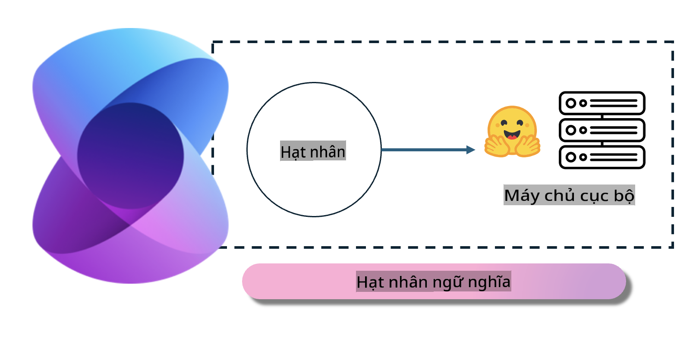
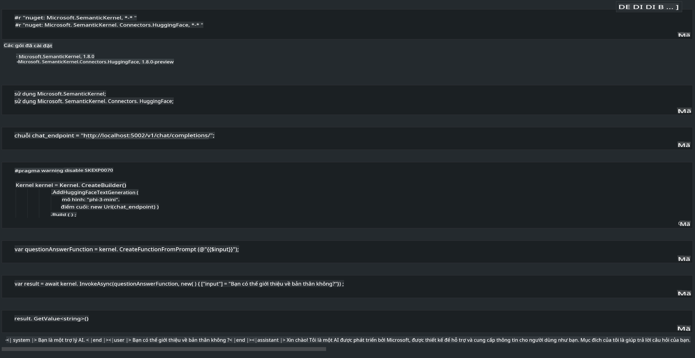

# **Triển khai Phi-3 trên máy chủ cục bộ**

Chúng ta có thể triển khai Phi-3 trên một máy chủ cục bộ. Người dùng có thể chọn giải pháp [Ollama](https://ollama.com) hoặc [LM Studio](https://llamaedge.com), hoặc tự viết mã của riêng mình. Bạn có thể kết nối các dịch vụ cục bộ của Phi-3 thông qua [Semantic Kernel](https://github.com/microsoft/semantic-kernel?WT.mc_id=aiml-138114-kinfeylo) hoặc [Langchain](https://www.langchain.com/) để xây dựng các ứng dụng Copilot.

## **Sử dụng Semantic Kernel để truy cập Phi-3-mini**

Trong ứng dụng Copilot, chúng ta tạo ứng dụng thông qua Semantic Kernel / LangChain. Loại khung ứng dụng này thường tương thích với Azure OpenAI Service / các mô hình OpenAI, và cũng hỗ trợ các mô hình mã nguồn mở trên Hugging Face cũng như các mô hình cục bộ. Vậy nếu muốn sử dụng Semantic Kernel để truy cập Phi-3-mini thì cần làm gì? Sử dụng .NET làm ví dụ, chúng ta có thể kết hợp với Hugging Face Connector trong Semantic Kernel. Theo mặc định, nó có thể tương ứng với model id trên Hugging Face (lần đầu tiên sử dụng, mô hình sẽ được tải xuống từ Hugging Face, điều này mất nhiều thời gian). Bạn cũng có thể kết nối với dịch vụ cục bộ tự xây dựng. So sánh giữa hai cách, chúng tôi khuyên bạn nên sử dụng cách thứ hai vì nó có mức độ tự chủ cao hơn, đặc biệt là trong các ứng dụng doanh nghiệp.

Từ hình trên, truy cập dịch vụ cục bộ thông qua Semantic Kernel có thể dễ dàng kết nối với máy chủ mô hình Phi-3-mini tự xây dựng. Dưới đây là kết quả chạy.

***Mã mẫu*** https://github.com/kinfey/Phi3MiniSamples/tree/main/semantickernel

**Tuyên bố miễn trừ trách nhiệm**:  
Tài liệu này đã được dịch bằng các dịch vụ dịch thuật AI tự động. Mặc dù chúng tôi cố gắng đảm bảo độ chính xác, xin lưu ý rằng các bản dịch tự động có thể chứa lỗi hoặc không chính xác. Tài liệu gốc bằng ngôn ngữ bản địa nên được coi là nguồn đáng tin cậy nhất. Đối với các thông tin quan trọng, nên sử dụng dịch vụ dịch thuật chuyên nghiệp từ con người. Chúng tôi không chịu trách nhiệm về bất kỳ sự hiểu lầm hoặc diễn giải sai nào phát sinh từ việc sử dụng bản dịch này.