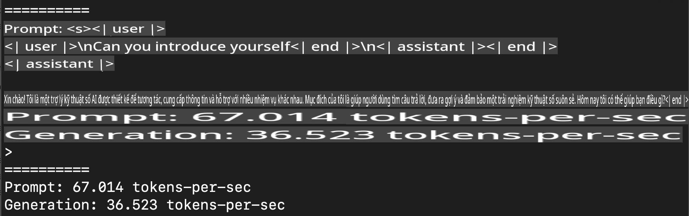
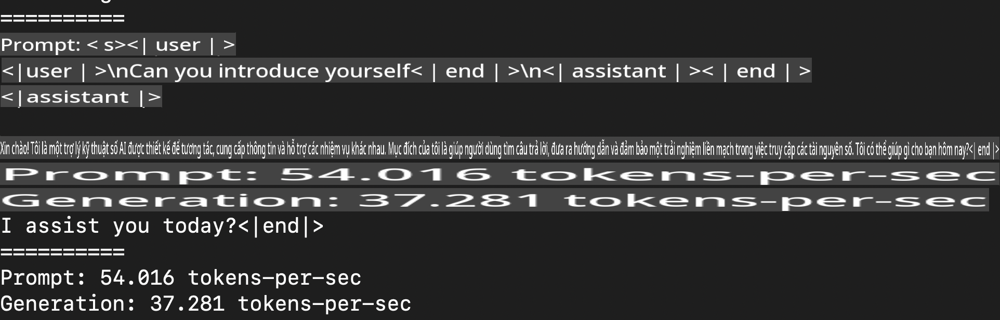
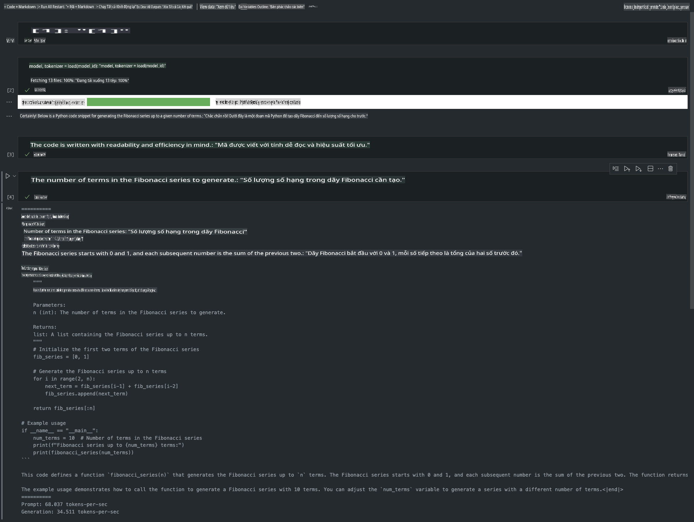

# **Suy luận Phi-3 với Apple MLX Framework**

## **MLX Framework là gì**

MLX là một framework mảng dành cho nghiên cứu học máy trên Apple silicon, được phát triển bởi nhóm nghiên cứu học máy của Apple.

MLX được thiết kế bởi các nhà nghiên cứu học máy, dành riêng cho các nhà nghiên cứu học máy. Framework này được tạo ra để thân thiện với người dùng, đồng thời vẫn đảm bảo hiệu quả trong việc huấn luyện và triển khai mô hình. Thiết kế của framework cũng rất đơn giản về mặt khái niệm, nhằm giúp các nhà nghiên cứu dễ dàng mở rộng và cải thiện MLX, với mục tiêu khám phá nhanh các ý tưởng mới.

Các LLM có thể được tăng tốc trên các thiết bị Apple Silicon thông qua MLX, và mô hình có thể chạy cục bộ một cách cực kỳ tiện lợi.

## **Sử dụng MLX để suy luận Phi-3-mini**

### **1. Thiết lập môi trường MLX**

1. Python 3.11.x  
2. Cài đặt thư viện MLX  

```bash

pip install mlx-lm

```

### **2. Chạy Phi-3-mini trong Terminal với MLX**

```bash

python -m mlx_lm.generate --model microsoft/Phi-3-mini-4k-instruct --max-token 2048 --prompt  "<|user|>\nCan you introduce yourself<|end|>\n<|assistant|>"

```

Kết quả (môi trường của tôi là Apple M1 Max, 64GB) là  



### **3. Lượng tử hóa Phi-3-mini với MLX trong Terminal**

```bash

python -m mlx_lm.convert --hf-path microsoft/Phi-3-mini-4k-instruct

```

***Lưu ý:*** Mô hình có thể được lượng tử hóa thông qua mlx_lm.convert, và lượng tử hóa mặc định là INT4. Ví dụ này lượng tử hóa Phi-3-mini thành INT4.

Mô hình sẽ được lưu trữ trong thư mục mặc định ./mlx_model sau khi lượng tử hóa.  

Chúng ta có thể kiểm tra mô hình đã được lượng tử hóa với MLX từ terminal  

```bash

python -m mlx_lm.generate --model ./mlx_model/ --max-token 2048 --prompt  "<|user|>\nCan you introduce yourself<|end|>\n<|assistant|>"

```

Kết quả là  



### **4. Chạy Phi-3-mini với MLX trong Jupyter Notebook**



***Lưu ý:*** Vui lòng đọc ví dụ này [nhấn vào đây](../../../../../code/03.Inference/MLX/MLX_DEMO.ipynb)

## **Tài nguyên**

1. Tìm hiểu về Apple MLX Framework [https://ml-explore.github.io](https://ml-explore.github.io/mlx/build/html/index.html)

2. Kho GitHub của Apple MLX [https://github.com/ml-explore](https://github.com/ml-explore)  

**Tuyên bố miễn trừ trách nhiệm**:  
Tài liệu này đã được dịch bằng các dịch vụ dịch thuật AI tự động. Mặc dù chúng tôi cố gắng đảm bảo độ chính xác, xin lưu ý rằng các bản dịch tự động có thể chứa lỗi hoặc sự không chính xác. Tài liệu gốc bằng ngôn ngữ bản địa nên được coi là nguồn thông tin có giá trị nhất. Đối với các thông tin quan trọng, khuyến nghị sử dụng dịch thuật chuyên nghiệp bởi con người. Chúng tôi không chịu trách nhiệm đối với bất kỳ sự hiểu lầm hoặc diễn giải sai nào phát sinh từ việc sử dụng bản dịch này.