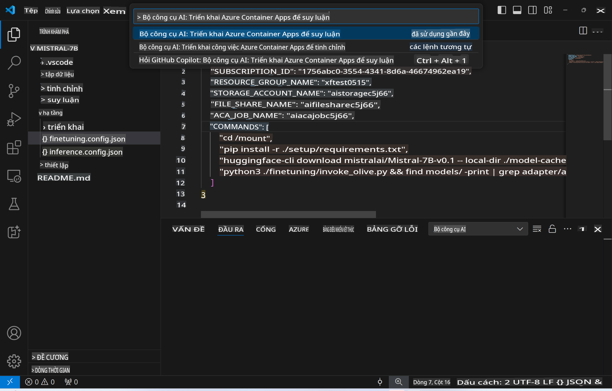
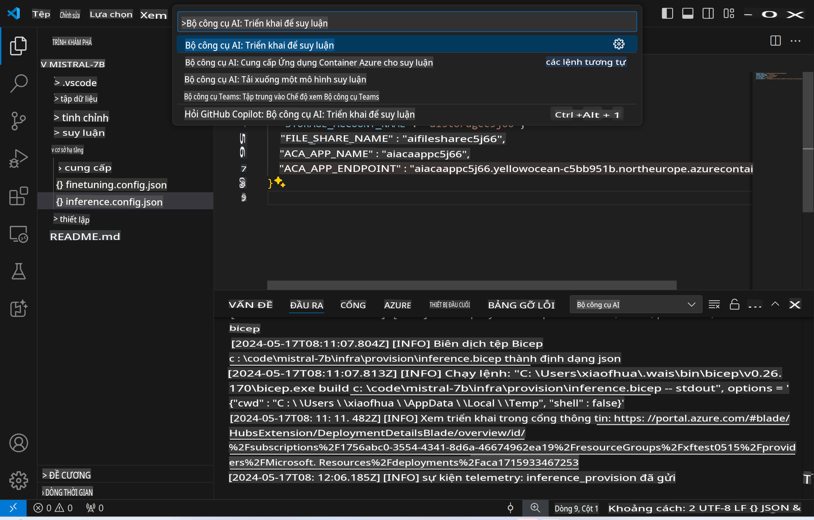
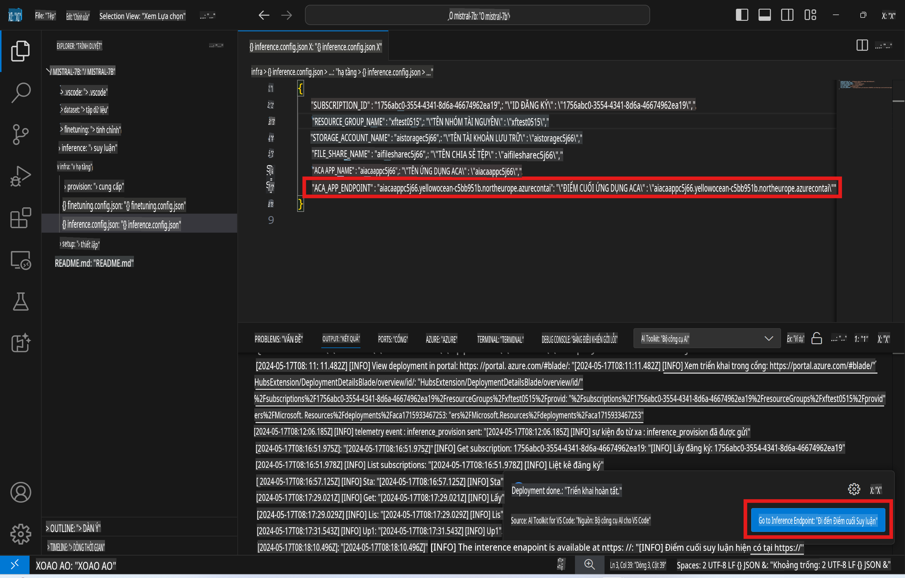

# Suy luận từ xa với mô hình đã tinh chỉnh

Sau khi các adapters được huấn luyện trong môi trường từ xa, bạn có thể sử dụng một ứng dụng Gradio đơn giản để tương tác với mô hình.


### Cấp phát tài nguyên Azure
Bạn cần thiết lập tài nguyên Azure để thực hiện suy luận từ xa bằng cách chạy `AI Toolkit: Provision Azure Container Apps for inference` từ command palette. Trong quá trình này, bạn sẽ được yêu cầu chọn Azure Subscription và resource group của mình.  

   
Theo mặc định, subscription và resource group dùng cho suy luận nên khớp với những gì đã sử dụng trong quá trình tinh chỉnh. Quá trình suy luận sẽ sử dụng cùng một Azure Container App Environment và truy cập mô hình cùng adapter của mô hình được lưu trữ trong Azure Files, được tạo ra trong bước tinh chỉnh.

## Sử dụng AI Toolkit 

### Triển khai cho suy luận  
Nếu bạn muốn chỉnh sửa lại mã suy luận hoặc tải lại mô hình suy luận, hãy chạy lệnh `AI Toolkit: Deploy for inference`. Lệnh này sẽ đồng bộ mã mới nhất của bạn với ACA và khởi động lại replica.  



Sau khi triển khai thành công, mô hình đã sẵn sàng để đánh giá thông qua endpoint này.

### Truy cập API suy luận

Bạn có thể truy cập API suy luận bằng cách nhấn vào nút "*Go to Inference Endpoint*" hiển thị trong thông báo của VSCode. Ngoài ra, endpoint của web API có thể được tìm thấy trong `ACA_APP_ENDPOINT` tại `./infra/inference.config.json` và trong output panel.



> **Lưu ý:** Endpoint suy luận có thể cần vài phút để hoạt động đầy đủ.

## Các thành phần suy luận có trong mẫu

| Thư mục | Nội dung |
| ------ |--------- |
| `infra` | Chứa tất cả cấu hình cần thiết cho các thao tác từ xa. |
| `infra/provision/inference.parameters.json` | Chứa các tham số cho bicep templates, được sử dụng để cấp phát tài nguyên Azure cho suy luận. |
| `infra/provision/inference.bicep` | Chứa các mẫu để cấp phát tài nguyên Azure cho suy luận. |
| `infra/inference.config.json` | Tệp cấu hình được tạo bởi lệnh `AI Toolkit: Provision Azure Container Apps for inference`. Nó được sử dụng làm đầu vào cho các command palette từ xa khác. |

### Sử dụng AI Toolkit để cấu hình cấp phát tài nguyên Azure
Cấu hình [AI Toolkit](https://marketplace.visualstudio.com/items?itemName=ms-windows-ai-studio.windows-ai-studio)

Cấp phát Azure Container Apps cho suy luận` command.

You can find configuration parameters in `./infra/provision/inference.parameters.json` file. Here are the details:
| Parameter | Description |
| --------- |------------ |
| `defaultCommands` | This is the commands to initiate a web API. |
| `maximumInstanceCount` | This parameter sets the maximum capacity of GPU instances. |
| `location` | This is the location where Azure resources are provisioned. The default value is the same as the chosen resource group's location. |
| `storageAccountName`, `fileShareName` `acaEnvironmentName`, `acaEnvironmentStorageName`, `acaAppName`,  `acaLogAnalyticsName` | These parameters are used to name the Azure resources for provision. By default, they will be same to the fine-tuning resource name. You can input a new, unused resource name to create your own custom-named resources, or you can input the name of an already existing Azure resource if you'd prefer to use that. For details, refer to the section [Using existing Azure Resources](../../../../../md/01.Introduction/03). |

### Using Existing Azure Resources

By default, the inference provision use the same Azure Container App Environment, Storage Account, Azure File Share, and Azure Log Analytics that were used for fine-tuning. A separate Azure Container App is created solely for the inference API. 

If you have customized the Azure resources during the fine-tuning step or want to use your own existing Azure resources for inference, specify their names in the `./infra/inference.parameters.json` file. Sau đó, chạy lệnh `AI Toolkit: Provision Azure Container Apps for inference` từ command palette. Lệnh này sẽ cập nhật bất kỳ tài nguyên nào đã được chỉ định và tạo ra những tài nguyên còn thiếu.

Ví dụ, nếu bạn đã có một Azure container environment, tệp `./infra/finetuning.parameters.json` của bạn nên trông như sau:

```json
{
    "$schema": "https://schema.management.azure.com/schemas/2019-04-01/deploymentParameters.json#",
    "contentVersion": "1.0.0.0",
    "parameters": {
      ...
      "acaEnvironmentName": {
        "value": "<your-aca-env-name>"
      },
      "acaEnvironmentStorageName": {
        "value": null
      },
      ...
    }
  }
```

### Cấp phát thủ công  
Nếu bạn muốn tự cấu hình tài nguyên Azure, bạn có thể sử dụng các tệp bicep được cung cấp trong thư mục `./infra/provision` folders. If you have already set up and configured all the Azure resources without using the AI Toolkit command palette, you can simply enter the resource names in the `inference.config.json`.

Ví dụ:

```json
{
  "SUBSCRIPTION_ID": "<your-subscription-id>",
  "RESOURCE_GROUP_NAME": "<your-resource-group-name>",
  "STORAGE_ACCOUNT_NAME": "<your-storage-account-name>",
  "FILE_SHARE_NAME": "<your-file-share-name>",
  "ACA_APP_NAME": "<your-aca-name>",
  "ACA_APP_ENDPOINT": "<your-aca-endpoint>"
}
```

**Tuyên bố miễn trừ trách nhiệm**:  
Tài liệu này đã được dịch bằng các dịch vụ dịch thuật AI tự động. Mặc dù chúng tôi cố gắng đảm bảo độ chính xác, xin lưu ý rằng các bản dịch tự động có thể chứa lỗi hoặc sự không chính xác. Tài liệu gốc bằng ngôn ngữ nguyên bản nên được coi là nguồn tham khảo chính thức. Đối với thông tin quan trọng, khuyến nghị sử dụng dịch vụ dịch thuật chuyên nghiệp bởi con người. Chúng tôi không chịu trách nhiệm cho bất kỳ sự hiểu lầm hoặc diễn giải sai nào phát sinh từ việc sử dụng bản dịch này.