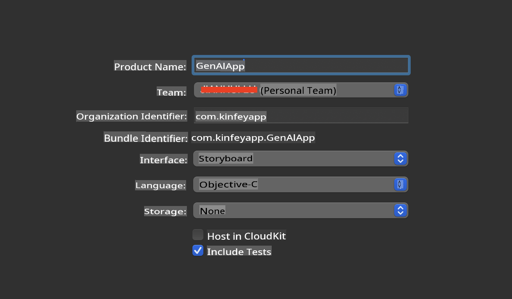
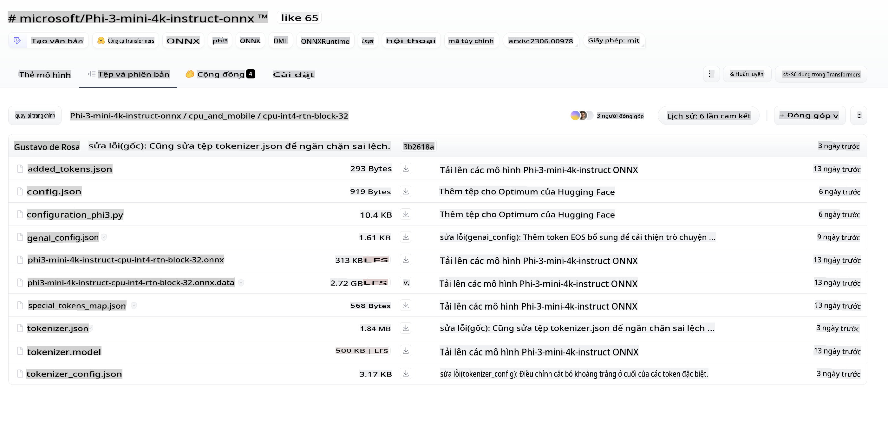
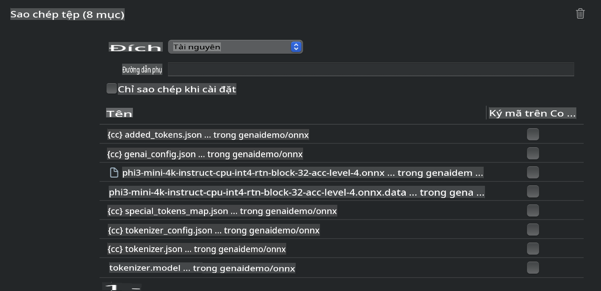
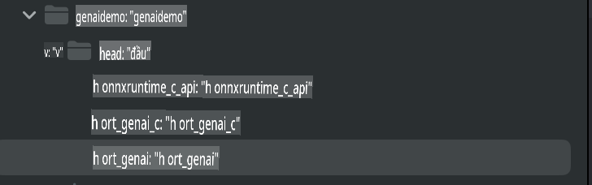
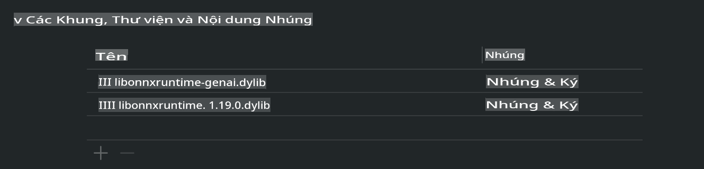
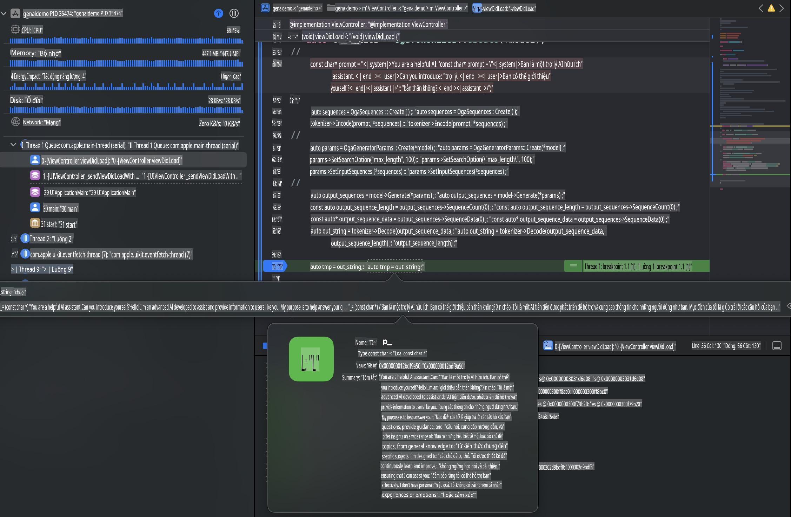

# **Triển khai Phi-3 trên iOS**

Phi-3-mini là một dòng mô hình mới từ Microsoft, cho phép triển khai các Mô hình Ngôn ngữ Lớn (LLMs) trên các thiết bị biên và thiết bị IoT. Phi-3-mini có sẵn cho iOS, Android và các thiết bị biên, cho phép triển khai AI tạo sinh trong môi trường BYOD. Ví dụ dưới đây minh họa cách triển khai Phi-3-mini trên iOS.

## **1. Chuẩn bị**

- **a.** macOS 14+
- **b.** Xcode 15+
- **c.** iOS SDK 17.x (iPhone 14 A16 hoặc cao hơn)
- **d.** Cài đặt Python 3.10+ (nên sử dụng Conda)
- **e.** Cài đặt thư viện Python: `python-flatbuffers`
- **f.** Cài đặt CMake

### Semantic Kernel và Inference

Semantic Kernel là một khung ứng dụng cho phép bạn tạo các ứng dụng tương thích với Azure OpenAI Service, các mô hình của OpenAI, và thậm chí cả các mô hình cục bộ. Truy cập dịch vụ cục bộ thông qua Semantic Kernel giúp dễ dàng tích hợp với máy chủ mô hình Phi-3-mini tự lưu trữ.

### Gọi các mô hình lượng tử hóa với Ollama hoặc LlamaEdge

Nhiều người dùng thích sử dụng các mô hình lượng tử hóa để chạy mô hình cục bộ. [Ollama](https://ollama.com) và [LlamaEdge](https://llamaedge.com) cho phép người dùng gọi các mô hình lượng tử hóa khác nhau:

#### **Ollama**

Bạn có thể chạy `ollama run phi3` trực tiếp hoặc cấu hình ngoại tuyến. Tạo một Modelfile với đường dẫn đến tệp `gguf` của bạn. Ví dụ mã để chạy mô hình Phi-3-mini lượng tử hóa:

```gguf
FROM {Add your gguf file path}
TEMPLATE \"\"\"<|user|> .Prompt<|end|> <|assistant|>\"\"\"
PARAMETER stop <|end|>
PARAMETER num_ctx 4096
```

#### **LlamaEdge**

Nếu bạn muốn sử dụng `gguf` trên cả thiết bị đám mây và thiết bị biên cùng lúc, LlamaEdge là một lựa chọn tuyệt vời.

## **2. Biên dịch ONNX Runtime cho iOS**

```bash

git clone https://github.com/microsoft/onnxruntime.git

cd onnxruntime

./build.sh --build_shared_lib --ios --skip_tests --parallel --build_dir ./build_ios --ios --apple_sysroot iphoneos --osx_arch arm64 --apple_deploy_target 17.5 --cmake_generator Xcode --config Release

cd ../

```

### **Lưu ý**

- **a.** Trước khi biên dịch, đảm bảo rằng Xcode đã được cấu hình đúng và đặt nó làm thư mục nhà phát triển hoạt động trong terminal:

    ```bash
    sudo xcode-select -switch /Applications/Xcode.app/Contents/Developer
    ```

- **b.** ONNX Runtime cần được biên dịch cho các nền tảng khác nhau. Đối với iOS, bạn có thể biên dịch cho `arm64` or `x86_64`.

- **c.** Nên sử dụng phiên bản iOS SDK mới nhất để biên dịch. Tuy nhiên, bạn cũng có thể sử dụng phiên bản cũ hơn nếu cần tương thích với các SDK trước đó.

## **3. Biên dịch AI tạo sinh với ONNX Runtime cho iOS**

> **Lưu ý:** Vì AI tạo sinh với ONNX Runtime đang ở giai đoạn thử nghiệm, vui lòng lưu ý các thay đổi có thể xảy ra.

```bash

git clone https://github.com/microsoft/onnxruntime-genai
 
cd onnxruntime-genai
 
mkdir ort
 
cd ort
 
mkdir include
 
mkdir lib
 
cd ../
 
cp ../onnxruntime/include/onnxruntime/core/session/onnxruntime_c_api.h ort/include
 
cp ../onnxruntime/build_ios/Release/Release-iphoneos/libonnxruntime*.dylib* ort/lib
 
export OPENCV_SKIP_XCODEBUILD_FORCE_TRYCOMPILE_DEBUG=1
 
python3 build.py --parallel --build_dir ./build_ios --ios --ios_sysroot iphoneos --ios_arch arm64 --ios_deployment_target 17.5 --cmake_generator Xcode --cmake_extra_defines CMAKE_XCODE_ATTRIBUTE_CODE_SIGNING_ALLOWED=NO

```

## **4. Tạo một ứng dụng App trong Xcode**

Tôi chọn Objective-C làm phương pháp phát triển App, vì khi sử dụng AI tạo sinh với ONNX Runtime C++ API, Objective-C tương thích tốt hơn. Tất nhiên, bạn cũng có thể thực hiện các lời gọi liên quan thông qua Swift bridging.



## **5. Sao chép mô hình INT4 lượng tử hóa ONNX vào dự án ứng dụng App**

Chúng ta cần nhập mô hình lượng tử hóa INT4 ở định dạng ONNX, cần được tải xuống trước.



Sau khi tải xuống, bạn cần thêm nó vào thư mục Resources của dự án trong Xcode.



## **6. Thêm API C++ trong ViewControllers**

> **Lưu ý:**

- **a.** Thêm các tệp header C++ tương ứng vào dự án.

  

- **b.** Bao gồm `onnxruntime-genai` dynamic library in Xcode.

  

- **c.** Use the C Samples code for testing. You can also add additional features like ChatUI for more functionality.

- **d.** Since you need to use C++ in your project, rename `ViewController.m` to `ViewController.mm` để kích hoạt hỗ trợ Objective-C++.

```objc

    NSString *llmPath = [[NSBundle mainBundle] resourcePath];
    char const *modelPath = llmPath.cString;

    auto model =  OgaModel::Create(modelPath);

    auto tokenizer = OgaTokenizer::Create(*model);

    const char* prompt = "<|system|>You are a helpful AI assistant.<|end|><|user|>Can you introduce yourself?<|end|><|assistant|>";

    auto sequences = OgaSequences::Create();
    tokenizer->Encode(prompt, *sequences);

    auto params = OgaGeneratorParams::Create(*model);
    params->SetSearchOption("max_length", 100);
    params->SetInputSequences(*sequences);

    auto output_sequences = model->Generate(*params);
    const auto output_sequence_length = output_sequences->SequenceCount(0);
    const auto* output_sequence_data = output_sequences->SequenceData(0);
    auto out_string = tokenizer->Decode(output_sequence_data, output_sequence_length);
    
    auto tmp = out_string;

```

## **7. Chạy ứng dụng**

Khi thiết lập hoàn tất, bạn có thể chạy ứng dụng để xem kết quả suy luận của mô hình Phi-3-mini.



Để xem thêm mã mẫu và hướng dẫn chi tiết, hãy truy cập [Kho mẫu Phi-3 Mini](https://github.com/Azure-Samples/Phi-3MiniSamples/tree/main/ios).

**Tuyên bố từ chối trách nhiệm**:  
Tài liệu này đã được dịch bằng các dịch vụ dịch thuật AI tự động. Mặc dù chúng tôi cố gắng đảm bảo độ chính xác, xin lưu ý rằng các bản dịch tự động có thể chứa lỗi hoặc sai sót. Tài liệu gốc bằng ngôn ngữ ban đầu nên được coi là nguồn tham khảo chính thức. Đối với các thông tin quan trọng, nên sử dụng dịch vụ dịch thuật chuyên nghiệp từ con người. Chúng tôi không chịu trách nhiệm về bất kỳ sự hiểu lầm hoặc diễn giải sai nào phát sinh từ việc sử dụng bản dịch này.