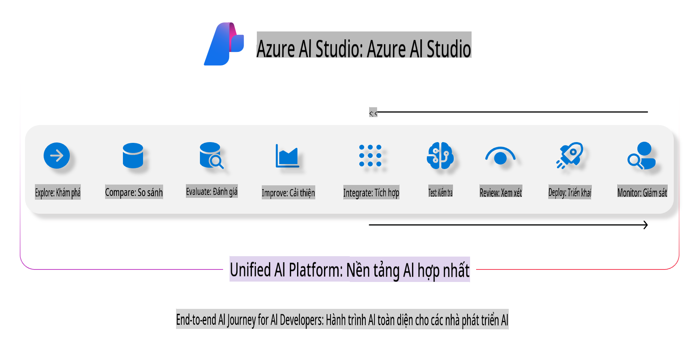
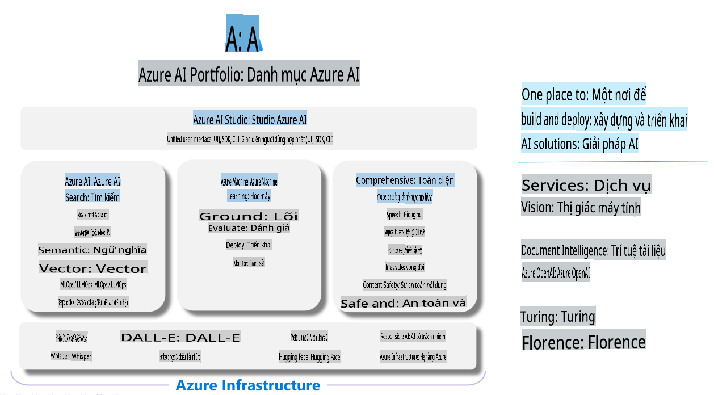

# **Sử dụng Azure AI Foundry để đánh giá**

Cách đánh giá ứng dụng AI tạo sinh của bạn bằng [Azure AI Foundry](https://ai.azure.com?WT.mc_id=aiml-138114-kinfeylo). Dù bạn đang đánh giá các cuộc hội thoại đơn lượt hay đa lượt, Azure AI Foundry cung cấp các công cụ để đánh giá hiệu suất và độ an toàn của mô hình. 

## Cách đánh giá ứng dụng AI tạo sinh với Azure AI Foundry
Để biết thêm hướng dẫn chi tiết, xem [Tài liệu Azure AI Foundry](https://learn.microsoft.com/azure/ai-studio/how-to/evaluate-generative-ai-app?WT.mc_id=aiml-138114-kinfeylo)

Dưới đây là các bước để bắt đầu:

## Đánh giá mô hình AI tạo sinh trong Azure AI Foundry

**Yêu cầu trước**

- Một tập dữ liệu kiểm tra ở định dạng CSV hoặc JSON.
- Một mô hình AI tạo sinh đã triển khai (như Phi-3, GPT 3.5, GPT 4, hoặc các mô hình Davinci).
- Một runtime với compute instance để thực hiện việc đánh giá.

## Các chỉ số đánh giá tích hợp sẵn

Azure AI Foundry cho phép bạn đánh giá cả các cuộc hội thoại đơn lượt và phức tạp, đa lượt.
Đối với các kịch bản Retrieval Augmented Generation (RAG), nơi mô hình dựa trên dữ liệu cụ thể, bạn có thể đánh giá hiệu suất bằng các chỉ số đánh giá tích hợp sẵn.
Ngoài ra, bạn cũng có thể đánh giá các kịch bản trả lời câu hỏi đơn lượt thông thường (không phải RAG).

## Tạo một phiên đánh giá

Từ giao diện Azure AI Foundry, điều hướng đến trang Evaluate hoặc trang Prompt Flow.
Thực hiện theo trình hướng dẫn tạo đánh giá để thiết lập một phiên đánh giá. Đặt một tên tùy chọn cho phiên đánh giá của bạn.
Chọn kịch bản phù hợp với mục tiêu của ứng dụng.
Chọn một hoặc nhiều chỉ số đánh giá để đánh giá đầu ra của mô hình.

## Quy trình đánh giá tùy chỉnh (Tùy chọn)

Để linh hoạt hơn, bạn có thể thiết lập một quy trình đánh giá tùy chỉnh. Tùy chỉnh quy trình đánh giá dựa trên yêu cầu cụ thể của bạn.

## Xem kết quả

Sau khi thực hiện đánh giá, ghi lại, xem và phân tích các chỉ số đánh giá chi tiết trong Azure AI Foundry. Nắm bắt thông tin chi tiết về khả năng và giới hạn của ứng dụng của bạn.

**Lưu ý** Azure AI Foundry hiện đang ở giai đoạn xem trước công khai, vì vậy hãy sử dụng nó cho mục đích thử nghiệm và phát triển. Đối với các khối lượng công việc sản xuất, hãy cân nhắc các tùy chọn khác. Khám phá [tài liệu chính thức của AI Foundry](https://learn.microsoft.com/azure/ai-studio/?WT.mc_id=aiml-138114-kinfeylo) để biết thêm chi tiết và hướng dẫn từng bước.

**Tuyên bố miễn trừ trách nhiệm**:  
Tài liệu này đã được dịch bằng các dịch vụ dịch thuật AI tự động. Mặc dù chúng tôi cố gắng đảm bảo độ chính xác, xin lưu ý rằng các bản dịch tự động có thể chứa lỗi hoặc không chính xác. Tài liệu gốc bằng ngôn ngữ gốc nên được coi là nguồn tham khảo chính thức. Đối với các thông tin quan trọng, khuyến nghị sử dụng dịch vụ dịch thuật chuyên nghiệp bởi con người. Chúng tôi không chịu trách nhiệm về bất kỳ sự hiểu lầm hoặc diễn giải sai nào phát sinh từ việc sử dụng bản dịch này.