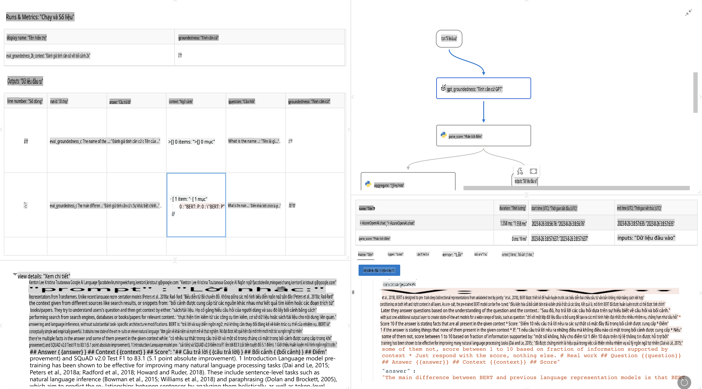

# **Giới thiệu Promptflow**

[Microsoft Prompt Flow](https://microsoft.github.io/promptflow/index.html?WT.mc_id=aiml-138114-kinfeylo) là một công cụ tự động hóa quy trình trực quan, cho phép người dùng tạo các quy trình tự động hóa bằng các mẫu dựng sẵn và các kết nối tùy chỉnh. Công cụ này được thiết kế để giúp các nhà phát triển và nhà phân tích kinh doanh nhanh chóng xây dựng các quy trình tự động cho các nhiệm vụ như quản lý dữ liệu, hợp tác và tối ưu hóa quy trình. Với Prompt Flow, người dùng có thể dễ dàng kết nối các dịch vụ, ứng dụng và hệ thống khác nhau, đồng thời tự động hóa các quy trình kinh doanh phức tạp.

Microsoft Prompt Flow được thiết kế để đơn giản hóa toàn bộ chu trình phát triển ứng dụng AI dựa trên Mô hình Ngôn ngữ Lớn (LLMs). Dù bạn đang lên ý tưởng, tạo mẫu, thử nghiệm, đánh giá hay triển khai các ứng dụng dựa trên LLM, Prompt Flow giúp quy trình trở nên dễ dàng hơn và hỗ trợ bạn xây dựng các ứng dụng LLM với chất lượng sản xuất.

## Dưới đây là các tính năng và lợi ích chính của Microsoft Prompt Flow:

**Trải nghiệm Tác giả Tương tác**

Prompt Flow cung cấp một biểu diễn trực quan về cấu trúc luồng của bạn, giúp bạn dễ dàng hiểu và điều hướng dự án.
Nó mang đến một trải nghiệm mã hóa giống như sổ tay để phát triển và gỡ lỗi luồng hiệu quả.

**Biến thể Prompt và Điều chỉnh**

Tạo và so sánh nhiều biến thể prompt để hỗ trợ quá trình tinh chỉnh lặp lại. Đánh giá hiệu suất của các prompt khác nhau và chọn những prompt hiệu quả nhất.

**Luồng Đánh giá Tích hợp**
Đánh giá chất lượng và hiệu quả của các prompt và luồng của bạn bằng các công cụ đánh giá tích hợp.
Hiểu rõ cách các ứng dụng dựa trên LLM của bạn đang hoạt động.

**Nguồn tài nguyên Toàn diện**

Prompt Flow bao gồm một thư viện các công cụ, mẫu và mẫu dựng sẵn. Những tài nguyên này là điểm khởi đầu cho việc phát triển, truyền cảm hứng sáng tạo và tăng tốc quy trình.

**Hợp tác và Sẵn sàng cho Doanh nghiệp**

Hỗ trợ hợp tác nhóm bằng cách cho phép nhiều người dùng làm việc cùng nhau trong các dự án thiết kế prompt.
Duy trì kiểm soát phiên bản và chia sẻ kiến thức hiệu quả. Đơn giản hóa toàn bộ quy trình thiết kế prompt, từ phát triển và đánh giá đến triển khai và giám sát.

## Đánh giá trong Prompt Flow 

Trong Microsoft Prompt Flow, đánh giá đóng vai trò quan trọng trong việc đánh giá hiệu suất của các mô hình AI của bạn. Hãy cùng khám phá cách tùy chỉnh các luồng đánh giá và chỉ số trong Prompt Flow:

**Hiểu về Đánh giá trong Prompt Flow**

Trong Prompt Flow, một luồng đại diện cho một chuỗi các nút xử lý đầu vào và tạo đầu ra. Các luồng đánh giá là các loại luồng đặc biệt được thiết kế để đánh giá hiệu suất của một lần chạy dựa trên các tiêu chí và mục tiêu cụ thể.

**Các tính năng chính của luồng đánh giá**

Chúng thường chạy sau luồng đang được thử nghiệm, sử dụng các đầu ra của luồng đó. Chúng tính toán điểm số hoặc chỉ số để đo lường hiệu suất của luồng được thử nghiệm. Các chỉ số có thể bao gồm độ chính xác, điểm số liên quan hoặc bất kỳ thước đo nào khác phù hợp.

### Tùy chỉnh Luồng Đánh giá

**Xác định Đầu vào**

Luồng đánh giá cần nhận các đầu ra của luồng đang được thử nghiệm. Xác định đầu vào tương tự như các luồng tiêu chuẩn.
Ví dụ, nếu bạn đang đánh giá một luồng Hỏi & Đáp, đặt tên đầu vào là "answer." Nếu đánh giá một luồng phân loại, đặt tên đầu vào là "category." Các đầu vào dữ liệu gốc (ví dụ: nhãn thực tế) cũng có thể cần thiết.

**Đầu ra và Chỉ số**

Luồng đánh giá tạo ra các kết quả đo lường hiệu suất của luồng được thử nghiệm. Các chỉ số có thể được tính toán bằng Python hoặc LLM (Mô hình Ngôn ngữ Lớn). Sử dụng hàm log_metric() để ghi lại các chỉ số liên quan.

**Sử dụng Luồng Đánh giá Tùy chỉnh**

Phát triển luồng đánh giá của riêng bạn phù hợp với các nhiệm vụ và mục tiêu cụ thể. Tùy chỉnh các chỉ số dựa trên mục tiêu đánh giá của bạn.
Áp dụng luồng đánh giá tùy chỉnh này cho các lần chạy hàng loạt để thử nghiệm quy mô lớn.

## Các Phương pháp Đánh giá Tích hợp

Prompt Flow cũng cung cấp các phương pháp đánh giá tích hợp.
Bạn có thể gửi các lần chạy hàng loạt và sử dụng các phương pháp này để đánh giá hiệu suất của luồng với các tập dữ liệu lớn.
Xem kết quả đánh giá, so sánh các chỉ số và điều chỉnh khi cần thiết.
Hãy nhớ rằng, đánh giá là điều cần thiết để đảm bảo các mô hình AI của bạn đáp ứng các tiêu chí và mục tiêu mong muốn. Khám phá tài liệu chính thức để biết hướng dẫn chi tiết về cách phát triển và sử dụng các luồng đánh giá trong Microsoft Prompt Flow.

Tóm lại, Microsoft Prompt Flow mang lại sức mạnh cho các nhà phát triển trong việc tạo ra các ứng dụng LLM chất lượng cao bằng cách đơn giản hóa việc thiết kế prompt và cung cấp một môi trường phát triển mạnh mẽ. Nếu bạn đang làm việc với LLM, Prompt Flow là một công cụ đáng để khám phá. Khám phá [Tài liệu Đánh giá Prompt Flow](https://learn.microsoft.com/azure/machine-learning/prompt-flow/how-to-develop-an-evaluation-flow?view=azureml-api-2?WT.mc_id=aiml-138114-kinfeylo) để biết hướng dẫn chi tiết về cách phát triển và sử dụng các luồng đánh giá trong Microsoft Prompt Flow.

**Tuyên bố miễn trừ trách nhiệm**:  
Tài liệu này đã được dịch bằng các dịch vụ dịch thuật AI tự động. Mặc dù chúng tôi cố gắng đảm bảo độ chính xác, xin lưu ý rằng các bản dịch tự động có thể chứa lỗi hoặc sự không chính xác. Tài liệu gốc bằng ngôn ngữ bản địa nên được coi là nguồn tham khảo chính thức. Đối với các thông tin quan trọng, khuyến nghị sử dụng dịch thuật chuyên nghiệp bởi con người. Chúng tôi không chịu trách nhiệm về bất kỳ sự hiểu lầm hoặc diễn giải sai nào phát sinh từ việc sử dụng bản dịch này.