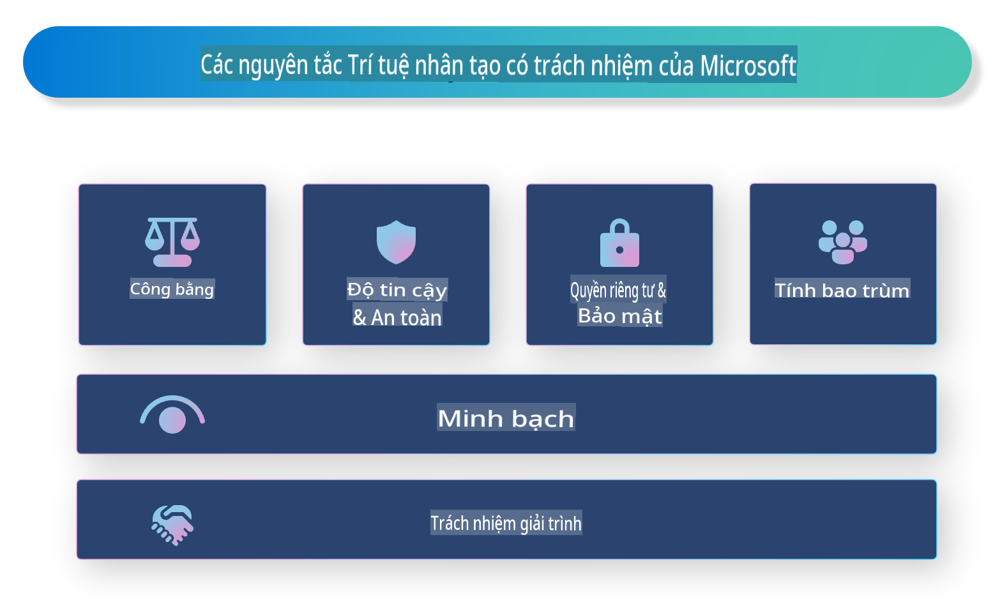

# **Giới thiệu về AI có trách nhiệm**

[Microsoft Responsible AI](https://www.microsoft.com/ai/responsible-ai?WT.mc_id=aiml-138114-kinfeylo) là một sáng kiến nhằm hỗ trợ các nhà phát triển và tổ chức xây dựng các hệ thống AI minh bạch, đáng tin cậy và có trách nhiệm. Sáng kiến này cung cấp hướng dẫn và tài nguyên để phát triển các giải pháp AI có trách nhiệm, tuân theo các nguyên tắc đạo đức như quyền riêng tư, công bằng và minh bạch. Chúng ta cũng sẽ khám phá một số thách thức và các thực tiễn tốt nhất liên quan đến việc xây dựng các hệ thống AI có trách nhiệm.

## Tổng quan về Microsoft Responsible AI

**Nguyên tắc đạo đức**

Microsoft Responsible AI được dẫn dắt bởi một tập hợp các nguyên tắc đạo đức, bao gồm quyền riêng tư, công bằng, minh bạch, trách nhiệm và an toàn. Những nguyên tắc này được thiết kế để đảm bảo rằng các hệ thống AI được phát triển một cách có đạo đức và có trách nhiệm.

**AI minh bạch**

Microsoft Responsible AI nhấn mạnh tầm quan trọng của tính minh bạch trong các hệ thống AI. Điều này bao gồm việc cung cấp các giải thích rõ ràng về cách các mô hình AI hoạt động, cũng như đảm bảo rằng các nguồn dữ liệu và thuật toán được công khai.

**AI có trách nhiệm**

[Microsoft Responsible AI](https://www.microsoft.com/ai/responsible-ai?WT.mc_id=aiml-138114-kinfeylo) thúc đẩy việc phát triển các hệ thống AI có trách nhiệm, có khả năng cung cấp những hiểu biết về cách các mô hình AI đưa ra quyết định. Điều này giúp người dùng hiểu và tin tưởng vào các kết quả đầu ra của hệ thống AI.

**Tính bao trùm**

Các hệ thống AI nên được thiết kế để mang lại lợi ích cho tất cả mọi người. Microsoft hướng đến việc tạo ra AI bao trùm, xem xét các quan điểm đa dạng và tránh thiên vị hoặc phân biệt đối xử.

**Độ tin cậy và an toàn**

Đảm bảo rằng các hệ thống AI đáng tin cậy và an toàn là điều rất quan trọng. Microsoft tập trung vào việc xây dựng các mô hình mạnh mẽ, hoạt động ổn định và tránh các hậu quả gây hại.

**Công bằng trong AI**

Microsoft Responsible AI nhận thức rằng các hệ thống AI có thể duy trì sự thiên vị nếu được huấn luyện trên dữ liệu hoặc thuật toán thiên lệch. Sáng kiến này cung cấp hướng dẫn để phát triển các hệ thống AI công bằng, không phân biệt dựa trên các yếu tố như chủng tộc, giới tính hoặc tuổi tác.

**Quyền riêng tư và bảo mật**

Microsoft Responsible AI nhấn mạnh tầm quan trọng của việc bảo vệ quyền riêng tư và an ninh dữ liệu của người dùng trong các hệ thống AI. Điều này bao gồm việc triển khai mã hóa dữ liệu mạnh mẽ và kiểm soát truy cập, cũng như thường xuyên kiểm tra các hệ thống AI để phát hiện lỗ hổng.

**Trách nhiệm và nghĩa vụ**

Microsoft Responsible AI thúc đẩy trách nhiệm và nghĩa vụ trong việc phát triển và triển khai AI. Điều này bao gồm việc đảm bảo rằng các nhà phát triển và tổ chức nhận thức được các rủi ro tiềm ẩn liên quan đến các hệ thống AI và thực hiện các biện pháp để giảm thiểu các rủi ro đó.

## Các thực tiễn tốt nhất để xây dựng hệ thống AI có trách nhiệm

**Phát triển mô hình AI bằng cách sử dụng tập dữ liệu đa dạng**

Để tránh thiên vị trong các hệ thống AI, điều quan trọng là sử dụng các tập dữ liệu đa dạng, đại diện cho nhiều quan điểm và trải nghiệm khác nhau.

**Sử dụng các kỹ thuật AI có thể giải thích**

Các kỹ thuật AI có thể giải thích giúp người dùng hiểu cách các mô hình AI đưa ra quyết định, từ đó tăng cường sự tin tưởng vào hệ thống.

**Thường xuyên kiểm tra các hệ thống AI để phát hiện lỗ hổng**

Việc kiểm tra định kỳ các hệ thống AI giúp phát hiện các rủi ro và lỗ hổng tiềm ẩn cần được khắc phục.

**Triển khai mã hóa dữ liệu mạnh mẽ và kiểm soát truy cập**

Mã hóa dữ liệu và kiểm soát truy cập giúp bảo vệ quyền riêng tư và an ninh của người dùng trong các hệ thống AI.

**Tuân theo các nguyên tắc đạo đức trong phát triển AI**

Tuân theo các nguyên tắc đạo đức như công bằng, minh bạch và trách nhiệm giúp xây dựng niềm tin vào các hệ thống AI và đảm bảo rằng chúng được phát triển một cách có trách nhiệm.

## Sử dụng AI Foundry để phát triển AI có trách nhiệm

[Azure AI Foundry](https://ai.azure.com?WT.mc_id=aiml-138114-kinfeylo) là một nền tảng mạnh mẽ cho phép các nhà phát triển và tổ chức nhanh chóng tạo ra các ứng dụng thông minh, tiên tiến, sẵn sàng ra thị trường và có trách nhiệm. Dưới đây là một số tính năng và khả năng chính của Azure AI Foundry:

**Các API và mô hình có sẵn**

Azure AI Foundry cung cấp các API và mô hình được xây dựng sẵn và có thể tùy chỉnh. Chúng bao gồm nhiều nhiệm vụ AI, như AI tạo nội dung, xử lý ngôn ngữ tự nhiên cho hội thoại, tìm kiếm, giám sát, dịch thuật, giọng nói, thị giác và ra quyết định.

**Prompt Flow**

Prompt flow trong Azure AI Foundry cho phép bạn tạo các trải nghiệm AI hội thoại. Nó giúp bạn thiết kế và quản lý các luồng hội thoại, giúp việc xây dựng chatbot, trợ lý ảo và các ứng dụng tương tác khác trở nên dễ dàng hơn.

**Kỹ thuật Retrieval Augmented Generation (RAG)**

RAG là một kỹ thuật kết hợp các phương pháp dựa trên truy xuất và dựa trên tạo sinh. Nó nâng cao chất lượng các phản hồi được tạo ra bằng cách tận dụng cả kiến thức có sẵn (truy xuất) và khả năng sáng tạo (tạo sinh).

**Công cụ đánh giá và giám sát cho AI tạo nội dung**

Azure AI Foundry cung cấp các công cụ để đánh giá và giám sát các mô hình AI tạo nội dung. Bạn có thể đánh giá hiệu suất, công bằng và các chỉ số quan trọng khác để đảm bảo triển khai có trách nhiệm. Ngoài ra, nếu bạn đã tạo một bảng điều khiển, bạn có thể sử dụng giao diện không cần mã trong Azure Machine Learning Studio để tùy chỉnh và tạo Bảng điều khiển AI có trách nhiệm và bảng điểm liên quan dựa trên các thư viện Python của [Responsible AI Toolbox](https://responsibleaitoolbox.ai/?WT.mc_id=aiml-138114-kinfeylo). Bảng điểm này giúp bạn chia sẻ các thông tin chính liên quan đến công bằng, tầm quan trọng của đặc trưng và các cân nhắc triển khai có trách nhiệm khác với cả các bên kỹ thuật và phi kỹ thuật.

Để sử dụng AI Foundry cùng với AI có trách nhiệm, bạn có thể tuân theo các thực tiễn tốt nhất sau:

**Xác định vấn đề và mục tiêu của hệ thống AI**

Trước khi bắt đầu quá trình phát triển, điều quan trọng là xác định rõ vấn đề hoặc mục tiêu mà hệ thống AI của bạn hướng đến giải quyết. Điều này giúp bạn xác định dữ liệu, thuật toán và tài nguyên cần thiết để xây dựng một mô hình hiệu quả.

**Thu thập và tiền xử lý dữ liệu liên quan**

Chất lượng và số lượng dữ liệu được sử dụng để huấn luyện một hệ thống AI có ảnh hưởng lớn đến hiệu suất của nó. Do đó, điều quan trọng là thu thập dữ liệu liên quan, làm sạch, tiền xử lý và đảm bảo rằng dữ liệu đại diện cho dân số hoặc vấn đề bạn đang cố gắng giải quyết.

**Chọn thuật toán đánh giá phù hợp**

Có nhiều thuật toán đánh giá khác nhau. Điều quan trọng là chọn thuật toán phù hợp nhất dựa trên dữ liệu và vấn đề của bạn.

**Đánh giá và giải thích mô hình**

Sau khi xây dựng mô hình AI, việc đánh giá hiệu suất của nó bằng các chỉ số phù hợp và giải thích kết quả một cách minh bạch là rất quan trọng. Điều này giúp bạn xác định bất kỳ thiên vị hoặc hạn chế nào trong mô hình và thực hiện các cải tiến cần thiết.

**Đảm bảo tính minh bạch và khả năng giải thích**

Các hệ thống AI cần minh bạch và có khả năng giải thích để người dùng hiểu cách chúng hoạt động và cách các quyết định được đưa ra. Điều này đặc biệt quan trọng đối với các ứng dụng có ảnh hưởng lớn đến cuộc sống con người, như chăm sóc sức khỏe, tài chính và hệ thống pháp lý.

**Giám sát và cập nhật mô hình**

Các hệ thống AI cần được giám sát và cập nhật liên tục để đảm bảo rằng chúng vẫn chính xác và hiệu quả theo thời gian. Điều này yêu cầu bảo trì, kiểm tra và huấn luyện lại mô hình liên tục.

Tóm lại, Microsoft Responsible AI là một sáng kiến nhằm hỗ trợ các nhà phát triển và tổ chức xây dựng các hệ thống AI minh bạch, đáng tin cậy và có trách nhiệm. Hãy nhớ rằng việc triển khai AI có trách nhiệm là điều rất quan trọng, và Azure AI Foundry hướng đến việc biến điều này thành hiện thực cho các tổ chức. Bằng cách tuân theo các nguyên tắc đạo đức và các thực tiễn tốt nhất, chúng ta có thể đảm bảo rằng các hệ thống AI được phát triển và triển khai một cách có trách nhiệm, mang lại lợi ích cho toàn xã hội.

**Tuyên bố miễn trừ trách nhiệm**:  
Tài liệu này đã được dịch bằng các dịch vụ dịch thuật AI dựa trên máy móc. Mặc dù chúng tôi cố gắng đảm bảo độ chính xác, xin lưu ý rằng các bản dịch tự động có thể chứa lỗi hoặc sự không chính xác. Tài liệu gốc bằng ngôn ngữ bản địa nên được coi là nguồn thông tin chính thức. Đối với thông tin quan trọng, nên sử dụng dịch vụ dịch thuật chuyên nghiệp bởi con người. Chúng tôi không chịu trách nhiệm cho bất kỳ sự hiểu lầm hoặc diễn giải sai nào phát sinh từ việc sử dụng bản dịch này.