# Tinh chỉnh và tích hợp các mô hình Phi-3 tùy chỉnh với Prompt flow

Mẫu end-to-end (E2E) này dựa trên hướng dẫn "[Fine-Tune and Integrate Custom Phi-3 Models with Prompt Flow: Step-by-Step Guide](https://techcommunity.microsoft.com/t5/educator-developer-blog/fine-tune-and-integrate-custom-phi-3-models-with-prompt-flow/ba-p/4178612?WT.mc_id=aiml-137032-kinfeylo)" từ Microsoft Tech Community. Nó giới thiệu các quy trình tinh chỉnh, triển khai và tích hợp các mô hình Phi-3 tùy chỉnh với Prompt flow.

## Tổng quan

Trong mẫu E2E này, bạn sẽ học cách tinh chỉnh mô hình Phi-3 và tích hợp nó với Prompt flow. Bằng cách sử dụng Azure Machine Learning và Prompt flow, bạn sẽ thiết lập quy trình làm việc để triển khai và sử dụng các mô hình AI tùy chỉnh. Mẫu E2E này được chia thành ba kịch bản:

**Kịch bản 1: Thiết lập tài nguyên Azure và chuẩn bị cho việc tinh chỉnh**

**Kịch bản 2: Tinh chỉnh mô hình Phi-3 và triển khai trong Azure Machine Learning Studio**

**Kịch bản 3: Tích hợp với Prompt flow và trò chuyện với mô hình tùy chỉnh của bạn**

Dưới đây là tổng quan về mẫu E2E này.

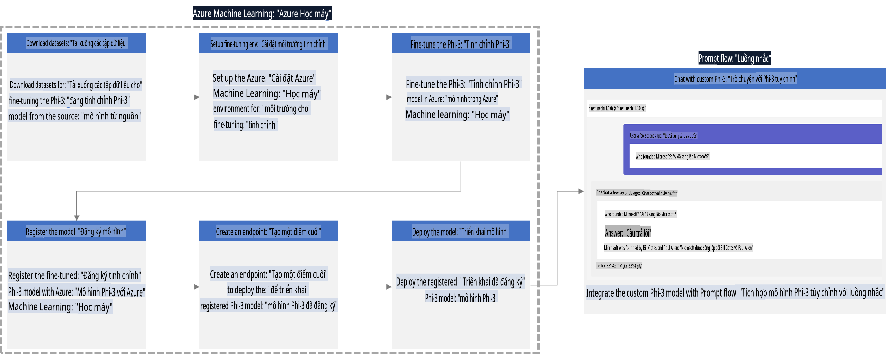

### Mục lục

1. **[Kịch bản 1: Thiết lập tài nguyên Azure và chuẩn bị cho việc tinh chỉnh](../../../../../../md/02.Application/01.TextAndChat/Phi3)**
    - [Tạo Azure Machine Learning Workspace](../../../../../../md/02.Application/01.TextAndChat/Phi3)
    - [Yêu cầu hạn ngạch GPU trong Azure Subscription](../../../../../../md/02.Application/01.TextAndChat/Phi3)
    - [Thêm phân quyền vai trò](../../../../../../md/02.Application/01.TextAndChat/Phi3)
    - [Thiết lập dự án](../../../../../../md/02.Application/01.TextAndChat/Phi3)
    - [Chuẩn bị dữ liệu cho việc tinh chỉnh](../../../../../../md/02.Application/01.TextAndChat/Phi3)

1. **[Kịch bản 2: Tinh chỉnh mô hình Phi-3 và triển khai trong Azure Machine Learning Studio](../../../../../../md/02.Application/01.TextAndChat/Phi3)**
    - [Thiết lập Azure CLI](../../../../../../md/02.Application/01.TextAndChat/Phi3)
    - [Tinh chỉnh mô hình Phi-3](../../../../../../md/02.Application/01.TextAndChat/Phi3)
    - [Triển khai mô hình đã tinh chỉnh](../../../../../../md/02.Application/01.TextAndChat/Phi3)

1. **[Kịch bản 3: Tích hợp với Prompt flow và trò chuyện với mô hình tùy chỉnh của bạn](../../../../../../md/02.Application/01.TextAndChat/Phi3)**
    - [Tích hợp mô hình Phi-3 tùy chỉnh với Prompt flow](../../../../../../md/02.Application/01.TextAndChat/Phi3)
    - [Trò chuyện với mô hình tùy chỉnh của bạn](../../../../../../md/02.Application/01.TextAndChat/Phi3)

## Kịch bản 1: Thiết lập tài nguyên Azure và chuẩn bị cho việc tinh chỉnh

### Tạo Azure Machine Learning Workspace

1. Gõ *azure machine learning* vào **thanh tìm kiếm** ở đầu trang cổng và chọn **Azure Machine Learning** từ các tùy chọn xuất hiện.

    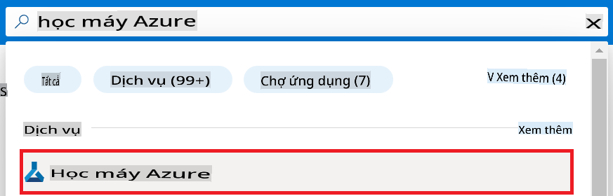

1. Chọn **+ Create** từ menu điều hướng.

1. Chọn **New workspace** từ menu điều hướng.

    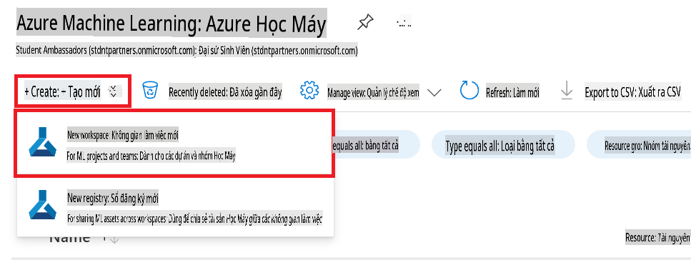

1. Thực hiện các tác vụ sau:

    - Chọn **Subscription** Azure của bạn.
    - Chọn **Resource group** để sử dụng (tạo mới nếu cần).
    - Nhập **Workspace Name**. Giá trị này phải là duy nhất.
    - Chọn **Region** bạn muốn sử dụng.
    - Chọn **Storage account** để sử dụng (tạo mới nếu cần).
    - Chọn **Key vault** để sử dụng (tạo mới nếu cần).
    - Chọn **Application insights** để sử dụng (tạo mới nếu cần).
    - Chọn **Container registry** để sử dụng (tạo mới nếu cần).

    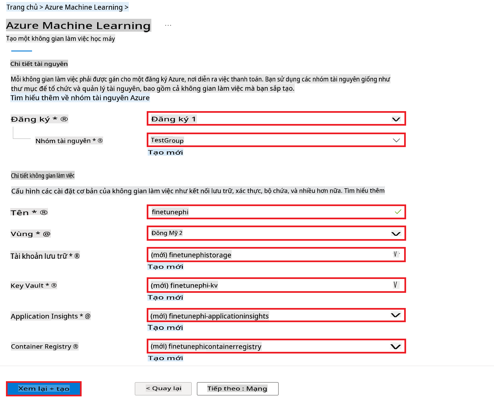

1. Chọn **Review + Create**.

1. Chọn **Create**.

### Yêu cầu hạn ngạch GPU trong Azure Subscription

Trong mẫu E2E này, bạn sẽ sử dụng GPU *Standard_NC24ads_A100_v4* để tinh chỉnh, yêu cầu một yêu cầu hạn ngạch, và CPU *Standard_E4s_v3* để triển khai, không yêu cầu hạn ngạch.

> [!NOTE]
>
> Chỉ các loại đăng ký Pay-As-You-Go (loại đăng ký tiêu chuẩn) mới đủ điều kiện để cấp phát GPU; các đăng ký lợi ích hiện không được hỗ trợ.
>
> Đối với những người sử dụng đăng ký lợi ích (như Visual Studio Enterprise Subscription) hoặc muốn nhanh chóng thử nghiệm quá trình tinh chỉnh và triển khai, hướng dẫn này cũng cung cấp hướng dẫn tinh chỉnh với tập dữ liệu nhỏ bằng CPU. Tuy nhiên, cần lưu ý rằng kết quả tinh chỉnh tốt hơn đáng kể khi sử dụng GPU với các tập dữ liệu lớn.

1. Truy cập [Azure ML Studio](https://ml.azure.com/home?wt.mc_id=studentamb_279723).

1. Thực hiện các tác vụ sau để yêu cầu hạn ngạch *Standard NCADSA100v4 Family*:

    - Chọn **Quota** từ tab bên trái.
    - Chọn **Virtual machine family** để sử dụng. Ví dụ, chọn **Standard NCADSA100v4 Family Cluster Dedicated vCPUs**, bao gồm GPU *Standard_NC24ads_A100_v4*.
    - Chọn **Request quota** từ menu điều hướng.

        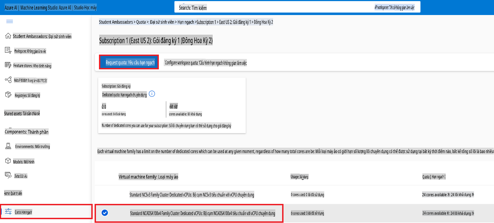

    - Trong trang Request quota, nhập **New cores limit** bạn muốn sử dụng. Ví dụ, 24.
    - Trong trang Request quota, chọn **Submit** để yêu cầu hạn ngạch GPU.

> [!NOTE]
> Bạn có thể chọn GPU hoặc CPU phù hợp với nhu cầu của mình bằng cách tham khảo tài liệu [Sizes for Virtual Machines in Azure](https://learn.microsoft.com/azure/virtual-machines/sizes/overview?tabs=breakdownseries%2Cgeneralsizelist%2Ccomputesizelist%2Cmemorysizelist%2Cstoragesizelist%2Cgpusizelist%2Cfpgasizelist%2Chpcsizelist).

### Thêm phân quyền vai trò

Để tinh chỉnh và triển khai các mô hình của bạn, trước tiên bạn phải tạo một User Assigned Managed Identity (UAI) và gán cho nó các quyền thích hợp. UAI này sẽ được sử dụng để xác thực trong quá trình triển khai.

#### Tạo User Assigned Managed Identity (UAI)

1. Gõ *managed identities* vào **thanh tìm kiếm** ở đầu trang cổng và chọn **Managed Identities** từ các tùy chọn xuất hiện.

    

1. Chọn **+ Create**.

    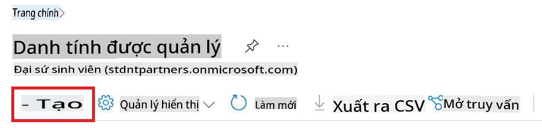

1. Thực hiện các tác vụ sau:

    - Chọn **Subscription** Azure của bạn.
    - Chọn **Resource group** để sử dụng (tạo mới nếu cần).
    - Chọn **Region** bạn muốn sử dụng.
    - Nhập **Name**. Giá trị này phải là duy nhất.

1. Chọn **Review + create**.

1. Chọn **+ Create**.

#### Thêm vai trò Contributor cho Managed Identity

1. Điều hướng đến tài nguyên Managed Identity mà bạn đã tạo.

1. Chọn **Azure role assignments** từ tab bên trái.

1. Chọn **+Add role assignment** từ menu điều hướng.

1. Trong trang Add role assignment, thực hiện các tác vụ sau:
    - Chọn **Scope** là **Resource group**.
    - Chọn **Subscription** Azure của bạn.
    - Chọn **Resource group** để sử dụng.
    - Chọn **Role** là **Contributor**.

    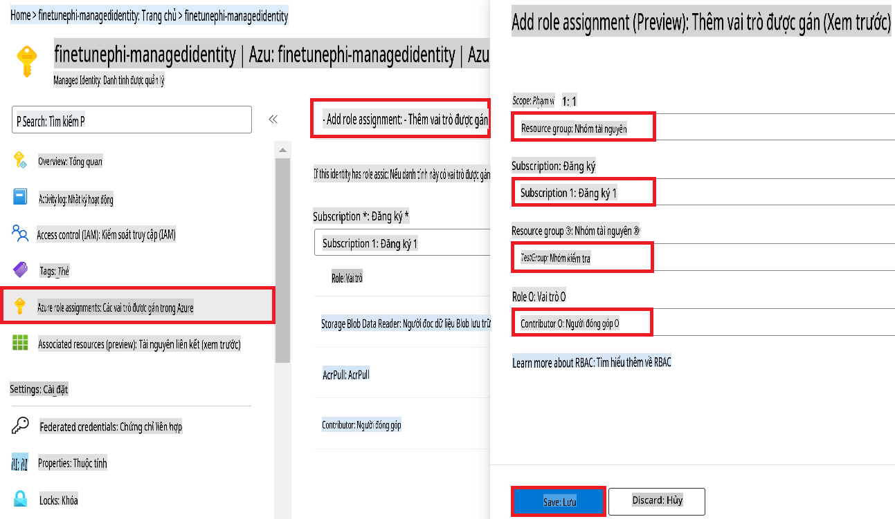

1. Chọn **Save**.

#### Thêm vai trò Storage Blob Data Reader cho Managed Identity

1. Gõ *storage accounts* vào **thanh tìm kiếm** ở đầu trang cổng và chọn **Storage accounts** từ các tùy chọn xuất hiện.

    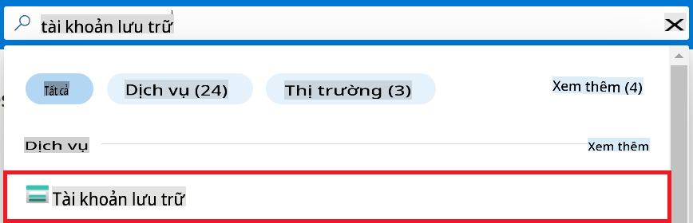

1. Chọn tài khoản lưu trữ được liên kết với Azure Machine Learning workspace mà bạn đã tạo. Ví dụ, *finetunephistorage*.

1. Thực hiện các tác vụ sau để điều hướng đến trang Add role assignment:

    - Điều hướng đến tài khoản lưu trữ Azure mà bạn đã tạo.
    - Chọn **Access Control (IAM)** từ tab bên trái.
    - Chọn **+ Add** từ menu điều hướng.
    - Chọn **Add role assignment** từ menu điều hướng.

    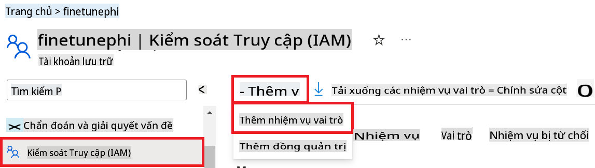

1. Trong trang Add role assignment, thực hiện các tác vụ sau:

    - Trong trang Role, gõ *Storage Blob Data Reader* vào **thanh tìm kiếm** và chọn **Storage Blob Data Reader** từ các tùy chọn xuất hiện.
    - Trong trang Role, chọn **Next**.
    - Trong trang Members, chọn **Assign access to** là **Managed identity**.
    - Trong trang Members, chọn **+ Select members**.
    - Trong trang Select managed identities, chọn **Subscription** Azure của bạn.
    - Trong trang Select managed identities, chọn **Managed identity** là **Manage Identity**.
    - Trong trang Select managed identities, chọn Managed Identity mà bạn đã tạo. Ví dụ, *finetunephi-managedidentity*.
    - Trong trang Select managed identities, chọn **Select**.

    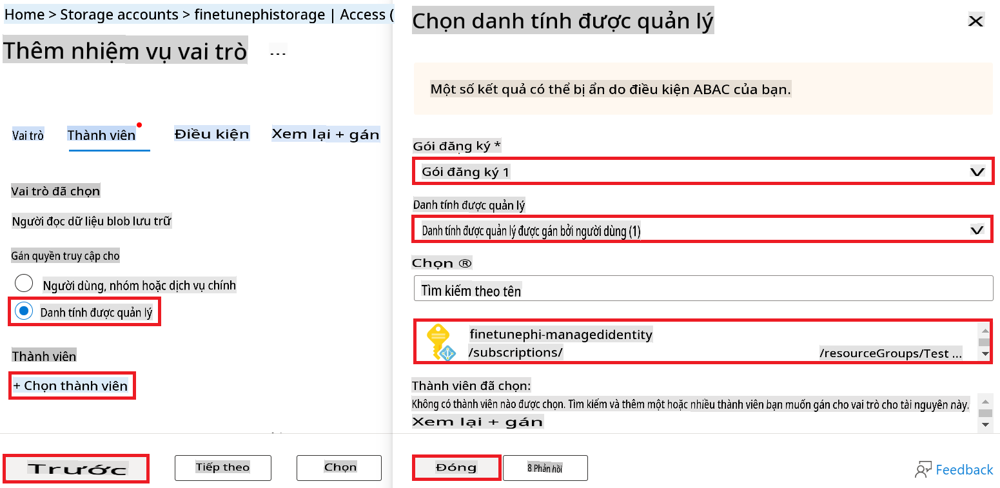

1. Chọn **Review + assign**.

#### Thêm vai trò AcrPull cho Managed Identity

1. Gõ *container registries* vào **thanh tìm kiếm** ở đầu trang cổng và chọn **Container registries** từ các tùy chọn xuất hiện.

    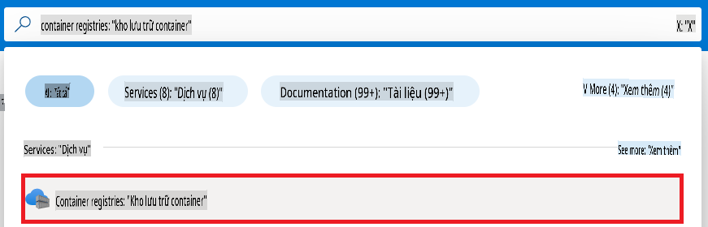

1. Chọn container registry được liên kết với Azure Machine Learning workspace. Ví dụ, *finetunephicontainerregistries*.

1. Thực hiện các tác vụ sau để điều hướng đến trang Add role assignment:

    - Chọn **Access Control (IAM)** từ tab bên trái.
    - Chọn **+ Add** từ menu điều hướng.
    - Chọn **Add role assignment** từ menu điều hướng.

1. Trong trang Add role assignment, thực hiện các tác vụ sau:

    - Trong trang Role, gõ *AcrPull* vào **thanh tìm kiếm** và chọn **AcrPull** từ các tùy chọn xuất hiện.
    - Trong trang Role, chọn **Next**.
    - Trong trang Members, chọn **Assign access to** là **Managed identity**.
    - Trong trang Members, chọn **+ Select members**.
    - Trong trang Select managed identities, chọn **Subscription** Azure của bạn.
    - Trong trang Select managed identities, chọn **Managed identity** là **Manage Identity**.
    - Trong trang Select managed identities, chọn Managed Identity mà bạn đã tạo. Ví dụ, *finetunephi-managedidentity*.
    - Trong trang Select managed identities, chọn **Select**.
    - Chọn **Review + assign**.

### Thiết lập dự án

Bây giờ, bạn sẽ tạo một thư mục để làm việc và thiết lập một môi trường ảo để phát triển một chương trình tương tác với người dùng và sử dụng lịch sử trò chuyện được lưu trữ từ Azure Cosmos DB để cung cấp thông tin cho các phản hồi.

#### Tạo một thư mục để làm việc bên trong nó

1. Mở cửa sổ terminal và gõ lệnh sau để tạo thư mục tên là *finetune-phi* trong đường dẫn mặc định.

    ```console
    mkdir finetune-phi
    ```

1. Gõ lệnh sau trong terminal của bạn để điều hướng đến thư mục *finetune-phi* mà bạn đã tạo.

    ```console
    cd finetune-phi
    ```

#### Tạo môi trường ảo

1. Gõ lệnh sau trong terminal của bạn để tạo môi trường ảo tên là *.venv*.

    ```console
    python -m venv .venv
    ```

1. Gõ lệnh sau trong terminal của bạn để kích hoạt môi trường ảo.

    ```console
    .venv\Scripts\activate.bat
    ```

> [!NOTE]
>
> Nếu thành công, bạn sẽ thấy *(.venv)* trước dấu nhắc lệnh.

#### Cài đặt các gói cần thiết

1. Gõ các lệnh sau trong terminal của bạn để cài đặt các gói cần thiết.

    ```console
    pip install datasets==2.19.1
    pip install transformers==4.41.1
    pip install azure-ai-ml==1.16.0
    pip install torch==2.3.1
    pip install trl==0.9.4
    pip install promptflow==1.12.0
    ```

#### Tạo các tệp dự án

Trong bài tập này, bạn sẽ tạo các tệp thiết yếu cho dự án của mình. Các tệp này bao gồm các tập lệnh để tải xuống tập dữ liệu, thiết lập môi trường Azure Machine Learning, tinh chỉnh mô hình Phi-3 và triển khai mô hình đã tinh chỉnh. Bạn cũng sẽ tạo tệp *conda.yml* để thiết lập môi trường tinh chỉnh.

Trong bài tập này, bạn sẽ:

- Tạo tệp *download_dataset.py* để tải xuống tập dữ liệu.
- Tạo tệp *setup_ml.py* để thiết lập môi trường Azure Machine Learning.
- Tạo tệp *fine_tune.py* trong thư mục *finetuning_dir* để tinh chỉnh mô hình Phi-3 bằng tập dữ liệu.
- Tạo tệp *conda.yml* để thiết lập môi trường tinh chỉnh.
- Tạo tệp *deploy_model.py* để triển khai mô hình đã tinh chỉnh.
- Tạo tệp *integrate_with_promptflow.py* để tích hợp mô hình đã tinh chỉnh và thực thi mô hình bằng Prompt flow.
- Tạo tệp *flow.dag.yml* để thiết lập cấu trúc quy trình làm việc cho Prompt flow.
- Tạo tệp *config.py* để nhập thông tin Azure.

> [!NOTE]
>
> Cấu trúc thư mục hoàn chỉnh:
>
> ```text
> └── YourUserName
> .    └── finetune-phi
> .        ├── finetuning_dir
> .        │      └── fine_tune.py
> .        ├── conda.yml
> .        ├── config.py
> .        ├── deploy_model.py
> .        ├── download_dataset.py
> .        ├── flow.dag.yml
> .        ├── integrate_with_promptflow.py
> .        └── setup_ml.py
> ```

1. Mở **Visual Studio Code**.

1. Chọn **File** từ thanh menu.

1. Chọn **Open Folder**.

1. Chọn thư mục *finetune-phi* mà bạn đã tạo, nằm tại *C:\Users\yourUserName\finetune-phi*.

    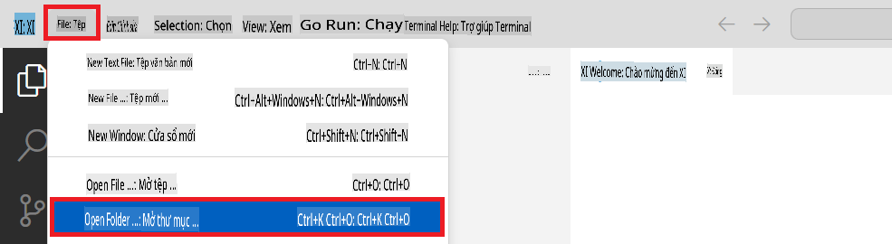

1. Trong ngăn bên trái của Visual Studio Code, nhấp chuột phải và chọn **New File** để tạo tệp mới tên là *download_dataset.py*.

1. Trong ngăn bên trái của Visual Studio Code, nhấp chuột phải và chọn **New File** để tạo tệp mới tên là *setup_ml.py*.

1. Trong ngăn bên trái của Visual Studio Code, nhấp chuột phải và chọn **New File** để tạo tệp mới tên là *deploy_model.py*.

    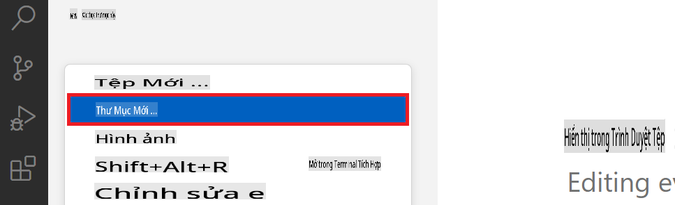

1. Trong ngăn bên trái của Visual Studio Code, nhấp chuột phải và chọn **New Folder** để tạo thư mục mới tên là *finetuning_dir*.

1. Trong thư mục *finetuning_dir*, tạo tệp mới tên là *fine_tune.py*.

#### Tạo và cấu hình tệp *conda.yml*

1. Trong ngăn bên trái của Visual Studio Code, nhấp chuột phải và chọn **New File** để tạo tệp mới tên là *conda.yml*.

1. Thêm đoạn mã sau vào tệp *conda.yml* để thiết lập môi trường tinh chỉnh cho mô hình Phi-3.

    ```yml
    name: phi-3-training-env
    channels:
      - defaults
      - conda-forge
    dependencies:
      - python=3.10
      - pip
      - numpy<2.0
      - pip:
          - torch==2.4.0
          - torchvision==0.19.0
          - trl==0.8.6
          - transformers==4.41
          - datasets==2.21.0
          - azureml-core==1.57.0
          - azure-storage-blob==12.19.0
          - azure-ai-ml==1.16
          - azure-identity==1.17.1
          - accelerate==0.33.0
          - mlflow==2.15.1
          - azureml-mlflow==1.57.0
    ```

#### Tạo và cấu hình tệp *config.py*

1. Trong ngăn bên trái của Visual Studio Code, nhấp chuột phải và chọn **New File** để tạo tệp mới tên là *config.py*.

1. Thêm đoạn mã sau vào tệp *config.py* để nhập thông tin Azure của bạn.

    ```python
    # Azure settings
    AZURE_SUBSCRIPTION_ID = "your_subscription_id"
    AZURE_RESOURCE_GROUP_NAME = "your_resource_group_name" # "TestGroup"

    # Azure Machine Learning settings
    AZURE_ML_WORKSPACE_NAME = "your_workspace_name" # "finetunephi-workspace"

    # Azure Managed Identity settings
    AZURE_MANAGED_IDENTITY_CLIENT_ID = "your_azure_managed_identity_client_id"
    AZURE_MANAGED_IDENTITY_NAME = "your_azure_managed_identity_name" # "finetunephi-mangedidentity"
    AZURE_MANAGED_IDENTITY_RESOURCE_ID = f"/subscriptions/{AZURE_SUBSCRIPTION_ID}/resourceGroups/{AZURE_RESOURCE_GROUP_NAME}/providers/Microsoft.ManagedIdentity/userAssignedIdentities/{AZURE_MANAGED_IDENTITY_NAME}"

    # Dataset file paths
    TRAIN_DATA_PATH = "data/train_data.jsonl"
    TEST_DATA_PATH = "data/test_data.jsonl"

    # Fine-tuned model settings
    AZURE_MODEL_NAME = "your_fine_tuned_model_name" # "finetune-phi-model"
    AZURE_ENDPOINT_NAME = "your_fine_tuned_model_endpoint_name" # "finetune-phi-endpoint"
    AZURE_DEPLOYMENT_NAME = "your_fine_tuned_model_deployment_name" # "finetune-phi-deployment"

    AZURE_ML_API_KEY = "your_fine_tuned_model_api_key"
    AZURE_ML_ENDPOINT = "your_fine_tuned_model_endpoint_uri" # "https://{your-endpoint-name}.{your-region}.inference.ml.azure.com/score"
    ```

#### Thêm biến môi trường Azure

1. Thực hiện các tác vụ sau để thêm Azure Subscription ID:

    - Gõ *subscriptions* vào **thanh tìm kiếm** ở đầu trang cổng và chọn **Subscriptions** từ các tùy chọn xuất hiện.
    - Chọn Azure Subscription mà bạn đang sử dụng.
    - Sao chép và dán Subscription ID của bạn vào tệp *config.py*.


1. Thực hiện các bước sau để thêm Tên Azure Workspace:

    - Điều hướng đến tài nguyên Azure Machine Learning mà bạn đã tạo.
    - Sao chép và dán tên tài khoản của bạn vào tệp *config.py*.

    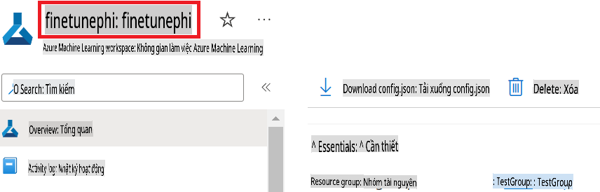

1. Thực hiện các bước sau để thêm Tên Nhóm Tài Nguyên Azure:

    - Điều hướng đến tài nguyên Azure Machine Learning mà bạn đã tạo.
    - Sao chép và dán Tên Nhóm Tài Nguyên Azure của bạn vào tệp *config.py*.

    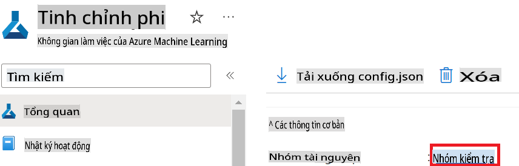

2. Thực hiện các bước sau để thêm tên Azure Managed Identity:

    - Điều hướng đến tài nguyên Managed Identities mà bạn đã tạo.
    - Sao chép và dán tên Azure Managed Identity của bạn vào tệp *config.py*.

    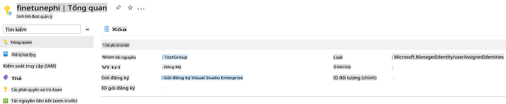

### Chuẩn bị tập dữ liệu để tinh chỉnh

Trong bài tập này, bạn sẽ chạy tệp *download_dataset.py* để tải xuống tập dữ liệu *ULTRACHAT_200k* vào môi trường cục bộ của bạn. Sau đó, bạn sẽ sử dụng tập dữ liệu này để tinh chỉnh mô hình Phi-3 trong Azure Machine Learning.

#### Tải tập dữ liệu bằng *download_dataset.py*

1. Mở tệp *download_dataset.py* trong Visual Studio Code.

1. Thêm đoạn mã sau vào *download_dataset.py*.

    ```python
    import json
    import os
    from datasets import load_dataset
    from config import (
        TRAIN_DATA_PATH,
        TEST_DATA_PATH)

    def load_and_split_dataset(dataset_name, config_name, split_ratio):
        """
        Load and split a dataset.
        """
        # Load the dataset with the specified name, configuration, and split ratio
        dataset = load_dataset(dataset_name, config_name, split=split_ratio)
        print(f"Original dataset size: {len(dataset)}")
        
        # Split the dataset into train and test sets (80% train, 20% test)
        split_dataset = dataset.train_test_split(test_size=0.2)
        print(f"Train dataset size: {len(split_dataset['train'])}")
        print(f"Test dataset size: {len(split_dataset['test'])}")
        
        return split_dataset

    def save_dataset_to_jsonl(dataset, filepath):
        """
        Save a dataset to a JSONL file.
        """
        # Create the directory if it does not exist
        os.makedirs(os.path.dirname(filepath), exist_ok=True)
        
        # Open the file in write mode
        with open(filepath, 'w', encoding='utf-8') as f:
            # Iterate over each record in the dataset
            for record in dataset:
                # Dump the record as a JSON object and write it to the file
                json.dump(record, f)
                # Write a newline character to separate records
                f.write('\n')
        
        print(f"Dataset saved to {filepath}")

    def main():
        """
        Main function to load, split, and save the dataset.
        """
        # Load and split the ULTRACHAT_200k dataset with a specific configuration and split ratio
        dataset = load_and_split_dataset("HuggingFaceH4/ultrachat_200k", 'default', 'train_sft[:1%]')
        
        # Extract the train and test datasets from the split
        train_dataset = dataset['train']
        test_dataset = dataset['test']

        # Save the train dataset to a JSONL file
        save_dataset_to_jsonl(train_dataset, TRAIN_DATA_PATH)
        
        # Save the test dataset to a separate JSONL file
        save_dataset_to_jsonl(test_dataset, TEST_DATA_PATH)

    if __name__ == "__main__":
        main()

    ```

> [!TIP]
>
> **Hướng dẫn tinh chỉnh với tập dữ liệu nhỏ sử dụng CPU**
>
> Nếu bạn muốn sử dụng CPU để tinh chỉnh, cách tiếp cận này rất phù hợp cho những người có gói đăng ký lợi ích (chẳng hạn như Visual Studio Enterprise Subscription) hoặc để nhanh chóng thử nghiệm quy trình tinh chỉnh và triển khai.
>
> Thay thế `dataset = load_and_split_dataset("HuggingFaceH4/ultrachat_200k", 'default', 'train_sft[:1%]')` with `dataset = load_and_split_dataset("HuggingFaceH4/ultrachat_200k", 'default', 'train_sft[:10]')`
>

1. Nhập lệnh sau trong terminal của bạn để chạy script và tải tập dữ liệu về môi trường cục bộ.

    ```console
    python download_data.py
    ```

1. Kiểm tra rằng tập dữ liệu đã được lưu thành công vào thư mục cục bộ *finetune-phi/data*.

> [!NOTE]
>
> **Kích thước tập dữ liệu và thời gian tinh chỉnh**
>
> Trong mẫu E2E này, bạn chỉ sử dụng 1% của tập dữ liệu (`train_sft[:1%]`). Điều này giảm đáng kể lượng dữ liệu, giúp tăng tốc cả quá trình tải lên và tinh chỉnh. Bạn có thể điều chỉnh tỷ lệ phần trăm để tìm ra sự cân bằng phù hợp giữa thời gian đào tạo và hiệu suất mô hình. Sử dụng một phần nhỏ hơn của tập dữ liệu sẽ giảm thời gian yêu cầu cho quá trình tinh chỉnh, giúp quá trình này dễ quản lý hơn cho một mẫu E2E.

## Kịch bản 2: Tinh chỉnh mô hình Phi-3 và Triển khai trong Azure Machine Learning Studio

### Cài đặt Azure CLI

Bạn cần cài đặt Azure CLI để xác thực môi trường của mình. Azure CLI cho phép bạn quản lý tài nguyên Azure trực tiếp từ dòng lệnh và cung cấp thông tin xác thực cần thiết để Azure Machine Learning truy cập các tài nguyên này. Để bắt đầu, cài đặt [Azure CLI](https://learn.microsoft.com/cli/azure/install-azure-cli).

1. Mở cửa sổ terminal và nhập lệnh sau để đăng nhập vào tài khoản Azure của bạn.

    ```console
    az login
    ```

1. Chọn tài khoản Azure mà bạn muốn sử dụng.

1. Chọn đăng ký Azure mà bạn muốn sử dụng.

    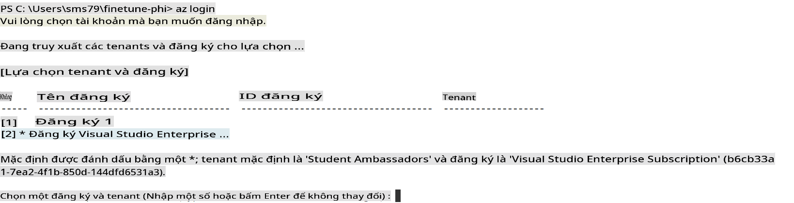

> [!TIP]
>
> Nếu bạn gặp khó khăn khi đăng nhập vào Azure, hãy thử sử dụng mã thiết bị. Mở cửa sổ terminal và nhập lệnh sau để đăng nhập vào tài khoản Azure của bạn:
>
> ```console
> az login --use-device-code
> ```
>

### Tinh chỉnh mô hình Phi-3

Trong bài tập này, bạn sẽ tinh chỉnh mô hình Phi-3 bằng tập dữ liệu được cung cấp. Trước tiên, bạn sẽ định nghĩa quy trình tinh chỉnh trong tệp *fine_tune.py*. Sau đó, bạn sẽ cấu hình môi trường Azure Machine Learning và bắt đầu quy trình tinh chỉnh bằng cách chạy tệp *setup_ml.py*. Script này đảm bảo rằng quá trình tinh chỉnh diễn ra trong môi trường Azure Machine Learning.

Bằng cách chạy *setup_ml.py*, bạn sẽ bắt đầu quá trình tinh chỉnh trong môi trường Azure Machine Learning.

#### Thêm mã vào tệp *fine_tune.py*

1. Điều hướng đến thư mục *finetuning_dir* và mở tệp *fine_tune.py* trong Visual Studio Code.

1. Thêm đoạn mã sau vào *fine_tune.py*.

    ```python
    import argparse
    import sys
    import logging
    import os
    from datasets import load_dataset
    import torch
    import mlflow
    from transformers import AutoModelForCausalLM, AutoTokenizer, TrainingArguments
    from trl import SFTTrainer

    # To avoid the INVALID_PARAMETER_VALUE error in MLflow, disable MLflow integration
    os.environ["DISABLE_MLFLOW_INTEGRATION"] = "True"

    # Logging setup
    logging.basicConfig(
        format="%(asctime)s - %(levelname)s - %(name)s - %(message)s",
        datefmt="%Y-%m-%d %H:%M:%S",
        handlers=[logging.StreamHandler(sys.stdout)],
        level=logging.WARNING
    )
    logger = logging.getLogger(__name__)

    def initialize_model_and_tokenizer(model_name, model_kwargs):
        """
        Initialize the model and tokenizer with the given pretrained model name and arguments.
        """
        model = AutoModelForCausalLM.from_pretrained(model_name, **model_kwargs)
        tokenizer = AutoTokenizer.from_pretrained(model_name)
        tokenizer.model_max_length = 2048
        tokenizer.pad_token = tokenizer.unk_token
        tokenizer.pad_token_id = tokenizer.convert_tokens_to_ids(tokenizer.pad_token)
        tokenizer.padding_side = 'right'
        return model, tokenizer

    def apply_chat_template(example, tokenizer):
        """
        Apply a chat template to tokenize messages in the example.
        """
        messages = example["messages"]
        if messages[0]["role"] != "system":
            messages.insert(0, {"role": "system", "content": ""})
        example["text"] = tokenizer.apply_chat_template(
            messages, tokenize=False, add_generation_prompt=False
        )
        return example

    def load_and_preprocess_data(train_filepath, test_filepath, tokenizer):
        """
        Load and preprocess the dataset.
        """
        train_dataset = load_dataset('json', data_files=train_filepath, split='train')
        test_dataset = load_dataset('json', data_files=test_filepath, split='train')
        column_names = list(train_dataset.features)

        train_dataset = train_dataset.map(
            apply_chat_template,
            fn_kwargs={"tokenizer": tokenizer},
            num_proc=10,
            remove_columns=column_names,
            desc="Applying chat template to train dataset",
        )

        test_dataset = test_dataset.map(
            apply_chat_template,
            fn_kwargs={"tokenizer": tokenizer},
            num_proc=10,
            remove_columns=column_names,
            desc="Applying chat template to test dataset",
        )

        return train_dataset, test_dataset

    def train_and_evaluate_model(train_dataset, test_dataset, model, tokenizer, output_dir):
        """
        Train and evaluate the model.
        """
        training_args = TrainingArguments(
            bf16=True,
            do_eval=True,
            output_dir=output_dir,
            eval_strategy="epoch",
            learning_rate=5.0e-06,
            logging_steps=20,
            lr_scheduler_type="cosine",
            num_train_epochs=3,
            overwrite_output_dir=True,
            per_device_eval_batch_size=4,
            per_device_train_batch_size=4,
            remove_unused_columns=True,
            save_steps=500,
            seed=0,
            gradient_checkpointing=True,
            gradient_accumulation_steps=1,
            warmup_ratio=0.2,
        )

        trainer = SFTTrainer(
            model=model,
            args=training_args,
            train_dataset=train_dataset,
            eval_dataset=test_dataset,
            max_seq_length=2048,
            dataset_text_field="text",
            tokenizer=tokenizer,
            packing=True
        )

        train_result = trainer.train()
        trainer.log_metrics("train", train_result.metrics)

        mlflow.transformers.log_model(
            transformers_model={"model": trainer.model, "tokenizer": tokenizer},
            artifact_path=output_dir,
        )

        tokenizer.padding_side = 'left'
        eval_metrics = trainer.evaluate()
        eval_metrics["eval_samples"] = len(test_dataset)
        trainer.log_metrics("eval", eval_metrics)

    def main(train_file, eval_file, model_output_dir):
        """
        Main function to fine-tune the model.
        """
        model_kwargs = {
            "use_cache": False,
            "trust_remote_code": True,
            "torch_dtype": torch.bfloat16,
            "device_map": None,
            "attn_implementation": "eager"
        }

        # pretrained_model_name = "microsoft/Phi-3-mini-4k-instruct"
        pretrained_model_name = "microsoft/Phi-3.5-mini-instruct"

        with mlflow.start_run():
            model, tokenizer = initialize_model_and_tokenizer(pretrained_model_name, model_kwargs)
            train_dataset, test_dataset = load_and_preprocess_data(train_file, eval_file, tokenizer)
            train_and_evaluate_model(train_dataset, test_dataset, model, tokenizer, model_output_dir)

    if __name__ == "__main__":
        parser = argparse.ArgumentParser()
        parser.add_argument("--train-file", type=str, required=True, help="Path to the training data")
        parser.add_argument("--eval-file", type=str, required=True, help="Path to the evaluation data")
        parser.add_argument("--model_output_dir", type=str, required=True, help="Directory to save the fine-tuned model")
        args = parser.parse_args()
        main(args.train_file, args.eval_file, args.model_output_dir)

    ```

1. Lưu và đóng tệp *fine_tune.py*.

> [!TIP]
> **Bạn có thể tinh chỉnh mô hình Phi-3.5**
>
> Trong tệp *fine_tune.py*, bạn có thể thay đổi trường `pretrained_model_name` from `"microsoft/Phi-3-mini-4k-instruct"` to any model you want to fine-tune. For example, if you change it to `"microsoft/Phi-3.5-mini-instruct"`, you'll be using the Phi-3.5-mini-instruct model for fine-tuning. To find and use the model name you prefer, visit [Hugging Face](https://huggingface.co/), search for the model you're interested in, and then copy and paste its name into the `pretrained_model_name` trong script của bạn.
>
> :::image type="content" source="../../imgs/03/FineTuning-PromptFlow/finetunephi3.5.png" alt-text="Tinh chỉnh Phi-3.5.":::
>

#### Thêm mã vào tệp *setup_ml.py*

1. Mở tệp *setup_ml.py* trong Visual Studio Code.

1. Thêm đoạn mã sau vào *setup_ml.py*.

    ```python
    import logging
    from azure.ai.ml import MLClient, command, Input
    from azure.ai.ml.entities import Environment, AmlCompute
    from azure.identity import AzureCliCredential
    from config import (
        AZURE_SUBSCRIPTION_ID,
        AZURE_RESOURCE_GROUP_NAME,
        AZURE_ML_WORKSPACE_NAME,
        TRAIN_DATA_PATH,
        TEST_DATA_PATH
    )

    # Constants

    # Uncomment the following lines to use a CPU instance for training
    # COMPUTE_INSTANCE_TYPE = "Standard_E16s_v3" # cpu
    # COMPUTE_NAME = "cpu-e16s-v3"
    # DOCKER_IMAGE_NAME = "mcr.microsoft.com/azureml/openmpi4.1.0-ubuntu20.04:latest"

    # Uncomment the following lines to use a GPU instance for training
    COMPUTE_INSTANCE_TYPE = "Standard_NC24ads_A100_v4"
    COMPUTE_NAME = "gpu-nc24s-a100-v4"
    DOCKER_IMAGE_NAME = "mcr.microsoft.com/azureml/curated/acft-hf-nlp-gpu:59"

    CONDA_FILE = "conda.yml"
    LOCATION = "eastus2" # Replace with the location of your compute cluster
    FINETUNING_DIR = "./finetuning_dir" # Path to the fine-tuning script
    TRAINING_ENV_NAME = "phi-3-training-environment" # Name of the training environment
    MODEL_OUTPUT_DIR = "./model_output" # Path to the model output directory in azure ml

    # Logging setup to track the process
    logger = logging.getLogger(__name__)
    logging.basicConfig(
        format="%(asctime)s - %(levelname)s - %(name)s - %(message)s",
        datefmt="%Y-%m-%d %H:%M:%S",
        level=logging.WARNING
    )

    def get_ml_client():
        """
        Initialize the ML Client using Azure CLI credentials.
        """
        credential = AzureCliCredential()
        return MLClient(credential, AZURE_SUBSCRIPTION_ID, AZURE_RESOURCE_GROUP_NAME, AZURE_ML_WORKSPACE_NAME)

    def create_or_get_environment(ml_client):
        """
        Create or update the training environment in Azure ML.
        """
        env = Environment(
            image=DOCKER_IMAGE_NAME,  # Docker image for the environment
            conda_file=CONDA_FILE,  # Conda environment file
            name=TRAINING_ENV_NAME,  # Name of the environment
        )
        return ml_client.environments.create_or_update(env)

    def create_or_get_compute_cluster(ml_client, compute_name, COMPUTE_INSTANCE_TYPE, location):
        """
        Create or update the compute cluster in Azure ML.
        """
        try:
            compute_cluster = ml_client.compute.get(compute_name)
            logger.info(f"Compute cluster '{compute_name}' already exists. Reusing it for the current run.")
        except Exception:
            logger.info(f"Compute cluster '{compute_name}' does not exist. Creating a new one with size {COMPUTE_INSTANCE_TYPE}.")
            compute_cluster = AmlCompute(
                name=compute_name,
                size=COMPUTE_INSTANCE_TYPE,
                location=location,
                tier="Dedicated",  # Tier of the compute cluster
                min_instances=0,  # Minimum number of instances
                max_instances=1  # Maximum number of instances
            )
            ml_client.compute.begin_create_or_update(compute_cluster).wait()  # Wait for the cluster to be created
        return compute_cluster

    def create_fine_tuning_job(env, compute_name):
        """
        Set up the fine-tuning job in Azure ML.
        """
        return command(
            code=FINETUNING_DIR,  # Path to fine_tune.py
            command=(
                "python fine_tune.py "
                "--train-file ${{inputs.train_file}} "
                "--eval-file ${{inputs.eval_file}} "
                "--model_output_dir ${{inputs.model_output}}"
            ),
            environment=env,  # Training environment
            compute=compute_name,  # Compute cluster to use
            inputs={
                "train_file": Input(type="uri_file", path=TRAIN_DATA_PATH),  # Path to the training data file
                "eval_file": Input(type="uri_file", path=TEST_DATA_PATH),  # Path to the evaluation data file
                "model_output": MODEL_OUTPUT_DIR
            }
        )

    def main():
        """
        Main function to set up and run the fine-tuning job in Azure ML.
        """
        # Initialize ML Client
        ml_client = get_ml_client()

        # Create Environment
        env = create_or_get_environment(ml_client)
        
        # Create or get existing compute cluster
        create_or_get_compute_cluster(ml_client, COMPUTE_NAME, COMPUTE_INSTANCE_TYPE, LOCATION)

        # Create and Submit Fine-Tuning Job
        job = create_fine_tuning_job(env, COMPUTE_NAME)
        returned_job = ml_client.jobs.create_or_update(job)  # Submit the job
        ml_client.jobs.stream(returned_job.name)  # Stream the job logs
        
        # Capture the job name
        job_name = returned_job.name
        print(f"Job name: {job_name}")

    if __name__ == "__main__":
        main()

    ```

1. Thay thế `COMPUTE_INSTANCE_TYPE`, `COMPUTE_NAME`, and `LOCATION` bằng thông tin cụ thể của bạn.

    ```python
   # Uncomment the following lines to use a GPU instance for training
    COMPUTE_INSTANCE_TYPE = "Standard_NC24ads_A100_v4"
    COMPUTE_NAME = "gpu-nc24s-a100-v4"
    ...
    LOCATION = "eastus2" # Replace with the location of your compute cluster
    ```

> [!TIP]
>
> **Hướng dẫn tinh chỉnh với tập dữ liệu nhỏ sử dụng CPU**
>
> Nếu bạn muốn sử dụng CPU để tinh chỉnh, cách tiếp cận này rất phù hợp cho những người có gói đăng ký lợi ích (chẳng hạn như Visual Studio Enterprise Subscription) hoặc để nhanh chóng thử nghiệm quy trình tinh chỉnh và triển khai.
>
> 1. Mở tệp *setup_ml*.
> 1. Thay thế `COMPUTE_INSTANCE_TYPE`, `COMPUTE_NAME`, and `DOCKER_IMAGE_NAME` with the following. If you do not have access to *Standard_E16s_v3*, you can use an equivalent CPU instance or request a new quota.
> 1. Replace `LOCATION` bằng thông tin cụ thể của bạn.
>
>    ```python
>    # Uncomment the following lines to use a CPU instance for training
>    COMPUTE_INSTANCE_TYPE = "Standard_E16s_v3" # cpu
>    COMPUTE_NAME = "cpu-e16s-v3"
>    DOCKER_IMAGE_NAME = "mcr.microsoft.com/azureml/openmpi4.1.0-ubuntu20.04:latest"
>    LOCATION = "eastus2" # Replace with the location of your compute cluster
>    ```
>

1. Nhập lệnh sau để chạy script *setup_ml.py* và bắt đầu quá trình tinh chỉnh trong Azure Machine Learning.

    ```python
    python setup_ml.py
    ```

1. Trong bài tập này, bạn đã tinh chỉnh thành công mô hình Phi-3 bằng Azure Machine Learning. Bằng cách chạy script *setup_ml.py*, bạn đã cấu hình môi trường Azure Machine Learning và bắt đầu quy trình tinh chỉnh được định nghĩa trong tệp *fine_tune.py*. Lưu ý rằng quá trình tinh chỉnh có thể mất một khoảng thời gian đáng kể. Sau khi chạy `python setup_ml.py` command, you need to wait for the process to complete. You can monitor the status of the fine-tuning job by following the link provided in the terminal to the Azure Machine Learning portal.

    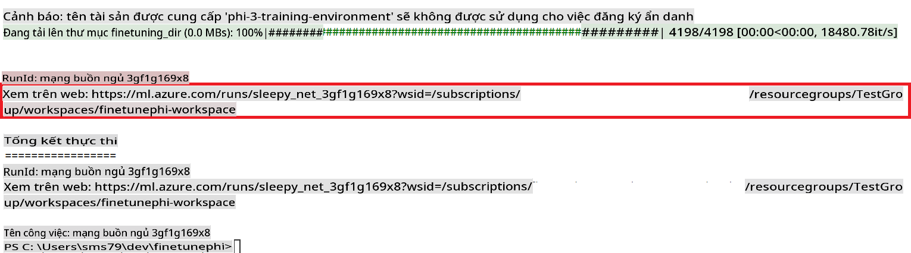

### Deploy the fine-tuned model

To integrate the fine-tuned Phi-3 model with Prompt Flow, you need to deploy the model to make it accessible for real-time inference. This process involves registering the model, creating an online endpoint, and deploying the model.

#### Set the model name, endpoint name, and deployment name for deployment

1. Open *config.py* file.

1. Replace `AZURE_MODEL_NAME = "your_fine_tuned_model_name"` with the desired name for your model.

1. Replace `AZURE_ENDPOINT_NAME = "your_fine_tuned_model_endpoint_name"` with the desired name for your endpoint.

1. Replace `AZURE_DEPLOYMENT_NAME = "your_fine_tuned_model_deployment_name"` với tên mong muốn cho triển khai của bạn.

#### Thêm mã vào tệp *deploy_model.py*

Chạy tệp *deploy_model.py* tự động hóa toàn bộ quy trình triển khai. Nó đăng ký mô hình, tạo một endpoint và thực hiện triển khai dựa trên các cài đặt được chỉ định trong tệp config.py, bao gồm tên mô hình, tên endpoint và tên triển khai.

1. Mở tệp *deploy_model.py* trong Visual Studio Code.

1. Thêm đoạn mã sau vào *deploy_model.py*.

    ```python
    import logging
    from azure.identity import AzureCliCredential
    from azure.ai.ml import MLClient
    from azure.ai.ml.entities import Model, ProbeSettings, ManagedOnlineEndpoint, ManagedOnlineDeployment, IdentityConfiguration, ManagedIdentityConfiguration, OnlineRequestSettings
    from azure.ai.ml.constants import AssetTypes

    # Configuration imports
    from config import (
        AZURE_SUBSCRIPTION_ID,
        AZURE_RESOURCE_GROUP_NAME,
        AZURE_ML_WORKSPACE_NAME,
        AZURE_MANAGED_IDENTITY_RESOURCE_ID,
        AZURE_MANAGED_IDENTITY_CLIENT_ID,
        AZURE_MODEL_NAME,
        AZURE_ENDPOINT_NAME,
        AZURE_DEPLOYMENT_NAME
    )

    # Constants
    JOB_NAME = "your-job-name"
    COMPUTE_INSTANCE_TYPE = "Standard_E4s_v3"

    deployment_env_vars = {
        "SUBSCRIPTION_ID": AZURE_SUBSCRIPTION_ID,
        "RESOURCE_GROUP_NAME": AZURE_RESOURCE_GROUP_NAME,
        "UAI_CLIENT_ID": AZURE_MANAGED_IDENTITY_CLIENT_ID,
    }

    # Logging setup
    logging.basicConfig(
        format="%(asctime)s - %(levelname)s - %(name)s - %(message)s",
        datefmt="%Y-%m-%d %H:%M:%S",
        level=logging.DEBUG
    )
    logger = logging.getLogger(__name__)

    def get_ml_client():
        """Initialize and return the ML Client."""
        credential = AzureCliCredential()
        return MLClient(credential, AZURE_SUBSCRIPTION_ID, AZURE_RESOURCE_GROUP_NAME, AZURE_ML_WORKSPACE_NAME)

    def register_model(ml_client, model_name, job_name):
        """Register a new model."""
        model_path = f"azureml://jobs/{job_name}/outputs/artifacts/paths/model_output"
        logger.info(f"Registering model {model_name} from job {job_name} at path {model_path}.")
        run_model = Model(
            path=model_path,
            name=model_name,
            description="Model created from run.",
            type=AssetTypes.MLFLOW_MODEL,
        )
        model = ml_client.models.create_or_update(run_model)
        logger.info(f"Registered model ID: {model.id}")
        return model

    def delete_existing_endpoint(ml_client, endpoint_name):
        """Delete existing endpoint if it exists."""
        try:
            endpoint_result = ml_client.online_endpoints.get(name=endpoint_name)
            logger.info(f"Deleting existing endpoint {endpoint_name}.")
            ml_client.online_endpoints.begin_delete(name=endpoint_name).result()
            logger.info(f"Deleted existing endpoint {endpoint_name}.")
        except Exception as e:
            logger.info(f"No existing endpoint {endpoint_name} found to delete: {e}")

    def create_or_update_endpoint(ml_client, endpoint_name, description=""):
        """Create or update an endpoint."""
        delete_existing_endpoint(ml_client, endpoint_name)
        logger.info(f"Creating new endpoint {endpoint_name}.")
        endpoint = ManagedOnlineEndpoint(
            name=endpoint_name,
            description=description,
            identity=IdentityConfiguration(
                type="user_assigned",
                user_assigned_identities=[ManagedIdentityConfiguration(resource_id=AZURE_MANAGED_IDENTITY_RESOURCE_ID)]
            )
        )
        endpoint_result = ml_client.online_endpoints.begin_create_or_update(endpoint).result()
        logger.info(f"Created new endpoint {endpoint_name}.")
        return endpoint_result

    def create_or_update_deployment(ml_client, endpoint_name, deployment_name, model):
        """Create or update a deployment."""

        logger.info(f"Creating deployment {deployment_name} for endpoint {endpoint_name}.")
        deployment = ManagedOnlineDeployment(
            name=deployment_name,
            endpoint_name=endpoint_name,
            model=model.id,
            instance_type=COMPUTE_INSTANCE_TYPE,
            instance_count=1,
            environment_variables=deployment_env_vars,
            request_settings=OnlineRequestSettings(
                max_concurrent_requests_per_instance=3,
                request_timeout_ms=180000,
                max_queue_wait_ms=120000
            ),
            liveness_probe=ProbeSettings(
                failure_threshold=30,
                success_threshold=1,
                period=100,
                initial_delay=500,
            ),
            readiness_probe=ProbeSettings(
                failure_threshold=30,
                success_threshold=1,
                period=100,
                initial_delay=500,
            ),
        )
        deployment_result = ml_client.online_deployments.begin_create_or_update(deployment).result()
        logger.info(f"Created deployment {deployment.name} for endpoint {endpoint_name}.")
        return deployment_result

    def set_traffic_to_deployment(ml_client, endpoint_name, deployment_name):
        """Set traffic to the specified deployment."""
        try:
            # Fetch the current endpoint details
            endpoint = ml_client.online_endpoints.get(name=endpoint_name)
            
            # Log the current traffic allocation for debugging
            logger.info(f"Current traffic allocation: {endpoint.traffic}")
            
            # Set the traffic allocation for the deployment
            endpoint.traffic = {deployment_name: 100}
            
            # Update the endpoint with the new traffic allocation
            endpoint_poller = ml_client.online_endpoints.begin_create_or_update(endpoint)
            updated_endpoint = endpoint_poller.result()
            
            # Log the updated traffic allocation for debugging
            logger.info(f"Updated traffic allocation: {updated_endpoint.traffic}")
            logger.info(f"Set traffic to deployment {deployment_name} at endpoint {endpoint_name}.")
            return updated_endpoint
        except Exception as e:
            # Log any errors that occur during the process
            logger.error(f"Failed to set traffic to deployment: {e}")
            raise


    def main():
        ml_client = get_ml_client()

        registered_model = register_model(ml_client, AZURE_MODEL_NAME, JOB_NAME)
        logger.info(f"Registered model ID: {registered_model.id}")

        endpoint = create_or_update_endpoint(ml_client, AZURE_ENDPOINT_NAME, "Endpoint for finetuned Phi-3 model")
        logger.info(f"Endpoint {AZURE_ENDPOINT_NAME} is ready.")

        try:
            deployment = create_or_update_deployment(ml_client, AZURE_ENDPOINT_NAME, AZURE_DEPLOYMENT_NAME, registered_model)
            logger.info(f"Deployment {AZURE_DEPLOYMENT_NAME} is created for endpoint {AZURE_ENDPOINT_NAME}.")

            set_traffic_to_deployment(ml_client, AZURE_ENDPOINT_NAME, AZURE_DEPLOYMENT_NAME)
            logger.info(f"Traffic is set to deployment {AZURE_DEPLOYMENT_NAME} at endpoint {AZURE_ENDPOINT_NAME}.")
        except Exception as e:
            logger.error(f"Failed to create or update deployment: {e}")

    if __name__ == "__main__":
        main()

    ```

1. Thực hiện các bước sau để lấy `JOB_NAME`:

    - Navigate to Azure Machine Learning resource that you created.
    - Select **Studio web URL** to open the Azure Machine Learning workspace.
    - Select **Jobs** from the left side tab.
    - Select the experiment for fine-tuning. For example, *finetunephi*.
    - Select the job that you created.
    - Copy and paste your job Name into the `JOB_NAME = "your-job-name"` in *deploy_model.py* file.

1. Replace `COMPUTE_INSTANCE_TYPE` với thông tin cụ thể của bạn.

1. Nhập lệnh sau để chạy script *deploy_model.py* và bắt đầu quá trình triển khai trong Azure Machine Learning.

    ```python
    python deploy_model.py
    ```

> [!WARNING]
> Để tránh các chi phí bổ sung cho tài khoản của bạn, hãy đảm bảo xóa endpoint đã tạo trong workspace Azure Machine Learning.
>

#### Kiểm tra trạng thái triển khai trong Azure Machine Learning Workspace

1. Truy cập [Azure ML Studio](https://ml.azure.com/home?wt.mc_id=studentamb_279723).

1. Điều hướng đến workspace Azure Machine Learning mà bạn đã tạo.

1. Chọn **Studio web URL** để mở workspace Azure Machine Learning.

1. Chọn **Endpoints** từ thanh tab bên trái.

    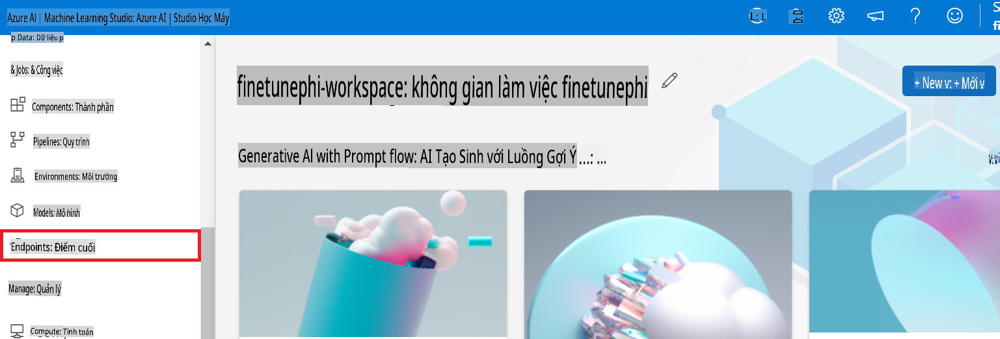

2. Chọn endpoint mà bạn đã tạo.

    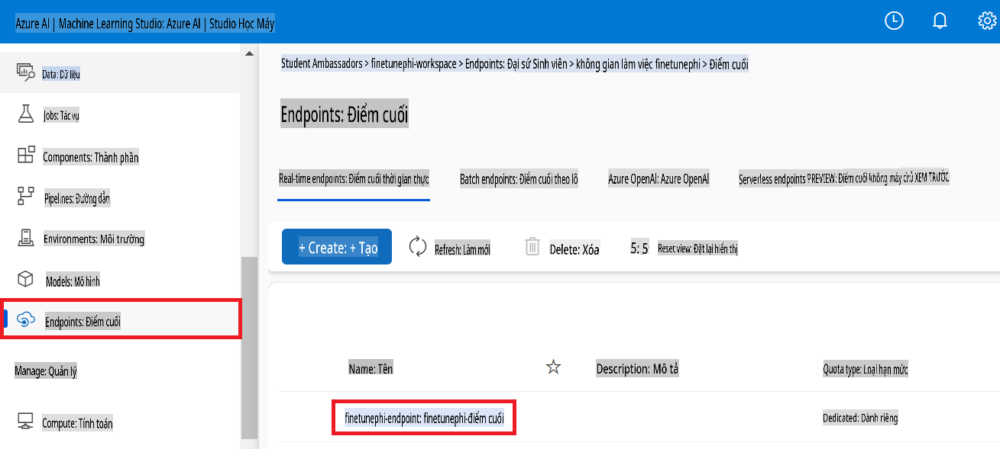

3. Trên trang này, bạn có thể quản lý các endpoints được tạo trong quá trình triển khai.

## Kịch bản 3: Tích hợp với Prompt flow và Trò chuyện với mô hình tùy chỉnh của bạn

### Tích hợp mô hình Phi-3 tùy chỉnh với Prompt flow

Sau khi triển khai thành công mô hình tinh chỉnh của bạn, bây giờ bạn có thể tích hợp nó với Prompt flow để sử dụng mô hình của bạn trong các ứng dụng thời gian thực, cho phép thực hiện nhiều tác vụ tương tác với mô hình Phi-3 tùy chỉnh của bạn.

#### Cài đặt api key và endpoint uri của mô hình Phi-3 đã tinh chỉnh

1. Điều hướng đến workspace Azure Machine Learning mà bạn đã tạo.
1. Chọn **Endpoints** từ thanh tab bên trái.
1. Chọn endpoint mà bạn đã tạo.
1. Chọn **Consume** từ menu điều hướng.
1. Sao chép và dán **REST endpoint** của bạn vào tệp *config.py*, thay thế `AZURE_ML_ENDPOINT = "your_fine_tuned_model_endpoint_uri"` with your **REST endpoint**.
1. Copy and paste your **Primary key** into the *config.py* file, replacing `AZURE_ML_API_KEY = "your_fine_tuned_model_api_key"` bằng **Primary key** của bạn.

    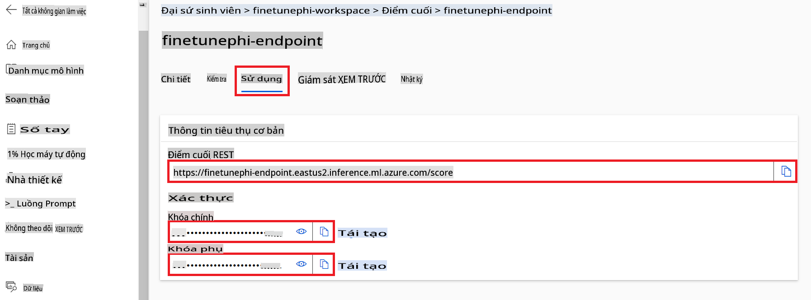

#### Thêm mã vào tệp *flow.dag.yml*

1. Mở tệp *flow.dag.yml* trong Visual Studio Code.

1. Thêm đoạn mã sau vào *flow.dag.yml*.

    ```yml
    inputs:
      input_data:
        type: string
        default: "Who founded Microsoft?"

    outputs:
      answer:
        type: string
        reference: ${integrate_with_promptflow.output}

    nodes:
    - name: integrate_with_promptflow
      type: python
      source:
        type: code
        path: integrate_with_promptflow.py
      inputs:
        input_data: ${inputs.input_data}
    ```

#### Thêm mã vào tệp *integrate_with_promptflow.py*

1. Mở tệp *integrate_with_promptflow.py* trong Visual Studio Code.

1. Thêm đoạn mã sau vào *integrate_with_promptflow.py*.

    ```python
    import logging
    import requests
    from promptflow.core import tool
    import asyncio
    import platform
    from config import (
        AZURE_ML_ENDPOINT,
        AZURE_ML_API_KEY
    )

    # Logging setup
    logging.basicConfig(
        format="%(asctime)s - %(levelname)s - %(name)s - %(message)s",
        datefmt="%Y-%m-%d %H:%M:%S",
        level=logging.DEBUG
    )
    logger = logging.getLogger(__name__)

    def query_azml_endpoint(input_data: list, endpoint_url: str, api_key: str) -> str:
        """
        Send a request to the Azure ML endpoint with the given input data.
        """
        headers = {
            "Content-Type": "application/json",
            "Authorization": f"Bearer {api_key}"
        }
        data = {
            "input_data": [input_data],
            "params": {
                "temperature": 0.7,
                "max_new_tokens": 128,
                "do_sample": True,
                "return_full_text": True
            }
        }
        try:
            response = requests.post(endpoint_url, json=data, headers=headers)
            response.raise_for_status()
            result = response.json()[0]
            logger.info("Successfully received response from Azure ML Endpoint.")
            return result
        except requests.exceptions.RequestException as e:
            logger.error(f"Error querying Azure ML Endpoint: {e}")
            raise

    def setup_asyncio_policy():
        """
        Setup asyncio event loop policy for Windows.
        """
        if platform.system() == 'Windows':
            asyncio.set_event_loop_policy(asyncio.WindowsSelectorEventLoopPolicy())
            logger.info("Set Windows asyncio event loop policy.")

    @tool
    def my_python_tool(input_data: str) -> str:
        """
        Tool function to process input data and query the Azure ML endpoint.
        """
        setup_asyncio_policy()
        return query_azml_endpoint(input_data, AZURE_ML_ENDPOINT, AZURE_ML_API_KEY)

    ```

### Trò chuyện với mô hình tùy chỉnh của bạn

1. Nhập lệnh sau để chạy script *deploy_model.py* và bắt đầu quá trình triển khai trong Azure Machine Learning.

    ```python
    pf flow serve --source ./ --port 8080 --host localhost
    ```

1. Đây là một ví dụ về kết quả: Bây giờ bạn có thể trò chuyện với mô hình Phi-3 tùy chỉnh của mình. Nên đặt câu hỏi dựa trên dữ liệu được sử dụng để tinh chỉnh.

    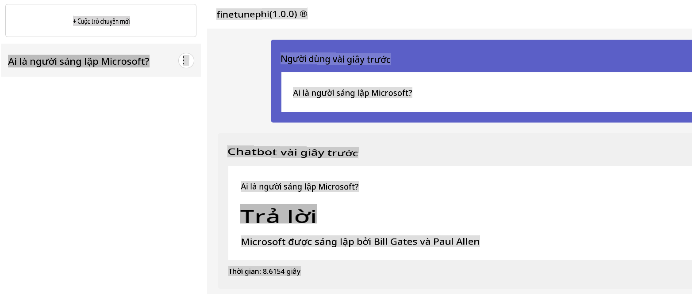

**Tuyên bố miễn trừ trách nhiệm**:  
Tài liệu này đã được dịch bằng các dịch vụ dịch thuật AI tự động. Mặc dù chúng tôi cố gắng đảm bảo độ chính xác, xin lưu ý rằng các bản dịch tự động có thể chứa lỗi hoặc không chính xác. Tài liệu gốc bằng ngôn ngữ bản địa nên được coi là nguồn tham khảo chính thức. Đối với các thông tin quan trọng, nên sử dụng dịch thuật chuyên nghiệp từ con người. Chúng tôi không chịu trách nhiệm cho bất kỳ sự hiểu lầm hoặc diễn giải sai nào phát sinh từ việc sử dụng bản dịch này.