# Tinh chỉnh và tích hợp mô hình Phi-3 tùy chỉnh với Prompt flow trong Azure AI Foundry

Ví dụ end-to-end (E2E) này dựa trên hướng dẫn "[Fine-Tune and Integrate Custom Phi-3 Models with Prompt Flow in Azure AI Foundry](https://techcommunity.microsoft.com/t5/educator-developer-blog/fine-tune-and-integrate-custom-phi-3-models-with-prompt-flow-in/ba-p/4191726?WT.mc_id=aiml-137032-kinfeylo)" từ cộng đồng công nghệ Microsoft. Hướng dẫn này giới thiệu các quy trình tinh chỉnh, triển khai và tích hợp mô hình Phi-3 tùy chỉnh với Prompt flow trong Azure AI Foundry.  
Không giống như ví dụ E2E "[Fine-Tune and Integrate Custom Phi-3 Models with Prompt Flow](./E2E_Phi-3-FineTuning_PromptFlow_Integration.md)", vốn chạy mã cục bộ, hướng dẫn này tập trung hoàn toàn vào việc tinh chỉnh và tích hợp mô hình của bạn trong Azure AI / ML Studio.

## Tổng quan

Trong ví dụ E2E này, bạn sẽ học cách tinh chỉnh mô hình Phi-3 và tích hợp nó với Prompt flow trong Azure AI Foundry. Bằng cách tận dụng Azure AI / ML Studio, bạn sẽ xây dựng một quy trình làm việc để triển khai và sử dụng các mô hình AI tùy chỉnh. Ví dụ E2E này được chia thành ba kịch bản:

**Kịch bản 1: Thiết lập tài nguyên Azure và chuẩn bị cho tinh chỉnh**

**Kịch bản 2: Tinh chỉnh mô hình Phi-3 và triển khai trong Azure Machine Learning Studio**

**Kịch bản 3: Tích hợp với Prompt flow và trò chuyện với mô hình tùy chỉnh của bạn trong Azure AI Foundry**

Dưới đây là tổng quan về ví dụ E2E này.

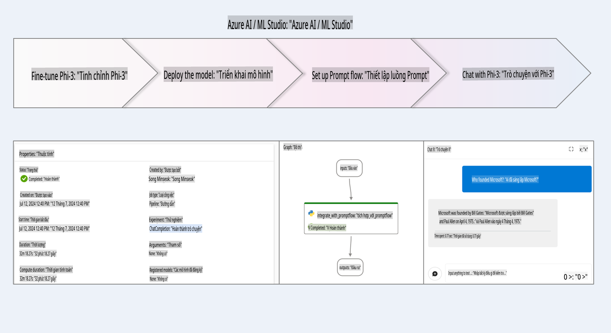

### Mục lục

1. **[Kịch bản 1: Thiết lập tài nguyên Azure và chuẩn bị cho tinh chỉnh](../../../../../../md/02.Application/01.TextAndChat/Phi3)**
    - [Tạo Azure Machine Learning Workspace](../../../../../../md/02.Application/01.TextAndChat/Phi3)
    - [Yêu cầu GPU quotas trong Azure Subscription](../../../../../../md/02.Application/01.TextAndChat/Phi3)
    - [Thêm role assignment](../../../../../../md/02.Application/01.TextAndChat/Phi3)
    - [Thiết lập dự án](../../../../../../md/02.Application/01.TextAndChat/Phi3)
    - [Chuẩn bị dataset cho tinh chỉnh](../../../../../../md/02.Application/01.TextAndChat/Phi3)

2. **[Kịch bản 2: Tinh chỉnh mô hình Phi-3 và triển khai trong Azure Machine Learning Studio](../../../../../../md/02.Application/01.TextAndChat/Phi3)**
    - [Tinh chỉnh mô hình Phi-3](../../../../../../md/02.Application/01.TextAndChat/Phi3)
    - [Triển khai mô hình Phi-3 đã tinh chỉnh](../../../../../../md/02.Application/01.TextAndChat/Phi3)

3. **[Kịch bản 3: Tích hợp với Prompt flow và trò chuyện với mô hình tùy chỉnh của bạn trong Azure AI Foundry](../../../../../../md/02.Application/01.TextAndChat/Phi3)**
    - [Tích hợp mô hình Phi-3 tùy chỉnh với Prompt flow](../../../../../../md/02.Application/01.TextAndChat/Phi3)
    - [Trò chuyện với mô hình Phi-3 tùy chỉnh của bạn](../../../../../../md/02.Application/01.TextAndChat/Phi3)

## Kịch bản 1: Thiết lập tài nguyên Azure và chuẩn bị cho tinh chỉnh

### Tạo Azure Machine Learning Workspace

1. Gõ *azure machine learning* vào **thanh tìm kiếm** ở đầu trang portal và chọn **Azure Machine Learning** từ các tùy chọn hiện ra.

    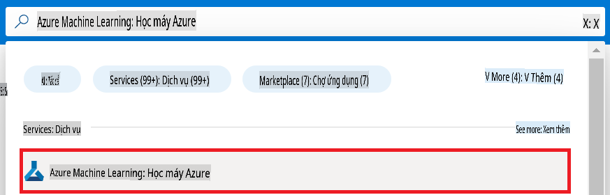

2. Chọn **+ Create** từ menu điều hướng.

3. Chọn **New workspace** từ menu điều hướng.

    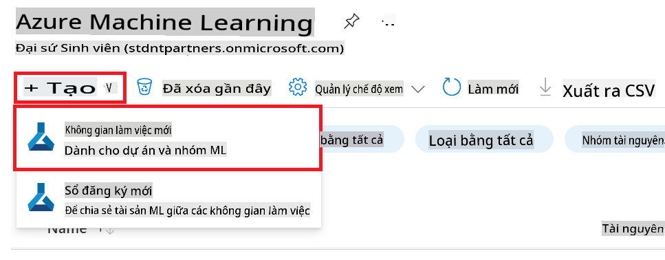

4. Thực hiện các bước sau:

    - Chọn **Subscription** của bạn.
    - Chọn **Resource group** để sử dụng (tạo mới nếu cần).
    - Nhập **Workspace Name**. Tên này phải là giá trị duy nhất.
    - Chọn **Region** bạn muốn sử dụng.
    - Chọn **Storage account** để sử dụng (tạo mới nếu cần).
    - Chọn **Key vault** để sử dụng (tạo mới nếu cần).
    - Chọn **Application insights** để sử dụng (tạo mới nếu cần).
    - Chọn **Container registry** để sử dụng (tạo mới nếu cần).

    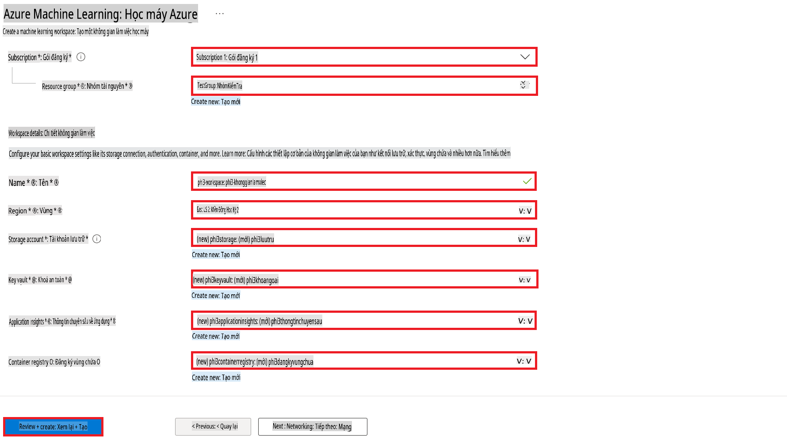

5. Chọn **Review + Create**.

6. Chọn **Create**.

### Yêu cầu GPU quotas trong Azure Subscription

Trong hướng dẫn này, bạn sẽ học cách tinh chỉnh và triển khai mô hình Phi-3, sử dụng GPU. Để tinh chỉnh, bạn sẽ sử dụng GPU *Standard_NC24ads_A100_v4*, yêu cầu gửi yêu cầu quota. Để triển khai, bạn sẽ sử dụng GPU *Standard_NC6s_v3*, cũng yêu cầu gửi yêu cầu quota.

> [!NOTE]
>
> Chỉ các subscription loại Pay-As-You-Go (loại subscription tiêu chuẩn) đủ điều kiện để phân bổ GPU; các subscription có lợi ích không được hỗ trợ hiện tại.
>

1. Truy cập [Azure ML Studio](https://ml.azure.com/home?wt.mc_id=studentamb_279723).

2. Thực hiện các bước sau để yêu cầu quota *Standard NCADSA100v4 Family*:

    - Chọn **Quota** từ thanh điều hướng bên trái.
    - Chọn **Virtual machine family** để sử dụng. Ví dụ, chọn **Standard NCADSA100v4 Family Cluster Dedicated vCPUs**, bao gồm GPU *Standard_NC24ads_A100_v4*.
    - Chọn **Request quota** từ menu điều hướng.

        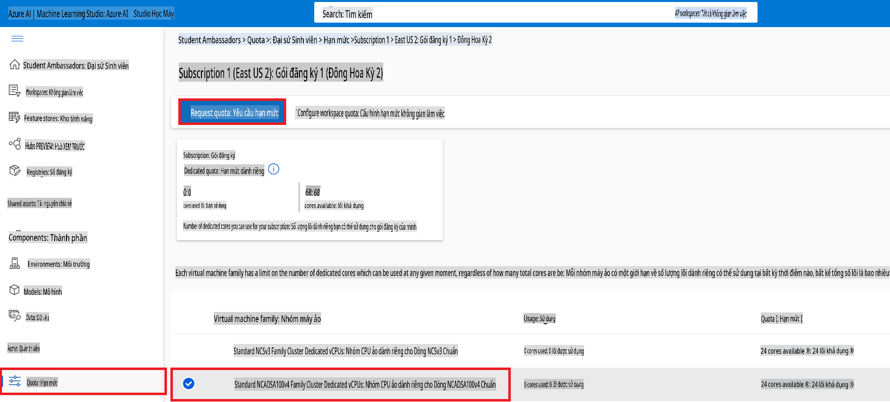

    - Trong trang Request quota, nhập **New cores limit** bạn muốn sử dụng. Ví dụ, 24.
    - Trong trang Request quota, chọn **Submit** để yêu cầu GPU quota.

3. Thực hiện các bước sau để yêu cầu quota *Standard NCSv3 Family*:

    - Chọn **Quota** từ thanh điều hướng bên trái.
    - Chọn **Virtual machine family** để sử dụng. Ví dụ, chọn **Standard NCSv3 Family Cluster Dedicated vCPUs**, bao gồm GPU *Standard_NC6s_v3*.
    - Chọn **Request quota** từ menu điều hướng.
    - Trong trang Request quota, nhập **New cores limit** bạn muốn sử dụng. Ví dụ, 24.
    - Trong trang Request quota, chọn **Submit** để yêu cầu GPU quota.

### Thêm role assignment

Để tinh chỉnh và triển khai mô hình của bạn, trước tiên bạn phải tạo một User Assigned Managed Identity (UAI) và gán quyền phù hợp. UAI này sẽ được sử dụng để xác thực trong quá trình triển khai.

#### Tạo User Assigned Managed Identity (UAI)

1. Gõ *managed identities* vào **thanh tìm kiếm** ở đầu trang portal và chọn **Managed Identities** từ các tùy chọn hiện ra.

    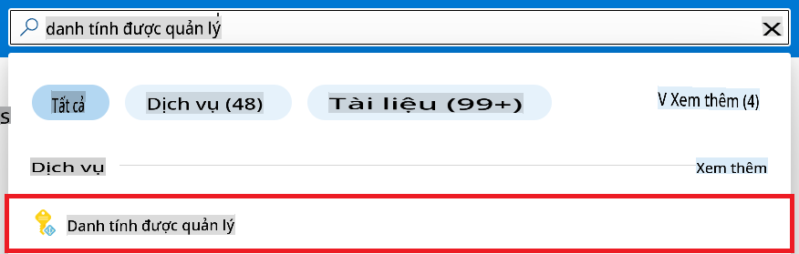

2. Chọn **+ Create**.

    

3. Thực hiện các bước sau:

    - Chọn **Subscription** của bạn.
    - Chọn **Resource group** để sử dụng (tạo mới nếu cần).
    - Chọn **Region** bạn muốn sử dụng.
    - Nhập **Name**. Tên này phải là giá trị duy nhất.

    

4. Chọn **Review + create**.

5. Chọn **+ Create**.

#### Thêm quyền Contributor vào Managed Identity

1. Điều hướng đến tài nguyên Managed Identity mà bạn đã tạo.

2. Chọn **Azure role assignments** từ thanh điều hướng bên trái.

3. Chọn **+Add role assignment** từ menu điều hướng.

4. Trong trang Add role assignment, thực hiện các bước sau:
    - Chọn **Scope** là **Resource group**.
    - Chọn **Subscription** của bạn.
    - Chọn **Resource group** để sử dụng.
    - Chọn **Role** là **Contributor**.

    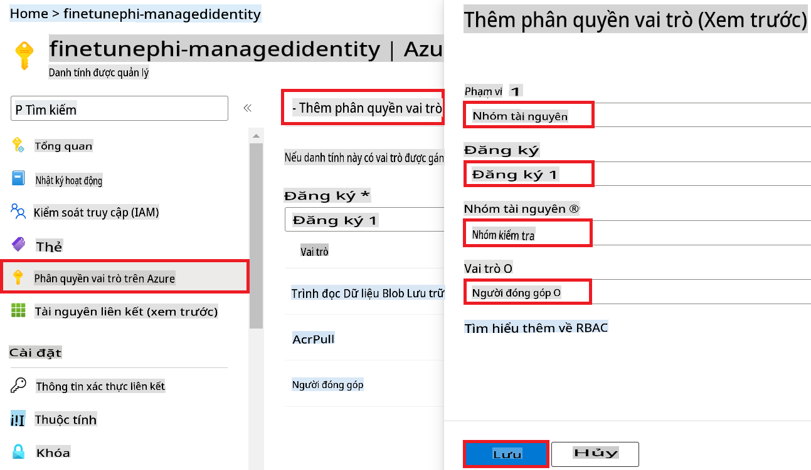

5. Chọn **Save**.

#### Thêm quyền Storage Blob Data Reader vào Managed Identity

1. Gõ *storage accounts* vào **thanh tìm kiếm** ở đầu trang portal và chọn **Storage accounts** từ các tùy chọn hiện ra.

    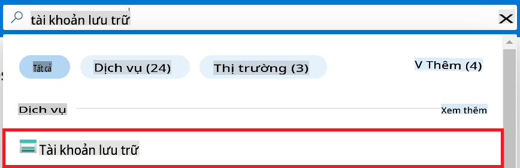

2. Chọn tài khoản lưu trữ được liên kết với Azure Machine Learning workspace mà bạn đã tạo. Ví dụ, *finetunephistorage*.

3. Thực hiện các bước sau để điều hướng đến trang Add role assignment:

    - Điều hướng đến tài khoản lưu trữ Azure mà bạn đã tạo.
    - Chọn **Access Control (IAM)** từ thanh điều hướng bên trái.
    - Chọn **+ Add** từ menu điều hướng.
    - Chọn **Add role assignment** từ menu điều hướng.

    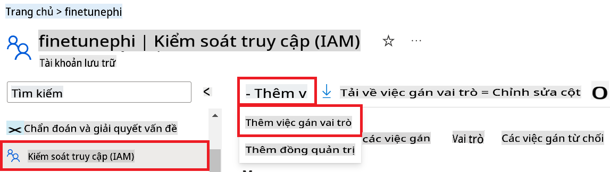

4. Trong trang Add role assignment, thực hiện các bước sau:

    - Trong trang Role, gõ *Storage Blob Data Reader* vào **thanh tìm kiếm** và chọn **Storage Blob Data Reader** từ các tùy chọn hiện ra.
    - Trong trang Role, chọn **Next**.
    - Trong trang Members, chọn **Assign access to** **Managed identity**.
    - Trong trang Members, chọn **+ Select members**.
    - Trong trang Select managed identities, chọn **Subscription** của bạn.
    - Trong trang Select managed identities, chọn **Managed identity** là **Manage Identity**.
    - Trong trang Select managed identities, chọn Managed Identity mà bạn đã tạo. Ví dụ, *finetunephi-managedidentity*.
    - Trong trang Select managed identities, chọn **Select**.

    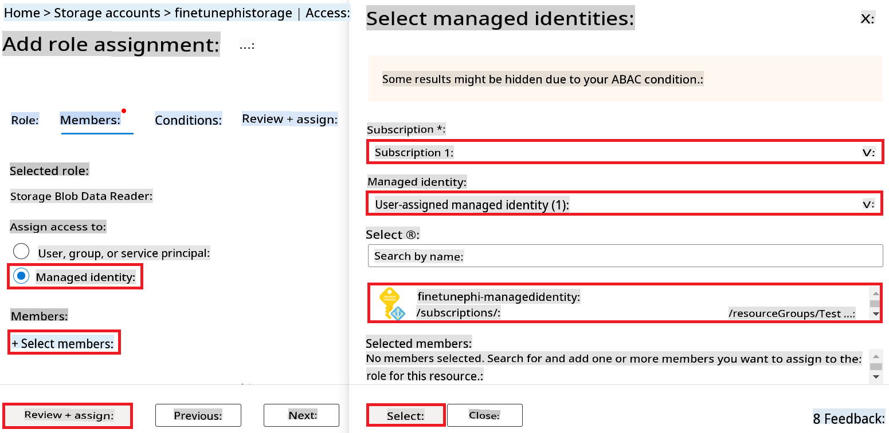

5. Chọn **Review + assign**.

#### Thêm quyền AcrPull vào Managed Identity

1. Gõ *container registries* vào **thanh tìm kiếm** ở đầu trang portal và chọn **Container registries** từ các tùy chọn hiện ra.

    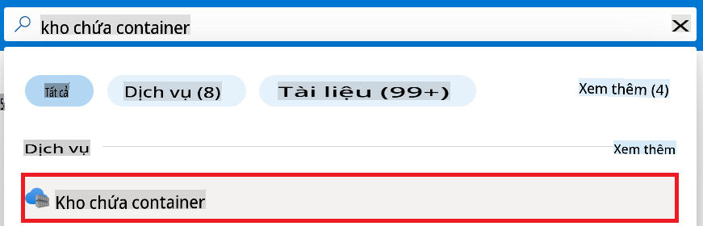

2. Chọn container registry được liên kết với Azure Machine Learning workspace. Ví dụ, *finetunephicontainerregistry*.

3. Thực hiện các bước sau để điều hướng đến trang Add role assignment:

    - Chọn **Access Control (IAM)** từ thanh điều hướng bên trái.
    - Chọn **+ Add** từ menu điều hướng.
    - Chọn **Add role assignment** từ menu điều hướng.

4. Trong trang Add role assignment, thực hiện các bước sau:

    - Trong trang Role, gõ *AcrPull* vào **thanh tìm kiếm** và chọn **AcrPull** từ các tùy chọn hiện ra.
    - Trong trang Role, chọn **Next**.
    - Trong trang Members, chọn **Assign access to** **Managed identity**.
    - Trong trang Members, chọn **+ Select members**.
    - Trong trang Select managed identities, chọn **Subscription** của bạn.
    - Trong trang Select managed identities, chọn **Managed identity** là **Manage Identity**.
    - Trong trang Select managed identities, chọn Managed Identity mà bạn đã tạo. Ví dụ, *finetunephi-managedidentity*.
    - Trong trang Select managed identities, chọn **Select**.
    - Chọn **Review + assign**.

### Thiết lập dự án

Để tải xuống dataset cần thiết cho việc tinh chỉnh, bạn sẽ thiết lập môi trường cục bộ.

Trong bài tập này, bạn sẽ:

- Tạo một thư mục để làm việc bên trong.
- Tạo một môi trường ảo.
- Cài đặt các gói cần thiết.
- Tạo tệp *download_dataset.py* để tải dataset.

#### Tạo thư mục để làm việc bên trong

1. Mở cửa sổ terminal và gõ lệnh sau để tạo thư mục tên *finetune-phi* trong đường dẫn mặc định.

    ```console
    mkdir finetune-phi
    ```

2. Gõ lệnh sau trong terminal để chuyển đến thư mục *finetune-phi* mà bạn đã tạo.

    ```console
    cd finetune-phi
    ```

#### Tạo môi trường ảo

1. Gõ lệnh sau trong terminal để tạo môi trường ảo tên *.venv*.

    ```console
    python -m venv .venv
    ```

2. Gõ lệnh sau trong terminal để kích hoạt môi trường ảo.

    ```console
    .venv\Scripts\activate.bat
    ```

> [!NOTE]
> Nếu thành công, bạn sẽ thấy *(.venv)* xuất hiện trước dấu nhắc lệnh.

#### Cài đặt các gói cần thiết

1. Gõ các lệnh sau trong terminal để cài đặt các gói cần thiết.

    ```console
    pip install datasets==2.19.1
    ```

#### Tạo `download_dataset.py`

> [!NOTE]
> Cấu trúc thư mục hoàn chỉnh:
>
> ```text
> └── YourUserName
> .    └── finetune-phi
> .        └── download_dataset.py
> ```

1. Mở **Visual Studio Code**.

2. Chọn **File** từ thanh menu.

3. Chọn **Open Folder**.

4. Chọn thư mục *finetune-phi* mà bạn đã tạo, nằm tại *C:\Users\yourUserName\finetune-phi*.

    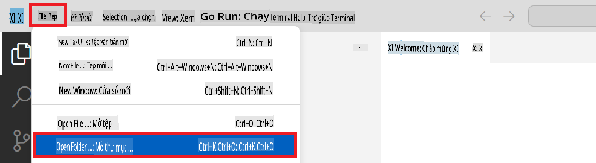

5. Trong khung bên trái của Visual Studio Code, nhấp chuột phải và chọn **New File** để tạo tệp mới tên *download_dataset.py*.

    

### Chuẩn bị dataset cho tinh chỉnh

Trong bài tập này, bạn sẽ chạy tệp *download_dataset.py* để tải dataset *ultrachat_200k* về môi trường cục bộ. Bạn sẽ sử dụng dataset này để tinh chỉnh mô hình Phi-3 trong Azure Machine Learning.

Trong bài tập này, bạn sẽ:

- Thêm mã vào tệp *download_dataset.py* để tải dataset.
- Chạy tệp *download_dataset.py* để tải dataset về môi trường cục bộ.

#### Tải dataset bằng *download_dataset.py*

1. Mở tệp *download_dataset.py* trong Visual Studio Code.

2. Thêm mã sau vào tệp *download_dataset.py*.

    ```python
    import json
    import os
    from datasets import load_dataset

    def load_and_split_dataset(dataset_name, config_name, split_ratio):
        """
        Load and split a dataset.
        """
        # Load the dataset with the specified name, configuration, and split ratio
        dataset = load_dataset(dataset_name, config_name, split=split_ratio)
        print(f"Original dataset size: {len(dataset)}")
        
        # Split the dataset into train and test sets (80% train, 20% test)
        split_dataset = dataset.train_test_split(test_size=0.2)
        print(f"Train dataset size: {len(split_dataset['train'])}")
        print(f"Test dataset size: {len(split_dataset['test'])}")
        
        return split_dataset

    def save_dataset_to_jsonl(dataset, filepath):
        """
        Save a dataset to a JSONL file.
        """
        # Create the directory if it does not exist
        os.makedirs(os.path.dirname(filepath), exist_ok=True)
        
        # Open the file in write mode
        with open(filepath, 'w', encoding='utf-8') as f:
            # Iterate over each record in the dataset
            for record in dataset:
                # Dump the record as a JSON object and write it to the file
                json.dump(record, f)
                # Write a newline character to separate records
                f.write('\n')
        
        print(f"Dataset saved to {filepath}")

    def main():
        """
        Main function to load, split, and save the dataset.
        """
        # Load and split the ULTRACHAT_200k dataset with a specific configuration and split ratio
        dataset = load_and_split_dataset("HuggingFaceH4/ultrachat_200k", 'default', 'train_sft[:1%]')
        
        # Extract the train and test datasets from the split
        train_dataset = dataset['train']
        test_dataset = dataset['test']

        # Save the train dataset to a JSONL file
        save_dataset_to_jsonl(train_dataset, "data/train_data.jsonl")
        
        # Save the test dataset to a separate JSONL file
        save_dataset_to_jsonl(test_dataset, "data/test_data.jsonl")

    if __name__ == "__main__":
        main()

    ```

3. Gõ lệnh sau trong terminal để chạy script và tải dataset về môi trường cục bộ.

    ```console
    python download_dataset.py
    ```

4. Kiểm tra xem dataset đã được lưu thành công vào thư mục *finetune-phi/data* trên máy cục bộ của bạn.

> [!NOTE]
>
> #### Lưu ý về kích thước dataset và thời gian tinh chỉnh
>
> Trong hướng dẫn này, bạn chỉ sử dụng 1% dataset (`split='train[:1%]'`). Điều này giúp giảm đáng kể lượng dữ liệu, tăng tốc quá trình tải lên và tinh chỉnh. Bạn có thể điều chỉnh tỷ lệ phần trăm để cân bằng giữa thời gian huấn luyện và hiệu suất mô hình. Sử dụng một phần nhỏ dataset giúp rút ngắn thời gian tinh chỉnh, làm cho quy trình dễ quản lý hơn trong một hướng dẫn.

## Kịch bản 2: Tinh chỉnh mô hình Phi-3 và triển khai trong Azure Machine Learning Studio

### Tinh chỉnh mô hình Phi-3

Trong bài tập này, bạn sẽ tinh chỉnh mô hình Phi-3 trong Azure Machine Learning Studio.

Trong bài tập này, bạn sẽ:

- Tạo computer cluster cho tinh chỉnh.
- Tinh chỉnh mô hình Phi-3 trong Azure Machine Learning Studio.

#### Tạo computer cluster cho tinh chỉnh
1. Truy cập [Azure ML Studio](https://ml.azure.com/home?wt.mc_id=studentamb_279723).

1. Chọn **Compute** từ thanh tab bên trái.

1. Chọn **Compute clusters** từ menu điều hướng.

1. Chọn **+ New**.

    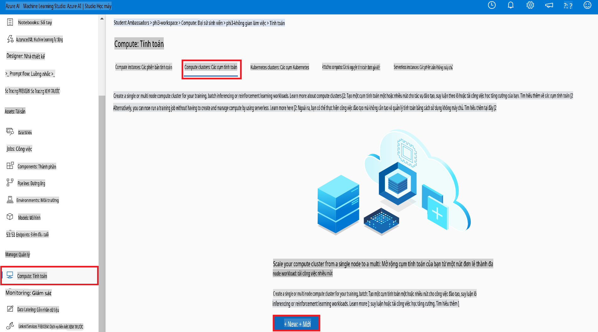

1. Thực hiện các tác vụ sau:

    - Chọn **Region** mà bạn muốn sử dụng.
    - Chọn **Virtual machine tier** thành **Dedicated**.
    - Chọn **Virtual machine type** thành **GPU**.
    - Chọn bộ lọc **Virtual machine size** thành **Select from all options**.
    - Chọn **Virtual machine size** thành **Standard_NC24ads_A100_v4**.

    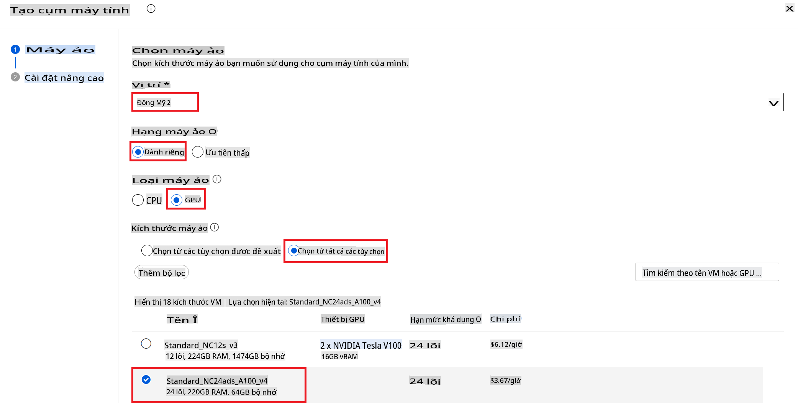

1. Chọn **Next**.

1. Thực hiện các tác vụ sau:

    - Nhập **Compute name**. Giá trị này phải là duy nhất.
    - Chọn **Minimum number of nodes** thành **0**.
    - Chọn **Maximum number of nodes** thành **1**.
    - Chọn **Idle seconds before scale down** thành **120**.

    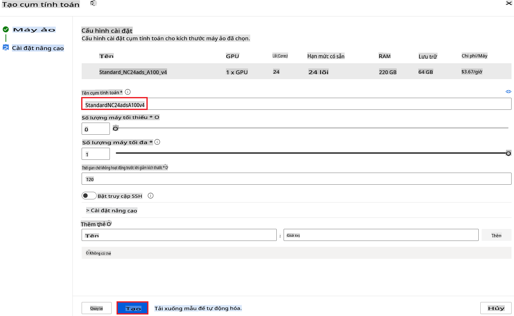

1. Chọn **Create**.

#### Tinh chỉnh mô hình Phi-3

1. Truy cập [Azure ML Studio](https://ml.azure.com/home?wt.mc_id=studentamb_279723).

1. Chọn không gian làm việc Azure Machine Learning mà bạn đã tạo.

    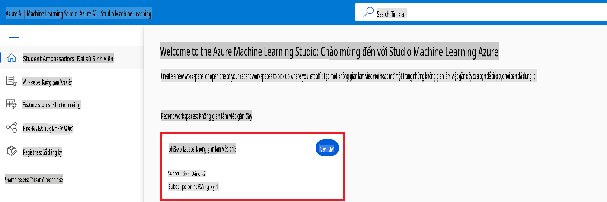

1. Thực hiện các tác vụ sau:

    - Chọn **Model catalog** từ thanh tab bên trái.
    - Nhập *phi-3-mini-4k* vào **thanh tìm kiếm** và chọn **Phi-3-mini-4k-instruct** từ các tùy chọn xuất hiện.

    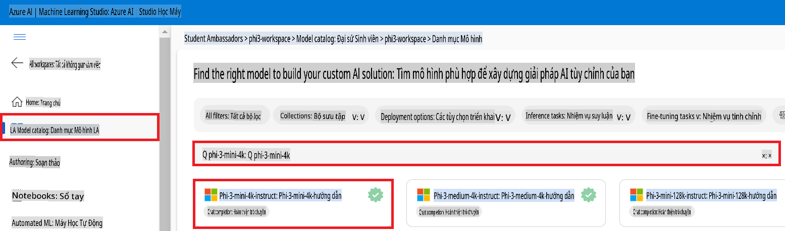

1. Chọn **Fine-tune** từ menu điều hướng.

    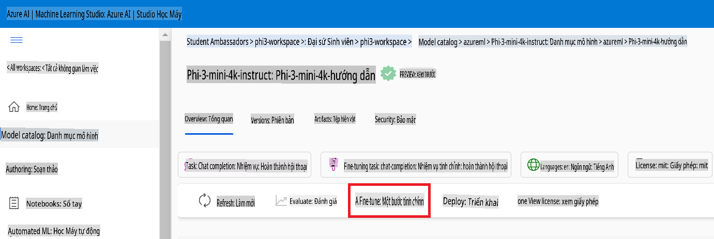

1. Thực hiện các tác vụ sau:

    - Chọn **Select task type** thành **Chat completion**.
    - Chọn **+ Select data** để tải lên **Training data**.
    - Chọn loại tải lên Validation data thành **Provide different validation data**.
    - Chọn **+ Select data** để tải lên **Validation data**.

    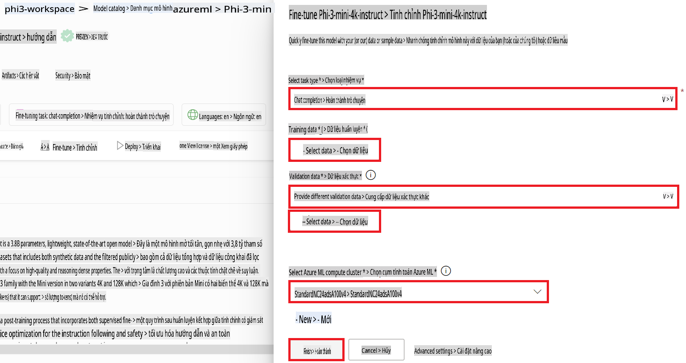

    > [!TIP]
    >
    > Bạn có thể chọn **Advanced settings** để tùy chỉnh các cấu hình như **learning_rate** và **lr_scheduler_type** để tối ưu hóa quá trình tinh chỉnh theo nhu cầu cụ thể của bạn.

1. Chọn **Finish**.

1. Trong bài tập này, bạn đã tinh chỉnh thành công mô hình Phi-3 bằng Azure Machine Learning. Lưu ý rằng quá trình tinh chỉnh có thể mất khá nhiều thời gian. Sau khi chạy công việc tinh chỉnh, bạn cần đợi nó hoàn thành. Bạn có thể theo dõi trạng thái công việc tinh chỉnh bằng cách điều hướng đến tab Jobs trong không gian làm việc Azure Machine Learning của bạn. Trong loạt bài tiếp theo, bạn sẽ triển khai mô hình đã tinh chỉnh và tích hợp nó với Prompt flow.

    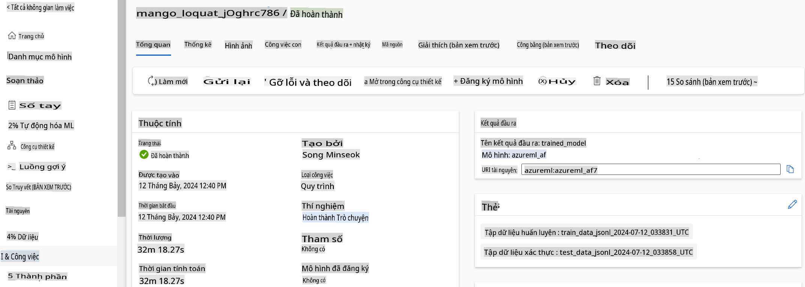

### Triển khai mô hình Phi-3 đã tinh chỉnh

Để tích hợp mô hình Phi-3 đã tinh chỉnh với Prompt flow, bạn cần triển khai mô hình để có thể truy cập nó cho suy luận thời gian thực. Quá trình này bao gồm đăng ký mô hình, tạo một endpoint trực tuyến và triển khai mô hình.

Trong bài tập này, bạn sẽ:

- Đăng ký mô hình đã tinh chỉnh trong không gian làm việc Azure Machine Learning.
- Tạo một endpoint trực tuyến.
- Triển khai mô hình Phi-3 đã tinh chỉnh được đăng ký.

#### Đăng ký mô hình đã tinh chỉnh

1. Truy cập [Azure ML Studio](https://ml.azure.com/home?wt.mc_id=studentamb_279723).

1. Chọn không gian làm việc Azure Machine Learning mà bạn đã tạo.

    

1. Chọn **Models** từ thanh tab bên trái.
1. Chọn **+ Register**.
1. Chọn **From a job output**.

    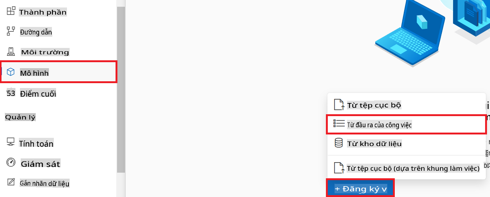

1. Chọn công việc mà bạn đã tạo.

    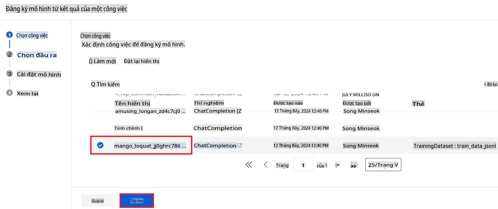

1. Chọn **Next**.

1. Chọn **Model type** thành **MLflow**.

1. Đảm bảo rằng **Job output** được chọn; nó sẽ được chọn tự động.

    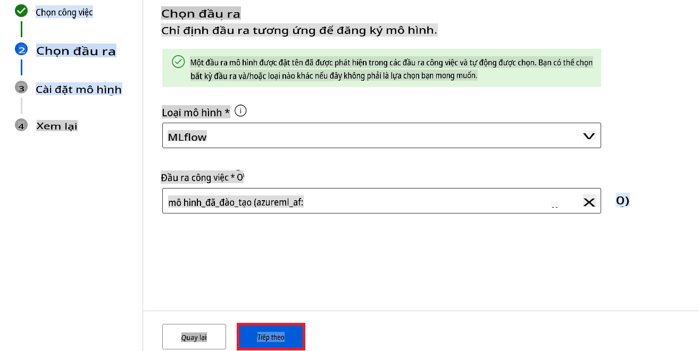

2. Chọn **Next**.

3. Chọn **Register**.

    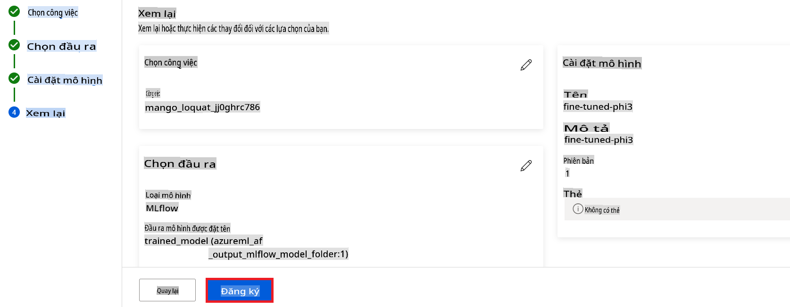

4. Bạn có thể xem mô hình đã đăng ký của mình bằng cách điều hướng đến menu **Models** từ thanh tab bên trái.

    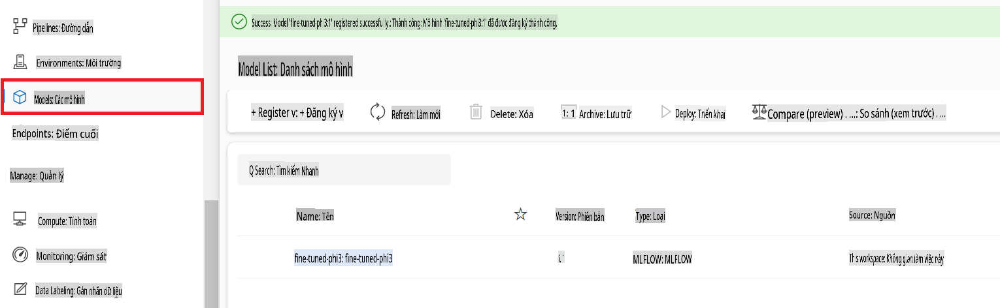

#### Triển khai mô hình đã tinh chỉnh

1. Điều hướng đến không gian làm việc Azure Machine Learning mà bạn đã tạo.

1. Chọn **Endpoints** từ thanh tab bên trái.

1. Chọn **Real-time endpoints** từ menu điều hướng.

    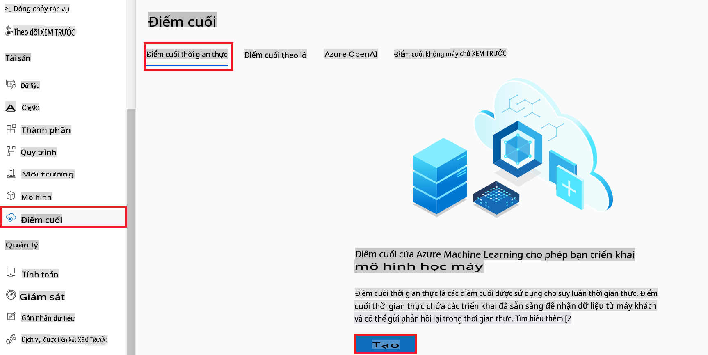

1. Chọn **Create**.

1. Chọn mô hình đã đăng ký mà bạn đã tạo.

    

1. Chọn **Select**.

1. Thực hiện các tác vụ sau:

    - Chọn **Virtual machine** thành *Standard_NC6s_v3*.
    - Chọn **Instance count** mà bạn muốn sử dụng. Ví dụ, *1*.
    - Chọn **Endpoint** thành **New** để tạo một endpoint.
    - Nhập **Endpoint name**. Giá trị này phải là duy nhất.
    - Nhập **Deployment name**. Giá trị này phải là duy nhất.

    

1. Chọn **Deploy**.

> [!WARNING]
> Để tránh các khoản phí bổ sung vào tài khoản của bạn, hãy đảm bảo xóa endpoint đã tạo trong không gian làm việc Azure Machine Learning.
>

#### Kiểm tra trạng thái triển khai trong Azure Machine Learning Workspace

1. Điều hướng đến không gian làm việc Azure Machine Learning mà bạn đã tạo.

1. Chọn **Endpoints** từ thanh tab bên trái.

1. Chọn endpoint mà bạn đã tạo.

    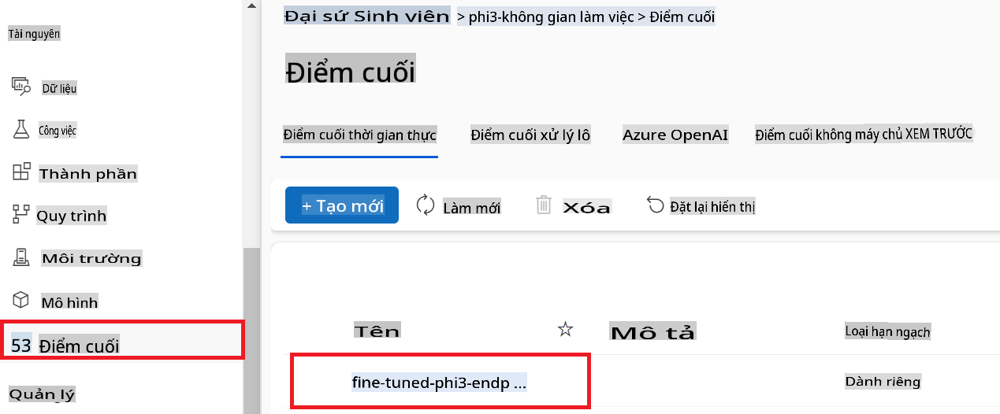

1. Trên trang này, bạn có thể quản lý các endpoint trong quá trình triển khai.

> [!NOTE]
> Sau khi triển khai hoàn tất, đảm bảo rằng **Live traffic** được đặt thành **100%**. Nếu không, chọn **Update traffic** để điều chỉnh cài đặt lưu lượng. Lưu ý rằng bạn không thể kiểm tra mô hình nếu lưu lượng được đặt thành 0%.
>
> 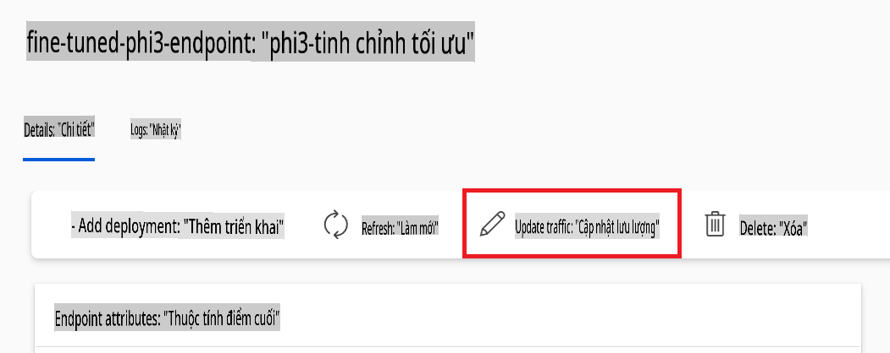
>

## Tình huống 3: Tích hợp với Prompt flow và trò chuyện với mô hình tùy chỉnh của bạn trong Azure AI Foundry

### Tích hợp mô hình Phi-3 tùy chỉnh với Prompt flow

Sau khi triển khai thành công mô hình đã tinh chỉnh, bạn có thể tích hợp nó với Prompt Flow để sử dụng mô hình của mình trong các ứng dụng thời gian thực, cho phép thực hiện nhiều tác vụ tương tác với mô hình Phi-3 tùy chỉnh của bạn.

Trong bài tập này, bạn sẽ:

- Tạo Azure AI Foundry Hub.
- Tạo Azure AI Foundry Project.
- Tạo Prompt flow.
- Thêm một kết nối tùy chỉnh cho mô hình Phi-3 đã tinh chỉnh.
- Thiết lập Prompt flow để trò chuyện với mô hình Phi-3 tùy chỉnh của bạn.

> [!NOTE]
> Bạn cũng có thể tích hợp với Promptflow bằng Azure ML Studio. Quá trình tích hợp tương tự có thể được áp dụng cho Azure ML Studio.

#### Tạo Azure AI Foundry Hub

Bạn cần tạo một Hub trước khi tạo Project. Hub hoạt động như một Nhóm Tài nguyên, cho phép bạn tổ chức và quản lý nhiều Dự án trong Azure AI Foundry.

1. Truy cập [Azure AI Foundry](https://ai.azure.com/?WT.mc_id=aiml-137032-kinfeylo).

1. Chọn **All hubs** từ thanh tab bên trái.

1. Chọn **+ New hub** từ menu điều hướng.

    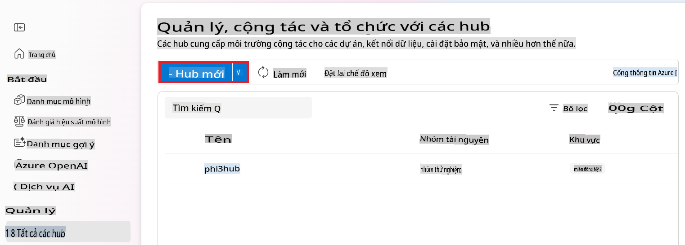

1. Thực hiện các tác vụ sau:

    - Nhập **Hub name**. Giá trị này phải là duy nhất.
    - Chọn **Subscription** Azure của bạn.
    - Chọn **Resource group** để sử dụng (tạo mới nếu cần).
    - Chọn **Location** mà bạn muốn sử dụng.
    - Chọn **Connect Azure AI Services** để sử dụng (tạo mới nếu cần).
    - Chọn **Connect Azure AI Search** thành **Skip connecting**.

    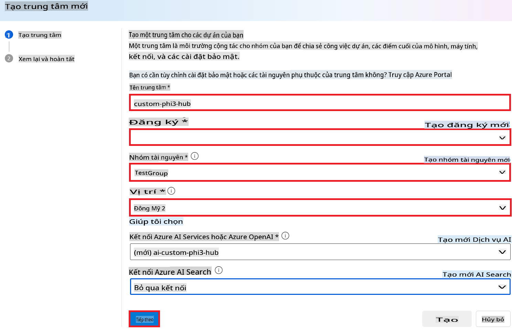

1. Chọn **Next**.

#### Tạo Azure AI Foundry Project

1. Trong Hub mà bạn đã tạo, chọn **All projects** từ thanh tab bên trái.

1. Chọn **+ New project** từ menu điều hướng.

    

1. Nhập **Project name**. Giá trị này phải là duy nhất.

    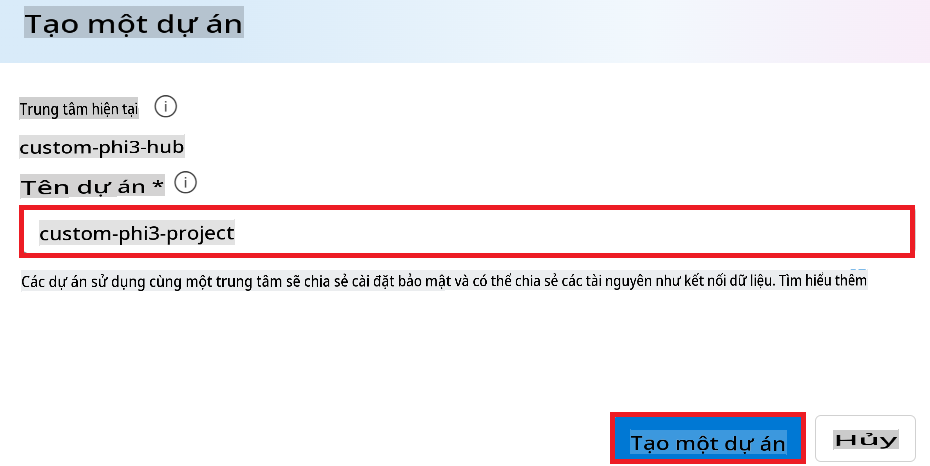

1. Chọn **Create a project**.

#### Thêm một kết nối tùy chỉnh cho mô hình Phi-3 đã tinh chỉnh

Để tích hợp mô hình Phi-3 tùy chỉnh của bạn với Prompt flow, bạn cần lưu endpoint và key của mô hình vào một kết nối tùy chỉnh. Thiết lập này đảm bảo quyền truy cập vào mô hình Phi-3 tùy chỉnh của bạn trong Prompt flow.

#### Đặt api key và endpoint uri của mô hình Phi-3 đã tinh chỉnh

1. Truy cập [Azure ML Studio](https://ml.azure.com/home?WT.mc_id=aiml-137032-kinfeylo).

1. Điều hướng đến không gian làm việc Azure Machine Learning mà bạn đã tạo.

1. Chọn **Endpoints** từ thanh tab bên trái.

    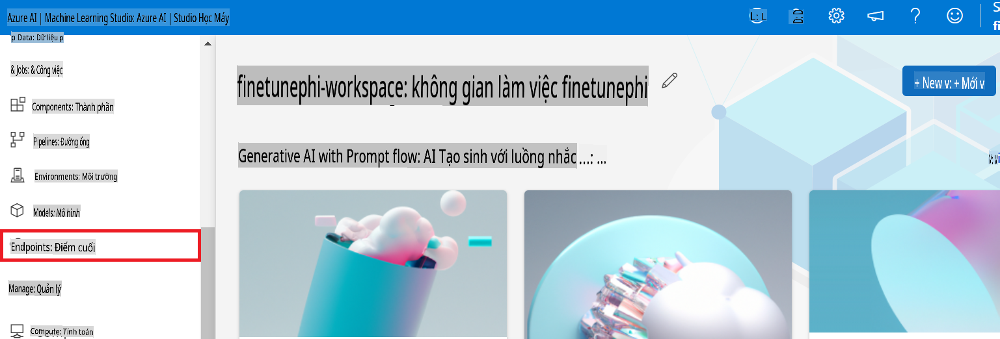

1. Chọn endpoint mà bạn đã tạo.

    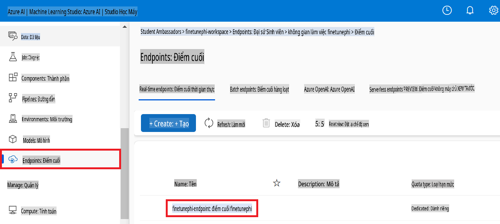

1. Chọn **Consume** từ menu điều hướng.

1. Sao chép **REST endpoint** và **Primary key** của bạn.
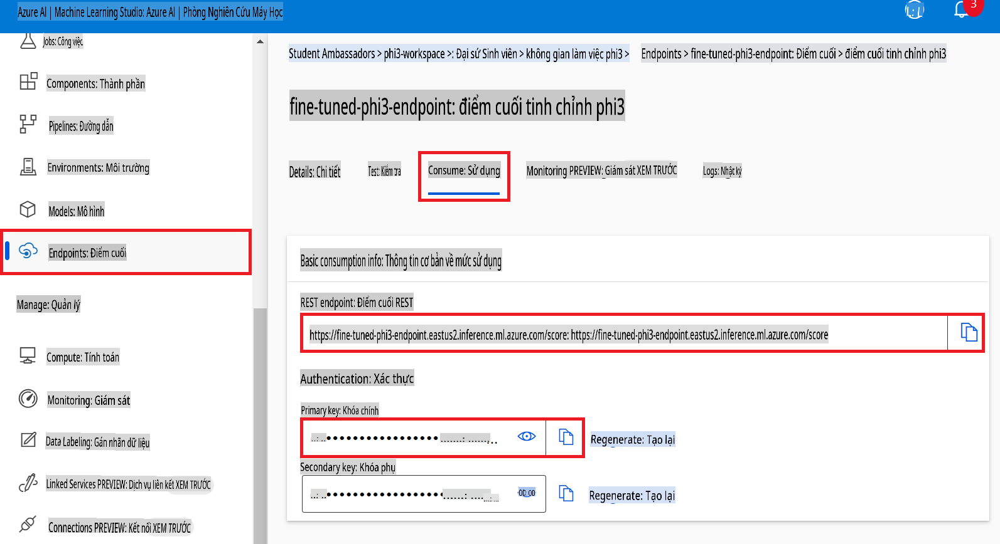

#### Thêm Kết Nối Tùy Chỉnh

1. Truy cập [Azure AI Foundry](https://ai.azure.com/?WT.mc_id=aiml-137032-kinfeylo).

1. Điều hướng đến dự án Azure AI Foundry mà bạn đã tạo.

1. Trong dự án mà bạn đã tạo, chọn **Settings** từ thanh bên trái.

1. Chọn **+ New connection**.

    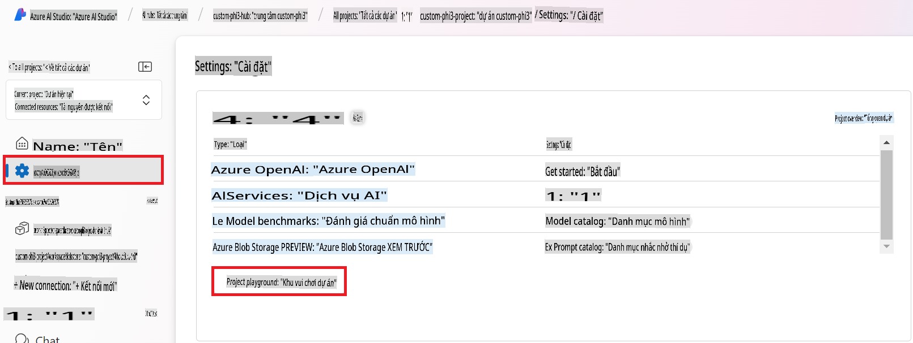

1. Chọn **Custom keys** từ menu điều hướng.

    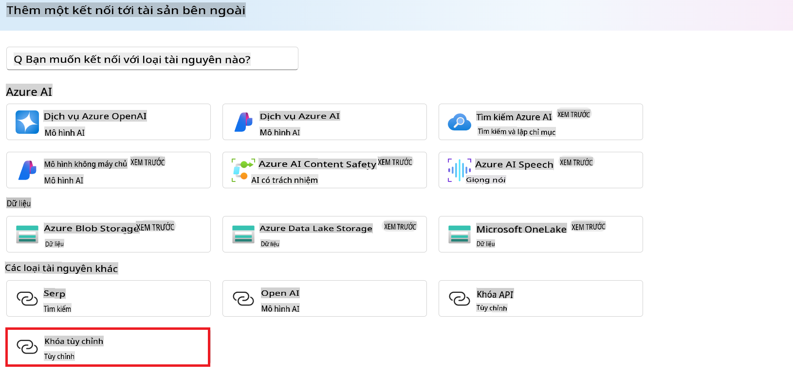

1. Thực hiện các bước sau:

    - Chọn **+ Add key value pairs**.
    - Đối với tên khóa, nhập **endpoint** và dán endpoint mà bạn đã sao chép từ Azure ML Studio vào trường giá trị.
    - Chọn **+ Add key value pairs** một lần nữa.
    - Đối với tên khóa, nhập **key** và dán khóa mà bạn đã sao chép từ Azure ML Studio vào trường giá trị.
    - Sau khi thêm các khóa, chọn **is secret** để ngăn khóa bị lộ.

    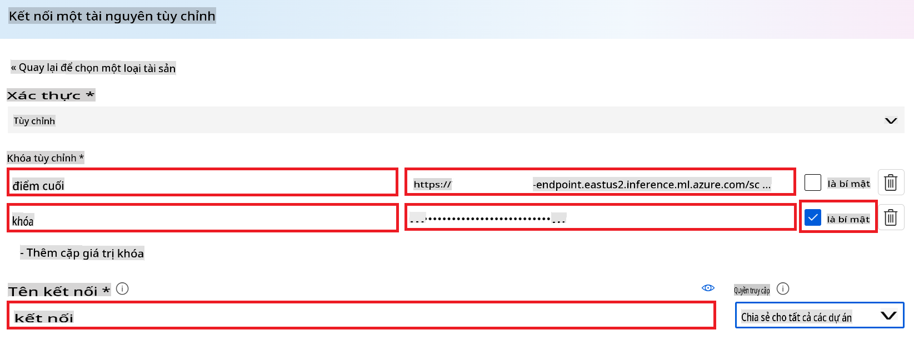

1. Chọn **Add connection**.

#### Tạo Prompt flow

Bạn đã thêm một kết nối tùy chỉnh trong Azure AI Foundry. Bây giờ, hãy tạo một Prompt flow bằng các bước sau. Sau đó, bạn sẽ kết nối Prompt flow này với kết nối tùy chỉnh để sử dụng mô hình đã tinh chỉnh trong Prompt flow.

1. Điều hướng đến dự án Azure AI Foundry mà bạn đã tạo.

1. Chọn **Prompt flow** từ thanh bên trái.

1. Chọn **+ Create** từ menu điều hướng.

    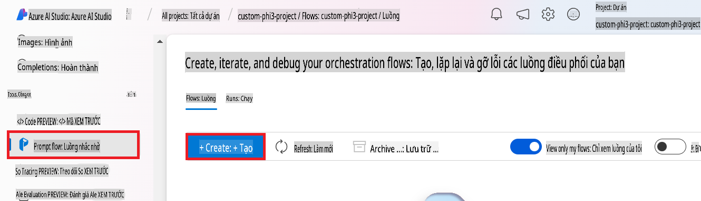

1. Chọn **Chat flow** từ menu điều hướng.

    

1. Nhập **Tên thư mục** mà bạn muốn sử dụng.

    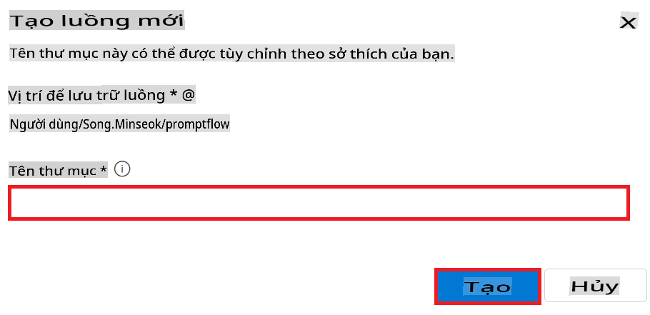

2. Chọn **Create**.

#### Thiết lập Prompt flow để trò chuyện với mô hình Phi-3 tùy chỉnh của bạn

Bạn cần tích hợp mô hình Phi-3 đã tinh chỉnh vào một Prompt flow. Tuy nhiên, Prompt flow hiện tại không được thiết kế cho mục đích này. Do đó, bạn phải thiết kế lại Prompt flow để tích hợp mô hình tùy chỉnh.

1. Trong Prompt flow, thực hiện các bước sau để xây dựng lại flow hiện tại:

    - Chọn **Raw file mode**.
    - Xóa toàn bộ mã hiện có trong tệp *flow.dag.yml*.
    - Thêm đoạn mã sau vào tệp *flow.dag.yml*.

        ```yml
        inputs:
          input_data:
            type: string
            default: "Who founded Microsoft?"

        outputs:
          answer:
            type: string
            reference: ${integrate_with_promptflow.output}

        nodes:
        - name: integrate_with_promptflow
          type: python
          source:
            type: code
            path: integrate_with_promptflow.py
          inputs:
            input_data: ${inputs.input_data}
        ```

    - Chọn **Save**.

    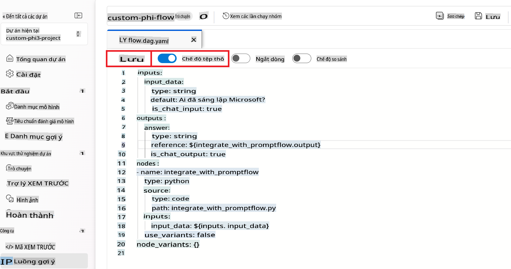

1. Thêm đoạn mã sau vào tệp *integrate_with_promptflow.py* để sử dụng mô hình Phi-3 tùy chỉnh trong Prompt flow.

    ```python
    import logging
    import requests
    from promptflow import tool
    from promptflow.connections import CustomConnection

    # Logging setup
    logging.basicConfig(
        format="%(asctime)s - %(levelname)s - %(name)s - %(message)s",
        datefmt="%Y-%m-%d %H:%M:%S",
        level=logging.DEBUG
    )
    logger = logging.getLogger(__name__)

    def query_phi3_model(input_data: str, connection: CustomConnection) -> str:
        """
        Send a request to the Phi-3 model endpoint with the given input data using Custom Connection.
        """

        # "connection" is the name of the Custom Connection, "endpoint", "key" are the keys in the Custom Connection
        endpoint_url = connection.endpoint
        api_key = connection.key

        headers = {
            "Content-Type": "application/json",
            "Authorization": f"Bearer {api_key}"
        }
        data = {
            "input_data": {
                "input_string": [
                    {"role": "user", "content": input_data}
                ],
                "parameters": {
                    "temperature": 0.7,
                    "max_new_tokens": 128
                }
            }
        }
        try:
            response = requests.post(endpoint_url, json=data, headers=headers)
            response.raise_for_status()
            
            # Log the full JSON response
            logger.debug(f"Full JSON response: {response.json()}")

            result = response.json()["output"]
            logger.info("Successfully received response from Azure ML Endpoint.")
            return result
        except requests.exceptions.RequestException as e:
            logger.error(f"Error querying Azure ML Endpoint: {e}")
            raise

    @tool
    def my_python_tool(input_data: str, connection: CustomConnection) -> str:
        """
        Tool function to process input data and query the Phi-3 model.
        """
        return query_phi3_model(input_data, connection)

    ```

    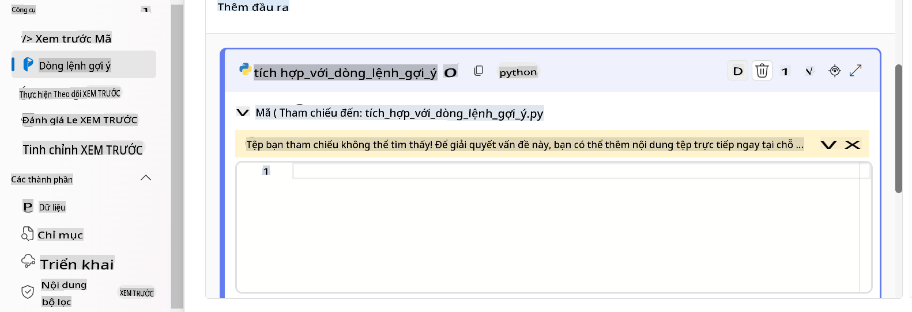

> [!NOTE]
> Để biết thêm thông tin chi tiết về cách sử dụng Prompt flow trong Azure AI Foundry, bạn có thể tham khảo [Prompt flow in Azure AI Foundry](https://learn.microsoft.com/azure/ai-studio/how-to/prompt-flow).

1. Chọn **Chat input**, **Chat output** để bật trò chuyện với mô hình của bạn.

    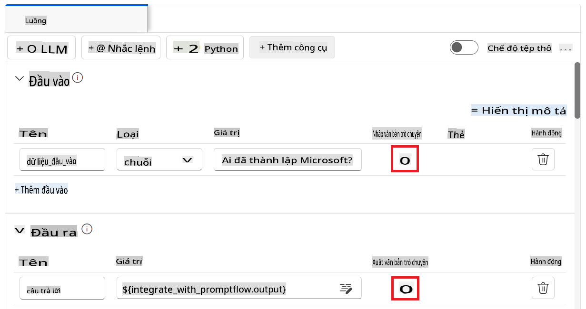

1. Bây giờ bạn đã sẵn sàng để trò chuyện với mô hình Phi-3 tùy chỉnh của mình. Trong bài tập tiếp theo, bạn sẽ học cách khởi động Prompt flow và sử dụng nó để trò chuyện với mô hình Phi-3 đã tinh chỉnh của bạn.

> [!NOTE]
>
> Flow được xây dựng lại sẽ trông giống như hình dưới đây:
>
> 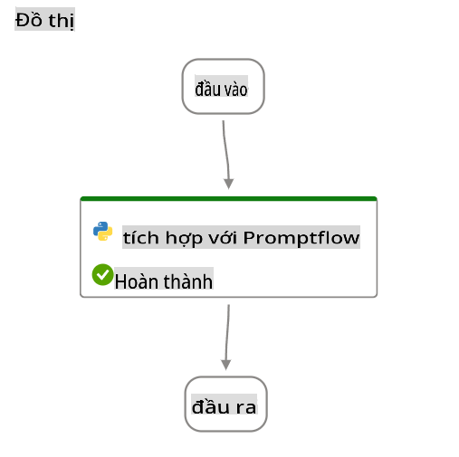
>

### Trò chuyện với mô hình Phi-3 tùy chỉnh của bạn

Bây giờ bạn đã tinh chỉnh và tích hợp mô hình Phi-3 tùy chỉnh của mình với Prompt flow, bạn đã sẵn sàng để bắt đầu tương tác với nó. Bài tập này sẽ hướng dẫn bạn cách thiết lập và khởi động một cuộc trò chuyện với mô hình của bạn bằng Prompt flow. Bằng cách làm theo các bước này, bạn sẽ có thể tận dụng tối đa khả năng của mô hình Phi-3 đã tinh chỉnh cho nhiều tác vụ và cuộc trò chuyện khác nhau.

- Trò chuyện với mô hình Phi-3 tùy chỉnh của bạn bằng Prompt flow.

#### Khởi động Prompt flow

1. Chọn **Start compute sessions** để khởi động Prompt flow.

    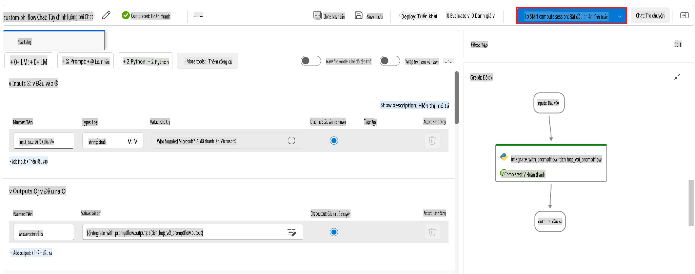

1. Chọn **Validate and parse input** để làm mới các tham số.

    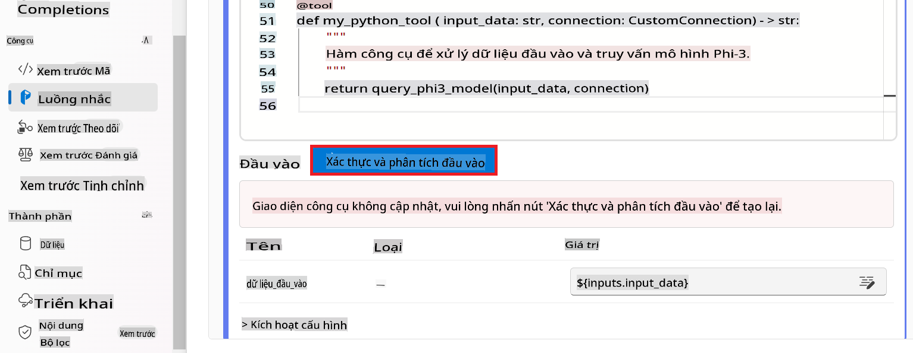

1. Chọn **Value** của **connection** đến kết nối tùy chỉnh mà bạn đã tạo. Ví dụ: *connection*.

    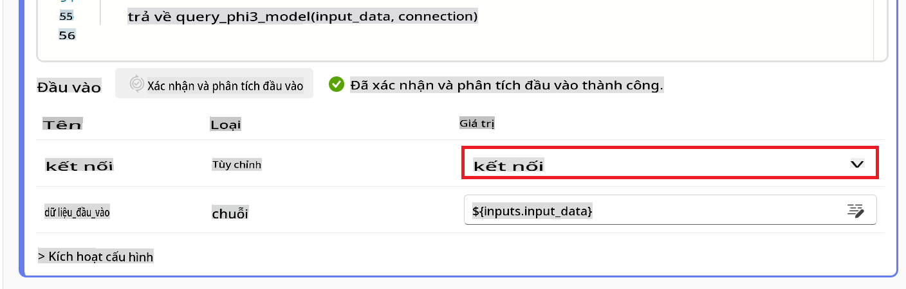

#### Trò chuyện với mô hình tùy chỉnh của bạn

1. Chọn **Chat**.

    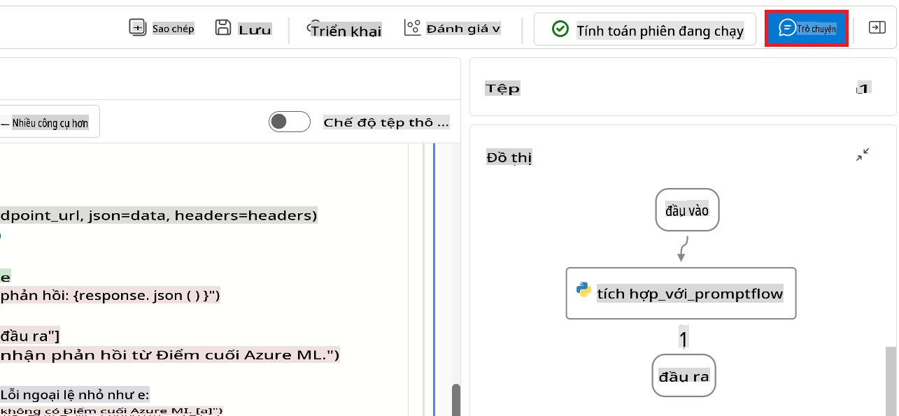

1. Đây là một ví dụ về kết quả: Bây giờ bạn có thể trò chuyện với mô hình Phi-3 tùy chỉnh của mình. Khuyến khích đặt câu hỏi dựa trên dữ liệu được sử dụng để tinh chỉnh.

    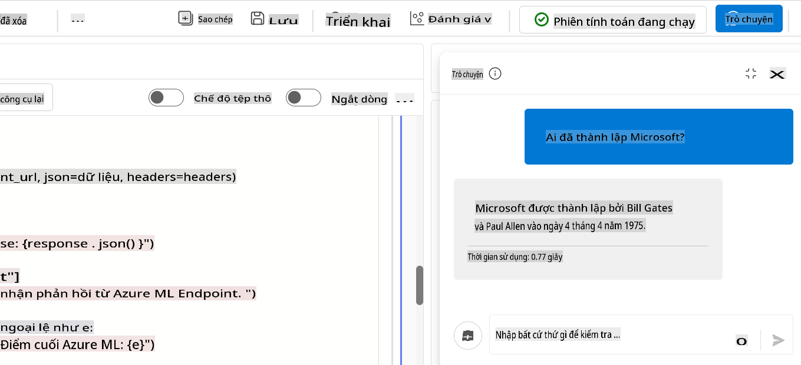

**Tuyên bố miễn trừ trách nhiệm**:  
Tài liệu này đã được dịch bằng các dịch vụ dịch thuật AI tự động. Mặc dù chúng tôi cố gắng đảm bảo độ chính xác, xin lưu ý rằng các bản dịch tự động có thể chứa lỗi hoặc không chính xác. Tài liệu gốc bằng ngôn ngữ bản địa nên được coi là nguồn tham khảo chính thức. Đối với các thông tin quan trọng, khuyến nghị sử dụng dịch thuật chuyên nghiệp bởi con người. Chúng tôi không chịu trách nhiệm về bất kỳ sự hiểu lầm hoặc diễn giải sai nào phát sinh từ việc sử dụng bản dịch này.