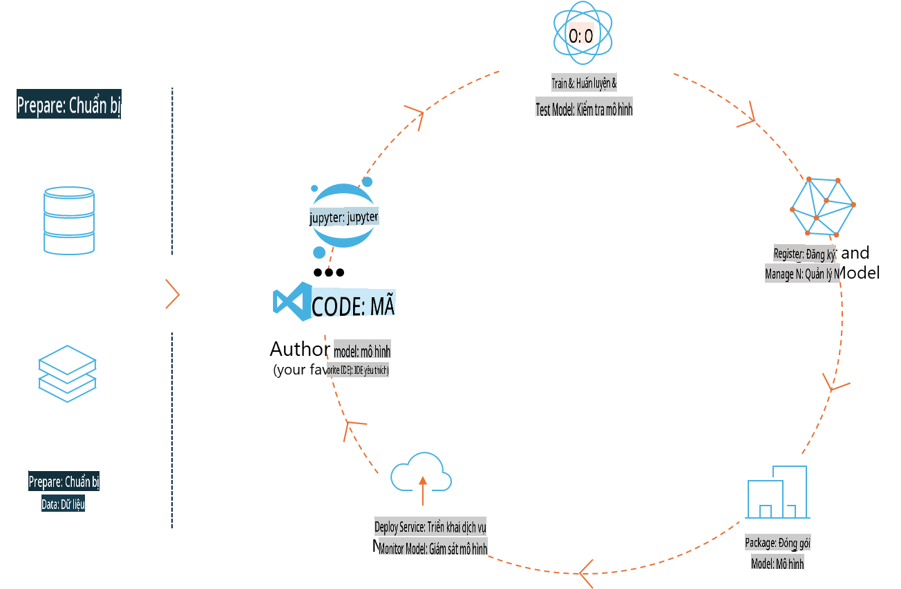
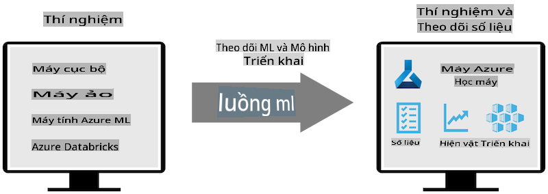
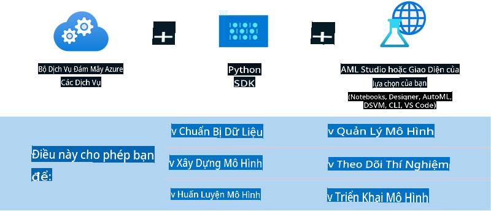

# MLflow

[MLflow](https://mlflow.org/) là một nền tảng mã nguồn mở được thiết kế để quản lý toàn bộ vòng đời của học máy (machine learning).



MLFlow được sử dụng để quản lý vòng đời ML, bao gồm thử nghiệm, tái tạo, triển khai và một kho lưu trữ mô hình trung tâm. Hiện tại, MLFlow cung cấp bốn thành phần chính:

- **MLflow Tracking:** Ghi lại và truy vấn các thử nghiệm, mã, cấu hình dữ liệu và kết quả.
- **MLflow Projects:** Đóng gói mã khoa học dữ liệu trong một định dạng để tái tạo các lần chạy trên bất kỳ nền tảng nào.
- **Mlflow Models:** Triển khai các mô hình học máy trong nhiều môi trường phục vụ khác nhau.
- **Model Registry:** Lưu trữ, chú thích và quản lý các mô hình trong một kho lưu trữ trung tâm.

Nền tảng này bao gồm các khả năng như theo dõi thử nghiệm, đóng gói mã để tái tạo, chia sẻ và triển khai mô hình. MLFlow được tích hợp vào Databricks và hỗ trợ nhiều thư viện ML khác nhau, giúp nó không phụ thuộc vào bất kỳ thư viện cụ thể nào. Nó có thể được sử dụng với bất kỳ thư viện học máy nào và trong bất kỳ ngôn ngữ lập trình nào, nhờ cung cấp REST API và CLI tiện lợi.



Các tính năng chính của MLFlow bao gồm:

- **Experiment Tracking:** Ghi lại và so sánh các tham số và kết quả.
- **Model Management:** Triển khai mô hình đến các nền tảng phục vụ và suy luận khác nhau.
- **Model Registry:** Quản lý vòng đời của các mô hình MLflow một cách hợp tác, bao gồm quản lý phiên bản và chú thích.
- **Projects:** Đóng gói mã ML để chia sẻ hoặc sử dụng trong sản xuất.

MLFlow cũng hỗ trợ chu trình MLOps, bao gồm chuẩn bị dữ liệu, đăng ký và quản lý mô hình, đóng gói mô hình để thực thi, triển khai dịch vụ và giám sát mô hình. Mục tiêu của nó là đơn giản hóa quy trình chuyển đổi từ nguyên mẫu sang quy trình sản xuất, đặc biệt trong các môi trường đám mây và biên.

## Kịch bản E2E - Xây dựng một wrapper và sử dụng Phi-3 như một mô hình MLFlow

Trong ví dụ E2E này, chúng ta sẽ trình bày hai cách tiếp cận khác nhau để xây dựng một wrapper xung quanh mô hình ngôn ngữ nhỏ Phi-3 (SLM) và sau đó chạy nó như một mô hình MLFlow, có thể là cục bộ hoặc trên đám mây, ví dụ: trong không gian làm việc Azure Machine Learning.



| Dự án | Mô tả | Vị trí |
| ------------ | ----------- | -------- |
| Transformer Pipeline | Transformer Pipeline là cách dễ nhất để xây dựng một wrapper nếu bạn muốn sử dụng mô hình HuggingFace với hương vị transformers thử nghiệm của MLFlow. | [**TransformerPipeline.ipynb**](../../../../../../code/06.E2E/E2E_Phi-3-MLflow_TransformerPipeline.ipynb) |
| Custom Python Wrapper | Tại thời điểm viết bài, transformer pipeline không hỗ trợ tạo wrapper MLFlow cho các mô hình HuggingFace ở định dạng ONNX, ngay cả khi sử dụng gói Python optimum thử nghiệm. Trong các trường hợp như vậy, bạn có thể xây dựng wrapper Python tùy chỉnh cho chế độ MLFlow. | [**CustomPythonWrapper.ipynb**](../../../../../../code/06.E2E/E2E_Phi-3-MLflow_CustomPythonWrapper.ipynb) |

## Dự án: Transformer Pipeline

1. Bạn sẽ cần các gói Python liên quan từ MLFlow và HuggingFace:

    ``` Python
    import mlflow
    import transformers
    ```

2. Tiếp theo, bạn nên khởi tạo một transformer pipeline bằng cách tham chiếu đến mô hình Phi-3 mục tiêu trong registry của HuggingFace. Như có thể thấy từ thẻ mô hình _Phi-3-mini-4k-instruct_, nhiệm vụ của nó là loại “Text Generation”:

    ``` Python
    pipeline = transformers.pipeline(
        task = "text-generation",
        model = "microsoft/Phi-3-mini-4k-instruct"
    )
    ```

3. Bây giờ bạn có thể lưu pipeline transformer của mô hình Phi-3 vào định dạng MLFlow và cung cấp các chi tiết bổ sung như đường dẫn artifact mục tiêu, cài đặt cấu hình mô hình cụ thể và loại API suy luận:

    ``` Python
    model_info = mlflow.transformers.log_model(
        transformers_model = pipeline,
        artifact_path = "phi3-mlflow-model",
        model_config = model_config,
        task = "llm/v1/chat"
    )
    ```

## Dự án: Custom Python Wrapper

1. Chúng ta có thể sử dụng [ONNX Runtime generate() API](https://github.com/microsoft/onnxruntime-genai) của Microsoft để suy luận mô hình ONNX và mã hóa / giải mã token. Bạn phải chọn gói _onnxruntime_genai_ cho máy tính mục tiêu của mình, với ví dụ dưới đây nhắm vào CPU:

    ``` Python
    import mlflow
    from mlflow.models import infer_signature
    import onnxruntime_genai as og
    ```

1. Lớp tùy chỉnh của chúng ta triển khai hai phương thức: _load_context()_ để khởi tạo **mô hình ONNX** của Phi-3 Mini 4K Instruct, **các tham số generator** và **tokenizer**; và _predict()_ để tạo token đầu ra từ prompt được cung cấp:

    ``` Python
    class Phi3Model(mlflow.pyfunc.PythonModel):
        def load_context(self, context):
            # Retrieving model from the artifacts
            model_path = context.artifacts["phi3-mini-onnx"]
            model_options = {
                 "max_length": 300,
                 "temperature": 0.2,         
            }
        
            # Defining the model
            self.phi3_model = og.Model(model_path)
            self.params = og.GeneratorParams(self.phi3_model)
            self.params.set_search_options(**model_options)
            
            # Defining the tokenizer
            self.tokenizer = og.Tokenizer(self.phi3_model)
    
        def predict(self, context, model_input):
            # Retrieving prompt from the input
            prompt = model_input["prompt"][0]
            self.params.input_ids = self.tokenizer.encode(prompt)
    
            # Generating the model's response
            response = self.phi3_model.generate(self.params)
    
            return self.tokenizer.decode(response[0][len(self.params.input_ids):])
    ```

1. Bây giờ bạn có thể sử dụng hàm _mlflow.pyfunc.log_model()_ để tạo một wrapper Python tùy chỉnh (ở định dạng pickle) cho mô hình Phi-3, cùng với mô hình ONNX gốc và các phụ thuộc cần thiết:

    ``` Python
    model_info = mlflow.pyfunc.log_model(
        artifact_path = artifact_path,
        python_model = Phi3Model(),
        artifacts = {
            "phi3-mini-onnx": "cpu_and_mobile/cpu-int4-rtn-block-32-acc-level-4",
        },
        input_example = input_example,
        signature = infer_signature(input_example, ["Run"]),
        extra_pip_requirements = ["torch", "onnxruntime_genai", "numpy"],
    )
    ```

## Chữ ký của các mô hình MLFlow được tạo

1. Ở bước 3 của dự án Transformer Pipeline ở trên, chúng ta đặt nhiệm vụ của mô hình MLFlow thành “_llm/v1/chat_”. Hướng dẫn này tạo ra một wrapper API của mô hình, tương thích với Chat API của OpenAI như dưới đây:

    ``` Python
    {inputs: 
      ['messages': Array({content: string (required), name: string (optional), role: string (required)}) (required), 'temperature': double (optional), 'max_tokens': long (optional), 'stop': Array(string) (optional), 'n': long (optional), 'stream': boolean (optional)],
    outputs: 
      ['id': string (required), 'object': string (required), 'created': long (required), 'model': string (required), 'choices': Array({finish_reason: string (required), index: long (required), message: {content: string (required), name: string (optional), role: string (required)} (required)}) (required), 'usage': {completion_tokens: long (required), prompt_tokens: long (required), total_tokens: long (required)} (required)],
    params: 
      None}
    ```

1. Kết quả là, bạn có thể gửi prompt của mình ở định dạng sau:

    ``` Python
    messages = [{"role": "user", "content": "What is the capital of Spain?"}]
    ```

1. Sau đó, sử dụng xử lý hậu kỳ tương thích với OpenAI API, ví dụ: _response[0][‘choices’][0][‘message’][‘content’]_, để làm đẹp đầu ra của bạn thành dạng như sau:

    ``` JSON
    Question: What is the capital of Spain?
    
    Answer: The capital of Spain is Madrid. It is the largest city in Spain and serves as the political, economic, and cultural center of the country. Madrid is located in the center of the Iberian Peninsula and is known for its rich history, art, and architecture, including the Royal Palace, the Prado Museum, and the Plaza Mayor.
    
    Usage: {'prompt_tokens': 11, 'completion_tokens': 73, 'total_tokens': 84}
    ```

1. Ở bước 3 của dự án Custom Python Wrapper ở trên, chúng ta cho phép gói MLFlow tạo chữ ký của mô hình từ một ví dụ đầu vào nhất định. Chữ ký của wrapper MLFlow sẽ trông như thế này:

    ``` Python
    {inputs: 
      ['prompt': string (required)],
    outputs: 
      [string (required)],
    params: 
      None}
    ```

1. Vì vậy, prompt của chúng ta sẽ cần chứa khóa dictionary "prompt", tương tự như sau:

    ``` Python
    {"prompt": "<|system|>You are a stand-up comedian.<|end|><|user|>Tell me a joke about atom<|end|><|assistant|>",}
    ```

1. Đầu ra của mô hình sau đó sẽ được cung cấp ở định dạng chuỗi:

    ``` JSON
    Alright, here's a little atom-related joke for you!
    
    Why don't electrons ever play hide and seek with protons?
    
    Because good luck finding them when they're always "sharing" their electrons!
    
    Remember, this is all in good fun, and we're just having a little atomic-level humor!
    ```

**Tuyên bố miễn trừ trách nhiệm**:  
Tài liệu này đã được dịch bằng các dịch vụ dịch thuật AI tự động. Mặc dù chúng tôi cố gắng đảm bảo độ chính xác, xin lưu ý rằng các bản dịch tự động có thể chứa lỗi hoặc không chính xác. Tài liệu gốc bằng ngôn ngữ bản địa nên được coi là nguồn thông tin có thẩm quyền. Đối với thông tin quan trọng, nên sử dụng dịch vụ dịch thuật chuyên nghiệp của con người. Chúng tôi không chịu trách nhiệm về bất kỳ sự hiểu lầm hoặc diễn giải sai nào phát sinh từ việc sử dụng bản dịch này.