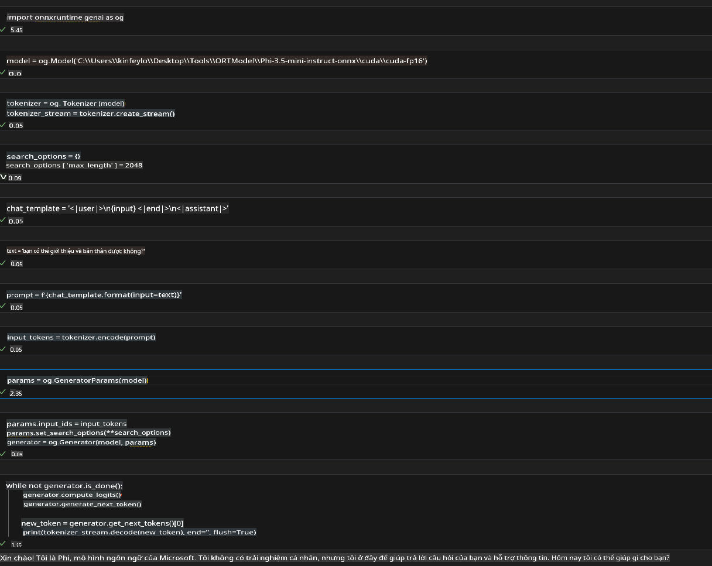

# **Hướng dẫn sử dụng OnnxRuntime GenAI trên Windows GPU**

Hướng dẫn này cung cấp các bước thiết lập và sử dụng ONNX Runtime (ORT) với GPU trên Windows. Mục đích là giúp bạn tận dụng khả năng tăng tốc của GPU cho các mô hình, cải thiện hiệu suất và hiệu quả.

Tài liệu này hướng dẫn về:

- Thiết lập môi trường: Hướng dẫn cài đặt các phụ thuộc cần thiết như CUDA, cuDNN và ONNX Runtime.
- Cấu hình: Cách cấu hình môi trường và ONNX Runtime để sử dụng tài nguyên GPU một cách hiệu quả.
- Mẹo tối ưu hóa: Gợi ý cách điều chỉnh cài đặt GPU để đạt hiệu suất tối ưu.

### **1. Python 3.10.x /3.11.8**

   ***Lưu ý*** Khuyến nghị sử dụng [miniforge](https://github.com/conda-forge/miniforge/releases/latest/download/Miniforge3-Windows-x86_64.exe) làm môi trường Python của bạn.

   ```bash

   conda create -n pydev python==3.11.8

   conda activate pydev

   ```

   ***Nhắc nhở*** Nếu bạn đã cài bất kỳ thư viện ONNX nào liên quan đến Python, hãy gỡ cài đặt chúng.

### **2. Cài đặt CMake bằng winget**

   ```bash

   winget install -e --id Kitware.CMake

   ```

### **3. Cài đặt Visual Studio 2022 - Desktop Development with C++**

   ***Lưu ý*** Nếu bạn không muốn biên dịch, bạn có thể bỏ qua bước này.


### **4. Cài đặt NVIDIA Driver**

1. **NVIDIA GPU Driver**  [https://www.nvidia.com/en-us/drivers/](https://www.nvidia.com/en-us/drivers/)

2. **NVIDIA CUDA 12.4** [https://developer.nvidia.com/cuda-12-4-0-download-archive](https://developer.nvidia.com/cuda-12-4-0-download-archive)

3. **NVIDIA CUDNN 9.4**  [https://developer.nvidia.com/cudnn-downloads](https://developer.nvidia.com/cudnn-downloads)

***Nhắc nhở*** Vui lòng sử dụng cài đặt mặc định trong quá trình cài đặt.

### **5. Thiết lập môi trường NVIDIA**

Sao chép các thư mục lib, bin, include của NVIDIA CUDNN 9.4 vào các thư mục lib, bin, include của NVIDIA CUDA 12.4.

- Sao chép các tệp trong *'C:\Program Files\NVIDIA\CUDNN\v9.4\bin\12.6'* vào *'C:\Program Files\NVIDIA GPU Computing Toolkit\CUDA\v12.4\bin'*.

- Sao chép các tệp trong *'C:\Program Files\NVIDIA\CUDNN\v9.4\include\12.6'* vào *'C:\Program Files\NVIDIA GPU Computing Toolkit\CUDA\v12.4\include'*.

- Sao chép các tệp trong *'C:\Program Files\NVIDIA\CUDNN\v9.4\lib\12.6'* vào *'C:\Program Files\NVIDIA GPU Computing Toolkit\CUDA\v12.4\lib\x64'*.

### **6. Tải xuống Phi-3.5-mini-instruct-onnx**

   ```bash

   winget install -e --id Git.Git

   winget install -e --id GitHub.GitLFS

   git lfs install

   git clone https://huggingface.co/microsoft/Phi-3.5-mini-instruct-onnx

   ```

### **7. Chạy InferencePhi35Instruct.ipynb**

   Mở [Notebook](../../../../../../code/09.UpdateSamples/Aug/ortgpu-phi35-instruct.ipynb) và thực thi.



### **8. Biên dịch ORT GenAI GPU**

   ***Lưu ý*** 
   
   1. Hãy gỡ cài đặt tất cả các thư viện liên quan đến onnx, onnxruntime và onnxruntime-genai trước.

   ```bash

   pip list 
   
   ```

   Sau đó gỡ cài đặt tất cả các thư viện onnxruntime, ví dụ:

   ```bash

   pip uninstall onnxruntime

   pip uninstall onnxruntime-genai

   pip uninstall onnxruntume-genai-cuda
   
   ```

   2. Kiểm tra hỗ trợ của Visual Studio Extension.

   Kiểm tra thư mục C:\Program Files\NVIDIA GPU Computing Toolkit\CUDA\v12.4\extras để đảm bảo rằng thư mục C:\Program Files\NVIDIA GPU Computing Toolkit\CUDA\v12.4\extras\visual_studio_integration tồn tại. 

   Nếu không tìm thấy, hãy kiểm tra các thư mục driver toolkit CUDA khác và sao chép thư mục visual_studio_integration cùng nội dung vào C:\Program Files\NVIDIA GPU Computing Toolkit\CUDA\v12.4\extras\visual_studio_integration.

   - Nếu bạn không muốn biên dịch, bạn có thể bỏ qua bước này.

   ```bash

   git clone https://github.com/microsoft/onnxruntime-genai

   ```

   - Tải xuống [https://github.com/microsoft/onnxruntime/releases/download/v1.19.2/onnxruntime-win-x64-gpu-1.19.2.zip](https://github.com/microsoft/onnxruntime/releases/download/v1.19.2/onnxruntime-win-x64-gpu-1.19.2.zip).

   - Giải nén tệp onnxruntime-win-x64-gpu-1.19.2.zip, đổi tên thành **ort**, sau đó sao chép thư mục ort vào onnxruntime-genai.

   - Sử dụng Windows Terminal, mở Developer Command Prompt for VS 2022 và điều hướng đến onnxruntime-genai.


   - Biên dịch với môi trường Python của bạn.

   ```bash

   cd onnxruntime-genai

   python build.py --use_cuda  --cuda_home "C:\Program Files\NVIDIA GPU Computing Toolkit\CUDA\v12.4" --config Release
 

   cd build/Windows/Release/Wheel

   pip install .whl

   ```

**Tuyên bố từ chối trách nhiệm**:  
Tài liệu này đã được dịch bằng các dịch vụ dịch thuật AI tự động. Mặc dù chúng tôi cố gắng đảm bảo độ chính xác, xin lưu ý rằng các bản dịch tự động có thể chứa lỗi hoặc không chính xác. Tài liệu gốc bằng ngôn ngữ gốc nên được coi là nguồn đáng tin cậy nhất. Đối với thông tin quan trọng, khuyến nghị sử dụng dịch vụ dịch thuật chuyên nghiệp từ con người. Chúng tôi không chịu trách nhiệm về bất kỳ sự hiểu lầm hoặc diễn giải sai nào phát sinh từ việc sử dụng bản dịch này.