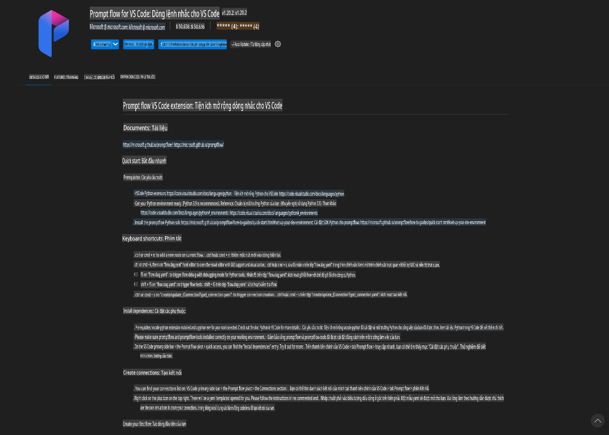
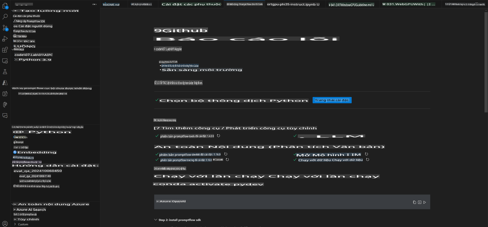
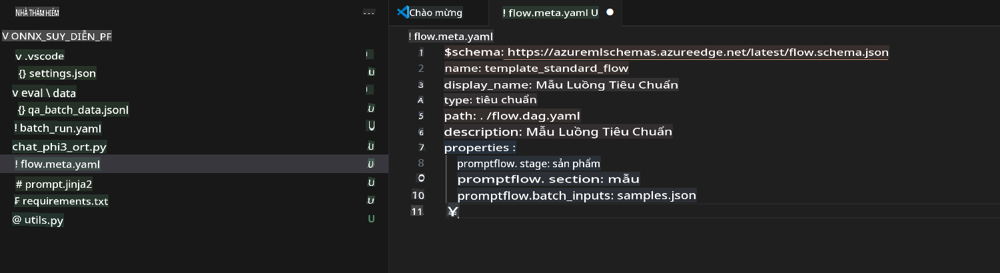
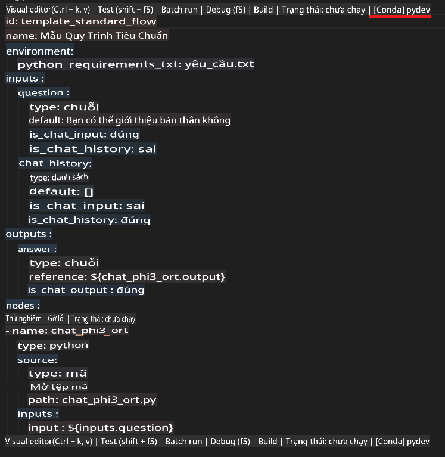
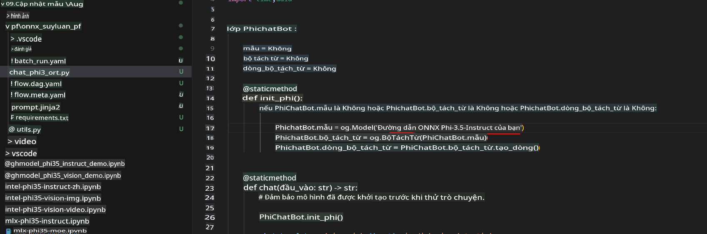
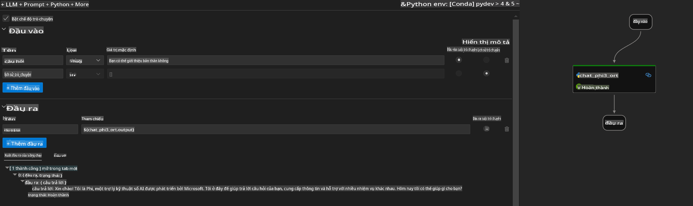
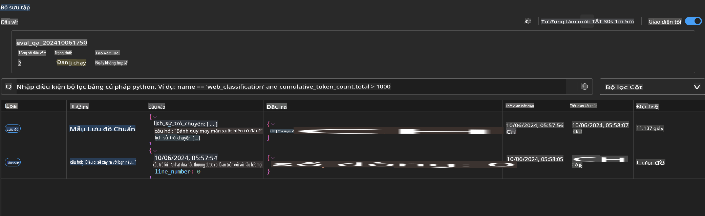

# Sử dụng Windows GPU để tạo giải pháp Prompt flow với Phi-3.5-Instruct ONNX

Tài liệu sau đây là một ví dụ về cách sử dụng PromptFlow với ONNX (Open Neural Network Exchange) để phát triển các ứng dụng AI dựa trên mô hình Phi-3.

PromptFlow là một bộ công cụ phát triển được thiết kế để đơn giản hóa chu trình phát triển từ đầu đến cuối của các ứng dụng AI dựa trên LLM (Large Language Model), từ giai đoạn ý tưởng và tạo mẫu đến thử nghiệm và đánh giá.

Bằng cách tích hợp PromptFlow với ONNX, các nhà phát triển có thể:

- **Tối ưu hóa hiệu suất mô hình**: Tận dụng ONNX để suy luận và triển khai mô hình hiệu quả.
- **Đơn giản hóa phát triển**: Sử dụng PromptFlow để quản lý quy trình làm việc và tự động hóa các tác vụ lặp lại.
- **Nâng cao hợp tác**: Tạo điều kiện hợp tác tốt hơn giữa các thành viên trong nhóm bằng cách cung cấp một môi trường phát triển thống nhất.

**Prompt flow** là một bộ công cụ phát triển được thiết kế để đơn giản hóa chu trình phát triển từ đầu đến cuối của các ứng dụng AI dựa trên LLM, từ ý tưởng, tạo mẫu, thử nghiệm, đánh giá đến triển khai sản phẩm và giám sát. Nó giúp việc thiết kế prompt trở nên dễ dàng hơn và cho phép bạn xây dựng các ứng dụng LLM với chất lượng sản xuất.

Prompt flow có thể kết nối với OpenAI, Azure OpenAI Service, và các mô hình tùy chỉnh (Huggingface, LLM/SLM cục bộ). Chúng tôi hy vọng triển khai mô hình ONNX đã được lượng tử hóa của Phi-3.5 vào các ứng dụng cục bộ. Prompt flow có thể giúp chúng ta lập kế hoạch kinh doanh tốt hơn và hoàn thiện các giải pháp cục bộ dựa trên Phi-3.5. Trong ví dụ này, chúng ta sẽ kết hợp Thư viện ONNX Runtime GenAI để hoàn thiện giải pháp Prompt flow dựa trên Windows GPU.

## **Cài đặt**

### **ONNX Runtime GenAI cho Windows GPU**

Đọc hướng dẫn này để thiết lập ONNX Runtime GenAI cho Windows GPU [nhấn vào đây](./ORTWindowGPUGuideline.md)

### **Thiết lập Prompt flow trong VSCode**

1. Cài đặt tiện ích mở rộng Prompt flow cho VS Code



2. Sau khi cài đặt tiện ích mở rộng Prompt flow, nhấn vào tiện ích, và chọn **Installation dependencies**. Làm theo hướng dẫn này để cài đặt Prompt flow SDK trong môi trường của bạn.



3. Tải xuống [Mã mẫu](../../../../../../code/09.UpdateSamples/Aug/pf/onnx_inference_pf) và sử dụng VS Code để mở mã mẫu này.



4. Mở **flow.dag.yaml** để chọn môi trường Python của bạn.



   Mở **chat_phi3_ort.py** để thay đổi vị trí mô hình Phi-3.5-instruct ONNX của bạn.



5. Chạy Prompt flow của bạn để thử nghiệm.

Mở **flow.dag.yaml** và nhấn vào trình chỉnh sửa trực quan.


Sau khi nhấn vào đây, chạy để thử nghiệm.



1. Bạn có thể chạy batch trong terminal để kiểm tra thêm kết quả.

```bash

pf run create --file batch_run.yaml --stream --name 'Your eval qa name'    

```

Bạn có thể kiểm tra kết quả trong trình duyệt mặc định của mình.



**Tuyên bố từ chối trách nhiệm**:  
Tài liệu này đã được dịch bằng các dịch vụ dịch thuật AI tự động. Mặc dù chúng tôi cố gắng đảm bảo độ chính xác, xin lưu ý rằng các bản dịch tự động có thể chứa lỗi hoặc không chính xác. Tài liệu gốc bằng ngôn ngữ ban đầu nên được coi là nguồn thông tin chính thức. Đối với các thông tin quan trọng, nên sử dụng dịch vụ dịch thuật chuyên nghiệp của con người. Chúng tôi không chịu trách nhiệm về bất kỳ sự hiểu lầm hoặc diễn giải sai nào phát sinh từ việc sử dụng bản dịch này.