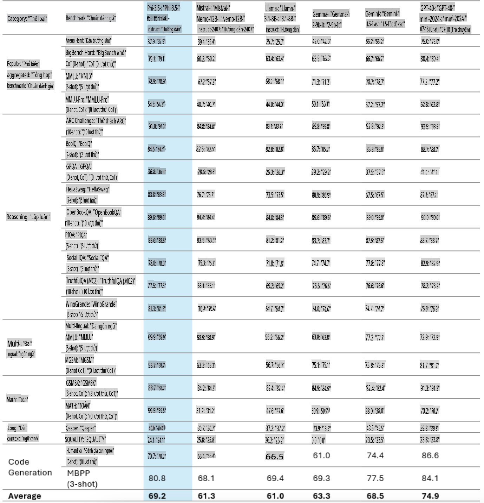
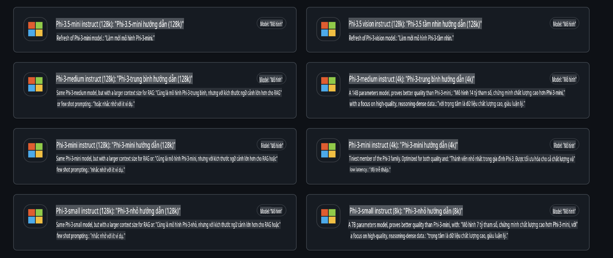
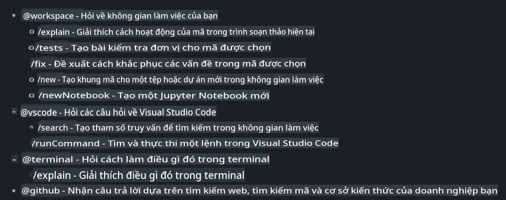
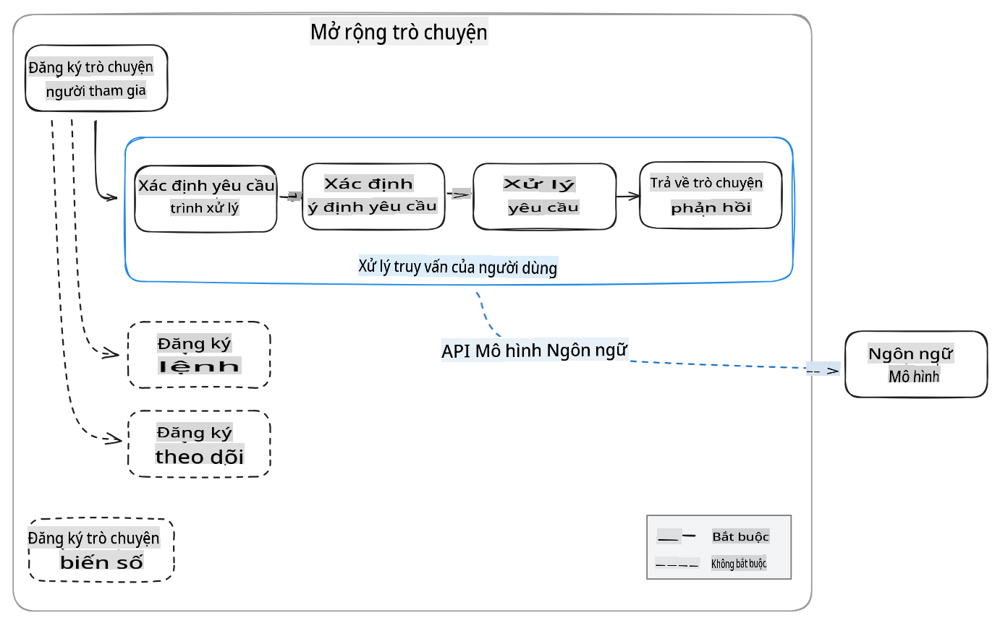
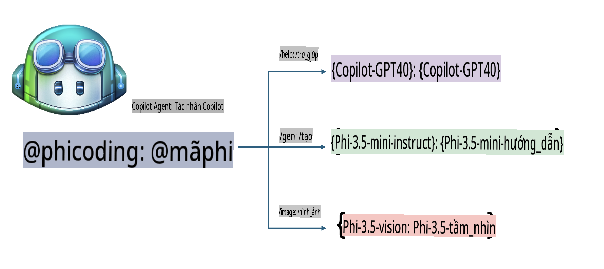
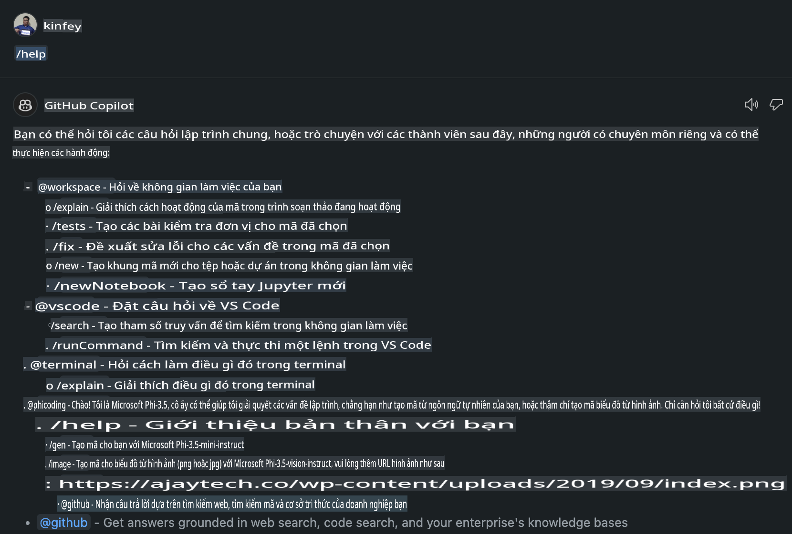
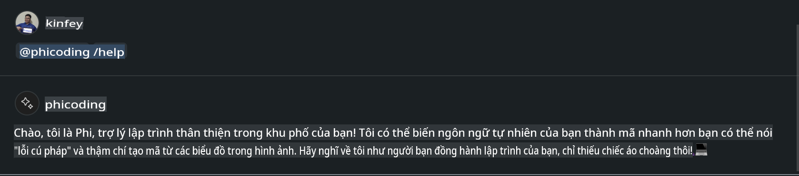
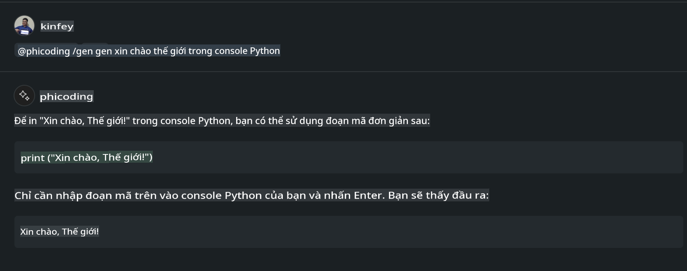
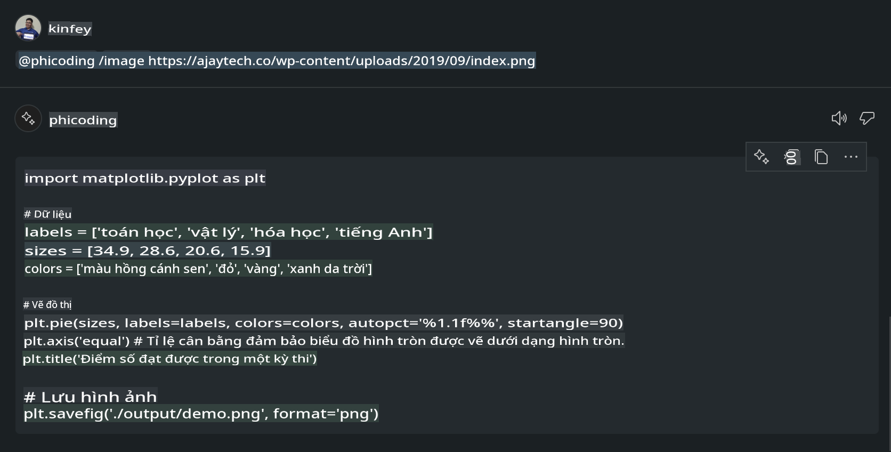

# **Tạo Visual Studio Code Chat Copilot Agent của riêng bạn với Phi-3.5 từ GitHub Models**

Bạn đang sử dụng Visual Studio Code Copilot? Đặc biệt trong Chat, bạn có thể sử dụng các agent khác nhau để cải thiện khả năng tạo, viết và duy trì dự án trong Visual Studio Code. Visual Studio Code cung cấp một API cho phép các công ty và cá nhân tạo ra các agent khác nhau dựa trên nhu cầu kinh doanh của họ để mở rộng khả năng trong các lĩnh vực chuyên biệt. Trong bài viết này, chúng ta sẽ tập trung vào **Phi-3.5-mini-instruct (128k)** và **Phi-3.5-vision-instruct (128k)** từ GitHub Models để tạo Visual Studio Code Agent của riêng bạn.

## **Giới thiệu về Phi-3.5 trên GitHub Models**

Chúng ta biết rằng Phi-3/3.5-mini-instruct trong dòng sản phẩm Phi-3/3.5 có khả năng hiểu và tạo mã mạnh mẽ, vượt trội so với Gemma-2-9b và Mistral-Nemo-12B-instruct-2407.



GitHub Models mới nhất đã cung cấp quyền truy cập vào các mô hình Phi-3.5-mini-instruct (128k) và Phi-3.5-vision-instruct (128k). Các nhà phát triển có thể truy cập chúng thông qua OpenAI SDK, Azure AI Inference SDK và REST API.



***Lưu ý:*** Khuyến nghị sử dụng Azure AI Inference SDK ở đây vì nó có thể chuyển đổi tốt hơn với Azure Model Catalog trong môi trường sản xuất.

Dưới đây là kết quả của **Phi-3.5-mini-instruct (128k)** và **Phi-3.5-vision-instruct (128k)** trong kịch bản tạo mã sau khi tích hợp với GitHub Models, đồng thời chuẩn bị cho các ví dụ sau.

**Demo: GitHub Models Phi-3.5-mini-instruct (128k) tạo mã từ Prompt** ([bấm vào đây](../../../../../../code/09.UpdateSamples/Aug/ghmodel_phi35_instruct_demo.ipynb))

**Demo: GitHub Models Phi-3.5-vision-instruct (128k) tạo mã từ Hình ảnh** ([bấm vào đây](../../../../../../code/09.UpdateSamples/Aug/ghmodel_phi35_vision_demo.ipynb))

## **Giới thiệu về GitHub Copilot Chat Agent**

GitHub Copilot Chat Agent có thể hoàn thành các tác vụ khác nhau trong các kịch bản dự án khác nhau dựa trên mã. Hệ thống có bốn agent: workspace, github, terminal, vscode.



Bằng cách thêm tên của agent với ‘@’, bạn có thể nhanh chóng hoàn thành công việc tương ứng. Đối với doanh nghiệp, nếu bạn thêm nội dung liên quan đến doanh nghiệp của mình như yêu cầu, mã hóa, thông số kiểm tra và phát hành, bạn có thể có các chức năng riêng tư mạnh mẽ hơn dựa trên GitHub Copilot.

Visual Studio Code Chat Agent hiện đã chính thức phát hành API, cho phép các doanh nghiệp hoặc nhà phát triển doanh nghiệp phát triển agent dựa trên các hệ sinh thái phần mềm kinh doanh khác nhau. Dựa trên phương pháp phát triển Visual Studio Code Extension, bạn có thể dễ dàng truy cập giao diện API của Visual Studio Code Chat Agent. Chúng ta có thể phát triển dựa trên quy trình này.



Kịch bản phát triển có thể hỗ trợ truy cập vào các API mô hình bên thứ ba (như GitHub Models, Azure Model Catalog và các dịch vụ tự xây dựng dựa trên mô hình mã nguồn mở) và cũng có thể sử dụng các mô hình gpt-35-turbo, gpt-4 và gpt-4o do GitHub Copilot cung cấp.

## **Thêm một Agent @phicoding dựa trên Phi-3.5**

Chúng ta thử tích hợp khả năng lập trình của Phi-3.5 để hoàn thành việc viết mã, tạo mã từ hình ảnh và các tác vụ khác. Hoàn thành một Agent xoay quanh Phi-3.5 - @PHI, dưới đây là một số chức năng:

1. Tạo phần giới thiệu bản thân dựa trên GPT-4o do GitHub Copilot cung cấp thông qua lệnh **@phicoding /help**.

2. Tạo mã cho các ngôn ngữ lập trình khác nhau dựa trên **Phi-3.5-mini-instruct (128k)** thông qua lệnh **@phicoding /gen**.

3. Tạo mã dựa trên **Phi-3.5-vision-instruct (128k)** và hoàn thiện hình ảnh thông qua lệnh **@phicoding /image**.



## **Các bước liên quan**

1. Cài đặt hỗ trợ phát triển Visual Studio Code Extension bằng npm.

```bash

npm install --global yo generator-code 

```

2. Tạo một plugin Visual Studio Code Extension (sử dụng chế độ phát triển Typescript, tên là phiext).

```bash

yo code 

```

3. Mở dự án đã tạo và chỉnh sửa file package.json. Đây là các hướng dẫn và cấu hình liên quan, cũng như cấu hình GitHub Models. Lưu ý rằng bạn cần thêm token GitHub Models của mình tại đây.

```json

{
  "name": "phiext",
  "displayName": "phiext",
  "description": "",
  "version": "0.0.1",
  "engines": {
    "vscode": "^1.93.0"
  },
  "categories": [
    "AI",
    "Chat"
  ],
  "activationEvents": [],
  "enabledApiProposals": [
      "chatVariableResolver"
  ],
  "main": "./dist/extension.js",
  "contributes": {
    "chatParticipants": [
        {
            "id": "chat.phicoding",
            "name": "phicoding",
            "description": "Hey! I am Microsoft Phi-3.5, She can help me with coding problems, such as generation code with your natural language, or even generation code about chart from images. Just ask me anything!",
            "isSticky": true,
            "commands": [
                {
                    "name": "help",
                    "description": "Introduce myself to you"
                },
                {
                    "name": "gen",
                    "description": "Generate code for you with Microsoft Phi-3.5-mini-instruct"
                },
                {
                    "name": "image",
                    "description": "Generate code for chart from image(png or jpg) with Microsoft Phi-3.5-vision-instruct, please add image url like this : https://ajaytech.co/wp-content/uploads/2019/09/index.png"
                }
            ]
        }
    ],
    "commands": [
        {
            "command": "phicoding.namesInEditor",
            "title": "Use Microsoft Phi 3.5 in Editor"
        }
    ],
    "configuration": {
      "type": "object",
      "title": "githubmodels",
      "properties": {
        "githubmodels.endpoint": {
          "type": "string",
          "default": "https://models.inference.ai.azure.com",
          "description": "Your GitHub Models Endpoint",
          "order": 0
        },
        "githubmodels.api_key": {
          "type": "string",
          "default": "Your GitHub Models Token",
          "description": "Your GitHub Models Token",
          "order": 1
        },
        "githubmodels.phi35instruct": {
          "type": "string",
          "default": "Phi-3.5-mini-instruct",
          "description": "Your Phi-35-Instruct Model",
          "order": 2
        },
        "githubmodels.phi35vision": {
          "type": "string",
          "default": "Phi-3.5-vision-instruct",
          "description": "Your Phi-35-Vision Model",
          "order": 3
        }
      }
    }
  },
  "scripts": {
    "vscode:prepublish": "npm run package",
    "compile": "webpack",
    "watch": "webpack --watch",
    "package": "webpack --mode production --devtool hidden-source-map",
    "compile-tests": "tsc -p . --outDir out",
    "watch-tests": "tsc -p . -w --outDir out",
    "pretest": "npm run compile-tests && npm run compile && npm run lint",
    "lint": "eslint src",
    "test": "vscode-test"
  },
  "devDependencies": {
    "@types/vscode": "^1.93.0",
    "@types/mocha": "^10.0.7",
    "@types/node": "20.x",
    "@typescript-eslint/eslint-plugin": "^8.3.0",
    "@typescript-eslint/parser": "^8.3.0",
    "eslint": "^9.9.1",
    "typescript": "^5.5.4",
    "ts-loader": "^9.5.1",
    "webpack": "^5.94.0",
    "webpack-cli": "^5.1.4",
    "@vscode/test-cli": "^0.0.10",
    "@vscode/test-electron": "^2.4.1"
  },
  "dependencies": {
    "@types/node-fetch": "^2.6.11",
    "node-fetch": "^3.3.2",
    "@azure-rest/ai-inference": "latest",
    "@azure/core-auth": "latest",
    "@azure/core-sse": "latest"
  }
}


```

4. Chỉnh sửa file src/extension.ts.

```typescript

// The module 'vscode' contains the VS Code extensibility API
// Import the module and reference it with the alias vscode in your code below
import * as vscode from 'vscode';
import ModelClient from "@azure-rest/ai-inference";
import { AzureKeyCredential } from "@azure/core-auth";


interface IPhiChatResult extends vscode.ChatResult {
    metadata: {
        command: string;
    };
}


const MODEL_SELECTOR: vscode.LanguageModelChatSelector = { vendor: 'copilot', family: 'gpt-4o' };

function isValidImageUrl(url: string): boolean {
    const regex = /^(https?:\/\/.*\.(?:png|jpg))$/i;
    return regex.test(url);
}
  

// This method is called when your extension is activated
// Your extension is activated the very first time the command is executed
export function activate(context: vscode.ExtensionContext) {

    const codinghandler: vscode.ChatRequestHandler = async (request: vscode.ChatRequest, context: vscode.ChatContext, stream: vscode.ChatResponseStream, token: vscode.CancellationToken): Promise<IPhiChatResult> => {


        const config : any = vscode.workspace.getConfiguration('githubmodels');
        const endPoint: string = config.get('endpoint');
        const apiKey: string = config.get('api_key');
        const phi35instruct: string = config.get('phi35instruct');
        const phi35vision: string = config.get('phi35vision');
        
        if (request.command === 'help') {

            const content = "Welcome to Coding assistant with Microsoft Phi-3.5"; 
            stream.progress(content);


            try {
                const [model] = await vscode.lm.selectChatModels(MODEL_SELECTOR);
                if (model) {
                    const messages = [
                        vscode.LanguageModelChatMessage.User("Please help me express this content in a humorous way: I am a programming assistant who can help you convert natural language into code and generate code based on the charts in the images. output format like this : Hey I am Phi ......")
                    ];
                    const chatResponse = await model.sendRequest(messages, {}, token);
                    for await (const fragment of chatResponse.text) {
                        stream.markdown(fragment);
                    }
                }
            } catch(err) {
                console.log(err);
            }


            return { metadata: { command: 'help' } };

        }

        
        if (request.command === 'gen') {

            const content = "Welcome to use phi-3.5 to generate code";

            stream.progress(content);

            const client = new ModelClient(endPoint, new AzureKeyCredential(apiKey));

            const response = await client.path("/chat/completions").post({
              body: {
                messages: [
                  { role:"system", content: "You are a coding assistant.Help answer all code generation questions." },
                  { role:"user", content: request.prompt }
                ],
                model: phi35instruct,
                temperature: 0.4,
                max_tokens: 1000,
                top_p: 1.
              }
            });

            stream.markdown(response.body.choices[0].message.content);

            return { metadata: { command: 'gen' } };

        }


        
        if (request.command === 'image') {


            const content = "Welcome to use phi-3.5 to generate code from image(png or jpg),image url like this:https://ajaytech.co/wp-content/uploads/2019/09/index.png";

            stream.progress(content);

            if (!isValidImageUrl(request.prompt)) {
                stream.markdown('Please provide a valid image URL');
                return { metadata: { command: 'image' } };
            }
            else
            {

                const client = new ModelClient(endPoint, new AzureKeyCredential(apiKey));
    
                const response = await client.path("/chat/completions").post({
                    body: {
                      messages: [
                        { role: "system", content: "You are a helpful assistant that describes images in details." },
                        { role: "user", content: [
                            { type: "text", text: "Please generate code according to the chart in the picture according to the following requirements\n1. Keep all information in the chart, including data and text\n2. Do not generate additional information that is not included in the chart\n3. Please extract data from the picture, do not generate it from csv\n4. Please save the regenerated chart as a chart and save it to ./output/demo.png"},
                            { type: "image_url", image_url: {url: request.prompt}
                            }
                          ]
                        }
                      ],
                      model: phi35vision,
                      temperature: 0.4,
                      max_tokens: 2048,
                      top_p: 1.
                    }
                  });
    
                
                stream.markdown(response.body.choices[0].message.content);
    
                return { metadata: { command: 'image' } };
            }


        }


        return { metadata: { command: '' } };
    };


    const phi_ext = vscode.chat.createChatParticipant("chat.phicoding", codinghandler);

    phi_ext.iconPath = new vscode.ThemeIcon('sparkle');


    phi_ext.followupProvider = {
        provideFollowups(result: IPhiChatResult, context: vscode.ChatContext, token: vscode.CancellationToken) {
            return [{
                prompt: 'Let us coding with Phi-3.5 😋😋😋😋',
                label: vscode.l10n.t('Enjoy coding with Phi-3.5'),
                command: 'help'
            } satisfies vscode.ChatFollowup];
        }
    };

    context.subscriptions.push(phi_ext);
}

// This method is called when your extension is deactivated
export function deactivate() {}


```

6. Chạy.

***/help***



***@phicoding /help***



***@phicoding /gen***



***@phicoding /image***



Bạn có thể tải xuống mã mẫu: [bấm vào đây](../../../../../../code/09.UpdateSamples/Aug/vscode)

## **Tài nguyên**

1. Đăng ký GitHub Models [https://gh.io/models](https://gh.io/models)

2. Tìm hiểu về Phát triển Visual Studio Code Extension [https://code.visualstudio.com/api/get-started/your-first-extension](https://code.visualstudio.com/api/get-started/your-first-extension)

3. Tìm hiểu về Visual Studio Code Copilot Chat API [https://code.visualstudio.com/api/extension-guides/chat](https://code.visualstudio.com/api/extension-guides/chat)

**Tuyên bố miễn trừ trách nhiệm**:  
Tài liệu này đã được dịch bằng các dịch vụ dịch thuật AI tự động. Mặc dù chúng tôi cố gắng đảm bảo độ chính xác, xin lưu ý rằng các bản dịch tự động có thể chứa lỗi hoặc không chính xác. Tài liệu gốc bằng ngôn ngữ bản địa nên được coi là nguồn đáng tin cậy nhất. Đối với các thông tin quan trọng, khuyến nghị sử dụng dịch vụ dịch thuật chuyên nghiệp từ con người. Chúng tôi không chịu trách nhiệm cho bất kỳ sự hiểu lầm hoặc diễn giải sai nào phát sinh từ việc sử dụng bản dịch này.