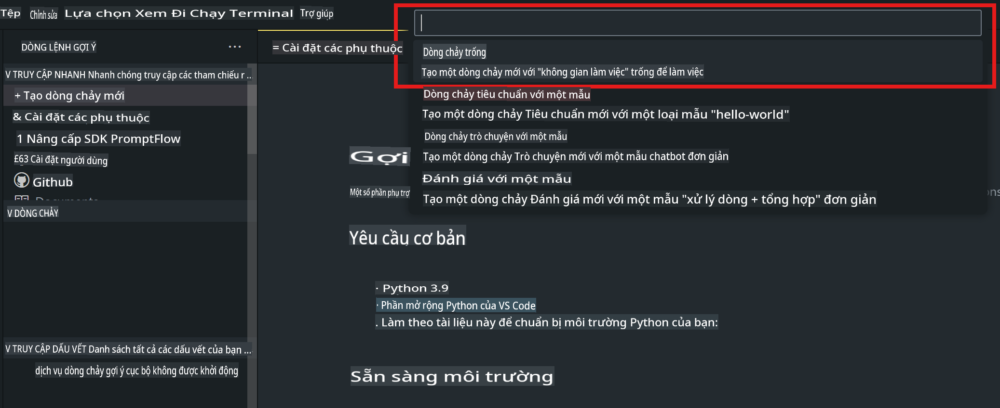
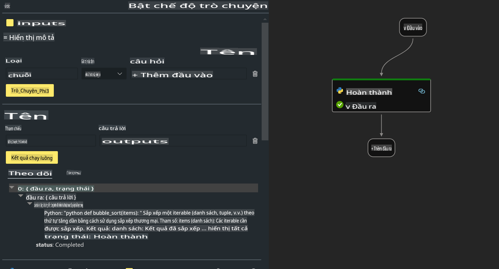

# **Lab 2 - Chạy Prompt flow với Phi-3-mini trong AIPC**

## **Prompt flow là gì**

Prompt flow là một bộ công cụ phát triển được thiết kế để tối ưu hóa quy trình phát triển ứng dụng AI dựa trên LLM từ đầu đến cuối, bao gồm từ việc lên ý tưởng, tạo mẫu, kiểm thử, đánh giá cho đến triển khai và giám sát sản phẩm. Công cụ này giúp việc thiết kế prompt trở nên dễ dàng hơn và cho phép bạn xây dựng các ứng dụng LLM với chất lượng sản xuất.

Với Prompt flow, bạn có thể:

- Tạo các luồng liên kết LLM, prompts, mã Python và các công cụ khác vào một quy trình làm việc có thể thực thi.

- Gỡ lỗi và cải thiện luồng của bạn, đặc biệt là tương tác với LLM một cách dễ dàng.

- Đánh giá luồng, tính toán các chỉ số chất lượng và hiệu suất với các bộ dữ liệu lớn hơn.

- Tích hợp kiểm thử và đánh giá vào hệ thống CI/CD của bạn để đảm bảo chất lượng của luồng.

- Triển khai luồng lên nền tảng phục vụ mà bạn chọn hoặc tích hợp vào mã nguồn ứng dụng của bạn một cách dễ dàng.

- (Tùy chọn nhưng rất được khuyến khích) Hợp tác với nhóm của bạn bằng cách sử dụng phiên bản đám mây của Prompt flow trong Azure AI.

## **AIPC là gì**

Một AI PC bao gồm CPU, GPU và NPU, mỗi thành phần đều có khả năng tăng tốc AI cụ thể. NPU, hay neural processing unit, là một bộ tăng tốc chuyên dụng xử lý các tác vụ trí tuệ nhân tạo (AI) và học máy (ML) trực tiếp trên PC của bạn thay vì gửi dữ liệu lên đám mây để xử lý. GPU và CPU cũng có thể xử lý các tác vụ này, nhưng NPU đặc biệt hiệu quả với các tính toán AI tiêu thụ ít năng lượng. AI PC đánh dấu một sự thay đổi cơ bản trong cách máy tính hoạt động. Đây không phải là giải pháp cho một vấn đề chưa từng tồn tại, mà là một cải tiến lớn cho các nhu cầu sử dụng PC hàng ngày.

Vậy nó hoạt động như thế nào? So với AI tạo sinh và các mô hình ngôn ngữ lớn (LLMs) được đào tạo trên lượng dữ liệu công khai khổng lồ, AI trên PC của bạn dễ tiếp cận hơn ở hầu hết mọi khía cạnh. Khái niệm này dễ hiểu hơn, và vì nó được đào tạo trên dữ liệu của bạn, không cần truy cập đám mây, nên lợi ích trở nên hấp dẫn ngay lập tức với nhiều người dùng hơn.

Trong tương lai gần, thế giới AI PC sẽ bao gồm các trợ lý cá nhân và các mô hình AI nhỏ hơn chạy trực tiếp trên PC của bạn, sử dụng dữ liệu của bạn để mang lại các cải tiến AI cá nhân hóa, riêng tư và an toàn hơn cho các công việc bạn làm hàng ngày – ghi biên bản cuộc họp, tổ chức giải đấu bóng đá ảo, tự động hóa chỉnh sửa ảnh và video, hoặc lập kế hoạch hoàn hảo cho một buổi họp mặt gia đình dựa trên thời gian đến và đi của mọi người.

## **Xây dựng luồng mã tạo trên AIPC**

***Lưu ý***: Nếu bạn chưa hoàn thành việc cài đặt môi trường, vui lòng truy cập [Lab 0 - Installations](./01.Installations.md)

1. Mở Prompt flow Extension trong Visual Studio Code và tạo một dự án luồng trống.



2. Thêm tham số Inputs và Outputs, sau đó thêm mã Python làm luồng mới.



Bạn có thể tham khảo cấu trúc này (flow.dag.yaml) để xây dựng luồng của mình.

```yaml

inputs:
  question:
    type: string
    default: how to write Bubble Algorithm
outputs:
  answer:
    type: string
    reference: ${Chat_With_Phi3.output}
nodes:
- name: Chat_With_Phi3
  type: python
  source:
    type: code
    path: Chat_With_Phi3.py
  inputs:
    question: ${inputs.question}


```

3. Thêm mã vào ***Chat_With_Phi3.py***

```python


from promptflow.core import tool

# import torch
from transformers import AutoTokenizer, pipeline,TextStreamer
import intel_npu_acceleration_library as npu_lib

import warnings

import asyncio
import platform

class Phi3CodeAgent:
    
    model = None
    tokenizer = None
    text_streamer = None
    
    model_id = "microsoft/Phi-3-mini-4k-instruct"

    @staticmethod
    def init_phi3():
        
        if Phi3CodeAgent.model is None or Phi3CodeAgent.tokenizer is None or Phi3CodeAgent.text_streamer is None:
            Phi3CodeAgent.model = npu_lib.NPUModelForCausalLM.from_pretrained(
                                    Phi3CodeAgent.model_id,
                                    torch_dtype="auto",
                                    dtype=npu_lib.int4,
                                    trust_remote_code=True
                                )
            Phi3CodeAgent.tokenizer = AutoTokenizer.from_pretrained(Phi3CodeAgent.model_id)
            Phi3CodeAgent.text_streamer = TextStreamer(Phi3CodeAgent.tokenizer, skip_prompt=True)

    

    @staticmethod
    def chat_with_phi3(prompt):
        
        Phi3CodeAgent.init_phi3()

        messages = "<|system|>You are a AI Python coding assistant. Please help me to generate code in Python.The answer only genertated Python code, but any comments and instructions do not need to be generated<|end|><|user|>" + prompt +"<|end|><|assistant|>"


        generation_args = {
            "max_new_tokens": 1024,
            "return_full_text": False,
            "temperature": 0.3,
            "do_sample": False,
            "streamer": Phi3CodeAgent.text_streamer,
        }

        pipe = pipeline(
            "text-generation",
            model=Phi3CodeAgent.model,
            tokenizer=Phi3CodeAgent.tokenizer,
            # **generation_args
        )

        result = ''

        with warnings.catch_warnings():
            warnings.simplefilter("ignore")
            response = pipe(messages, **generation_args)
            result =response[0]['generated_text']
            return result


@tool
def my_python_tool(question: str) -> str:
    if platform.system() == 'Windows':
        asyncio.set_event_loop_policy(asyncio.WindowsSelectorEventLoopPolicy())
    return Phi3CodeAgent.chat_with_phi3(question)


```

4. Bạn có thể kiểm tra luồng từ Debug hoặc Run để kiểm tra mã tạo có hoạt động hay không.


5. Chạy luồng dưới dạng API phát triển trong terminal.

```

pf flow serve --source ./ --port 8080 --host localhost   

```

Bạn có thể kiểm tra nó trong Postman / Thunder Client.

### **Lưu ý**

1. Lần chạy đầu tiên sẽ mất nhiều thời gian. Khuyến nghị tải xuống mô hình phi-3 từ Hugging Face CLI.

2. Vì khả năng tính toán của Intel NPU bị giới hạn, nên sử dụng Phi-3-mini-4k-instruct.

3. Chúng tôi sử dụng Intel NPU Acceleration để thực hiện chuyển đổi INT4, nhưng nếu bạn chạy lại dịch vụ, bạn cần xóa thư mục cache và nc_workshop.

## **Tài nguyên**

1. Tìm hiểu Promptflow [https://microsoft.github.io/promptflow/](https://microsoft.github.io/promptflow/)

2. Tìm hiểu Intel NPU Acceleration [https://github.com/intel/intel-npu-acceleration-library](https://github.com/intel/intel-npu-acceleration-library)

3. Mã mẫu, tải xuống [Local NPU Agent Sample Code](../../../../../../../../../code/07.Lab/01/AIPC)

**Tuyên bố miễn trừ trách nhiệm**:  
Tài liệu này đã được dịch bằng các dịch vụ dịch thuật AI tự động. Mặc dù chúng tôi cố gắng đảm bảo độ chính xác, xin lưu ý rằng các bản dịch tự động có thể chứa lỗi hoặc không chính xác. Tài liệu gốc bằng ngôn ngữ bản địa nên được coi là nguồn tham khảo chính thức. Đối với các thông tin quan trọng, khuyến nghị sử dụng dịch vụ dịch thuật chuyên nghiệp từ con người. Chúng tôi không chịu trách nhiệm cho bất kỳ sự hiểu lầm hoặc diễn giải sai nào phát sinh từ việc sử dụng bản dịch này.