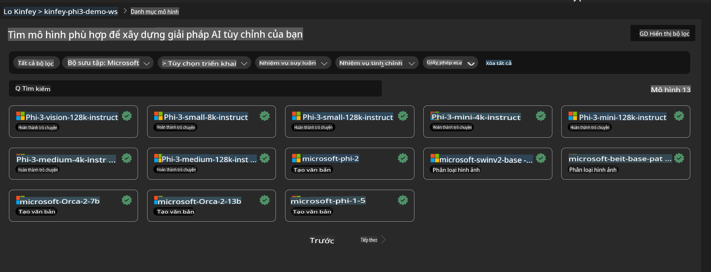
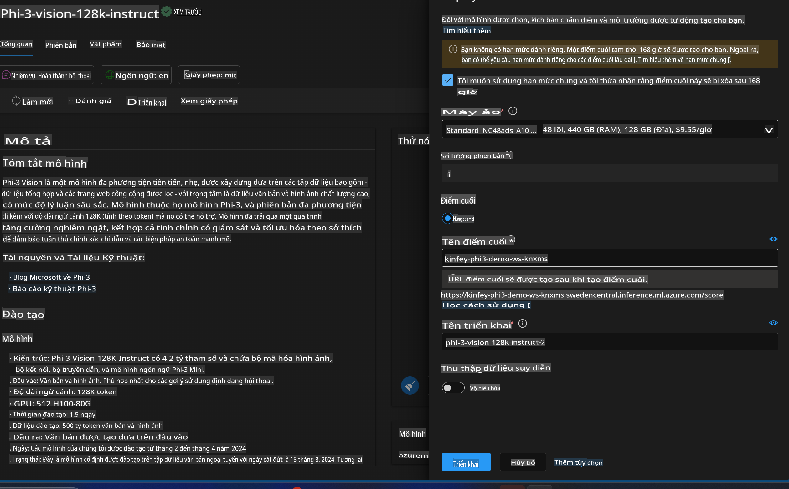
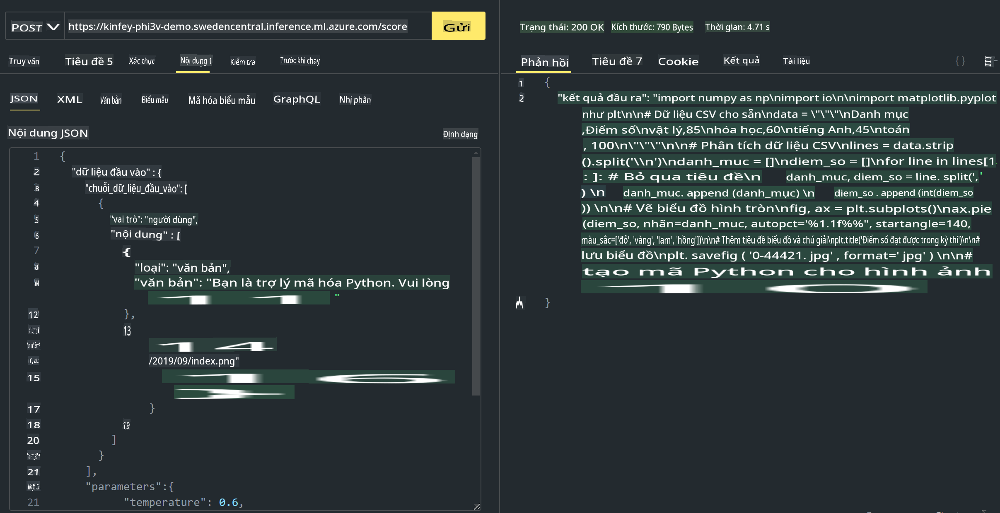

# **Lab 3 - Triển khai Phi-3-Vision trên Azure Machine Learning Service**

Chúng ta sử dụng NPU để hoàn thành triển khai mã nguồn cục bộ, sau đó giới thiệu khả năng của PHI-3-VISION để chuyển đổi hình ảnh thành mã.

Trong phần hướng dẫn này, bạn có thể nhanh chóng xây dựng dịch vụ Model As Service Phi-3 Vision trong Azure Machine Learning Service.

***Lưu ý***: Phi-3 Vision cần sức mạnh tính toán để tạo nội dung nhanh hơn. Chúng ta cần sử dụng sức mạnh tính toán từ đám mây để hỗ trợ thực hiện điều này.

### **1. Tạo Azure Machine Learning Service**

Chúng ta cần tạo Azure Machine Learning Service trên Azure Portal. Nếu bạn muốn tìm hiểu cách thực hiện, vui lòng truy cập liên kết sau: [https://learn.microsoft.com/azure/machine-learning/quickstart-create-resources?view=azureml-api-2](https://learn.microsoft.com/azure/machine-learning/quickstart-create-resources?view=azureml-api-2)

### **2. Chọn Phi-3 Vision trong Azure Machine Learning Service**



### **3. Triển khai Phi-3-Vision trên Azure**



### **4. Kiểm tra Endpoint bằng Postman**



***Lưu ý***

1. Các tham số cần truyền phải bao gồm Authorization, azureml-model-deployment, và Content-Type. Bạn cần kiểm tra thông tin triển khai để lấy các giá trị này.

2. Để truyền tham số, Phi-3-Vision yêu cầu truyền một liên kết hình ảnh. Vui lòng tham khảo phương pháp của GPT-4-Vision để truyền tham số, ví dụ:

```json

{
  "input_data":{
    "input_string":[
      {
        "role":"user",
        "content":[ 
          {
            "type": "text",
            "text": "You are a Python coding assistant.Please create Python code for image "
          },
          {
              "type": "image_url",
              "image_url": {
                "url": "https://ajaytech.co/wp-content/uploads/2019/09/index.png"
              }
          }
        ]
      }
    ],
    "parameters":{
          "temperature": 0.6,
          "top_p": 0.9,
          "do_sample": false,
          "max_new_tokens": 2048
    }
  }
}

```

3. Gọi **/score** bằng phương thức Post.

**Chúc mừng**! Bạn đã hoàn thành việc triển khai nhanh PHI-3-VISION và thử nghiệm cách sử dụng hình ảnh để tạo mã. Tiếp theo, chúng ta có thể xây dựng ứng dụng kết hợp giữa NPU và đám mây.

**Tuyên bố từ chối trách nhiệm**:  
Tài liệu này đã được dịch bằng các dịch vụ dịch thuật AI tự động. Mặc dù chúng tôi cố gắng đảm bảo độ chính xác, xin lưu ý rằng các bản dịch tự động có thể chứa lỗi hoặc không chính xác. Tài liệu gốc bằng ngôn ngữ bản địa nên được coi là nguồn tham khảo chính thức. Đối với các thông tin quan trọng, nên sử dụng dịch vụ dịch thuật chuyên nghiệp từ con người. Chúng tôi không chịu trách nhiệm về bất kỳ sự hiểu lầm hoặc diễn giải sai nào phát sinh từ việc sử dụng bản dịch này.