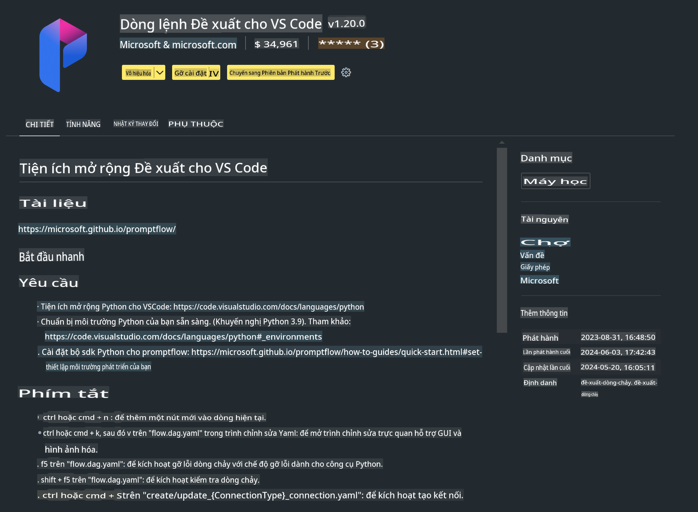

# **Lab 0 - Cài đặt**

Khi tham gia Lab, chúng ta cần cấu hình môi trường liên quan:

### **1. Python 3.11+**

Khuyến nghị sử dụng miniforge để cấu hình môi trường Python của bạn.

Để cấu hình miniforge, vui lòng tham khảo [https://github.com/conda-forge/miniforge](https://github.com/conda-forge/miniforge)

Sau khi cấu hình miniforge, chạy lệnh sau trong Power Shell

```bash

conda create -n pyenv python==3.11.8 -y

conda activate pyenv

```

### **2. Cài đặt Prompt flow SDK**

Trong Lab 1, chúng ta sẽ sử dụng Prompt flow, vì vậy bạn cần cấu hình Prompt flow SDK.

```bash

pip install promptflow --upgrade

```

Bạn có thể kiểm tra promptflow sdk bằng lệnh sau:

```bash

pf --version

```

### **3. Cài đặt Visual Studio Code Prompt flow Extension**



### **4. Framework MLX của Apple**

MLX là một framework mảng dành cho nghiên cứu máy học trên Apple silicon, được phát triển bởi nhóm nghiên cứu máy học của Apple. Bạn có thể sử dụng **framework Apple MLX** để tăng tốc LLM / SLM với Apple Silicon. Nếu bạn muốn tìm hiểu thêm, hãy đọc [https://github.com/microsoft/PhiCookBook/blob/main/md/01.Introduction/03/MLX_Inference.md](https://github.com/microsoft/PhiCookBook/blob/main/md/01.Introduction/03/MLX_Inference.md).

Cài đặt thư viện MLX framework trong bash

```bash

pip install mlx-lm

```

### **5. Các thư viện Python khác**

Tạo file requirements.txt và thêm nội dung sau:

```txt

notebook
numpy 
scipy 
scikit-learn 
matplotlib 
pandas 
pillow 
graphviz

```

### **6. Cài đặt NVM**

Cài đặt nvm trong Power Shell:

```bash

brew install nvm

```

Cài đặt nodejs phiên bản 18.20:

```bash

nvm install 18.20.0

nvm use 18.20.0

```

### **7. Cài đặt hỗ trợ phát triển trên Visual Studio Code**

```bash

npm install --global yo generator-code

```

Chúc mừng! Bạn đã cấu hình thành công SDK. Tiếp theo, hãy tiến hành các bước thực hành.

**Tuyên bố miễn trừ trách nhiệm**:  
Tài liệu này đã được dịch bằng các dịch vụ dịch thuật AI tự động. Mặc dù chúng tôi cố gắng đảm bảo độ chính xác, xin lưu ý rằng các bản dịch tự động có thể chứa lỗi hoặc không chính xác. Tài liệu gốc bằng ngôn ngữ bản địa nên được coi là nguồn thông tin chính thức. Đối với thông tin quan trọng, nên sử dụng dịch vụ dịch thuật chuyên nghiệp bởi con người. Chúng tôi không chịu trách nhiệm về bất kỳ sự hiểu lầm hoặc diễn giải sai nào phát sinh từ việc sử dụng bản dịch này.