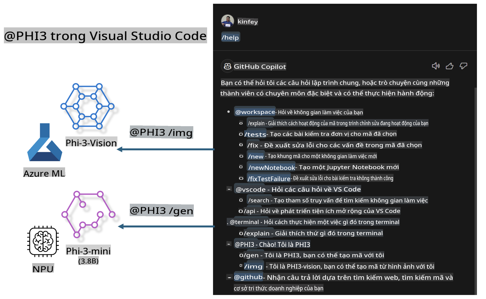

# **Tự xây dựng Visual Studio Code GitHub Copilot Chat của bạn với Microsoft Phi-3 Family**

Bạn đã từng sử dụng workspace agent trong GitHub Copilot Chat chưa? Bạn có muốn xây dựng một code agent dành riêng cho đội nhóm của mình không? Phòng thí nghiệm thực hành này hy vọng sẽ kết hợp mô hình mã nguồn mở để xây dựng một agent mã hóa cấp doanh nghiệp.

## **Nền tảng**

### **Tại sao chọn Microsoft Phi-3**

Phi-3 là một dòng sản phẩm bao gồm các phiên bản phi-3-mini, phi-3-small và phi-3-medium, dựa trên các tham số đào tạo khác nhau để tạo văn bản, hoàn thành hội thoại và tạo mã. Ngoài ra còn có phiên bản phi-3-vision dựa trên Vision. Đây là lựa chọn phù hợp cho các doanh nghiệp hoặc đội nhóm muốn tạo ra các giải pháp AI tạo sinh hoạt động ngoại tuyến.

Khuyến nghị đọc liên kết này [https://github.com/microsoft/PhiCookBook/blob/main/md/01.Introduction/01/01.PhiFamily.md](https://github.com/microsoft/PhiCookBook/blob/main/md/01.Introduction/01/01.PhiFamily.md)

### **Microsoft GitHub Copilot Chat**

Tiện ích mở rộng GitHub Copilot Chat cung cấp giao diện trò chuyện, cho phép bạn tương tác với GitHub Copilot và nhận câu trả lời cho các câu hỏi liên quan đến mã hóa trực tiếp trong VS Code, mà không cần phải tìm kiếm tài liệu hoặc diễn đàn trực tuyến.

Copilot Chat có thể sử dụng các tính năng như tô sáng cú pháp, thụt lề và định dạng khác để làm rõ câu trả lời được tạo ra. Tùy thuộc vào loại câu hỏi của người dùng, kết quả có thể bao gồm các liên kết đến ngữ cảnh mà Copilot đã sử dụng để tạo câu trả lời, như tệp mã nguồn hoặc tài liệu, hoặc các nút để truy cập chức năng của VS Code.

- Copilot Chat tích hợp vào luồng làm việc của nhà phát triển và hỗ trợ bạn khi cần thiết:

- Bắt đầu cuộc trò chuyện trực tiếp từ trình chỉnh sửa hoặc terminal để nhận trợ giúp khi đang viết mã

- Sử dụng chế độ Chat để có một trợ lý AI luôn sẵn sàng hỗ trợ bất kỳ lúc nào

- Mở Quick Chat để hỏi một câu hỏi nhanh và tiếp tục công việc của bạn

Bạn có thể sử dụng GitHub Copilot Chat trong các tình huống khác nhau, như:

- Trả lời các câu hỏi mã hóa về cách giải quyết vấn đề tốt nhất

- Giải thích mã của người khác và đề xuất cải tiến

- Đề xuất sửa lỗi mã

- Tạo các trường hợp kiểm thử đơn vị

- Tạo tài liệu mã

Khuyến nghị đọc liên kết này [https://code.visualstudio.com/docs/copilot/copilot-chat](https://code.visualstudio.com/docs/copilot/copilot-chat?WT.mc_id=aiml-137032-kinfeylo)

### **Microsoft GitHub Copilot Chat @workspace**

Tham chiếu **@workspace** trong Copilot Chat cho phép bạn đặt câu hỏi về toàn bộ cơ sở mã của mình. Dựa trên câu hỏi, Copilot thông minh truy xuất các tệp và ký hiệu liên quan, sau đó tham chiếu chúng trong câu trả lời dưới dạng liên kết và ví dụ mã.

Để trả lời câu hỏi của bạn, **@workspace** tìm kiếm qua các nguồn mà một nhà phát triển thường sử dụng khi điều hướng cơ sở mã trong VS Code:

- Tất cả các tệp trong workspace, ngoại trừ các tệp bị bỏ qua bởi tệp .gitignore

- Cấu trúc thư mục với các thư mục lồng nhau và tên tệp

- Chỉ mục tìm kiếm mã của GitHub, nếu workspace là một kho lưu trữ GitHub và được lập chỉ mục bởi tìm kiếm mã

- Các ký hiệu và định nghĩa trong workspace

- Văn bản được chọn hoặc văn bản hiển thị trong trình chỉnh sửa đang hoạt động

Lưu ý: .gitignore sẽ bị bỏ qua nếu bạn mở một tệp hoặc chọn văn bản trong một tệp bị bỏ qua.

Khuyến nghị đọc liên kết này [[https://code.visualstudio.com/docs/copilot/copilot-chat](https://code.visualstudio.com/docs/copilot/workspace-context?WT.mc_id=aiml-137032-kinfeylo)]

## **Tìm hiểu thêm về Lab này**

GitHub Copilot đã cải thiện đáng kể hiệu suất lập trình của doanh nghiệp, và mọi doanh nghiệp đều hy vọng tùy chỉnh các chức năng liên quan của GitHub Copilot. Nhiều doanh nghiệp đã tùy chỉnh các Extensions tương tự GitHub Copilot dựa trên kịch bản kinh doanh và mô hình mã nguồn mở của riêng họ. Đối với doanh nghiệp, các Extensions tùy chỉnh dễ kiểm soát hơn, nhưng điều này cũng ảnh hưởng đến trải nghiệm người dùng. Sau cùng, GitHub Copilot có chức năng mạnh mẽ hơn trong việc xử lý các tình huống chung và chuyên môn. Nếu có thể giữ trải nghiệm nhất quán, việc tùy chỉnh Extension của riêng doanh nghiệp sẽ tốt hơn. GitHub Copilot Chat cung cấp các API liên quan để doanh nghiệp mở rộng trải nghiệm Chat. Duy trì trải nghiệm nhất quán và có các chức năng tùy chỉnh sẽ mang lại trải nghiệm người dùng tốt hơn.

Lab này chủ yếu sử dụng mô hình Phi-3 kết hợp với NPU cục bộ và Azure hybrid để xây dựng một Agent tùy chỉnh trong GitHub Copilot Chat ***@PHI3*** để hỗ trợ các nhà phát triển doanh nghiệp hoàn thành việc tạo mã ***(@PHI3 /gen)*** và tạo mã dựa trên hình ảnh ***(@PHI3 /img)***.

### ***Lưu ý:*** 

Lab này hiện được triển khai trên AIPC của CPU Intel và Apple Silicon. Chúng tôi sẽ tiếp tục cập nhật phiên bản Qualcomm của NPU.

## **Lab**

| Tên | Mô tả | AIPC | Apple |
| ------------ | ----------- | -------- |-------- |
| Lab0 - Cài đặt (✅) | Cấu hình và cài đặt các môi trường và công cụ liên quan | [Go](./HOL/AIPC/01.Installations.md) |[Go](./HOL/Apple/01.Installations.md) |
| Lab1 - Chạy Prompt flow với Phi-3-mini (✅) | Kết hợp với AIPC / Apple Silicon, sử dụng NPU cục bộ để tạo mã thông qua Phi-3-mini | [Go](./HOL/AIPC/02.PromptflowWithNPU.md) |  [Go](./HOL/Apple/02.PromptflowWithMLX.md) |
| Lab2 - Triển khai Phi-3-vision trên Azure Machine Learning Service (✅) | Tạo mã bằng cách triển khai Phi-3-vision image từ Model Catalog của Azure Machine Learning Service | [Go](./HOL/AIPC/03.DeployPhi3VisionOnAzure.md) |[Go](./HOL/Apple/03.DeployPhi3VisionOnAzure.md) |
| Lab3 - Tạo một agent @phi-3 trong GitHub Copilot Chat (✅)  | Tạo một agent Phi-3 tùy chỉnh trong GitHub Copilot Chat để hoàn thành tạo mã, tạo mã từ hình ảnh, RAG, v.v. | [Go](./HOL/AIPC/04.CreatePhi3AgentInVSCode.md) | [Go](./HOL/Apple/04.CreatePhi3AgentInVSCode.md) |
| Mã mẫu (✅)  | Tải xuống mã mẫu | [Go](../../../../../../../code/07.Lab/01/AIPC) | [Go](../../../../../../../code/07.Lab/01/Apple) |

## **Nguồn tài nguyên**

1. Phi-3 Cookbook [https://github.com/microsoft/Phi-3CookBook](https://github.com/microsoft/Phi-3CookBook)

2. Tìm hiểu thêm về GitHub Copilot [https://learn.microsoft.com/training/paths/copilot/](https://learn.microsoft.com/training/paths/copilot/?WT.mc_id=aiml-137032-kinfeylo)

3. Tìm hiểu thêm về GitHub Copilot Chat [https://learn.microsoft.com/training/paths/accelerate-app-development-using-github-copilot/](https://learn.microsoft.com/training/paths/accelerate-app-development-using-github-copilot/?WT.mc_id=aiml-137032-kinfeylo)

4. Tìm hiểu thêm về API của GitHub Copilot Chat [https://code.visualstudio.com/api/extension-guides/chat](https://code.visualstudio.com/api/extension-guides/chat?WT.mc_id=aiml-137032-kinfeylo)

5. Tìm hiểu thêm về Azure AI Foundry [https://learn.microsoft.com/training/paths/create-custom-copilots-ai-studio/](https://learn.microsoft.com/training/paths/create-custom-copilots-ai-studio/?WT.mc_id=aiml-137032-kinfeylo)

6. Tìm hiểu thêm về Model Catalog của Azure AI Foundry [https://learn.microsoft.com/azure/ai-studio/how-to/model-catalog-overview](https://learn.microsoft.com/azure/ai-studio/how-to/model-catalog-overview)

**Tuyên bố từ chối trách nhiệm**:  
Tài liệu này đã được dịch bằng các dịch vụ dịch thuật AI tự động. Mặc dù chúng tôi cố gắng đảm bảo độ chính xác, xin lưu ý rằng các bản dịch tự động có thể chứa lỗi hoặc không chính xác. Tài liệu gốc bằng ngôn ngữ bản địa nên được coi là nguồn đáng tin cậy nhất. Đối với các thông tin quan trọng, nên sử dụng dịch thuật chuyên nghiệp từ con người. Chúng tôi không chịu trách nhiệm cho bất kỳ sự hiểu lầm hoặc diễn giải sai nào phát sinh từ việc sử dụng bản dịch này.