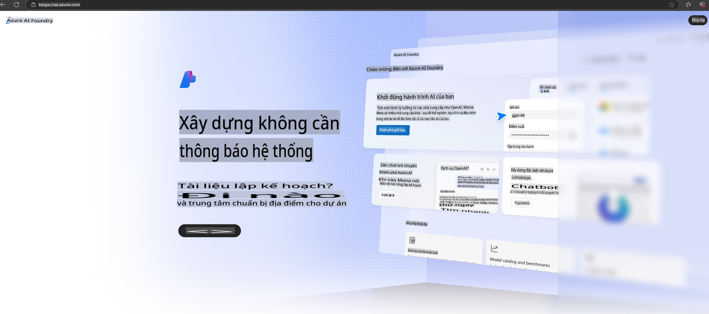

# **Sử dụng Phi-3 trong Azure AI Foundry**

Với sự phát triển của Generative AI, chúng tôi hy vọng sử dụng một nền tảng thống nhất để quản lý các LLM và SLM khác nhau, tích hợp dữ liệu doanh nghiệp, các thao tác tinh chỉnh/RAG, và đánh giá các hoạt động doanh nghiệp sau khi tích hợp LLM và SLM, v.v., để các ứng dụng AI tạo sinh có thể được triển khai hiệu quả hơn. [Azure AI Foundry](https://ai.azure.com) là một nền tảng ứng dụng AI tạo sinh cấp doanh nghiệp.

Với Azure AI Foundry, bạn có thể đánh giá phản hồi từ các mô hình ngôn ngữ lớn (LLM) và tổ chức các thành phần ứng dụng gợi ý bằng prompt flow để đạt hiệu suất tốt hơn. Nền tảng này hỗ trợ mở rộng quy mô để chuyển đổi từ các bằng chứng khái niệm sang sản phẩm hoàn chỉnh một cách dễ dàng. Việc giám sát và cải tiến liên tục đảm bảo thành công lâu dài.

Chúng ta có thể nhanh chóng triển khai mô hình Phi-3 trên Azure AI Foundry thông qua các bước đơn giản, sau đó sử dụng Azure AI Foundry để hoàn thành các công việc liên quan đến Phi-3 như Playground/Chat, tinh chỉnh, đánh giá, và các hoạt động khác.

## **1. Chuẩn bị**

Nếu bạn đã cài đặt [Azure Developer CLI](https://learn.microsoft.com/azure/developer/azure-developer-cli/overview?WT.mc_id=aiml-138114-kinfeylo) trên máy của mình, sử dụng mẫu này đơn giản như chạy lệnh sau trong một thư mục mới.

## Tạo Thủ Công

Tạo một dự án và hub Microsoft Azure AI Foundry là một cách tuyệt vời để tổ chức và quản lý công việc AI của bạn. Dưới đây là hướng dẫn từng bước để bắt đầu:

### Tạo một Dự Án trong Azure AI Foundry

1. **Truy cập Azure AI Foundry**: Đăng nhập vào cổng Azure AI Foundry.
2. **Tạo một Dự Án**:
   - Nếu bạn đang ở trong một dự án, chọn "Azure AI Foundry" ở góc trên bên trái của trang để quay lại trang chủ.
   - Chọn "+ Create project".
   - Nhập tên cho dự án.
   - Nếu bạn đã có một hub, nó sẽ được chọn mặc định. Nếu bạn có quyền truy cập vào nhiều hub, bạn có thể chọn một hub khác từ danh sách thả xuống. Nếu bạn muốn tạo một hub mới, chọn "Create new hub" và cung cấp tên.
   - Chọn "Create".

### Tạo một Hub trong Azure AI Foundry

1. **Truy cập Azure AI Foundry**: Đăng nhập bằng tài khoản Azure của bạn.
2. **Tạo một Hub**:
   - Chọn Trung tâm Quản lý từ menu bên trái.
   - Chọn "All resources", sau đó nhấn vào mũi tên xuống bên cạnh "+ New project" và chọn "+ New hub".
   - Trong hộp thoại "Create a new hub", nhập tên cho hub của bạn (ví dụ: contoso-hub) và điều chỉnh các trường khác theo ý muốn.
   - Chọn "Next", xem lại thông tin, và sau đó chọn "Create".

Để biết thêm hướng dẫn chi tiết, bạn có thể tham khảo [tài liệu chính thức của Microsoft](https://learn.microsoft.com/azure/ai-studio/how-to/create-projects).

Sau khi tạo thành công, bạn có thể truy cập studio mà bạn đã tạo thông qua [ai.azure.com](https://ai.azure.com/)

Một AI Foundry có thể chứa nhiều dự án. Hãy tạo một dự án trong AI Foundry để chuẩn bị.

Tạo Azure AI Foundry [QuickStarts](https://learn.microsoft.com/azure/ai-studio/quickstarts/get-started-code)

## **2. Triển khai mô hình Phi trong Azure AI Foundry**

Nhấn vào tùy chọn Explore của dự án để vào Model Catalog và chọn Phi-3

Chọn Phi-3-mini-4k-instruct

Nhấn 'Deploy' để triển khai mô hình Phi-3-mini-4k-instruct

> [!NOTE]
>
> Bạn có thể chọn tài nguyên tính toán khi triển khai

## **3. Chat với Phi trên Playground của Azure AI Foundry**

Truy cập trang triển khai, chọn Playground, và trò chuyện với Phi-3 trên Azure AI Foundry

## **4. Triển khai mô hình từ Azure AI Foundry**

Để triển khai một mô hình từ Azure Model Catalog, bạn có thể làm theo các bước sau:

- Đăng nhập vào Azure AI Foundry.
- Chọn mô hình bạn muốn triển khai từ danh mục mô hình của Azure AI Foundry.
- Trên trang Chi tiết của mô hình, chọn Deploy và sau đó chọn Serverless API with Azure AI Content Safety.
- Chọn dự án mà bạn muốn triển khai mô hình. Để sử dụng dịch vụ Serverless API, không gian làm việc của bạn phải thuộc khu vực East US 2 hoặc Sweden Central. Bạn có thể tùy chỉnh tên triển khai.
- Trong trình hướng dẫn triển khai, chọn Pricing and terms để tìm hiểu về giá cả và điều khoản sử dụng.
- Chọn Deploy. Chờ cho đến khi triển khai sẵn sàng và bạn được chuyển hướng đến trang Deployments.
- Chọn Open in playground để bắt đầu tương tác với mô hình.
- Bạn có thể quay lại trang Deployments, chọn triển khai, và ghi chú URL đích của endpoint và Secret Key, mà bạn có thể sử dụng để gọi triển khai và tạo completions.
- Bạn luôn có thể tìm thấy chi tiết endpoint, URL, và khóa truy cập bằng cách điều hướng đến tab Build và chọn Deployments từ phần Components.

> [!NOTE]
> Lưu ý rằng tài khoản của bạn phải có quyền Azure AI Developer role trên Resource Group để thực hiện các bước này.

## **5. Sử dụng Phi API trong Azure AI Foundry**

Bạn có thể truy cập https://{Tên dự án của bạn}.region.inference.ml.azure.com/swagger.json thông qua Postman GET và kết hợp với Key để tìm hiểu về các giao diện được cung cấp.

Bạn có thể dễ dàng lấy các tham số yêu cầu, cũng như các tham số phản hồi.

**Tuyên bố miễn trừ trách nhiệm**:  
Tài liệu này đã được dịch bằng các dịch vụ dịch thuật AI tự động. Mặc dù chúng tôi cố gắng đảm bảo độ chính xác, xin lưu ý rằng các bản dịch tự động có thể chứa lỗi hoặc không chính xác. Tài liệu gốc bằng ngôn ngữ bản địa nên được coi là nguồn thông tin đáng tin cậy nhất. Đối với các thông tin quan trọng, chúng tôi khuyến nghị sử dụng dịch vụ dịch thuật chuyên nghiệp bởi con người. Chúng tôi không chịu trách nhiệm cho bất kỳ sự hiểu lầm hoặc diễn giải sai nào phát sinh từ việc sử dụng bản dịch này.