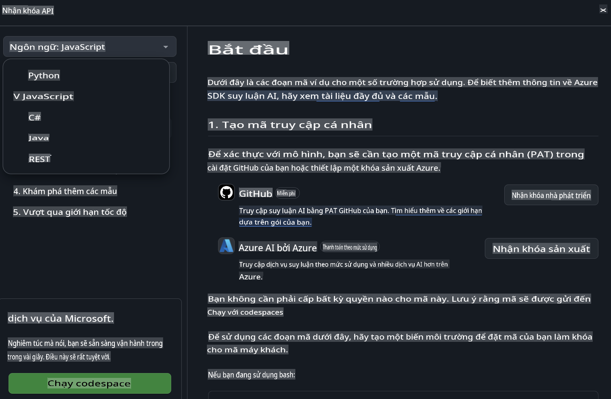
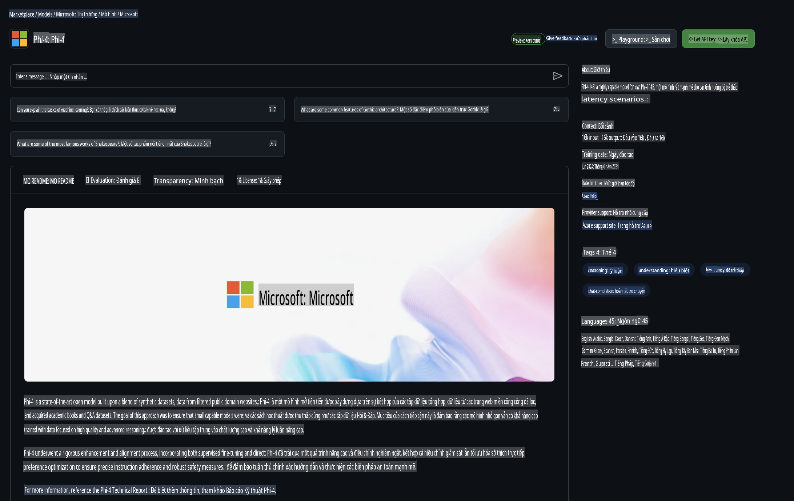

## GitHub Models - Bản Beta Công Khai Hạn Chế

Chào mừng bạn đến với [GitHub Models](https://github.com/marketplace/models)! Chúng tôi đã chuẩn bị sẵn sàng để bạn khám phá các Mô hình AI được lưu trữ trên Azure AI.


Để biết thêm thông tin về các Mô hình có sẵn trên GitHub Models, hãy xem [GitHub Model Marketplace](https://github.com/marketplace/models)

## Các Mô Hình Có Sẵn

Mỗi mô hình đều có một playground riêng và mã mẫu. 


### Mô hình Phi-3 trong GitHub Model Catalog

[Phi-3-Medium-128k-Instruct](https://github.com/marketplace/models/azureml/Phi-3-medium-128k-instruct)

[Phi-3-medium-4k-instruct](https://github.com/marketplace/models/azureml/Phi-3-medium-4k-instruct)

[Phi-3-mini-128k-instruct](https://github.com/marketplace/models/azureml/Phi-3-mini-128k-instruct)

[Phi-3-mini-4k-instruct](https://github.com/marketplace/models/azureml/Phi-3-mini-4k-instruct)

[Phi-3-small-128k-instruct](https://github.com/marketplace/models/azureml/Phi-3-small-128k-instruct)

[Phi-3-small-8k-instruct](https://github.com/marketplace/models/azureml/Phi-3-small-8k-instruct)

## Bắt Đầu

Có một số ví dụ cơ bản đã sẵn sàng để bạn chạy. Bạn có thể tìm thấy chúng trong thư mục samples. Nếu bạn muốn chuyển thẳng đến ngôn ngữ yêu thích của mình, bạn có thể tìm các ví dụ trong các ngôn ngữ sau:

- Python
- JavaScript
- cURL

Ngoài ra còn có một môi trường Codespaces chuyên dụng để chạy các mẫu và mô hình. 



## Mã Mẫu

Dưới đây là một số đoạn mã ví dụ cho vài trường hợp sử dụng. Để biết thêm thông tin về Azure AI Inference SDK, hãy xem tài liệu và các ví dụ đầy đủ.

## Cài Đặt

1. Tạo một mã truy cập cá nhân  
Bạn không cần cấp bất kỳ quyền nào cho mã truy cập này. Lưu ý rằng mã truy cập sẽ được gửi đến một dịch vụ của Microsoft.

Để sử dụng các đoạn mã bên dưới, hãy tạo một biến môi trường để đặt mã truy cập của bạn làm khóa cho mã client.

Nếu bạn đang sử dụng bash:  
```
export GITHUB_TOKEN="<your-github-token-goes-here>"
```  
Nếu bạn đang sử dụng powershell:  

```
$Env:GITHUB_TOKEN="<your-github-token-goes-here>"
```  

Nếu bạn đang sử dụng Windows command prompt:  

```
set GITHUB_TOKEN=<your-github-token-goes-here>
```  

## Ví Dụ Python

### Cài đặt các phụ thuộc  
Cài đặt Azure AI Inference SDK bằng pip (Yêu cầu: Python >=3.8):  

```
pip install azure-ai-inference
```  

### Chạy một ví dụ cơ bản  

Ví dụ này minh họa một lệnh gọi cơ bản đến API chat completion. Nó sử dụng endpoint suy luận mô hình AI GitHub và mã truy cập GitHub của bạn. Lệnh gọi này là đồng bộ.  

```
import os
from azure.ai.inference import ChatCompletionsClient
from azure.ai.inference.models import SystemMessage, UserMessage
from azure.core.credentials import AzureKeyCredential

endpoint = "https://models.inference.ai.azure.com"
# Replace Model_Name 
model_name = "Phi-3-small-8k-instruct"
token = os.environ["GITHUB_TOKEN"]

client = ChatCompletionsClient(
    endpoint=endpoint,
    credential=AzureKeyCredential(token),
)

response = client.complete(
    messages=[
        SystemMessage(content="You are a helpful assistant."),
        UserMessage(content="What is the capital of France?"),
    ],
    model=model_name,
    temperature=1.,
    max_tokens=1000,
    top_p=1.
)

print(response.choices[0].message.content)
```  

### Chạy một cuộc hội thoại nhiều lượt  

Ví dụ này minh họa một cuộc hội thoại nhiều lượt với API chat completion. Khi sử dụng mô hình cho một ứng dụng chat, bạn cần quản lý lịch sử hội thoại và gửi các tin nhắn mới nhất đến mô hình.  

```
import os
from azure.ai.inference import ChatCompletionsClient
from azure.ai.inference.models import AssistantMessage, SystemMessage, UserMessage
from azure.core.credentials import AzureKeyCredential

token = os.environ["GITHUB_TOKEN"]
endpoint = "https://models.inference.ai.azure.com"
# Replace Model_Name
model_name = "Phi-3-small-8k-instruct"

client = ChatCompletionsClient(
    endpoint=endpoint,
    credential=AzureKeyCredential(token),
)

messages = [
    SystemMessage(content="You are a helpful assistant."),
    UserMessage(content="What is the capital of France?"),
    AssistantMessage(content="The capital of France is Paris."),
    UserMessage(content="What about Spain?"),
]

response = client.complete(messages=messages, model=model_name)

print(response.choices[0].message.content)
```  

### Stream đầu ra  

Để có trải nghiệm người dùng tốt hơn, bạn nên stream phản hồi từ mô hình để token đầu tiên xuất hiện sớm và tránh phải chờ đợi phản hồi dài.  

```
import os
from azure.ai.inference import ChatCompletionsClient
from azure.ai.inference.models import SystemMessage, UserMessage
from azure.core.credentials import AzureKeyCredential

token = os.environ["GITHUB_TOKEN"]
endpoint = "https://models.inference.ai.azure.com"
# Replace Model_Name
model_name = "Phi-3-small-8k-instruct"

client = ChatCompletionsClient(
    endpoint=endpoint,
    credential=AzureKeyCredential(token),
)

response = client.complete(
    stream=True,
    messages=[
        SystemMessage(content="You are a helpful assistant."),
        UserMessage(content="Give me 5 good reasons why I should exercise every day."),
    ],
    model=model_name,
)

for update in response:
    if update.choices:
        print(update.choices[0].delta.content or "", end="")

client.close()
```  

## JavaScript  

### Cài đặt các phụ thuộc  

Cài đặt Node.js.  

Sao chép các dòng văn bản sau và lưu chúng thành một tệp package.json trong thư mục của bạn.  

```
{
  "type": "module",
  "dependencies": {
    "@azure-rest/ai-inference": "latest",
    "@azure/core-auth": "latest",
    "@azure/core-sse": "latest"
  }
}
```  

Lưu ý: @azure/core-sse chỉ cần thiết khi bạn stream phản hồi từ chat completions.  

Mở cửa sổ terminal trong thư mục này và chạy npm install.  

Với mỗi đoạn mã bên dưới, sao chép nội dung vào một tệp sample.js và chạy bằng lệnh node sample.js.  

### Chạy một ví dụ cơ bản  

Ví dụ này minh họa một lệnh gọi cơ bản đến API chat completion. Nó sử dụng endpoint suy luận mô hình AI GitHub và mã truy cập GitHub của bạn. Lệnh gọi này là đồng bộ.  

```
import ModelClient from "@azure-rest/ai-inference";
import { AzureKeyCredential } from "@azure/core-auth";

const token = process.env["GITHUB_TOKEN"];
const endpoint = "https://models.inference.ai.azure.com";
// Update your modelname
const modelName = "Phi-3-small-8k-instruct";

export async function main() {

  const client = new ModelClient(endpoint, new AzureKeyCredential(token));

  const response = await client.path("/chat/completions").post({
    body: {
      messages: [
        { role:"system", content: "You are a helpful assistant." },
        { role:"user", content: "What is the capital of France?" }
      ],
      model: modelName,
      temperature: 1.,
      max_tokens: 1000,
      top_p: 1.
    }
  });

  if (response.status !== "200") {
    throw response.body.error;
  }
  console.log(response.body.choices[0].message.content);
}

main().catch((err) => {
  console.error("The sample encountered an error:", err);
});
```  

### Chạy một cuộc hội thoại nhiều lượt  

Ví dụ này minh họa một cuộc hội thoại nhiều lượt với API chat completion. Khi sử dụng mô hình cho một ứng dụng chat, bạn cần quản lý lịch sử hội thoại và gửi các tin nhắn mới nhất đến mô hình.  

```
import ModelClient from "@azure-rest/ai-inference";
import { AzureKeyCredential } from "@azure/core-auth";

const token = process.env["GITHUB_TOKEN"];
const endpoint = "https://models.inference.ai.azure.com";
// Update your modelname
const modelName = "Phi-3-small-8k-instruct";

export async function main() {

  const client = new ModelClient(endpoint, new AzureKeyCredential(token));

  const response = await client.path("/chat/completions").post({
    body: {
      messages: [
        { role: "system", content: "You are a helpful assistant." },
        { role: "user", content: "What is the capital of France?" },
        { role: "assistant", content: "The capital of France is Paris." },
        { role: "user", content: "What about Spain?" },
      ],
      model: modelName,
    }
  });

  if (response.status !== "200") {
    throw response.body.error;
  }

  for (const choice of response.body.choices) {
    console.log(choice.message.content);
  }
}

main().catch((err) => {
  console.error("The sample encountered an error:", err);
});
```  

### Stream đầu ra  
Để có trải nghiệm người dùng tốt hơn, bạn nên stream phản hồi từ mô hình để token đầu tiên xuất hiện sớm và tránh phải chờ đợi phản hồi dài.  

```
import ModelClient from "@azure-rest/ai-inference";
import { AzureKeyCredential } from "@azure/core-auth";
import { createSseStream } from "@azure/core-sse";

const token = process.env["GITHUB_TOKEN"];
const endpoint = "https://models.inference.ai.azure.com";
// Update your modelname
const modelName = "Phi-3-small-8k-instruct";

export async function main() {

  const client = new ModelClient(endpoint, new AzureKeyCredential(token));

  const response = await client.path("/chat/completions").post({
    body: {
      messages: [
        { role: "system", content: "You are a helpful assistant." },
        { role: "user", content: "Give me 5 good reasons why I should exercise every day." },
      ],
      model: modelName,
      stream: true
    }
  }).asNodeStream();

  const stream = response.body;
  if (!stream) {
    throw new Error("The response stream is undefined");
  }

  if (response.status !== "200") {
    stream.destroy();
    throw new Error(`Failed to get chat completions, http operation failed with ${response.status} code`);
  }

  const sseStream = createSseStream(stream);

  for await (const event of sseStream) {
    if (event.data === "[DONE]") {
      return;
    }
    for (const choice of (JSON.parse(event.data)).choices) {
        process.stdout.write(choice.delta?.content ?? ``);
    }
  }
}

main().catch((err) => {
  console.error("The sample encountered an error:", err);
});
```  

## REST  

### Chạy một ví dụ cơ bản  

Dán đoạn mã sau vào shell:  

```
curl -X POST "https://models.inference.ai.azure.com/chat/completions" \
    -H "Content-Type: application/json" \
    -H "Authorization: Bearer $GITHUB_TOKEN" \
    -d '{
        "messages": [
            {
                "role": "system",
                "content": "You are a helpful assistant."
            },
            {
                "role": "user",
                "content": "What is the capital of France?"
            }
        ],
        "model": "Phi-3-small-8k-instruct"
    }'
```  

### Chạy một cuộc hội thoại nhiều lượt  

Gọi API chat completion và truyền lịch sử hội thoại:  

```
curl -X POST "https://models.inference.ai.azure.com/chat/completions" \
    -H "Content-Type: application/json" \
    -H "Authorization: Bearer $GITHUB_TOKEN" \
    -d '{
        "messages": [
            {
                "role": "system",
                "content": "You are a helpful assistant."
            },
            {
                "role": "user",
                "content": "What is the capital of France?"
            },
            {
                "role": "assistant",
                "content": "The capital of France is Paris."
            },
            {
                "role": "user",
                "content": "What about Spain?"
            }
        ],
        "model": "Phi-3-small-8k-instruct"
    }'
```  

### Stream đầu ra  

Đây là một ví dụ về việc gọi endpoint và stream phản hồi.  

```
curl -X POST "https://models.inference.ai.azure.com/chat/completions" \
    -H "Content-Type: application/json" \
    -H "Authorization: Bearer $GITHUB_TOKEN" \
    -d '{
        "messages": [
            {
                "role": "system",
                "content": "You are a helpful assistant."
            },
            {
                "role": "user",
                "content": "Give me 5 good reasons why I should exercise every day."
            }
        ],
        "stream": true,
        "model": "Phi-3-small-8k-instruct"
    }'
```  

## Sử Dụng Miễn Phí và Giới Hạn Tốc Độ cho GitHub Models  

  

[Giới hạn tốc độ cho playground và việc sử dụng API miễn phí](https://docs.github.com/en/github-models/prototyping-with-ai-models#rate-limits) nhằm giúp bạn thử nghiệm các mô hình và tạo mẫu ứng dụng AI của mình. Để sử dụng vượt quá các giới hạn này, và để mở rộng quy mô ứng dụng của bạn, bạn cần cung cấp tài nguyên từ một tài khoản Azure và xác thực từ đó thay vì sử dụng mã truy cập cá nhân GitHub của bạn. Bạn không cần thay đổi gì khác trong mã của mình. Sử dụng liên kết này để khám phá cách vượt qua giới hạn cấp miễn phí trong Azure AI.  

### Thông Báo  

Hãy nhớ rằng khi tương tác với một mô hình, bạn đang thử nghiệm với AI, vì vậy có thể xảy ra lỗi nội dung.  

Tính năng này chịu sự giới hạn khác nhau (bao gồm số yêu cầu mỗi phút, số yêu cầu mỗi ngày, số token mỗi yêu cầu và số yêu cầu đồng thời) và không được thiết kế cho các trường hợp sử dụng sản xuất.  

GitHub Models sử dụng Azure AI Content Safety. Các bộ lọc này không thể tắt trong trải nghiệm GitHub Models. Nếu bạn quyết định sử dụng các mô hình thông qua dịch vụ trả phí, vui lòng cấu hình bộ lọc nội dung để đáp ứng yêu cầu của bạn.  

Dịch vụ này nằm trong Điều khoản Phát hành Trước của GitHub.  

**Tuyên bố miễn trừ trách nhiệm**:  
Tài liệu này đã được dịch bằng các dịch vụ dịch thuật AI tự động. Mặc dù chúng tôi cố gắng đảm bảo độ chính xác, xin lưu ý rằng các bản dịch tự động có thể chứa lỗi hoặc không chính xác. Tài liệu gốc bằng ngôn ngữ bản địa nên được coi là nguồn thông tin chính thức. Đối với các thông tin quan trọng, nên sử dụng dịch vụ dịch thuật chuyên nghiệp từ con người. Chúng tôi không chịu trách nhiệm về bất kỳ sự hiểu lầm hoặc diễn giải sai nào phát sinh từ việc sử dụng bản dịch này.