# Tinh chỉnh Phi-3 với Azure AI Foundry

Hãy cùng khám phá cách tinh chỉnh mô hình ngôn ngữ Phi-3 Mini của Microsoft bằng Azure AI Foundry. Tinh chỉnh cho phép bạn điều chỉnh Phi-3 Mini để phù hợp với các nhiệm vụ cụ thể, giúp nó trở nên mạnh mẽ và nhạy bén hơn trong ngữ cảnh.

## Những điểm cần lưu ý

- **Khả năng:** Những mô hình nào có thể tinh chỉnh được? Mô hình gốc có thể được tinh chỉnh để làm gì?
- **Chi phí:** Mô hình định giá cho việc tinh chỉnh là gì?
- **Khả năng tùy chỉnh:** Tôi có thể thay đổi mô hình gốc đến mức nào và theo cách nào?
- **Sự tiện lợi:** Quá trình tinh chỉnh diễn ra như thế nào – tôi có cần viết mã tùy chỉnh không? Tôi có cần tự cung cấp tài nguyên tính toán không?
- **An toàn:** Các mô hình đã tinh chỉnh có thể gặp rủi ro về an toàn – có biện pháp bảo vệ nào để tránh các tác hại không mong muốn không?

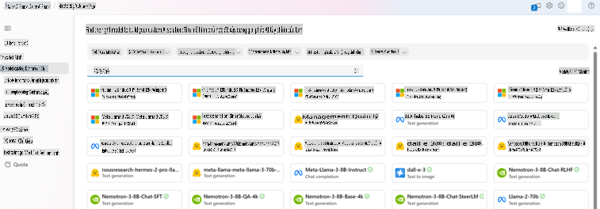

## Chuẩn bị cho việc tinh chỉnh

### Yêu cầu trước

> [!NOTE]
> Đối với các mô hình thuộc họ Phi-3, dịch vụ tinh chỉnh trả phí theo nhu cầu chỉ khả dụng với các hub được tạo tại các khu vực **East US 2**.

- Một tài khoản Azure. Nếu bạn chưa có, hãy tạo một [tài khoản Azure trả phí](https://azure.microsoft.com/pricing/purchase-options/pay-as-you-go) để bắt đầu.

- Một [dự án AI Foundry](https://ai.azure.com?WT.mc_id=aiml-138114-kinfeylo).
- Azure role-based access controls (Azure RBAC) được sử dụng để cấp quyền truy cập vào các hoạt động trong Azure AI Foundry. Để thực hiện các bước trong bài viết này, tài khoản người dùng của bạn cần được gán vai trò __Azure AI Developer__ trên nhóm tài nguyên.

### Đăng ký nhà cung cấp cho tài khoản

Xác minh rằng tài khoản đã được đăng ký với nhà cung cấp tài nguyên `Microsoft.Network`.

1. Đăng nhập vào [Azure portal](https://portal.azure.com).
1. Chọn **Subscriptions** từ menu bên trái.
1. Chọn tài khoản bạn muốn sử dụng.
1. Chọn **AI project settings** > **Resource providers** từ menu bên trái.
1. Xác nhận rằng **Microsoft.Network** nằm trong danh sách các nhà cung cấp tài nguyên. Nếu không, hãy thêm nó.

### Chuẩn bị dữ liệu

Chuẩn bị dữ liệu huấn luyện và dữ liệu kiểm tra để tinh chỉnh mô hình của bạn. Bộ dữ liệu huấn luyện và kiểm tra bao gồm các ví dụ về đầu vào và đầu ra mà bạn muốn mô hình thực hiện.

Hãy đảm bảo tất cả các ví dụ huấn luyện của bạn tuân theo định dạng dự kiến để suy luận. Để tinh chỉnh hiệu quả, cần đảm bảo bộ dữ liệu cân bằng và đa dạng.

Điều này bao gồm duy trì sự cân bằng dữ liệu, bao gồm các kịch bản khác nhau, và định kỳ tinh chỉnh dữ liệu huấn luyện để phù hợp với kỳ vọng thực tế, từ đó dẫn đến các phản hồi chính xác và cân bằng hơn từ mô hình.

Các loại mô hình khác nhau yêu cầu định dạng dữ liệu huấn luyện khác nhau.

### Hoàn thành hội thoại

Dữ liệu huấn luyện và kiểm tra bạn sử dụng **phải** được định dạng dưới dạng tài liệu JSON Lines (JSONL). Đối với `Phi-3-mini-128k-instruct`, tập dữ liệu tinh chỉnh phải được định dạng theo cấu trúc hội thoại được sử dụng bởi API hoàn thành hội thoại.

### Ví dụ về định dạng tệp

```json
    {"messages": [{"role": "system", "content": "You are an Xbox customer support agent whose primary goal is to help users with issues they are experiencing with their Xbox devices. You are friendly and concise. You only provide factual answers to queries, and do not provide answers that are not related to Xbox."}, {"role": "user", "content": "Is Xbox better than PlayStation?"}, {"role": "assistant", "content": "I apologize, but I cannot provide personal opinions. My primary job is to assist you with any issues related to your Xbox device. Do you have any Xbox-related issues that need addressing?"}]}
    {"messages": [{"role": "system", "content": "You are an Xbox customer support agent whose primary goal is to help users with issues they are experiencing with their Xbox devices. You are friendly and concise. You only provide factual answers to queries, and do not provide answers that are not related to Xbox."}, {"role": "user", "content": "Can I play PC games on my Xbox?"}, {"role": "assistant", "content": "While Xbox consoles don't natively support PC games, they can play an array of Xbox games, many of which are also available on PC. Can I assist you with finding games compatible with your Xbox device?"}]}
    {"messages": [{"role": "system", "content": "You are an Xbox customer support agent whose primary goal is to help users with issues they are experiencing with their Xbox devices. You are friendly and concise. You only provide factual answers to queries, and do not provide answers that are not related to Xbox."}, {"role": "user", "content": "I'm having trouble connecting my Xbox to the Wi-Fi."}, {"role": "assistant", "content": "No worries, let's go through the network settings on your Xbox. Can you please tell me what happens when you try to connect it to the Wi-Fi?"}]}
```

Loại tệp được hỗ trợ là JSON Lines. Các tệp được tải lên kho dữ liệu mặc định và sẵn sàng trong dự án của bạn.

## Tinh chỉnh Phi-3 với Azure AI Foundry

Azure AI Foundry cho phép bạn điều chỉnh các mô hình ngôn ngữ lớn với bộ dữ liệu cá nhân của mình thông qua quy trình gọi là tinh chỉnh. Tinh chỉnh mang lại giá trị lớn bằng cách cho phép tùy chỉnh và tối ưu hóa cho các nhiệm vụ và ứng dụng cụ thể. Điều này dẫn đến hiệu suất được cải thiện, tiết kiệm chi phí, giảm độ trễ, và đầu ra phù hợp hơn.

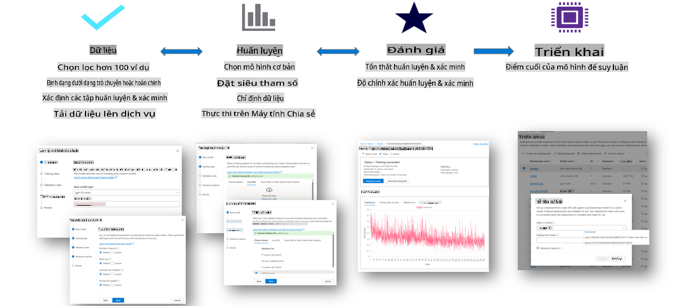

### Tạo dự án mới

1. Đăng nhập vào [Azure AI Foundry](https://ai.azure.com).

1. Chọn **+New project** để tạo một dự án mới trong Azure AI Foundry.

    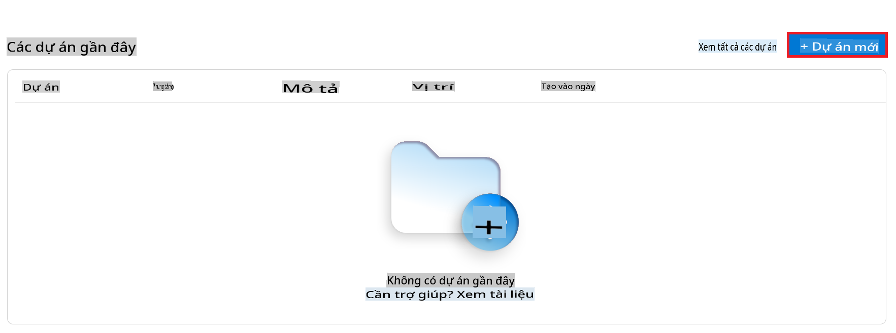

1. Thực hiện các tác vụ sau:

    - **Hub name** của dự án. Giá trị này phải là duy nhất.
    - Chọn **Hub** để sử dụng (tạo một cái mới nếu cần).

    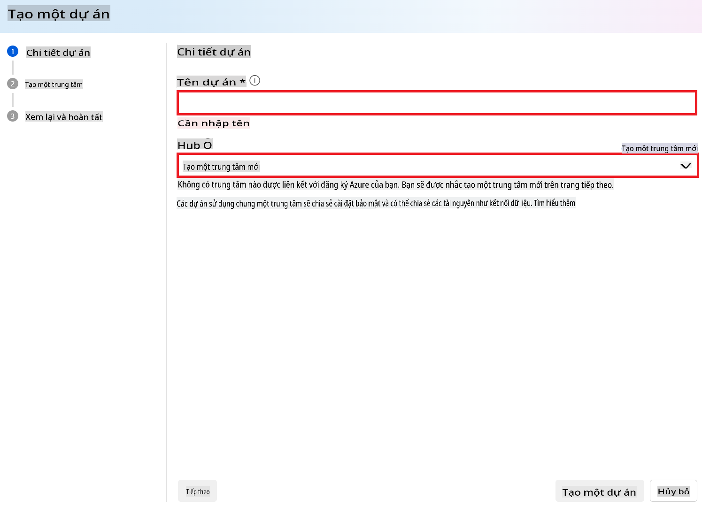

1. Thực hiện các tác vụ sau để tạo một hub mới:

    - Nhập **Hub name**. Giá trị này phải là duy nhất.
    - Chọn **Subscription** Azure của bạn.
    - Chọn **Resource group** để sử dụng (tạo một cái mới nếu cần).
    - Chọn **Location** bạn muốn sử dụng.
    - Chọn **Connect Azure AI Services** để sử dụng (tạo một cái mới nếu cần).
    - Chọn **Connect Azure AI Search** và **Skip connecting**.

    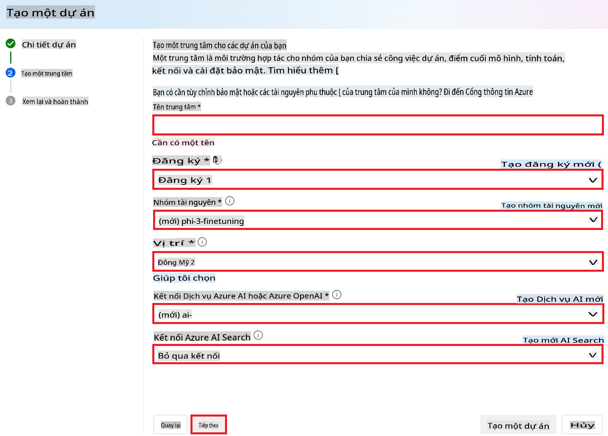

1. Chọn **Next**.
1. Chọn **Create a project**.

### Chuẩn bị dữ liệu

Trước khi tinh chỉnh, thu thập hoặc tạo một bộ dữ liệu phù hợp với nhiệm vụ của bạn, chẳng hạn như hướng dẫn hội thoại, cặp câu hỏi-trả lời, hoặc bất kỳ dữ liệu văn bản liên quan nào. Làm sạch và xử lý trước dữ liệu này bằng cách loại bỏ nhiễu, xử lý các giá trị bị thiếu, và phân đoạn văn bản.

### Tinh chỉnh các mô hình Phi-3 trong Azure AI Foundry

> [!NOTE]
> Tinh chỉnh các mô hình Phi-3 hiện chỉ được hỗ trợ trong các dự án tại East US 2.

1. Chọn **Model catalog** từ thanh bên trái.

1. Gõ *phi-3* trong **thanh tìm kiếm** và chọn mô hình phi-3 bạn muốn sử dụng.

    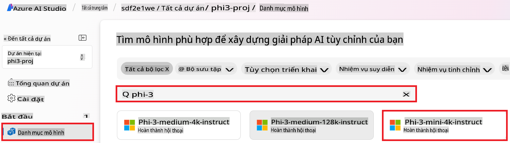

1. Chọn **Fine-tune**.

    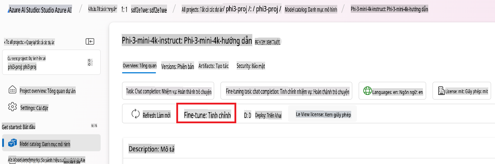

1. Nhập **Tên mô hình đã tinh chỉnh**.

    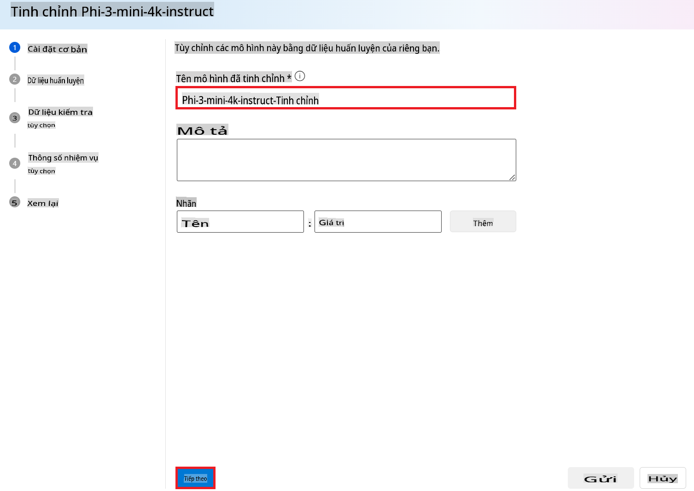

1. Chọn **Next**.

1. Thực hiện các tác vụ sau:

    - Chọn **Loại nhiệm vụ** là **Hoàn thành hội thoại**.
    - Chọn **Dữ liệu huấn luyện** bạn muốn sử dụng. Bạn có thể tải lên qua dữ liệu của Azure AI Foundry hoặc từ môi trường cục bộ của mình.

    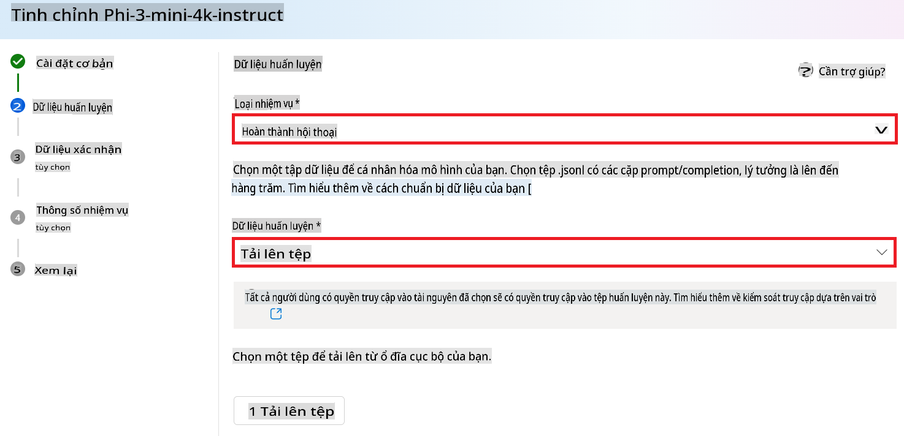

1. Chọn **Next**.

1. Tải lên **Dữ liệu kiểm tra** bạn muốn sử dụng hoặc chọn **Tự động chia dữ liệu huấn luyện**.

    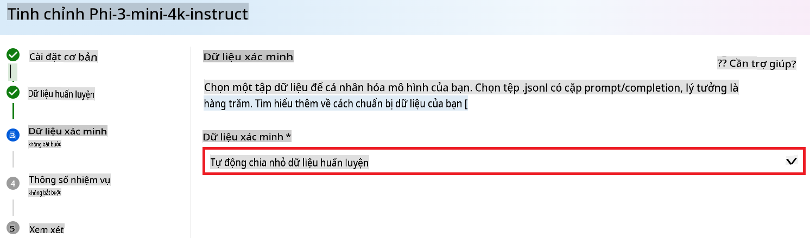

1. Chọn **Next**.

1. Thực hiện các tác vụ sau:

    - Chọn **Hệ số nhân kích thước lô** bạn muốn sử dụng.
    - Chọn **Tốc độ học** bạn muốn sử dụng.
    - Chọn **Số vòng lặp** bạn muốn sử dụng.

    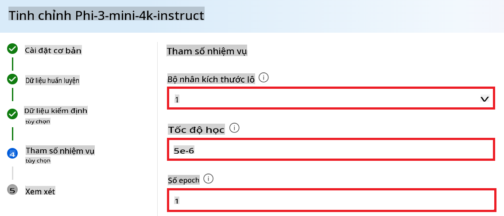

1. Chọn **Submit** để bắt đầu quá trình tinh chỉnh.

    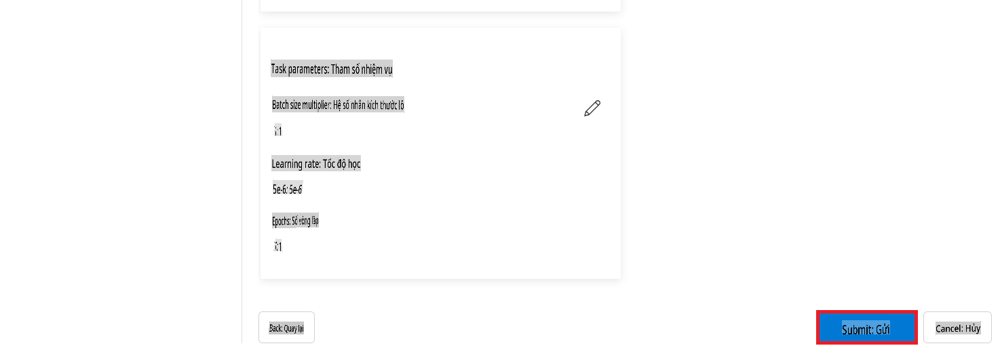

1. Khi mô hình của bạn đã được tinh chỉnh, trạng thái sẽ hiển thị là **Completed**, như trong hình dưới đây. Giờ đây, bạn có thể triển khai mô hình và sử dụng nó trong ứng dụng của mình, trong playground, hoặc trong prompt flow. Để biết thêm thông tin, xem [Cách triển khai họ mô hình ngôn ngữ nhỏ Phi-3 với Azure AI Foundry](https://learn.microsoft.com/azure/ai-studio/how-to/deploy-models-phi-3?tabs=phi-3-5&pivots=programming-language-python).

    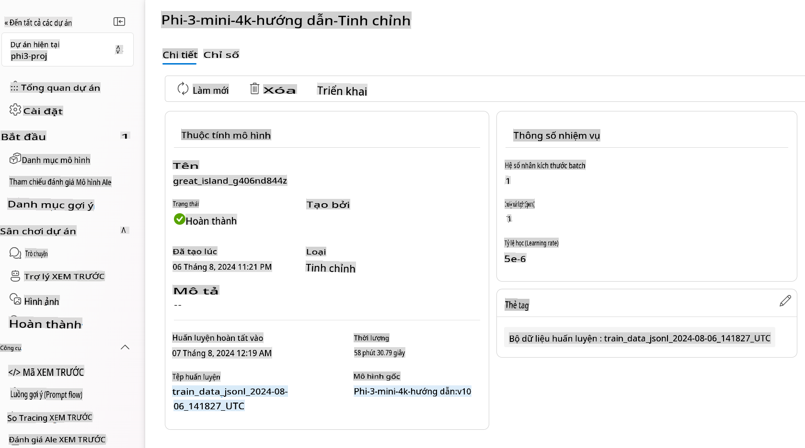

> [!NOTE]
> Để biết thêm thông tin chi tiết về tinh chỉnh Phi-3, vui lòng truy cập [Tinh chỉnh các mô hình Phi-3 trong Azure AI Foundry](https://learn.microsoft.com/azure/ai-studio/how-to/fine-tune-phi-3?tabs=phi-3-mini).

## Dọn dẹp các mô hình đã tinh chỉnh

Bạn có thể xóa một mô hình đã tinh chỉnh khỏi danh sách mô hình tinh chỉnh trong [Azure AI Foundry](https://ai.azure.com) hoặc từ trang chi tiết mô hình. Chọn mô hình đã tinh chỉnh để xóa từ trang Tinh chỉnh, sau đó chọn nút Xóa để xóa mô hình.

> [!NOTE]
> Bạn không thể xóa một mô hình tùy chỉnh nếu nó có một triển khai hiện có. Bạn phải xóa triển khai mô hình trước khi có thể xóa mô hình tùy chỉnh.

## Chi phí và hạn mức

### Cân nhắc về chi phí và hạn mức cho các mô hình Phi-3 được tinh chỉnh dưới dạng dịch vụ

Các mô hình Phi được tinh chỉnh dưới dạng dịch vụ được Microsoft cung cấp và tích hợp với Azure AI Foundry để sử dụng. Bạn có thể tìm thấy giá khi [triển khai](https://learn.microsoft.com/azure/ai-studio/how-to/deploy-models-phi-3?tabs=phi-3-5&pivots=programming-language-python) hoặc tinh chỉnh các mô hình trong tab Giá và điều khoản trên trình hướng dẫn triển khai.

## Lọc nội dung

Các mô hình được triển khai dưới dạng dịch vụ với chế độ trả phí theo nhu cầu được bảo vệ bởi Azure AI Content Safety. Khi được triển khai đến các điểm cuối thời gian thực, bạn có thể chọn không sử dụng tính năng này. Với Azure AI Content Safety được bật, cả yêu cầu đầu vào và kết quả hoàn thành đều được kiểm tra bởi một tập hợp các mô hình phân loại nhằm phát hiện và ngăn chặn nội dung có hại. Hệ thống lọc nội dung phát hiện và thực hiện hành động với các loại nội dung có hại tiềm tàng trong cả yêu cầu đầu vào và kết quả đầu ra. Tìm hiểu thêm về [Azure AI Content Safety](https://learn.microsoft.com/azure/ai-studio/concepts/content-filtering).

**Cấu hình Tinh chỉnh**

Siêu tham số: Định nghĩa các siêu tham số như tốc độ học, kích thước lô, và số vòng lặp huấn luyện.

**Hàm mất mát**

Chọn một hàm mất mát phù hợp với nhiệm vụ của bạn (ví dụ: cross-entropy).

**Bộ tối ưu hóa**

Chọn một bộ tối ưu hóa (ví dụ: Adam) để cập nhật gradient trong quá trình huấn luyện.

**Quy trình Tinh chỉnh**

- Tải mô hình đã được huấn luyện trước: Tải checkpoint của Phi-3 Mini.
- Thêm các lớp tùy chỉnh: Thêm các lớp cụ thể cho nhiệm vụ (ví dụ: lớp phân loại cho hướng dẫn hội thoại).

**Huấn luyện mô hình**
Tinh chỉnh mô hình bằng bộ dữ liệu đã chuẩn bị. Theo dõi tiến trình huấn luyện và điều chỉnh các siêu tham số khi cần.

**Đánh giá và kiểm tra**

Bộ dữ liệu kiểm tra: Chia bộ dữ liệu của bạn thành tập huấn luyện và tập kiểm tra.

**Đánh giá hiệu suất**

Sử dụng các chỉ số như độ chính xác, F1-score, hoặc perplexity để đánh giá hiệu suất của mô hình.

## Lưu mô hình đã tinh chỉnh

**Checkpoint**
Lưu checkpoint của mô hình đã tinh chỉnh để sử dụng sau này.

## Triển khai

- Triển khai dưới dạng Dịch vụ Web: Triển khai mô hình đã tinh chỉnh của bạn dưới dạng dịch vụ web trong Azure AI Foundry.
- Kiểm tra Điểm cuối: Gửi các truy vấn thử nghiệm đến điểm cuối được triển khai để xác minh tính năng hoạt động.

## Lặp lại và cải thiện

Lặp lại: Nếu hiệu suất không đạt yêu cầu, hãy lặp lại bằng cách điều chỉnh siêu tham số, thêm dữ liệu, hoặc tinh chỉnh thêm các vòng lặp.

## Theo dõi và tinh chỉnh

Liên tục theo dõi hành vi của mô hình và tinh chỉnh khi cần.

## Tùy chỉnh và mở rộng

Nhiệm vụ tùy chỉnh: Phi-3 Mini có thể được tinh chỉnh cho nhiều nhiệm vụ khác ngoài hướng dẫn hội thoại. Hãy khám phá các trường hợp sử dụng khác!
Thử nghiệm: Thử các kiến trúc, kết hợp các lớp, và kỹ thuật khác nhau để cải thiện hiệu suất.

> [!NOTE]
> Tinh chỉnh là một quá trình lặp lại. Hãy thử nghiệm, học hỏi, và điều chỉnh mô hình của bạn để đạt được kết quả tốt nhất cho nhiệm vụ cụ thể!

**Tuyên bố miễn trừ trách nhiệm**:  
Tài liệu này đã được dịch bằng các dịch vụ dịch thuật AI tự động. Mặc dù chúng tôi cố gắng đảm bảo độ chính xác, xin lưu ý rằng các bản dịch tự động có thể chứa lỗi hoặc sự không chính xác. Tài liệu gốc bằng ngôn ngữ bản địa nên được coi là nguồn thông tin chính thức. Đối với các thông tin quan trọng, nên sử dụng dịch thuật chuyên nghiệp từ con người. Chúng tôi không chịu trách nhiệm cho bất kỳ sự hiểu lầm hoặc diễn giải sai nào phát sinh từ việc sử dụng bản dịch này.