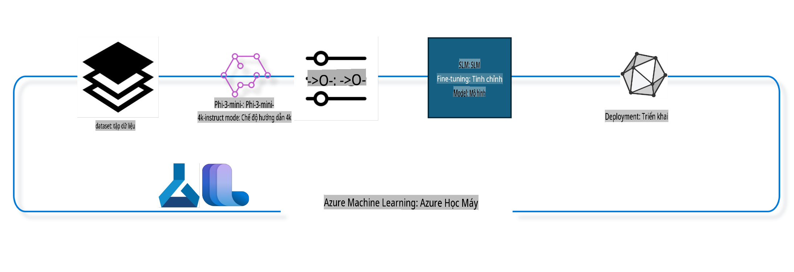

## Cách sử dụng các thành phần chat-completion từ Azure ML system registry để tinh chỉnh một mô hình

Trong ví dụ này, chúng ta sẽ thực hiện tinh chỉnh mô hình Phi-3-mini-4k-instruct để hoàn thành một cuộc hội thoại giữa 2 người bằng cách sử dụng tập dữ liệu ultrachat_200k.



Ví dụ này sẽ hướng dẫn bạn cách thực hiện tinh chỉnh bằng Azure ML SDK và Python, sau đó triển khai mô hình đã tinh chỉnh tới một endpoint trực tuyến để suy luận thời gian thực.

### Dữ liệu huấn luyện

Chúng ta sẽ sử dụng tập dữ liệu ultrachat_200k. Đây là một phiên bản đã được lọc kỹ lưỡng từ tập dữ liệu UltraChat và được sử dụng để huấn luyện Zephyr-7B-β, một mô hình chat tiên tiến với 7 tỷ tham số.

### Mô hình

Chúng ta sẽ sử dụng mô hình Phi-3-mini-4k-instruct để minh họa cách người dùng có thể tinh chỉnh mô hình cho nhiệm vụ chat-completion. Nếu bạn mở notebook này từ một trang mô hình cụ thể, hãy nhớ thay thế tên mô hình cụ thể.

### Các bước thực hiện

- Chọn một mô hình để tinh chỉnh.
- Chọn và khám phá dữ liệu huấn luyện.
- Cấu hình công việc tinh chỉnh.
- Chạy công việc tinh chỉnh.
- Xem lại các chỉ số huấn luyện và đánh giá.
- Đăng ký mô hình đã tinh chỉnh.
- Triển khai mô hình đã tinh chỉnh để suy luận thời gian thực.
- Dọn dẹp tài nguyên.

## 1. Thiết lập các điều kiện tiên quyết

- Cài đặt các thư viện cần thiết.
- Kết nối với AzureML Workspace. Tìm hiểu thêm tại set up SDK authentication. Thay thế <WORKSPACE_NAME>, <RESOURCE_GROUP>, và <SUBSCRIPTION_ID> bên dưới.
- Kết nối với AzureML system registry.
- Đặt tên thí nghiệm tùy chọn.
- Kiểm tra hoặc tạo máy tính.

> [!NOTE]
> Yêu cầu một node GPU duy nhất có thể có nhiều card GPU. Ví dụ, trong một node của Standard_NC24rs_v3 có 4 GPU NVIDIA V100, trong khi ở Standard_NC12s_v3 có 2 GPU NVIDIA V100. Tham khảo tài liệu để biết thông tin này. Số lượng card GPU trên mỗi node được đặt trong tham số gpus_per_node bên dưới. Việc đặt giá trị này đúng sẽ đảm bảo tận dụng tất cả các GPU trong node. Các SKU tính toán GPU được khuyến nghị có thể được tìm thấy tại đây và tại đây.

### Thư viện Python

Cài đặt các thư viện cần thiết bằng cách chạy cell dưới đây. Đây không phải là bước tùy chọn nếu chạy trong một môi trường mới.

```bash
pip install azure-ai-ml
pip install azure-identity
pip install datasets==2.9.0
pip install mlflow
pip install azureml-mlflow
```

### Tương tác với Azure ML

1. Tập lệnh Python này được sử dụng để tương tác với dịch vụ Azure Machine Learning (Azure ML). Dưới đây là phân tích chi tiết:

    - Import các module cần thiết từ azure.ai.ml, azure.identity, và azure.ai.ml.entities. Nó cũng import module time.

    - Cố gắng xác thực bằng DefaultAzureCredential(), cung cấp trải nghiệm xác thực đơn giản hóa để nhanh chóng bắt đầu phát triển ứng dụng chạy trên đám mây Azure. Nếu thất bại, nó chuyển sang InteractiveBrowserCredential(), cung cấp lời nhắc đăng nhập tương tác.

    - Tạo một instance MLClient bằng phương thức from_config, đọc cấu hình từ file config mặc định (config.json). Nếu thất bại, tạo một instance MLClient bằng cách cung cấp subscription_id, resource_group_name và workspace_name.

    - Tạo một instance MLClient khác, lần này cho registry Azure ML có tên "azureml". Registry này lưu trữ các mô hình, pipeline tinh chỉnh, và môi trường.

    - Đặt tên thí nghiệm là "chat_completion_Phi-3-mini-4k-instruct".

    - Tạo một timestamp duy nhất bằng cách chuyển đổi thời gian hiện tại (tính bằng giây kể từ epoch, dưới dạng số thực) thành số nguyên rồi thành chuỗi. Timestamp này có thể được sử dụng để tạo tên và phiên bản duy nhất.

    ```python
    # Import necessary modules from Azure ML and Azure Identity
    from azure.ai.ml import MLClient
    from azure.identity import (
        DefaultAzureCredential,
        InteractiveBrowserCredential,
    )
    from azure.ai.ml.entities import AmlCompute
    import time  # Import time module
    
    # Try to authenticate using DefaultAzureCredential
    try:
        credential = DefaultAzureCredential()
        credential.get_token("https://management.azure.com/.default")
    except Exception as ex:  # If DefaultAzureCredential fails, use InteractiveBrowserCredential
        credential = InteractiveBrowserCredential()
    
    # Try to create an MLClient instance using the default config file
    try:
        workspace_ml_client = MLClient.from_config(credential=credential)
    except:  # If that fails, create an MLClient instance by manually providing the details
        workspace_ml_client = MLClient(
            credential,
            subscription_id="<SUBSCRIPTION_ID>",
            resource_group_name="<RESOURCE_GROUP>",
            workspace_name="<WORKSPACE_NAME>",
        )
    
    # Create another MLClient instance for the Azure ML registry named "azureml"
    # This registry is where models, fine-tuning pipelines, and environments are stored
    registry_ml_client = MLClient(credential, registry_name="azureml")
    
    # Set the experiment name
    experiment_name = "chat_completion_Phi-3-mini-4k-instruct"
    
    # Generate a unique timestamp that can be used for names and versions that need to be unique
    timestamp = str(int(time.time()))
    ```

## 2. Chọn một mô hình nền tảng để tinh chỉnh

1. Phi-3-mini-4k-instruct là một mô hình nhẹ, tiên tiến, với 3.8 tỷ tham số, được xây dựng dựa trên các tập dữ liệu sử dụng cho Phi-2. Mô hình thuộc họ Phi-3, và phiên bản Mini có hai biến thể là 4K và 128K, tương ứng với độ dài ngữ cảnh (tính bằng token) mà nó có thể hỗ trợ. Chúng ta cần tinh chỉnh mô hình cho mục đích cụ thể để sử dụng. Bạn có thể duyệt qua các mô hình này trong Model Catalog của AzureML Studio, lọc theo nhiệm vụ chat-completion. Trong ví dụ này, chúng ta sử dụng mô hình Phi-3-mini-4k-instruct. Nếu bạn mở notebook này cho một mô hình khác, hãy thay thế tên và phiên bản mô hình phù hợp.

    > [!NOTE]
    > Thuộc tính id của mô hình sẽ được truyền làm đầu vào cho công việc tinh chỉnh. Thuộc tính này cũng có sẵn trong trường Asset ID trên trang chi tiết mô hình trong AzureML Studio Model Catalog.

2. Tập lệnh Python này tương tác với dịch vụ Azure Machine Learning (Azure ML). Dưới đây là phân tích chi tiết:

    - Đặt model_name là "Phi-3-mini-4k-instruct".

    - Sử dụng phương thức get của thuộc tính models của đối tượng registry_ml_client để lấy phiên bản mới nhất của mô hình với tên chỉ định từ registry Azure ML. Phương thức get được gọi với hai tham số: tên của mô hình và nhãn chỉ định rằng phiên bản mới nhất của mô hình sẽ được lấy.

    - In ra console một thông báo cho biết tên, phiên bản, và id của mô hình sẽ được sử dụng để tinh chỉnh. Phương thức format của chuỗi được sử dụng để chèn tên, phiên bản, và id của mô hình vào thông báo. Tên, phiên bản, và id của mô hình được truy cập dưới dạng thuộc tính của đối tượng foundation_model.

    ```python
    # Set the model name
    model_name = "Phi-3-mini-4k-instruct"
    
    # Get the latest version of the model from the Azure ML registry
    foundation_model = registry_ml_client.models.get(model_name, label="latest")
    
    # Print the model name, version, and id
    # This information is useful for tracking and debugging
    print(
        "\n\nUsing model name: {0}, version: {1}, id: {2} for fine tuning".format(
            foundation_model.name, foundation_model.version, foundation_model.id
        )
    )
    ```

## 3. Tạo một compute để sử dụng với công việc

Công việc tinh chỉnh CHỈ hoạt động với GPU compute. Kích thước của compute phụ thuộc vào kích thước của mô hình và trong hầu hết các trường hợp, việc xác định compute phù hợp cho công việc có thể gặp khó khăn. Trong cell này, chúng tôi hướng dẫn người dùng chọn compute phù hợp.

> [!NOTE]
> Các compute được liệt kê dưới đây hoạt động với cấu hình tối ưu nhất. Bất kỳ thay đổi nào đối với cấu hình có thể dẫn đến lỗi Cuda Out Of Memory. Trong những trường hợp như vậy, hãy thử nâng cấp compute lên kích thước lớn hơn.

> [!NOTE]
> Khi chọn compute_cluster_size bên dưới, hãy đảm bảo compute có sẵn trong nhóm tài nguyên của bạn. Nếu một compute cụ thể không có sẵn, bạn có thể yêu cầu quyền truy cập vào tài nguyên compute đó.

### Kiểm tra Mô hình có Hỗ trợ Tinh chỉnh

1. Tập lệnh Python này tương tác với một mô hình Azure Machine Learning (Azure ML). Dưới đây là phân tích chi tiết:

    - Import module ast, cung cấp các hàm để xử lý cây cú pháp trừu tượng của Python.

    - Kiểm tra xem đối tượng foundation_model (đại diện cho một mô hình trong Azure ML) có tag tên là finetune_compute_allow_list hay không. Tag trong Azure ML là các cặp key-value mà bạn có thể tạo và sử dụng để lọc và sắp xếp các mô hình.

    - Nếu tag finetune_compute_allow_list có mặt, sử dụng hàm ast.literal_eval để chuyển đổi giá trị của tag (một chuỗi) thành danh sách Python. Danh sách này sau đó được gán cho biến computes_allow_list. Sau đó, in ra thông báo chỉ dẫn rằng một compute nên được tạo từ danh sách này.

    - Nếu tag finetune_compute_allow_list không có, gán computes_allow_list là None và in ra thông báo rằng tag finetune_compute_allow_list không phải là một phần của tag mô hình.

    - Tóm lại, tập lệnh này kiểm tra một tag cụ thể trong metadata của mô hình, chuyển đổi giá trị của tag thành danh sách nếu nó tồn tại, và cung cấp phản hồi cho người dùng tương ứng.

    ```python
    # Import the ast module, which provides functions to process trees of the Python abstract syntax grammar
    import ast
    
    # Check if the 'finetune_compute_allow_list' tag is present in the model's tags
    if "finetune_compute_allow_list" in foundation_model.tags:
        # If the tag is present, use ast.literal_eval to safely parse the tag's value (a string) into a Python list
        computes_allow_list = ast.literal_eval(
            foundation_model.tags["finetune_compute_allow_list"]
        )  # convert string to python list
        # Print a message indicating that a compute should be created from the list
        print(f"Please create a compute from the above list - {computes_allow_list}")
    else:
        # If the tag is not present, set computes_allow_list to None
        computes_allow_list = None
        # Print a message indicating that the 'finetune_compute_allow_list' tag is not part of the model's tags
        print("`finetune_compute_allow_list` is not part of model tags")
    ```

### Kiểm tra Compute Instance

1. Tập lệnh Python này tương tác với dịch vụ Azure Machine Learning (Azure ML) và thực hiện một số kiểm tra trên một compute instance. Dưới đây là phân tích chi tiết:

    - Cố gắng lấy compute instance với tên được lưu trữ trong compute_cluster từ workspace Azure ML. Nếu trạng thái provisioning của compute instance là "failed", nó sẽ raise một ValueError.

    - Kiểm tra nếu computes_allow_list không phải là None. Nếu không, nó chuyển đổi tất cả kích thước compute trong danh sách thành chữ thường và kiểm tra nếu kích thước của compute instance hiện tại có trong danh sách. Nếu không, nó sẽ raise một ValueError.

    - Nếu computes_allow_list là None, nó kiểm tra nếu kích thước của compute instance có trong danh sách các kích thước GPU VM không được hỗ trợ. Nếu có, nó sẽ raise một ValueError.

    - Lấy danh sách tất cả các kích thước compute có sẵn trong workspace. Sau đó, duyệt qua danh sách này, và đối với mỗi kích thước compute, kiểm tra nếu tên của nó khớp với kích thước của compute instance hiện tại. Nếu có, lấy số lượng GPU cho kích thước compute đó và đặt gpu_count_found là True.

    - Nếu gpu_count_found là True, in ra số lượng GPU trong compute instance. Nếu gpu_count_found là False, nó sẽ raise một ValueError.

    - Tóm lại, tập lệnh này thực hiện một số kiểm tra trên một compute instance trong workspace Azure ML, bao gồm kiểm tra trạng thái provisioning, kích thước của nó so với danh sách cho phép hoặc danh sách từ chối, và số lượng GPU mà nó có.

    ```python
    # Print the exception message
    print(e)
    # Raise a ValueError if the compute size is not available in the workspace
    raise ValueError(
        f"WARNING! Compute size {compute_cluster_size} not available in workspace"
    )
    
    # Retrieve the compute instance from the Azure ML workspace
    compute = workspace_ml_client.compute.get(compute_cluster)
    # Check if the provisioning state of the compute instance is "failed"
    if compute.provisioning_state.lower() == "failed":
        # Raise a ValueError if the provisioning state is "failed"
        raise ValueError(
            f"Provisioning failed, Compute '{compute_cluster}' is in failed state. "
            f"please try creating a different compute"
        )
    
    # Check if computes_allow_list is not None
    if computes_allow_list is not None:
        # Convert all compute sizes in computes_allow_list to lowercase
        computes_allow_list_lower_case = [x.lower() for x in computes_allow_list]
        # Check if the size of the compute instance is in computes_allow_list_lower_case
        if compute.size.lower() not in computes_allow_list_lower_case:
            # Raise a ValueError if the size of the compute instance is not in computes_allow_list_lower_case
            raise ValueError(
                f"VM size {compute.size} is not in the allow-listed computes for finetuning"
            )
    else:
        # Define a list of unsupported GPU VM sizes
        unsupported_gpu_vm_list = [
            "standard_nc6",
            "standard_nc12",
            "standard_nc24",
            "standard_nc24r",
        ]
        # Check if the size of the compute instance is in unsupported_gpu_vm_list
        if compute.size.lower() in unsupported_gpu_vm_list:
            # Raise a ValueError if the size of the compute instance is in unsupported_gpu_vm_list
            raise ValueError(
                f"VM size {compute.size} is currently not supported for finetuning"
            )
    
    # Initialize a flag to check if the number of GPUs in the compute instance has been found
    gpu_count_found = False
    # Retrieve a list of all available compute sizes in the workspace
    workspace_compute_sku_list = workspace_ml_client.compute.list_sizes()
    available_sku_sizes = []
    # Iterate over the list of available compute sizes
    for compute_sku in workspace_compute_sku_list:
        available_sku_sizes.append(compute_sku.name)
        # Check if the name of the compute size matches the size of the compute instance
        if compute_sku.name.lower() == compute.size.lower():
            # If it does, retrieve the number of GPUs for that compute size and set gpu_count_found to True
            gpus_per_node = compute_sku.gpus
            gpu_count_found = True
    # If gpu_count_found is True, print the number of GPUs in the compute instance
    if gpu_count_found:
        print(f"Number of GPU's in compute {compute.size}: {gpus_per_node}")
    else:
        # If gpu_count_found is False, raise a ValueError
        raise ValueError(
            f"Number of GPU's in compute {compute.size} not found. Available skus are: {available_sku_sizes}."
            f"This should not happen. Please check the selected compute cluster: {compute_cluster} and try again."
        )
    ```

## 4. Chọn tập dữ liệu để tinh chỉnh mô hình

1. Chúng ta sử dụng tập dữ liệu ultrachat_200k. Tập dữ liệu có bốn phần, phù hợp cho Supervised fine-tuning (sft). Generation ranking (gen). Số lượng ví dụ trên mỗi phần được hiển thị như sau:

    ```bash
    train_sft test_sft  train_gen  test_gen
    207865  23110  256032  28304
    ```

1. Các cell tiếp theo hiển thị việc chuẩn bị dữ liệu cơ bản cho tinh chỉnh:

### Hiển thị một số dòng dữ liệu

Chúng ta muốn mẫu này chạy nhanh, vì vậy hãy lưu các file train_sft, test_sft chứa 5% số dòng đã được cắt gọn. Điều này có nghĩa là mô hình đã tinh chỉnh sẽ có độ chính xác thấp hơn, do đó không nên sử dụng trong thực tế.  
Tập lệnh download-dataset.py được sử dụng để tải xuống tập dữ liệu ultrachat_200k và chuyển đổi tập dữ liệu sang định dạng có thể sử dụng cho pipeline tinh chỉnh. Vì tập dữ liệu lớn, nên ở đây chúng ta chỉ sử dụng một phần của tập dữ liệu.

1. Chạy tập lệnh dưới đây chỉ tải xuống 5% dữ liệu. Bạn có thể tăng giá trị này bằng cách thay đổi tham số dataset_split_pc thành phần trăm mong muốn.

    > [!NOTE]
    > Một số mô hình ngôn ngữ có các mã ngôn ngữ khác nhau và do đó tên các cột trong tập dữ liệu cũng nên phản ánh điều này.

1. Đây là một ví dụ về cách dữ liệu nên trông như thế nào:  
Tập dữ liệu chat-completion được lưu trữ ở định dạng parquet với mỗi mục nhập sử dụng schema sau:

    - Đây là một tài liệu JSON (JavaScript Object Notation), một định dạng trao đổi dữ liệu phổ biến. Đây không phải là mã thực thi, mà là cách lưu trữ và truyền dữ liệu. Dưới đây là phân tích cấu trúc của nó:

    - "prompt": Key này chứa giá trị chuỗi đại diện cho nhiệm vụ hoặc câu hỏi được đặt ra cho một trợ lý AI.

    - "messages": Key này chứa một mảng các đối tượng. Mỗi đối tượng đại diện cho một tin nhắn trong cuộc trò chuyện giữa người dùng và trợ lý AI. Mỗi đối tượng tin nhắn có hai key:

    - "content": Key này chứa giá trị chuỗi đại diện cho nội dung của tin nhắn.
    - "role": Key này chứa giá trị chuỗi đại diện cho vai trò của thực thể đã gửi tin nhắn. Nó có thể là "user" hoặc "assistant".
    - "prompt_id": Key này chứa giá trị chuỗi đại diện cho một định danh duy nhất cho prompt.

1. Trong tài liệu JSON cụ thể này, một cuộc trò chuyện được đại diện nơi người dùng yêu cầu trợ lý AI tạo một nhân vật chính cho một câu chuyện dystopian. Trợ lý phản hồi, và người dùng sau đó yêu cầu thêm chi tiết. Trợ lý đồng ý cung cấp thêm chi tiết. Toàn bộ cuộc trò chuyện được liên kết với một prompt id cụ thể.

    ```python
    {
        // The task or question posed to an AI assistant
        "prompt": "Create a fully-developed protagonist who is challenged to survive within a dystopian society under the rule of a tyrant. ...",
        
        // An array of objects, each representing a message in a conversation between a user and an AI assistant
        "messages":[
            {
                // The content of the user's message
                "content": "Create a fully-developed protagonist who is challenged to survive within a dystopian society under the rule of a tyrant. ...",
                // The role of the entity that sent the message
                "role": "user"
            },
            {
                // The content of the assistant's message
                "content": "Name: Ava\n\n Ava was just 16 years old when the world as she knew it came crashing down. The government had collapsed, leaving behind a chaotic and lawless society. ...",
                // The role of the entity that sent the message
                "role": "assistant"
            },
            {
                // The content of the user's message
                "content": "Wow, Ava's story is so intense and inspiring! Can you provide me with more details.  ...",
                // The role of the entity that sent the message
                "role": "user"
            }, 
            {
                // The content of the assistant's message
                "content": "Certainly! ....",
                // The role of the entity that sent the message
                "role": "assistant"
            }
        ],
        
        // A unique identifier for the prompt
        "prompt_id": "d938b65dfe31f05f80eb8572964c6673eddbd68eff3db6bd234d7f1e3b86c2af"
    }
    ```

### Tải xuống dữ liệu

1. Tập lệnh Python này được sử dụng để tải xuống một tập dữ liệu bằng một tập lệnh hỗ trợ có tên download-dataset.py. Dưới đây là phân tích chi tiết:

    - Import module os, cung cấp một cách di động để sử dụng các chức năng phụ thuộc vào hệ điều hành.

    - Sử dụng hàm os.system để chạy tập lệnh download-dataset.py trong shell với các tham số dòng lệnh cụ thể. Các tham số chỉ định tập dữ liệu cần tải xuống (HuggingFaceH4/ultrachat_200k), thư mục để tải về (ultrachat_200k_dataset), và phần trăm của tập dữ liệu để chia (5). Hàm os.system trả về trạng thái thoát của lệnh mà nó thực thi; trạng thái này được lưu trữ trong biến exit_status.

    - Kiểm tra nếu exit_status không phải là 0. Trong các hệ điều hành giống Unix, trạng thái thoát là 0 thường chỉ ra rằng lệnh đã thành công, trong khi bất kỳ số nào khác chỉ ra lỗi. Nếu exit_status không phải là 0, nó raise một Exception với thông báo chỉ ra rằng có lỗi khi tải xuống tập dữ liệu.

    - Tóm lại, tập lệnh này chạy một lệnh để tải xuống một tập dữ liệu bằng một tập lệnh hỗ trợ, và raise một exception nếu lệnh thất bại.

    ```python
    # Import the os module, which provides a way of using operating system dependent functionality
    import os
    
    # Use the os.system function to run the download-dataset.py script in the shell with specific command-line arguments
    # The arguments specify the dataset to download (HuggingFaceH4/ultrachat_200k), the directory to download it to (ultrachat_200k_dataset), and the percentage of the dataset to split (5)
    # The os.system function returns the exit status of the command it executed; this status is stored in the exit_status variable
    exit_status = os.system(
        "python ./download-dataset.py --dataset HuggingFaceH4/ultrachat_200k --download_dir ultrachat_200k_dataset --dataset_split_pc 5"
    )
    
    # Check if exit_status is not 0
    # In Unix-like operating systems, an exit status of 0 usually indicates that a command has succeeded, while any other number indicates an error
    # If exit_status is not 0, raise an Exception with a message indicating that there was an error downloading the dataset
    if exit_status != 0:
        raise Exception("Error downloading dataset")
    ```

### Nạp dữ liệu vào DataFrame

1. Tập lệnh Python này nạp một file JSON Lines vào một pandas DataFrame và hiển thị 5 dòng đầu tiên. Dưới đây là phân tích chi tiết:

    - Import thư viện pandas, một thư viện mạnh mẽ để xử lý và phân tích dữ liệu.

    - Đặt chiều rộng tối đa của cột cho các tùy chọn hiển thị của pandas là 0. Điều này có nghĩa là toàn bộ văn bản của mỗi cột sẽ được hiển thị mà không bị cắt ngắn khi DataFrame được in ra.

    - Sử dụng hàm pd.read_json để nạp file train_sft.jsonl từ thư mục ultrachat_200k_dataset vào một DataFrame. Tham số lines=True chỉ ra rằng file ở định dạng JSON Lines, nơi mỗi dòng là một đối tượng JSON riêng biệt.

    - Sử dụng phương thức head để hiển thị 5 dòng đầu tiên của DataFrame. Nếu DataFrame có ít hơn 5 dòng, nó sẽ hiển thị tất cả.

    - Tóm lại, tập lệnh này nạp một file JSON Lines vào một DataFrame và hiển thị 5 dòng đầu tiên với toàn bộ văn bản của cột.

    ```python
    # Import the pandas library, which is a powerful data manipulation and analysis library
    import pandas as pd
    
    # Set the maximum column width for pandas' display options to 0
    # This means that the full text of each column will be displayed without truncation when the DataFrame is printed
    pd.set_option("display.max_colwidth", 0)
    
    # Use the pd.read_json function to load the train_sft.jsonl file from the ultrachat_200k_dataset directory into a DataFrame
    # The lines=True argument indicates that the file is in JSON Lines format, where each line is a separate JSON object
    df = pd.read_json("./ultrachat_200k_dataset/train_sft.jsonl", lines=True)
    
    # Use the head method to display the first 5 rows of the DataFrame
    # If the DataFrame has less than 5 rows, it will display all of them
    df.head()
    ```

## 5. Gửi công việc tinh chỉnh sử dụng mô hình và dữ liệu làm đầu vào

Tạo công việc sử dụng thành phần pipeline chat-completion. Tìm hiểu thêm về tất cả các tham số hỗ trợ cho tinh chỉnh.

### Định nghĩa các tham số tinh chỉnh

1. Các tham số tinh chỉnh có thể được nhóm thành 2 loại - tham số huấn luyện, tham số tối ưu hóa.

1. Các tham số huấn luyện xác định các khía cạnh huấn luyện như:

    - Bộ tối ưu hóa, lịch trình cần sử dụng.
    - Chỉ số để tối ưu hóa việc tinh chỉnh.
    - Số bước huấn luyện và kích thước batch, v.v.
    - Các tham số tối ưu hóa giúp tối ưu hóa bộ nhớ GPU và sử dụng hiệu quả tài nguyên tính toán.

1. Dưới đây là một số tham số thuộc loại này. Các tham số tối ưu hóa khác nhau cho mỗi mô hình và được đóng gói với mô hình để xử lý các biến thể này.

    - Kích hoạt deepspeed và LoRA.
    - Kích hoạt huấn luyện độ chính xác hỗn hợp.
    - Kích hoạt huấn luyện đa node.

> [!NOTE]
> Tinh chỉnh có giám sát có thể dẫn đến mất căn chỉnh hoặc quên lãng nghiêm trọng. Chúng tôi khuyến nghị kiểm tra vấn đề này và thực hiện một giai đoạn căn chỉnh sau khi bạn tinh chỉnh.

### Tham số Tinh chỉnh

1. Tập lệnh Python này thiết lập các tham số cho việc tinh chỉnh một mô hình máy học. Dưới đây là phân tích chi tiết:

    - Thiết lập các tham số huấn luyện mặc định như số lượng epoch huấn luyện, kích thước batch cho huấn luyện và đánh giá, learning rate, và loại lịch trình learning rate.

    - Thiết lập các tham số tối ưu hóa mặc định như có áp dụng Layer-wise Relevance Propagation (LoRa) và DeepSpeed hay không, và giai đoạn DeepSpeed.

    - Kết hợp các tham số huấn luyện và tối ưu hóa thành một dictionary duy nhất gọi là finetune_parameters.

    - Kiểm tra nếu foundation_model có bất kỳ tham số mặc định nào dành riêng cho mô hình. Nếu có, in ra một thông báo cảnh báo và cập nhật dictionary finetune_parameters với các mặc định dành riêng cho mô hình này. Hàm ast.literal_eval được sử dụng để chuyển đổi các mặc định dành riêng cho mô hình từ chuỗi thành dictionary Python.

    - In ra bộ tham số tinh chỉnh cuối cùng sẽ được sử dụng cho lần chạy.

    - Tóm lại, tập lệnh này thiết lập và hiển thị các tham số cho việc tinh chỉnh một mô hình máy học
pipeline huấn luyện dựa trên các tham số khác nhau, sau đó in ra tên hiển thị này. ```python
    # Define a function to generate a display name for the training pipeline
    def get_pipeline_display_name():
        # Calculate the total batch size by multiplying the per-device batch size, the number of gradient accumulation steps, the number of GPUs per node, and the number of nodes used for fine-tuning
        batch_size = (
            int(finetune_parameters.get("per_device_train_batch_size", 1))
            * int(finetune_parameters.get("gradient_accumulation_steps", 1))
            * int(gpus_per_node)
            * int(finetune_parameters.get("num_nodes_finetune", 1))
        )
        # Retrieve the learning rate scheduler type
        scheduler = finetune_parameters.get("lr_scheduler_type", "linear")
        # Retrieve whether DeepSpeed is applied
        deepspeed = finetune_parameters.get("apply_deepspeed", "false")
        # Retrieve the DeepSpeed stage
        ds_stage = finetune_parameters.get("deepspeed_stage", "2")
        # If DeepSpeed is applied, include "ds" followed by the DeepSpeed stage in the display name; if not, include "nods"
        if deepspeed == "true":
            ds_string = f"ds{ds_stage}"
        else:
            ds_string = "nods"
        # Retrieve whether Layer-wise Relevance Propagation (LoRa) is applied
        lora = finetune_parameters.get("apply_lora", "false")
        # If LoRa is applied, include "lora" in the display name; if not, include "nolora"
        if lora == "true":
            lora_string = "lora"
        else:
            lora_string = "nolora"
        # Retrieve the limit on the number of model checkpoints to keep
        save_limit = finetune_parameters.get("save_total_limit", -1)
        # Retrieve the maximum sequence length
        seq_len = finetune_parameters.get("max_seq_length", -1)
        # Construct the display name by concatenating all these parameters, separated by hyphens
        return (
            model_name
            + "-"
            + "ultrachat"
            + "-"
            + f"bs{batch_size}"
            + "-"
            + f"{scheduler}"
            + "-"
            + ds_string
            + "-"
            + lora_string
            + f"-save_limit{save_limit}"
            + f"-seqlen{seq_len}"
        )
    
    # Call the function to generate the display name
    pipeline_display_name = get_pipeline_display_name()
    # Print the display name
    print(f"Display name used for the run: {pipeline_display_name}")
    ```

### Cấu hình Pipeline

Đoạn script Python này định nghĩa và cấu hình một pipeline học máy sử dụng Azure Machine Learning SDK. Dưới đây là phân tích chi tiết những gì nó thực hiện:

1. Nhập các module cần thiết từ Azure AI ML SDK.  
1. Lấy một thành phần pipeline có tên "chat_completion_pipeline" từ registry.  
1. Định nghĩa một pipeline job bằng cách sử dụng `@pipeline` decorator and the function `create_pipeline`. The name of the pipeline is set to `pipeline_display_name`.

1. Inside the `create_pipeline` function, it initializes the fetched pipeline component with various parameters, including the model path, compute clusters for different stages, dataset splits for training and testing, the number of GPUs to use for fine-tuning, and other fine-tuning parameters.

1. It maps the output of the fine-tuning job to the output of the pipeline job. This is done so that the fine-tuned model can be easily registered, which is required to deploy the model to an online or batch endpoint.

1. It creates an instance of the pipeline by calling the `create_pipeline` function.

1. It sets the `force_rerun` setting of the pipeline to `True`, meaning that cached results from previous jobs will not be used.

1. It sets the `continue_on_step_failure` setting of the pipeline to `False`, nghĩa là pipeline sẽ dừng nếu bất kỳ bước nào thất bại.  
1. Tóm lại, đoạn script này định nghĩa và cấu hình một pipeline học máy cho nhiệm vụ hoàn thiện hội thoại sử dụng Azure Machine Learning SDK.  

```python
    # Import necessary modules from the Azure AI ML SDK
    from azure.ai.ml.dsl import pipeline
    from azure.ai.ml import Input
    
    # Fetch the pipeline component named "chat_completion_pipeline" from the registry
    pipeline_component_func = registry_ml_client.components.get(
        name="chat_completion_pipeline", label="latest"
    )
    
    # Define the pipeline job using the @pipeline decorator and the function create_pipeline
    # The name of the pipeline is set to pipeline_display_name
    @pipeline(name=pipeline_display_name)
    def create_pipeline():
        # Initialize the fetched pipeline component with various parameters
        # These include the model path, compute clusters for different stages, dataset splits for training and testing, the number of GPUs to use for fine-tuning, and other fine-tuning parameters
        chat_completion_pipeline = pipeline_component_func(
            mlflow_model_path=foundation_model.id,
            compute_model_import=compute_cluster,
            compute_preprocess=compute_cluster,
            compute_finetune=compute_cluster,
            compute_model_evaluation=compute_cluster,
            # Map the dataset splits to parameters
            train_file_path=Input(
                type="uri_file", path="./ultrachat_200k_dataset/train_sft.jsonl"
            ),
            test_file_path=Input(
                type="uri_file", path="./ultrachat_200k_dataset/test_sft.jsonl"
            ),
            # Training settings
            number_of_gpu_to_use_finetuning=gpus_per_node,  # Set to the number of GPUs available in the compute
            **finetune_parameters
        )
        return {
            # Map the output of the fine tuning job to the output of pipeline job
            # This is done so that we can easily register the fine tuned model
            # Registering the model is required to deploy the model to an online or batch endpoint
            "trained_model": chat_completion_pipeline.outputs.mlflow_model_folder
        }
    
    # Create an instance of the pipeline by calling the create_pipeline function
    pipeline_object = create_pipeline()
    
    # Don't use cached results from previous jobs
    pipeline_object.settings.force_rerun = True
    
    # Set continue on step failure to False
    # This means that the pipeline will stop if any step fails
    pipeline_object.settings.continue_on_step_failure = False
    ```

### Gửi Job

1. Đoạn script Python này gửi một pipeline học máy đến workspace Azure Machine Learning và chờ job hoàn thành. Dưới đây là phân tích chi tiết những gì nó thực hiện:  

   - Gọi phương thức `create_or_update` của đối tượng jobs trong `workspace_ml_client` để gửi pipeline job. Pipeline cần chạy được chỉ định bởi `pipeline_object`, và thí nghiệm (experiment) mà job thuộc về được chỉ định bởi `experiment_name`.  
   - Sau đó gọi phương thức `stream` của đối tượng jobs trong `workspace_ml_client` để chờ pipeline job hoàn thành. Job cần chờ được chỉ định bởi thuộc tính `name` của đối tượng `pipeline_job`.  

1. Tóm lại, đoạn script này gửi một pipeline học máy đến workspace Azure Machine Learning và chờ job hoàn thành.  

```python
    # Submit the pipeline job to the Azure Machine Learning workspace
    # The pipeline to be run is specified by pipeline_object
    # The experiment under which the job is run is specified by experiment_name
    pipeline_job = workspace_ml_client.jobs.create_or_update(
        pipeline_object, experiment_name=experiment_name
    )
    
    # Wait for the pipeline job to complete
    # The job to wait for is specified by the name attribute of the pipeline_job object
    workspace_ml_client.jobs.stream(pipeline_job.name)
    ```  

## 6. Đăng ký mô hình đã tinh chỉnh với workspace  

Chúng ta sẽ đăng ký mô hình từ đầu ra của job tinh chỉnh. Việc này sẽ theo dõi mối quan hệ giữa mô hình đã tinh chỉnh và job tinh chỉnh. Job tinh chỉnh, ngoài ra, còn theo dõi mối quan hệ với mô hình nền tảng, dữ liệu và mã huấn luyện.  

### Đăng ký Mô hình Học Máy  

1. Đoạn script Python này đăng ký một mô hình học máy đã được huấn luyện trong pipeline Azure Machine Learning. Dưới đây là phân tích chi tiết những gì nó thực hiện:  

   - Nhập các module cần thiết từ Azure AI ML SDK.  
   - Kiểm tra xem đầu ra `trained_model` có sẵn từ pipeline job không bằng cách gọi phương thức `get` của đối tượng jobs trong `workspace_ml_client` và truy cập thuộc tính `outputs` của nó.  
   - Tạo đường dẫn đến mô hình đã huấn luyện bằng cách định dạng chuỗi với tên của pipeline job và tên của đầu ra ("trained_model").  
   - Định nghĩa tên cho mô hình đã tinh chỉnh bằng cách thêm "-ultrachat-200k" vào tên mô hình gốc và thay thế bất kỳ dấu gạch chéo nào bằng dấu gạch ngang.  
   - Chuẩn bị đăng ký mô hình bằng cách tạo một đối tượng `Model` với các tham số khác nhau, bao gồm đường dẫn đến mô hình, loại mô hình (MLflow model), tên và phiên bản của mô hình, và mô tả của mô hình.  
   - Đăng ký mô hình bằng cách gọi phương thức `create_or_update` của đối tượng models trong `workspace_ml_client` với đối tượng `Model` làm tham số.  
   - In ra mô hình đã đăng ký.  

1. Tóm lại, đoạn script này đăng ký một mô hình học máy đã được huấn luyện trong pipeline Azure Machine Learning.  

```python
    # Import necessary modules from the Azure AI ML SDK
    from azure.ai.ml.entities import Model
    from azure.ai.ml.constants import AssetTypes
    
    # Check if the `trained_model` output is available from the pipeline job
    print("pipeline job outputs: ", workspace_ml_client.jobs.get(pipeline_job.name).outputs)
    
    # Construct a path to the trained model by formatting a string with the name of the pipeline job and the name of the output ("trained_model")
    model_path_from_job = "azureml://jobs/{0}/outputs/{1}".format(
        pipeline_job.name, "trained_model"
    )
    
    # Define a name for the fine-tuned model by appending "-ultrachat-200k" to the original model name and replacing any slashes with hyphens
    finetuned_model_name = model_name + "-ultrachat-200k"
    finetuned_model_name = finetuned_model_name.replace("/", "-")
    
    print("path to register model: ", model_path_from_job)
    
    # Prepare to register the model by creating a Model object with various parameters
    # These include the path to the model, the type of the model (MLflow model), the name and version of the model, and a description of the model
    prepare_to_register_model = Model(
        path=model_path_from_job,
        type=AssetTypes.MLFLOW_MODEL,
        name=finetuned_model_name,
        version=timestamp,  # Use timestamp as version to avoid version conflict
        description=model_name + " fine tuned model for ultrachat 200k chat-completion",
    )
    
    print("prepare to register model: \n", prepare_to_register_model)
    
    # Register the model by calling the create_or_update method of the models object in the workspace_ml_client with the Model object as the argument
    registered_model = workspace_ml_client.models.create_or_update(
        prepare_to_register_model
    )
    
    # Print the registered model
    print("registered model: \n", registered_model)
    ```  

## 7. Triển khai mô hình đã tinh chỉnh đến endpoint trực tuyến  

Endpoint trực tuyến cung cấp một REST API bền vững có thể được tích hợp với các ứng dụng cần sử dụng mô hình.  

### Quản lý Endpoint  

1. Đoạn script Python này tạo một endpoint trực tuyến được quản lý trong Azure Machine Learning cho một mô hình đã đăng ký. Dưới đây là phân tích chi tiết những gì nó thực hiện:  

   - Nhập các module cần thiết từ Azure AI ML SDK.  
   - Định nghĩa một tên duy nhất cho endpoint trực tuyến bằng cách thêm dấu thời gian vào chuỗi "ultrachat-completion-".  
   - Chuẩn bị tạo endpoint trực tuyến bằng cách tạo một đối tượng `ManagedOnlineEndpoint` với các tham số khác nhau, bao gồm tên của endpoint, mô tả của endpoint, và chế độ xác thực ("key").  
   - Tạo endpoint trực tuyến bằng cách gọi phương thức `begin_create_or_update` của `workspace_ml_client` với đối tượng `ManagedOnlineEndpoint` làm tham số. Sau đó chờ hoạt động tạo hoàn thành bằng cách gọi phương thức `wait`.  

1. Tóm lại, đoạn script này tạo một endpoint trực tuyến được quản lý trong Azure Machine Learning cho một mô hình đã đăng ký.  

```python
    # Import necessary modules from the Azure AI ML SDK
    from azure.ai.ml.entities import (
        ManagedOnlineEndpoint,
        ManagedOnlineDeployment,
        ProbeSettings,
        OnlineRequestSettings,
    )
    
    # Define a unique name for the online endpoint by appending a timestamp to the string "ultrachat-completion-"
    online_endpoint_name = "ultrachat-completion-" + timestamp
    
    # Prepare to create the online endpoint by creating a ManagedOnlineEndpoint object with various parameters
    # These include the name of the endpoint, a description of the endpoint, and the authentication mode ("key")
    endpoint = ManagedOnlineEndpoint(
        name=online_endpoint_name,
        description="Online endpoint for "
        + registered_model.name
        + ", fine tuned model for ultrachat-200k-chat-completion",
        auth_mode="key",
    )
    
    # Create the online endpoint by calling the begin_create_or_update method of the workspace_ml_client with the ManagedOnlineEndpoint object as the argument
    # Then wait for the creation operation to complete by calling the wait method
    workspace_ml_client.begin_create_or_update(endpoint).wait()
    ```  

> [!NOTE]  
> Bạn có thể tìm danh sách SKU được hỗ trợ cho việc triển khai tại đây - [Danh sách SKU endpoint trực tuyến được quản lý](https://learn.microsoft.com/azure/machine-learning/reference-managed-online-endpoints-vm-sku-list)  

### Triển khai Mô hình Học Máy  

1. Đoạn script Python này triển khai một mô hình học máy đã đăng ký đến một endpoint trực tuyến được quản lý trong Azure Machine Learning. Dưới đây là phân tích chi tiết những gì nó thực hiện:  

   - Nhập module `ast`, cung cấp các hàm để xử lý cây cú pháp trừu tượng của Python.  
   - Đặt loại instance cho việc triển khai là "Standard_NC6s_v3".  
   - Kiểm tra xem tag `inference_compute_allow_list` có tồn tại trong mô hình nền tảng hay không. Nếu có, chuyển đổi giá trị tag từ chuỗi sang danh sách Python và gán nó cho `inference_computes_allow_list`. Nếu không, đặt `inference_computes_allow_list` là None.  
   - Kiểm tra xem loại instance được chỉ định có nằm trong danh sách cho phép hay không. Nếu không, in ra thông báo yêu cầu người dùng chọn một loại instance từ danh sách cho phép.  
   - Chuẩn bị tạo triển khai bằng cách tạo một đối tượng `ManagedOnlineDeployment` với các tham số khác nhau, bao gồm tên của triển khai, tên của endpoint, ID của mô hình, loại và số lượng instance, cài đặt kiểm tra khả năng sống (liveness probe settings), và cài đặt yêu cầu (request settings).  
   - Tạo triển khai bằng cách gọi phương thức `begin_create_or_update` của `workspace_ml_client` với đối tượng `ManagedOnlineDeployment` làm tham số. Sau đó chờ hoạt động tạo hoàn thành bằng cách gọi phương thức `wait`.  
   - Đặt lưu lượng truy cập của endpoint để hướng 100% lưu lượng đến triển khai "demo".  
   - Cập nhật endpoint bằng cách gọi phương thức `begin_create_or_update` của `workspace_ml_client` với đối tượng endpoint làm tham số. Sau đó chờ hoạt động cập nhật hoàn thành bằng cách gọi phương thức `result`.  

1. Tóm lại, đoạn script này triển khai một mô hình học máy đã đăng ký đến một endpoint trực tuyến được quản lý trong Azure Machine Learning.  

```python
    # Import the ast module, which provides functions to process trees of the Python abstract syntax grammar
    import ast
    
    # Set the instance type for the deployment
    instance_type = "Standard_NC6s_v3"
    
    # Check if the `inference_compute_allow_list` tag is present in the foundation model
    if "inference_compute_allow_list" in foundation_model.tags:
        # If it is, convert the tag value from a string to a Python list and assign it to `inference_computes_allow_list`
        inference_computes_allow_list = ast.literal_eval(
            foundation_model.tags["inference_compute_allow_list"]
        )
        print(f"Please create a compute from the above list - {computes_allow_list}")
    else:
        # If it's not, set `inference_computes_allow_list` to `None`
        inference_computes_allow_list = None
        print("`inference_compute_allow_list` is not part of model tags")
    
    # Check if the specified instance type is in the allow list
    if (
        inference_computes_allow_list is not None
        and instance_type not in inference_computes_allow_list
    ):
        print(
            f"`instance_type` is not in the allow listed compute. Please select a value from {inference_computes_allow_list}"
        )
    
    # Prepare to create the deployment by creating a `ManagedOnlineDeployment` object with various parameters
    demo_deployment = ManagedOnlineDeployment(
        name="demo",
        endpoint_name=online_endpoint_name,
        model=registered_model.id,
        instance_type=instance_type,
        instance_count=1,
        liveness_probe=ProbeSettings(initial_delay=600),
        request_settings=OnlineRequestSettings(request_timeout_ms=90000),
    )
    
    # Create the deployment by calling the `begin_create_or_update` method of the `workspace_ml_client` with the `ManagedOnlineDeployment` object as the argument
    # Then wait for the creation operation to complete by calling the `wait` method
    workspace_ml_client.online_deployments.begin_create_or_update(demo_deployment).wait()
    
    # Set the traffic of the endpoint to direct 100% of the traffic to the "demo" deployment
    endpoint.traffic = {"demo": 100}
    
    # Update the endpoint by calling the `begin_create_or_update` method of the `workspace_ml_client` with the `endpoint` object as the argument
    # Then wait for the update operation to complete by calling the `result` method
    workspace_ml_client.begin_create_or_update(endpoint).result()
    ```  

## 8. Kiểm tra endpoint với dữ liệu mẫu  

Chúng ta sẽ lấy một số dữ liệu mẫu từ tập dữ liệu kiểm tra và gửi đến endpoint trực tuyến để suy luận. Sau đó, chúng ta sẽ hiển thị nhãn được dự đoán cùng với nhãn thực tế.  

### Đọc kết quả  

1. Đoạn script Python này đọc một tệp JSON Lines vào một DataFrame của pandas, lấy một mẫu ngẫu nhiên, và đặt lại chỉ mục. Dưới đây là phân tích chi tiết những gì nó thực hiện:  

   - Đọc tệp `./ultrachat_200k_dataset/test_gen.jsonl` vào một DataFrame của pandas. Hàm `read_json` được sử dụng với tham số `lines=True` vì tệp ở định dạng JSON Lines, nơi mỗi dòng là một đối tượng JSON riêng biệt.  
   - Lấy một mẫu ngẫu nhiên gồm 1 dòng từ DataFrame. Hàm `sample` được sử dụng với tham số `n=1` để chỉ định số dòng ngẫu nhiên cần chọn.  
   - Đặt lại chỉ mục của DataFrame. Hàm `reset_index` được sử dụng với tham số `drop=True` để bỏ chỉ mục gốc và thay thế bằng chỉ mục mới với các giá trị số nguyên mặc định.  
   - Hiển thị 2 dòng đầu tiên của DataFrame bằng hàm `head` với tham số `2`. Tuy nhiên, vì DataFrame chỉ chứa một dòng sau khi lấy mẫu, điều này sẽ chỉ hiển thị dòng đó.  

1. Tóm lại, đoạn script này đọc một tệp JSON Lines vào một DataFrame của pandas, lấy một mẫu ngẫu nhiên gồm 1 dòng, đặt lại chỉ mục, và hiển thị dòng đầu tiên.  

```python
    # Import pandas library
    import pandas as pd
    
    # Read the JSON Lines file './ultrachat_200k_dataset/test_gen.jsonl' into a pandas DataFrame
    # The 'lines=True' argument indicates that the file is in JSON Lines format, where each line is a separate JSON object
    test_df = pd.read_json("./ultrachat_200k_dataset/test_gen.jsonl", lines=True)
    
    # Take a random sample of 1 row from the DataFrame
    # The 'n=1' argument specifies the number of random rows to select
    test_df = test_df.sample(n=1)
    
    # Reset the index of the DataFrame
    # The 'drop=True' argument indicates that the original index should be dropped and replaced with a new index of default integer values
    # The 'inplace=True' argument indicates that the DataFrame should be modified in place (without creating a new object)
    test_df.reset_index(drop=True, inplace=True)
    
    # Display the first 2 rows of the DataFrame
    # However, since the DataFrame only contains one row after the sampling, this will only display that one row
    test_df.head(2)
    ```  

### Tạo Đối tượng JSON  

1. Đoạn script Python này tạo một đối tượng JSON với các tham số cụ thể và lưu nó vào một tệp. Dưới đây là phân tích chi tiết những gì nó thực hiện:  

   - Nhập module `json`, cung cấp các hàm để làm việc với dữ liệu JSON.  
   - Tạo một dictionary `parameters` với các khóa và giá trị đại diện cho các tham số cho mô hình học máy. Các khóa là "temperature", "top_p", "do_sample", và "max_new_tokens", và các giá trị tương ứng là 0.6, 0.9, True, và 200.  
   - Tạo một dictionary khác `test_json` với hai khóa: "input_data" và "params". Giá trị của "input_data" là một dictionary khác với các khóa "input_string" và "parameters". Giá trị của "input_string" là một danh sách chứa tin nhắn đầu tiên từ DataFrame `test_df`. Giá trị của "parameters" là dictionary `parameters` được tạo trước đó. Giá trị của "params" là một dictionary rỗng.  
   - Mở một tệp có tên `sample_score.json`.  

```python
    # Import the json module, which provides functions to work with JSON data
    import json
    
    # Create a dictionary `parameters` with keys and values that represent parameters for a machine learning model
    # The keys are "temperature", "top_p", "do_sample", and "max_new_tokens", and their corresponding values are 0.6, 0.9, True, and 200 respectively
    parameters = {
        "temperature": 0.6,
        "top_p": 0.9,
        "do_sample": True,
        "max_new_tokens": 200,
    }
    
    # Create another dictionary `test_json` with two keys: "input_data" and "params"
    # The value of "input_data" is another dictionary with keys "input_string" and "parameters"
    # The value of "input_string" is a list containing the first message from the `test_df` DataFrame
    # The value of "parameters" is the `parameters` dictionary created earlier
    # The value of "params" is an empty dictionary
    test_json = {
        "input_data": {
            "input_string": [test_df["messages"][0]],
            "parameters": parameters,
        },
        "params": {},
    }
    
    # Open a file named `sample_score.json` in the `./ultrachat_200k_dataset` directory in write mode
    with open("./ultrachat_200k_dataset/sample_score.json", "w") as f:
        # Write the `test_json` dictionary to the file in JSON format using the `json.dump` function
        json.dump(test_json, f)
    ```  

### Gọi Endpoint  

1. Đoạn script Python này gọi một endpoint trực tuyến trong Azure Machine Learning để suy luận một tệp JSON. Dưới đây là phân tích chi tiết những gì nó thực hiện:  

   - Gọi phương thức `invoke` của thuộc tính `online_endpoints` của đối tượng `workspace_ml_client`. Phương thức này được sử dụng để gửi một yêu cầu đến endpoint trực tuyến và nhận phản hồi.  
   - Chỉ định tên của endpoint và triển khai với các tham số `endpoint_name` và `deployment_name`. Trong trường hợp này, tên endpoint được lưu trữ trong biến `online_endpoint_name` và tên triển khai là "demo".  
   - Chỉ định đường dẫn đến tệp JSON cần suy luận với tham số `request_file`. Trong trường hợp này, tệp là `./ultrachat_200k_dataset/sample_score.json`.  
   - Lưu phản hồi từ endpoint vào biến `response`.  
   - In ra phản hồi thô.  

1. Tóm lại, đoạn script này gọi một endpoint trực tuyến trong Azure Machine Learning để suy luận một tệp JSON và in ra phản hồi.  

```python
    # Invoke the online endpoint in Azure Machine Learning to score the `sample_score.json` file
    # The `invoke` method of the `online_endpoints` property of the `workspace_ml_client` object is used to send a request to an online endpoint and get a response
    # The `endpoint_name` argument specifies the name of the endpoint, which is stored in the `online_endpoint_name` variable
    # The `deployment_name` argument specifies the name of the deployment, which is "demo"
    # The `request_file` argument specifies the path to the JSON file to be scored, which is `./ultrachat_200k_dataset/sample_score.json`
    response = workspace_ml_client.online_endpoints.invoke(
        endpoint_name=online_endpoint_name,
        deployment_name="demo",
        request_file="./ultrachat_200k_dataset/sample_score.json",
    )
    
    # Print the raw response from the endpoint
    print("raw response: \n", response, "\n")
    ```  

## 9. Xóa endpoint trực tuyến  

1. Đừng quên xóa endpoint trực tuyến, nếu không bạn sẽ để đồng hồ tính phí chạy cho tài nguyên compute mà endpoint sử dụng. Dòng mã Python này xóa một endpoint trực tuyến trong Azure Machine Learning. Dưới đây là phân tích chi tiết những gì nó thực hiện:  

   - Gọi phương thức `begin_delete` của thuộc tính `online_endpoints` của đối tượng `workspace_ml_client`. Phương thức này được sử dụng để bắt đầu việc xóa một endpoint trực tuyến.  
   - Chỉ định tên của endpoint cần xóa với tham số `name`. Trong trường hợp này, tên endpoint được lưu trữ trong biến `online_endpoint_name`.  
   - Gọi phương thức `wait` để chờ hoạt động xóa hoàn thành. Đây là một thao tác chặn, nghĩa là nó sẽ ngăn script tiếp tục cho đến khi việc xóa hoàn thành.  

1. Tóm lại, dòng mã này bắt đầu việc xóa một endpoint trực tuyến trong Azure Machine Learning và chờ cho đến khi hoạt động hoàn thành.  

```python
    # Delete the online endpoint in Azure Machine Learning
    # The `begin_delete` method of the `online_endpoints` property of the `workspace_ml_client` object is used to start the deletion of an online endpoint
    # The `name` argument specifies the name of the endpoint to be deleted, which is stored in the `online_endpoint_name` variable
    # The `wait` method is called to wait for the deletion operation to complete. This is a blocking operation, meaning that it will prevent the script from continuing until the deletion is finished
    workspace_ml_client.online_endpoints.begin_delete(name=online_endpoint_name).wait()
    ```  

**Tuyên bố miễn trừ trách nhiệm**:  
Tài liệu này đã được dịch bằng các dịch vụ dịch thuật AI tự động. Mặc dù chúng tôi cố gắng đảm bảo độ chính xác, xin lưu ý rằng các bản dịch tự động có thể chứa lỗi hoặc không chính xác. Tài liệu gốc bằng ngôn ngữ bản địa nên được coi là nguồn thông tin chính thức. Đối với các thông tin quan trọng, khuyến nghị sử dụng dịch thuật chuyên nghiệp bởi con người. Chúng tôi không chịu trách nhiệm về bất kỳ sự hiểu lầm hoặc diễn giải sai nào phát sinh từ việc sử dụng bản dịch này.