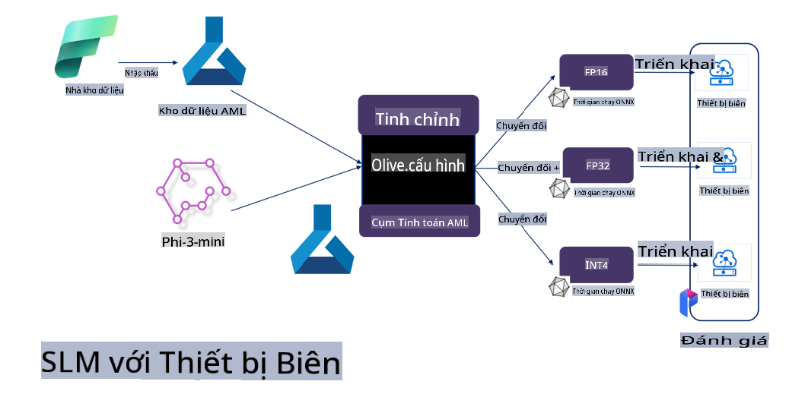

# **Tinh chỉnh Phi-3 với Microsoft Olive**

[Olive](https://github.com/microsoft/OLive?WT.mc_id=aiml-138114-kinfeylo) là một công cụ tối ưu hóa mô hình dễ sử dụng, được thiết kế để tận dụng tối đa các kiến trúc phần cứng cụ thể thông qua các kỹ thuật hàng đầu trong ngành về nén mô hình, tối ưu hóa và biên dịch.

Công cụ này được tạo ra để đơn giản hóa quy trình tối ưu hóa các mô hình học máy, đảm bảo chúng sử dụng hiệu quả phần cứng nhất có thể.

Dù bạn đang làm việc với các ứng dụng đám mây hay thiết bị biên, Olive giúp bạn tối ưu hóa các mô hình một cách dễ dàng và hiệu quả.

## Các tính năng chính:
- Olive tập hợp và tự động hóa các kỹ thuật tối ưu hóa cho phần cứng mục tiêu mong muốn.
- Không có một kỹ thuật tối ưu hóa nào phù hợp với tất cả các trường hợp, vì vậy Olive cho phép mở rộng bằng cách tích hợp các đổi mới tối ưu hóa từ các chuyên gia trong ngành.

## Giảm nỗ lực kỹ thuật:
- Các nhà phát triển thường phải học và sử dụng nhiều chuỗi công cụ cụ thể của các nhà cung cấp phần cứng để chuẩn bị và tối ưu hóa mô hình đã huấn luyện trước khi triển khai.
- Olive đơn giản hóa trải nghiệm này bằng cách tự động hóa các kỹ thuật tối ưu hóa cho phần cứng mong muốn.

## Giải pháp tối ưu hóa E2E sẵn sàng sử dụng:

Bằng cách kết hợp và tinh chỉnh các kỹ thuật tích hợp, Olive cung cấp một giải pháp thống nhất cho tối ưu hóa đầu cuối. Công cụ này xem xét các ràng buộc như độ chính xác và độ trễ trong khi tối ưu hóa mô hình.

## Sử dụng Microsoft Olive để tinh chỉnh

Microsoft Olive là một công cụ tối ưu hóa mô hình mã nguồn mở rất dễ sử dụng, có thể bao gồm cả tinh chỉnh và tham chiếu trong lĩnh vực trí tuệ nhân tạo sinh. Chỉ cần cấu hình đơn giản, kết hợp với việc sử dụng các mô hình ngôn ngữ nhỏ mã nguồn mở và môi trường runtime liên quan (AzureML / GPU cục bộ, CPU, DirectML), bạn có thể hoàn thành việc tinh chỉnh hoặc tham chiếu mô hình thông qua tối ưu hóa tự động và tìm ra mô hình tốt nhất để triển khai lên đám mây hoặc trên các thiết bị biên. Điều này cho phép doanh nghiệp xây dựng các mô hình ngành dọc của riêng mình tại chỗ và trên đám mây.


## Tinh chỉnh Phi-3 với Microsoft Olive 



## Ví dụ mã và minh họa Phi-3 Olive
Trong ví dụ này, bạn sẽ sử dụng Olive để:

- Tinh chỉnh một bộ điều hợp LoRA để phân loại các cụm từ thành các cảm xúc: Buồn, Vui, Sợ hãi, Ngạc nhiên.
- Gộp trọng số của bộ điều hợp vào mô hình gốc.
- Tối ưu hóa và lượng tử hóa mô hình xuống int4.

[Mã mẫu](../../code/03.Finetuning/olive-ort-example/README.md)

### Cài đặt Microsoft Olive

Việc cài đặt Microsoft Olive rất đơn giản, và có thể được cài đặt cho CPU, GPU, DirectML, và Azure ML.

```bash
pip install olive-ai
```

Nếu bạn muốn chạy một mô hình ONNX với CPU, bạn có thể sử dụng

```bash
pip install olive-ai[cpu]
```

Nếu bạn muốn chạy một mô hình ONNX với GPU, bạn có thể sử dụng

```python
pip install olive-ai[gpu]
```

Nếu bạn muốn sử dụng Azure ML, hãy dùng

```python
pip install git+https://github.com/microsoft/Olive#egg=olive-ai[azureml]
```

**Lưu ý**
Yêu cầu hệ điều hành: Ubuntu 20.04 / 22.04 

### **Config.json của Microsoft Olive**

Sau khi cài đặt, bạn có thể cấu hình các thiết lập cụ thể cho từng mô hình thông qua tệp Config, bao gồm dữ liệu, tính toán, huấn luyện, triển khai và tạo mô hình.

**1. Dữ liệu**

Trên Microsoft Olive, việc huấn luyện trên dữ liệu cục bộ và dữ liệu đám mây đều được hỗ trợ và có thể được cấu hình trong các thiết lập.

*Cấu hình dữ liệu cục bộ*

Bạn chỉ cần thiết lập tập dữ liệu cần được huấn luyện để tinh chỉnh, thường ở định dạng json, và điều chỉnh nó với mẫu dữ liệu. Điều này cần được điều chỉnh dựa trên yêu cầu của mô hình (ví dụ: điều chỉnh theo định dạng yêu cầu của Microsoft Phi-3-mini. Nếu bạn có các mô hình khác, vui lòng tham khảo các định dạng tinh chỉnh yêu cầu của các mô hình khác để xử lý).

```json

    "data_configs": [
        {
            "name": "dataset_default_train",
            "type": "HuggingfaceContainer",
            "load_dataset_config": {
                "params": {
                    "data_name": "json", 
                    "data_files":"dataset/dataset-classification.json",
                    "split": "train"
                }
            },
            "pre_process_data_config": {
                "params": {
                    "dataset_type": "corpus",
                    "text_cols": [
                            "phrase",
                            "tone"
                    ],
                    "text_template": "### Text: {phrase}\n### The tone is:\n{tone}",
                    "corpus_strategy": "join",
                    "source_max_len": 2048,
                    "pad_to_max_len": false,
                    "use_attention_mask": false
                }
            }
        }
    ],
```

*Cấu hình nguồn dữ liệu đám mây*

Bằng cách liên kết kho dữ liệu của Azure AI Studio/Azure Machine Learning Service, bạn có thể nhập các nguồn dữ liệu khác nhau vào Azure AI Studio/Azure Machine Learning Service thông qua Microsoft Fabric và Azure Data để hỗ trợ việc tinh chỉnh dữ liệu.

```json

    "data_configs": [
        {
            "name": "dataset_default_train",
            "type": "HuggingfaceContainer",
            "load_dataset_config": {
                "params": {
                    "data_name": "json", 
                    "data_files": {
                        "type": "azureml_datastore",
                        "config": {
                            "azureml_client": {
                                "subscription_id": "Your Azure Subscrition ID",
                                "resource_group": "Your Azure Resource Group",
                                "workspace_name": "Your Azure ML Workspaces name"
                            },
                            "datastore_name": "workspaceblobstore",
                            "relative_path": "Your train_data.json Azure ML Location"
                        }
                    },
                    "split": "train"
                }
            },
            "pre_process_data_config": {
                "params": {
                    "dataset_type": "corpus",
                    "text_cols": [
                            "Question",
                            "Best Answer"
                    ],
                    "text_template": "<|user|>\n{Question}<|end|>\n<|assistant|>\n{Best Answer}\n<|end|>",
                    "corpus_strategy": "join",
                    "source_max_len": 2048,
                    "pad_to_max_len": false,
                    "use_attention_mask": false
                }
            }
        }
    ],
    
```

**2. Cấu hình tính toán**

Nếu bạn cần sử dụng cục bộ, bạn có thể sử dụng trực tiếp tài nguyên dữ liệu cục bộ. Nếu cần sử dụng tài nguyên của Azure AI Studio / Azure Machine Learning Service, bạn cần cấu hình các thông số Azure liên quan, tên tài nguyên tính toán, v.v.

```json

    "systems": {
        "aml": {
            "type": "AzureML",
            "config": {
                "accelerators": ["gpu"],
                "hf_token": true,
                "aml_compute": "Your Azure AI Studio / Azure Machine Learning Service Compute Name",
                "aml_docker_config": {
                    "base_image": "Your Azure AI Studio / Azure Machine Learning Service docker",
                    "conda_file_path": "conda.yaml"
                }
            }
        },
        "azure_arc": {
            "type": "AzureML",
            "config": {
                "accelerators": ["gpu"],
                "aml_compute": "Your Azure AI Studio / Azure Machine Learning Service Compute Name",
                "aml_docker_config": {
                    "base_image": "Your Azure AI Studio / Azure Machine Learning Service docker",
                    "conda_file_path": "conda.yaml"
                }
            }
        }
    },
```

***Lưu ý***

Vì nó được chạy thông qua một container trên Azure AI Studio/Azure Machine Learning Service, môi trường cần thiết cần được cấu hình. Điều này được thiết lập trong tệp môi trường conda.yaml.

```yaml

name: project_environment
channels:
  - defaults
dependencies:
  - python=3.8.13
  - pip=22.3.1
  - pip:
      - einops
      - accelerate
      - azure-keyvault-secrets
      - azure-identity
      - bitsandbytes
      - datasets
      - huggingface_hub
      - peft
      - scipy
      - sentencepiece
      - torch>=2.2.0
      - transformers
      - git+https://github.com/microsoft/Olive@jiapli/mlflow_loading_fix#egg=olive-ai[gpu]
      - --extra-index-url https://aiinfra.pkgs.visualstudio.com/PublicPackages/_packaging/ORT-Nightly/pypi/simple/ 
      - ort-nightly-gpu==1.18.0.dev20240307004
      - --extra-index-url https://aiinfra.pkgs.visualstudio.com/PublicPackages/_packaging/onnxruntime-genai/pypi/simple/
      - onnxruntime-genai-cuda

    

```

**3. Chọn SLM của bạn**

Bạn có thể sử dụng mô hình trực tiếp từ Hugging Face hoặc kết hợp với Model Catalog của Azure AI Studio / Azure Machine Learning để chọn mô hình cần sử dụng. Trong ví dụ mã dưới đây, chúng ta sẽ sử dụng Microsoft Phi-3-mini làm ví dụ.

Nếu bạn có mô hình cục bộ, bạn có thể sử dụng phương pháp này:

```json

    "input_model":{
        "type": "PyTorchModel",
        "config": {
            "hf_config": {
                "model_name": "model-cache/microsoft/phi-3-mini",
                "task": "text-generation",
                "model_loading_args": {
                    "trust_remote_code": true
                }
            }
        }
    },
```

Nếu bạn muốn sử dụng mô hình từ Azure AI Studio / Azure Machine Learning Service, bạn có thể sử dụng phương pháp này:

```json

    "input_model":{
        "type": "PyTorchModel",
        "config": {
            "model_path": {
                "type": "azureml_registry_model",
                "config": {
                    "name": "microsoft/Phi-3-mini-4k-instruct",
                    "registry_name": "azureml-msr",
                    "version": "11"
                }
            },
             "model_file_format": "PyTorch.MLflow",
             "hf_config": {
                "model_name": "microsoft/Phi-3-mini-4k-instruct",
                "task": "text-generation",
                "from_pretrained_args": {
                    "trust_remote_code": true
                }
            }
        }
    },
```

**Lưu ý:**
Chúng ta cần tích hợp với Azure AI Studio / Azure Machine Learning Service, vì vậy khi thiết lập mô hình, vui lòng tham khảo số phiên bản và tên liên quan.

Tất cả các mô hình trên Azure cần được đặt thành PyTorch.MLflow.

Bạn cần có tài khoản Hugging Face và liên kết khóa với giá trị Key của Azure AI Studio / Azure Machine Learning.

**4. Thuật toán**

Microsoft Olive đã đóng gói các thuật toán tinh chỉnh Lora và QLora rất tốt. Bạn chỉ cần cấu hình một số tham số liên quan. Dưới đây là ví dụ về QLora.

```json
        "lora": {
            "type": "LoRA",
            "config": {
                "target_modules": [
                    "o_proj",
                    "qkv_proj"
                ],
                "double_quant": true,
                "lora_r": 64,
                "lora_alpha": 64,
                "lora_dropout": 0.1,
                "train_data_config": "dataset_default_train",
                "eval_dataset_size": 0.3,
                "training_args": {
                    "seed": 0,
                    "data_seed": 42,
                    "per_device_train_batch_size": 1,
                    "per_device_eval_batch_size": 1,
                    "gradient_accumulation_steps": 4,
                    "gradient_checkpointing": false,
                    "learning_rate": 0.0001,
                    "num_train_epochs": 3,
                    "max_steps": 10,
                    "logging_steps": 10,
                    "evaluation_strategy": "steps",
                    "eval_steps": 187,
                    "group_by_length": true,
                    "adam_beta2": 0.999,
                    "max_grad_norm": 0.3
                }
            }
        },
```

Nếu bạn muốn chuyển đổi lượng tử, nhánh chính của Microsoft Olive đã hỗ trợ phương pháp onnxruntime-genai. Bạn có thể thiết lập theo nhu cầu của mình:

1. Gộp trọng số của bộ điều hợp vào mô hình gốc.
2. Chuyển đổi mô hình sang mô hình ONNX với độ chính xác yêu cầu bằng ModelBuilder.

Ví dụ, chuyển đổi sang INT4 đã lượng tử hóa.

```json

        "merge_adapter_weights": {
            "type": "MergeAdapterWeights"
        },
        "builder": {
            "type": "ModelBuilder",
            "config": {
                "precision": "int4"
            }
        }
```

**Lưu ý** 
- Nếu bạn sử dụng QLoRA, việc chuyển đổi lượng tử của ONNXRuntime-genai hiện chưa được hỗ trợ.

- Cần lưu ý rằng bạn có thể thiết lập các bước trên theo nhu cầu của mình. Không cần thiết phải cấu hình hoàn toàn các bước trên. Tùy thuộc vào nhu cầu, bạn có thể sử dụng trực tiếp các bước của thuật toán mà không cần tinh chỉnh. Cuối cùng, bạn cần cấu hình các engine liên quan.

```json

    "engine": {
        "log_severity_level": 0,
        "host": "aml",
        "target": "aml",
        "search_strategy": false,
        "execution_providers": ["CUDAExecutionProvider"],
        "cache_dir": "../model-cache/models/phi3-finetuned/cache",
        "output_dir" : "../model-cache/models/phi3-finetuned"
    }
```

**5. Hoàn thành tinh chỉnh**

Trên dòng lệnh, thực thi trong thư mục của olive-config.json:

```bash
olive run --config olive-config.json  
```

**Tuyên bố miễn trừ trách nhiệm**:  
Tài liệu này đã được dịch bằng các dịch vụ dịch thuật AI dựa trên máy móc. Mặc dù chúng tôi cố gắng đảm bảo độ chính xác, xin lưu ý rằng các bản dịch tự động có thể chứa lỗi hoặc sai sót. Tài liệu gốc bằng ngôn ngữ bản địa nên được coi là nguồn đáng tin cậy nhất. Đối với thông tin quan trọng, khuyến nghị sử dụng dịch thuật chuyên nghiệp từ con người. Chúng tôi không chịu trách nhiệm về bất kỳ sự hiểu lầm hoặc diễn giải sai nào phát sinh từ việc sử dụng bản dịch này.