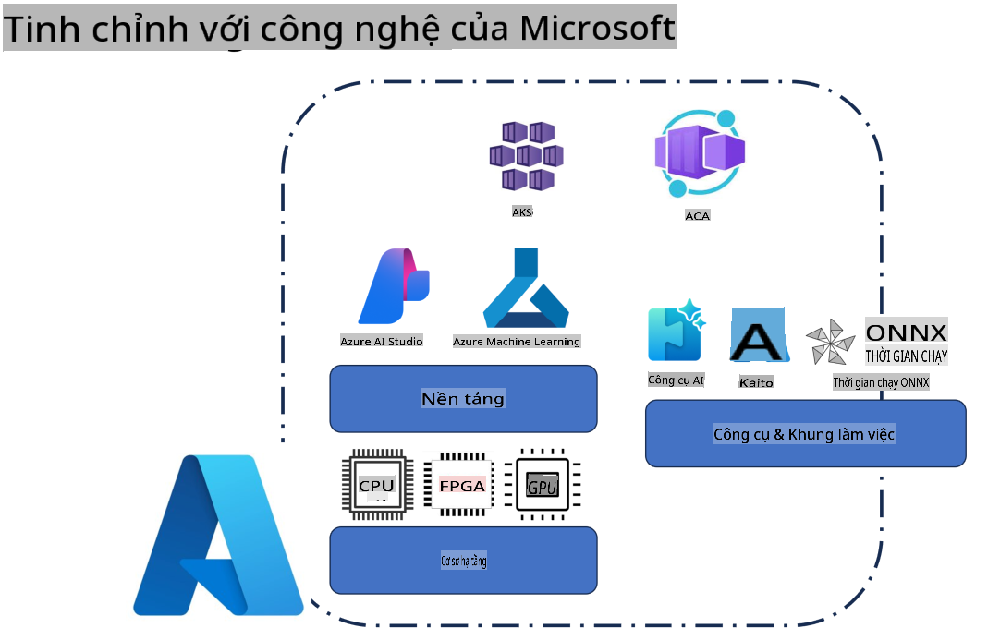
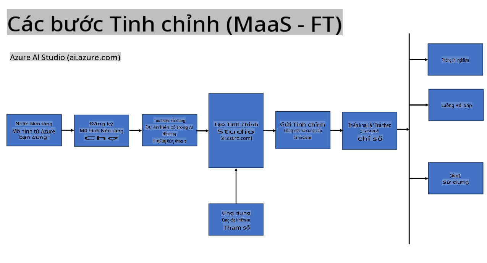
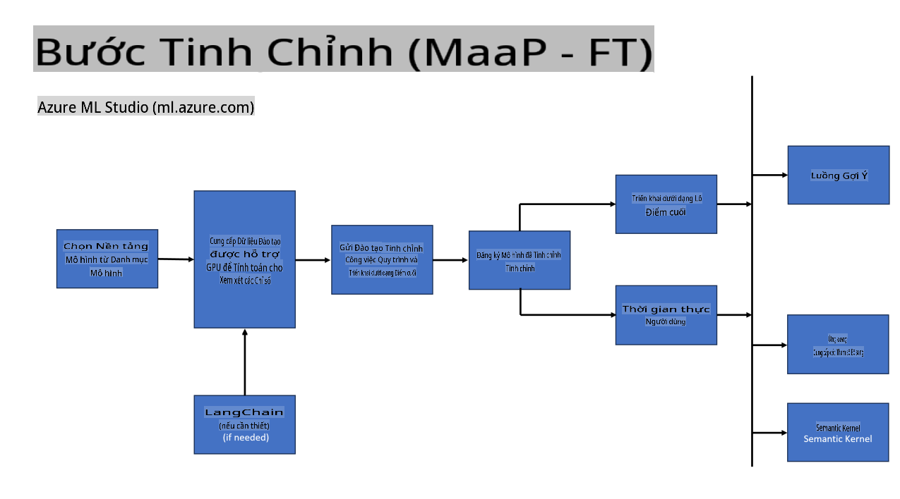
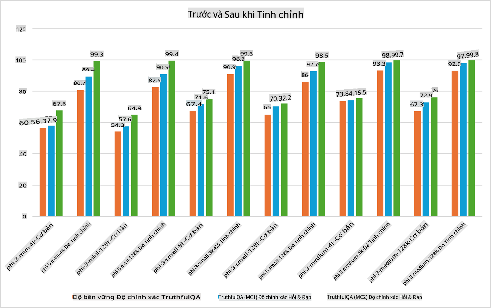

## Các Kịch Bản Tinh Chỉnh

**Nền Tảng** Bao gồm các công nghệ như Azure AI Foundry, Azure Machine Learning, AI Tools, Kaito, và ONNX Runtime.

**Hạ Tầng** Bao gồm CPU và FPGA, những thành phần quan trọng cho quá trình tinh chỉnh. Dưới đây là biểu tượng của từng công nghệ này.

**Công Cụ & Framework** Bao gồm ONNX Runtime và ONNX Runtime. Dưới đây là biểu tượng của từng công nghệ này.  
[Chèn biểu tượng của ONNX Runtime và ONNX Runtime]

Quá trình tinh chỉnh với các công nghệ Microsoft bao gồm nhiều thành phần và công cụ khác nhau. Hiểu và sử dụng các công nghệ này giúp chúng ta tinh chỉnh ứng dụng hiệu quả hơn và tạo ra những giải pháp tốt hơn.

## Mô Hình như Dịch Vụ

Tinh chỉnh mô hình bằng cách sử dụng tinh chỉnh được lưu trữ, không cần tạo và quản lý hạ tầng tính toán.

Tinh chỉnh không máy chủ hiện khả dụng cho các mô hình Phi-3-mini và Phi-3-medium, cho phép các nhà phát triển nhanh chóng và dễ dàng tùy chỉnh mô hình cho các kịch bản đám mây và biên mà không cần sắp xếp hạ tầng tính toán. Chúng tôi cũng đã công bố rằng Phi-3-small hiện có sẵn thông qua dịch vụ Models-as-a-Service, giúp các nhà phát triển dễ dàng bắt đầu phát triển AI mà không cần quản lý cơ sở hạ tầng bên dưới.

## Mô Hình như Nền Tảng

Người dùng tự quản lý hạ tầng tính toán của mình để tinh chỉnh các mô hình.

[Mẫu Tinh Chỉnh](https://github.com/Azure/azureml-examples/blob/main/sdk/python/foundation-models/system/finetune/chat-completion/chat-completion.ipynb)

## Các Kịch Bản Tinh Chỉnh

| | | | | | | |
|-|-|-|-|-|-|-|
|Kịch Bản|LoRA|QLoRA|PEFT|DeepSpeed|ZeRO|DORA|
|Tùy chỉnh LLM đã được huấn luyện trước cho các nhiệm vụ hoặc lĩnh vực cụ thể|Có|Có|Có|Có|Có|Có|
|Tinh chỉnh cho các nhiệm vụ NLP như phân loại văn bản, nhận dạng thực thể, và dịch máy|Có|Có|Có|Có|Có|Có|
|Tinh chỉnh cho các nhiệm vụ hỏi đáp|Có|Có|Có|Có|Có|Có|
|Tinh chỉnh để tạo phản hồi giống con người trong chatbot|Có|Có|Có|Có|Có|Có|
|Tinh chỉnh để tạo nhạc, nghệ thuật, hoặc các hình thức sáng tạo khác|Có|Có|Có|Có|Có|Có|
|Giảm chi phí tính toán và tài chính|Có|Có|Không|Có|Có|Không|
|Giảm sử dụng bộ nhớ|Không|Có|Không|Có|Có|Có|
|Sử dụng ít tham số hơn để tinh chỉnh hiệu quả|Không|Có|Có|Không|Không|Có|
|Hình thức song song dữ liệu tiết kiệm bộ nhớ, cho phép truy cập bộ nhớ GPU tổng hợp của tất cả các thiết bị GPU sẵn có|Không|Không|Không|Có|Có|Có|

## Các Ví Dụ Hiệu Suất Tinh Chỉnh

**Tuyên bố miễn trừ trách nhiệm**:  
Tài liệu này đã được dịch bằng các dịch vụ dịch thuật AI tự động. Mặc dù chúng tôi cố gắng đảm bảo độ chính xác, xin lưu ý rằng các bản dịch tự động có thể chứa lỗi hoặc không chính xác. Tài liệu gốc bằng ngôn ngữ bản địa nên được coi là nguồn thông tin đáng tin cậy nhất. Đối với các thông tin quan trọng, chúng tôi khuyến nghị sử dụng dịch vụ dịch thuật chuyên nghiệp của con người. Chúng tôi không chịu trách nhiệm cho bất kỳ sự hiểu lầm hoặc diễn giải sai nào phát sinh từ việc sử dụng bản dịch này.